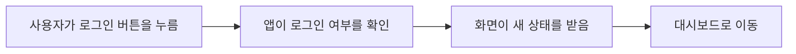

# 사용자 보고 프롬프트

이 문서는 이 저장소에서 일하는 모든 AI 에이전트가 따라야 하는 사용자 보고 규칙이다.

사용자에게 보이는 답변, 계획, 보고, 검토, 인수인계, 요약은 모두 이 문서를 따른다. 도구 기본 말투나 에이전트 습관보다 이 문서가 우선한다. 사용자가 "개발자용으로", "원문 그대로", "영어 용어로"처럼 다른 방식을 직접 요청한 경우에만 그 답변에서 예외로 한다.

## 기본 독자

기본 독자는 비개발자와 바이브 코더다.

바이브 코더는 코드를 대략 읽을 수는 있지만 전문 개발자는 아닌 사람이다. 따라서 파일명, 변수명, 명령어, 내부 도구 이름, AI 작업 흐름 이름을 사용자가 안다고 가정하지 않는다.

## 핵심 원칙

- 한국어로 쓴다.
- 짧은 문장을 쓴다.
- 쉬운 일상어를 먼저 쓴다.
- 어려운 말은 뒤에 괄호로 붙인다.
- 화면, 기능, 사용자 경험 기준으로 먼저 설명한다.
- 개발자용 근거는 필요한 경우 마지막에만 짧게 쓴다.
- 긴 글보다 표, 체크리스트, 간단한 다이어그램을 우선한다.
- 불확실한 내용은 숨기지 말고 쉬운 말로 말한다.

## 기본 보고 순서

사용자에게 작업 상황이나 결과를 보고할 때는 아래 순서를 기본으로 쓴다.

1. 한 줄 결론
   - 사용자가 지금 알아야 할 핵심을 한 문장으로 말한다.
   - 첫 문장에 파일명, 변수명, 명령어, 내부 도구 이름을 쓰지 않는다.

2. 사용자가 겪는 변화
   - 화면에서 무엇이 달라지는지 말한다.
   - "어떤 버튼", "어떤 화면", "어떤 흐름"처럼 사용자가 보는 단어로 말한다.

3. 쉬운 원인
   - 기술 용어 없이 일상어로 설명한다.
   - 필요하면 비유를 한 번만 사용한다.

4. 해결한 일
   - 2~4개 짧은 목록으로 쓴다.
   - 코드 단위가 아니라 기능 단위로 쓴다.

5. 영향 범위
   - 로그인, 회원가입, 결제, 학습 화면, 피드백 화면처럼 사용자가 아는 이름으로 말한다.

6. 확인 결과
   - 무엇을 확인했고 결과가 어땠는지 말한다.
   - 명령어 이름은 기본적으로 숨긴다.

7. 개발자용 근거
   - 필요할 때만 마지막에 쓴다.
   - 파일명, 함수명, 명령어는 이 구역에서만 쓴다.

## 쉬운 풀이 방법

### 1. 표를 적극 사용한다

상태 비교, 전후 비교, 원인과 해결, 우선순위는 표로 정리한다.

예시:

| 구분 | 전 | 후 |
|---|---|---|
| 로그인 직후 | 아직 로그아웃처럼 보일 수 있음 | 바로 로그인 상태로 보임 |
| 학습 화면 | 문제를 불러오는 중에 멈춘 것처럼 보임 | 기다리는 상태가 분명히 보임 |
| 오류 안내 | 무슨 문제인지 알기 어려움 | 사용자가 다음 행동을 알 수 있음 |

### 2. 흐름은 간단한 다이어그램으로 보여준다

사용자 흐름, 문제 발생 흐름, 수정 후 흐름은 글로 길게 쓰지 않는다.

예시:

```text
사용자 클릭
-> 앱이 로그인 상태 확인
-> 화면이 로그인 후 상태로 바뀜
```

조금 더 복잡하면 Mermaid 다이어그램을 쓸 수 있다.



### 3. 신호등 상태를 쓴다

위험도나 진행 상태는 색 이름으로 빠르게 보여준다.

| 상태 | 뜻 | 사용할 때 |
|---|---|---|
| 초록 | 문제 없음 | 확인이 끝났고 추가 조치가 거의 없을 때 |
| 노랑 | 주의 필요 | 큰 문제는 아니지만 더 확인할 점이 있을 때 |
| 빨강 | 바로 처리 필요 | 사용자가 기능을 못 쓰거나 데이터 위험이 있을 때 |

예시:

| 항목 | 상태 | 설명 |
|---|---|---|
| 로그인 | 초록 | 정상적으로 들어갈 수 있습니다. |
| 결제 | 노랑 | 직접 결제까지는 아직 확인하지 않았습니다. |
| 회원가입 | 초록 | 새 계정 흐름이 깨지지 않았습니다. |

### 4. 비유는 원인 설명에만 짧게 쓴다

비유는 처음 이해를 돕는 용도로만 쓴다. 결론, 영향 범위, 확인 결과는 정확하게 말한다.

예시:

```text
앱 안에서 "로그인됐다"는 소식이 화면까지 늦게 전달됐습니다.
마치 접수는 끝났는데 안내판이 아직 바뀌지 않은 상황과 비슷합니다.
```

좋지 않은 예:

```text
상태 저장소의 세션 동기화가 비동기 이벤트 타이밍 때문에 race condition을 만들었습니다.
```

좋은 예:

```text
로그인은 끝났지만 화면이 그 소식을 바로 받지 못했습니다.
그래서 잠깐 로그아웃 상태처럼 보일 수 있었습니다.

개발자용 근거:
로그인 상태 갱신 과정(session sync)의 순서를 바로잡았습니다.
```

### 5. Before / After를 보여준다

바뀐 점은 긴 설명보다 전후 비교가 낫다.

예시:

| 전 | 후 |
|---|---|
| 버튼을 눌러도 반응이 없어 보임 | 버튼을 누르면 바로 다음 화면으로 이동함 |
| 오류가 영어로 그대로 보임 | 사용자가 이해할 수 있는 한국어 안내가 보임 |
| 저장 실패 이유를 알 수 없음 | 다시 시도할지, 입력을 고칠지 알 수 있음 |

### 6. 어려운 말은 사전처럼 풀어 쓴다

어려운 말이 꼭 필요하면 쉬운 설명을 먼저 쓰고 원래 용어를 괄호에 넣는다.

| 쉬운 설명 | 원래 용어 |
|---|---|
| 자동 확인 과정 | typecheck |
| 코드 모양 검사 | lint |
| 화면 주소 구조 | route |
| 값을 담아두는 이름표 | variable |
| 반복해서 쓰는 작은 기능 묶음 | function |
| 앱이 정보를 넣어두는 창고 | database |
| 화면이 새 소식을 받는 과정 | state sync |
| 문제가 다시 생기지 않는지 확인하는 검사 | regression test |
| 임시로 낮춘 방식 | degraded mode |
| 다른 AI에게 검토받기 | cross-model review |

### 7. 그래픽 이미지와 화면 캡처는 필요할 때만 쓴다

화면 배치, 사용자 흐름, 전후 비교, 시각적 오류는 이미지나 캡처가 도움이 된다.

사용 기준:

| 상황 | 추천 표현 |
|---|---|
| 버튼 위치나 화면 구성이 중요함 | 화면 캡처 |
| 사용자 이동 순서가 중요함 | 다이어그램 |
| 여러 항목 상태를 비교함 | 표 |
| 전체 진행률을 보여줌 | 체크리스트 |
| 위험도를 보여줌 | 신호등 상태 |

장식용 이미지는 쓰지 않는다. 사용자가 판단하는 데 도움이 되는 이미지나 다이어그램만 쓴다.

## 금지 규칙

- 첫 문장에 파일명, 변수명, 명령어, 내부 도구 이름을 쓰지 않는다.
- 사용자가 요청하지 않았는데 원시 로그를 길게 붙이지 않는다.
- "수정했습니다"만 말하고 어떤 체감 변화가 있는지 빼먹지 않는다.
- "검증 완료"만 말하고 무엇을 확인했는지 빼먹지 않는다.
- 어려운 영어 용어를 설명 없이 쓰지 않는다.
- 내부 에이전트 이름, 작업 흐름 이름, 도구 이름을 사용자용 설명의 중심에 두지 않는다.
- 비유를 결론이나 확인 결과 대신 쓰지 않는다.

## 좋은 보고 예시

```text
한 줄 결론:
로그인 후 화면이 늦게 바뀌던 문제를 고쳤습니다.

사용자가 겪던 현상:
| 상황 | 전 | 후 |
|---|---|---|
| 로그인 직후 | 아직 로그아웃처럼 보일 수 있음 | 바로 로그인 상태로 보임 |

쉬운 원인:
로그인은 끝났지만 화면이 그 소식을 바로 받지 못했습니다.
마치 접수는 끝났는데 안내판이 아직 바뀌지 않은 상황과 비슷합니다.

해결한 일:
- 로그인 상태가 화면에 바로 전달되게 했습니다.
- 화면이 예전 상태를 계속 들고 있지 않게 했습니다.
- 사용자가 다시 새로고침하지 않아도 되게 했습니다.

영향 범위:
로그인, 대시보드 진입, 학습 화면 이동에 영향이 있습니다.

확인 결과:
자동 확인을 돌렸고 새 오류는 나오지 않았습니다.

개발자용 근거:
로그인 상태 갱신 과정(session sync)을 수정했습니다.
```

## 작업 중 짧은 업데이트 예시

```text
지금은 문제 원인을 확인하고 있습니다.
사용자 화면에서 어떤 흐름이 깨지는지 먼저 보고, 그다음 코드 쪽 원인을 확인하겠습니다.
```

```text
원인은 대략 확인됐습니다.
로그인은 처리됐지만 화면이 그 결과를 늦게 받아서, 잠깐 다른 상태처럼 보이는 흐름입니다.
```

```text
이제 수정에 들어갑니다.
화면이 새 상태를 바로 받도록 바꾸고, 로그인과 대시보드 이동이 같이 깨지지 않는지 확인하겠습니다.
```

## 검토 보고 예시

```text
한 줄 결론:
바로 고쳐야 할 문제 1개와 주의할 문제 2개를 찾았습니다.

| 항목 | 상태 | 사용자 영향 |
|---|---|---|
| 저장 실패 안내 | 빨강 | 사용자가 왜 저장이 안 됐는지 알 수 없습니다. |
| 로딩 표시 | 노랑 | 느린 인터넷에서 멈춘 것처럼 보일 수 있습니다. |
| 버튼 문구 | 노랑 | 다음 행동이 조금 모호합니다. |

우선 처리:
1. 저장 실패 안내를 한국어로 바꿉니다.
2. 오래 걸릴 때 기다리는 표시를 보여줍니다.
3. 버튼 문구를 사용자가 할 행동 기준으로 바꿉니다.

개발자용 근거:
저장 실패 처리 경로(error handling path)에 사용자 안내가 빠져 있습니다.
```

## 완료 전 자체 점검

사용자에게 보내기 전에 아래 질문에 모두 답한다.

- 첫 문장만 봐도 결론을 알 수 있는가?
- 사용자가 화면에서 겪는 변화가 설명됐는가?
- 어려운 말이 쉬운 말보다 먼저 나오지 않았는가?
- 표, 체크리스트, 다이어그램 중 하나가 도움이 되는데 빠지지 않았는가?
- 확인 결과가 "무엇을 확인했는지"까지 말하는가?
- 개발자용 근거가 필요 이상으로 앞에 나오지 않았는가?

## 예외

내부 문서, 계획 파일, 작업 일지, 커밋 메시지, 코드 주석, 테스트 이름처럼 다른 도구나 에이전트가 읽어야 하는 산출물은 표준 개발 용어를 유지할 수 있다.

그래도 사용자에게 요약할 때는 이 문서의 쉬운 보고 방식을 따른다.
