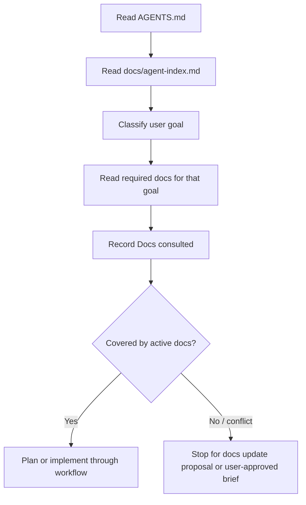
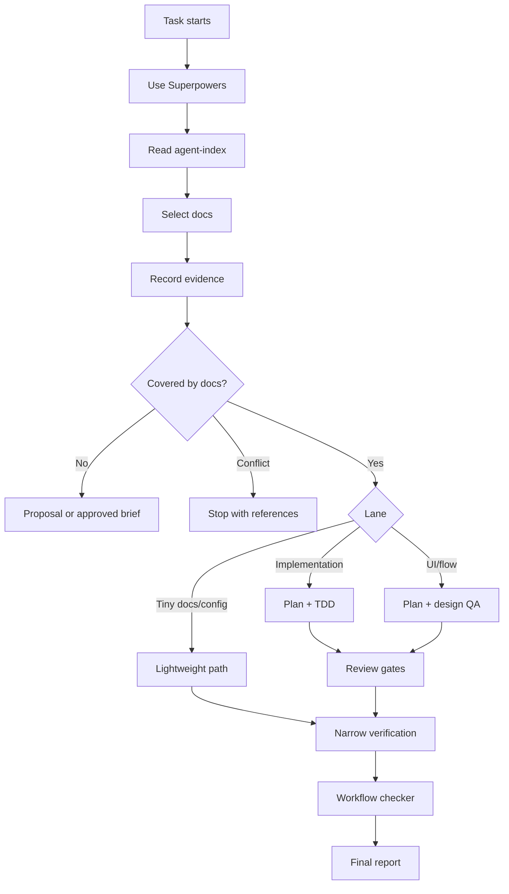
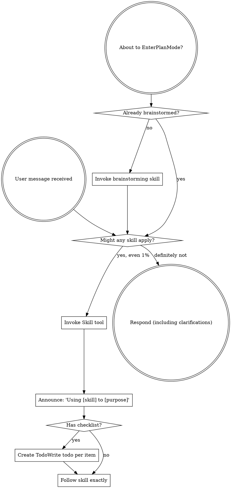
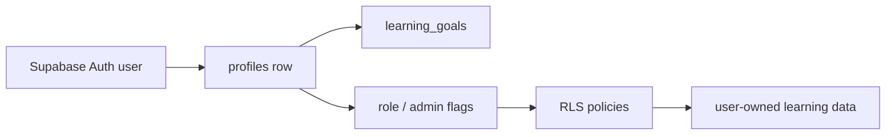
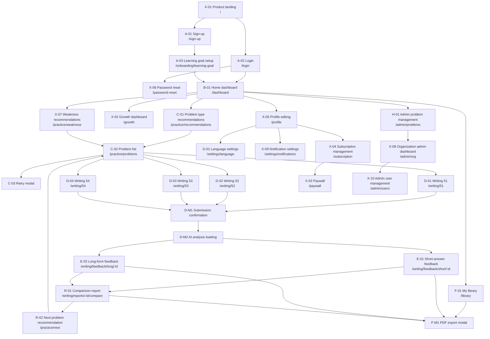

OpenAI Codex v0.128.0 (research preview)
--------
workdir: C:\Users\admin\Desktop\workspace\topik-project\v13
model: gpt-5.5
provider: openai
approval: never
sandbox: workspace-write [workdir, C:\Users\admin\.codex\memories]
reasoning effort: high
reasoning summaries: none
session id: 019e6379-2c78-76b2-b7ab-1714cce57389
--------
user
# Cross-Model Review · Round 2
# Auth Error / Callback Pages — Response to Round 1

Continuing review with Opus 4.7. Round 1 verdict: CONCERN with multiple P0 items. Opus accepts most findings; below is the revised proposal. Decide ACCEPTED / NEEDS REVISION / REJECTED for each, and whether the revised proposal is ready to integrate into the HTML report.

## Author response to each Round 1 finding

### Pattern findings

- **P1 (F1) Single page pattern.** ACCEPTED. Keep single `/auth/error?reason=...`.
- **P2 (F2) Callback contract.** ACCEPTED — critical fix. `/auth/callback` Route Handler must dispatch by URL params:
  - `token_hash` + `type` (email confirm, recovery, email_change, magiclink) → `supabase.auth.verifyOtp({ token_hash, type })`
  - `code` (PKCE / OAuth) → `supabase.auth.exchangeCodeForSession(code)`
  - Both share the same route; success goes to validated `next` else `/dashboard`; failure goes to `/auth/error?reason=<supabase_error_code>`.
- **P3 (F3) Route Handler type.** ACCEPTED. `src/app/auth/callback/route.ts`, no UI.
- **P4 (F4) Cache safety.** ACCEPTED. Document `export const dynamic = 'force-dynamic'` for `/auth/error` and `/auth/verify-email`; rely on `@supabase/ssr` cookie cache headers on the Route Handler.

### Route catalog findings

- **R1 (P1) `/auth/verify-email` route value.** ACCEPTED-P1. Keep proposed P1. Reason: deep-linkable post-signup state + reload survival + central resend control.
- **R2 (P0) Magic link redirect.** ACCEPTED. `LoginForm` magic-link `emailRedirectTo` must be `${origin}/auth/callback?next=/dashboard`. Same for `SignUpForm`. This is a follow-up code change explicitly noted in the report; current state breaks if we add callback routing without updating these.
- **R3 (P1) `/auth/sign-out`.** ACCEPTED. Add to catalog as POST Route Handler (server-side cookie clear). Out of this report's primary scope but listed in follow-ups.
- **R4 (P2) OAuth share callback.** ACCEPTED. Mark as future scope (Google/Kakao not in current phase). Same route works.
- **R5 (P1) Session expiry redirect.** ACCEPTED. Middleware redirects expired-JWT cases to `/login?reason=session_expired`. `/login` reads this query and shows friendly inline notice.

### Reason classification — expanded to 11 reasons

- **C1 (P0) 5 reasons too thin.** ACCEPTED. Final reason map (mapping from Supabase `error.code` to UX message):

  | `reason` (URL slug) | Source Supabase code | Korean message (warm, plain) | Primary CTA | Secondary |
  | --- | --- | --- | --- | --- |
  | `otp_expired` | `otp_expired` | "�� ��가 만료�어요. �메�� 다시 �력하면 새 메�� 보내드릴게요." | �메� �력 → �� 메� �전송 | 로그�하기 |
  | `flow_state_expired` | `flow_state_expired` | "�� 절차가 만료�어요. 처�부터 다시 시�해주세요." | 다시 시�하기 | 로그�하기 |
  | `flow_state_not_found` | `flow_state_not_found` | "�� 요청� 찾� 수 없어요. 다른 기기/브�우저�서 시�한 ��� 수 �어요." | 다시 시�하기 | �움� |
  | `bad_code_verifier` | `bad_code_verifier` | "보안 검�� 실패했어요. 같� 브�우저�서 �까지 진행해주세요." | 처�부터 다시 | — |
  | `user_not_found` | `user_not_found` | "� 계정� � �� 존�하지 않아요. 다시 가�하시면 �니다." | **다시 가�하기** | 로그�하기 |
  | `over_email_send_rate_limit` | `over_email_send_rate_limit` | "메�� 너무 �� 보냈어요. �시 후 다시 시�해주세요." (Retry-After 분 표시) | �시 후 �� 활성 | — |
  | `over_request_rate_limit` | `over_request_rate_limit` | "요청� 너무 �아요. �시 기다려주세요." | �시 후 �� 활성 | — |
  | `email_not_confirmed` | `email_not_confirmed` | "�메� ��� 아� 완료�지 않았어요. 받��지함� 확�해주세요." | �� 메� �전송 | — |
  | `access_denied` | `access_denied` | "��� 거부�어요. 다시 시�해주세요." | 다시 가�하기 | — |
  | `signup_disabled` | `signup_disabled` | "현� 신규 가�� �시 중단�어요. �시 후 다시 시�해주세요." | 홈으로 | — |
  | `unknown` | (catchall) | "처리 중 문제가 �겼어요. �시 후 다시 시�해주세요." | 홈으로 | �움� |

- **C2 (P1) signup-form errors.** ACCEPTED. `user_already_exists`/`email_exists` stay inline on `/sign-up` form (do NOT redirect to `/auth/error`). Document the split rule.
- **C3 (P1) `email_change_failed` invented label.** ACCEPTED. Replaced — email-change failures map via Supabase official codes above. No new invented label.
- **C4 (P0) Rate-limit explicit UI.** ACCEPTED. `over_email_send_rate_limit` and `over_request_rate_limit` rows above include disabled CTA + Retry-After countdown.

### UX findings

- **U1 (P1) Tone change.** ACCEPTED. Removed "바�브 코�" framing for end-user copy. All messages above use warm, plain Korean. The "바�브 코�" rule remains for our internal reports/docs only.
- **U2 (P1) `invalid_token` CTA.** RESOLVED by removing the `invalid_token` umbrella and mapping to specific codes (`otp_expired`, `flow_state_expired`, `bad_code_verifier`, `user_not_found`), each with appropriate primary CTA.
- **U3 (P1) Email prefill untrusted.** ACCEPTED. `email` query param only pre-fills a visible editable input. No auto-resend.
- **U4 (P1) Hide raw error_description.** ACCEPTED. `/auth/callback` logs raw `error_description` server-side and forwards only the canonical `reason` slug to `/auth/error`.

### Cleanup-synergy findings

- **S1 (P0) deleted user → maybe `user_not_found`.** ACCEPTED. Both `otp_expired` and `user_not_found` paths exist in the table.
- **S2 (P0) deleted user CTA.** ACCEPTED. `user_not_found` primary CTA = **"다시 가�하기"**.
- **S3 (P1) live test deferral.** ACCEPTED as **explicit follow-up before code lands**: create unconfirmed user → run cleanup manually → click old link → record actual Supabase code → confirm reason map.

### Resend cooldown findings

- **D1 (P0) 30s client cooldown vs Supabase 60s default.** ACCEPTED. UI cooldown raised to **60s** matching `auth.email.send_interval` Supabase default.
- **D2 (P0) Server enforcement.** ACCEPTED. Server side relies on Supabase's own rate-limits (30 OTP/hour project-wide cap on free tier per https://supabase.com/docs/guides/auth/rate-limits) plus our `/auth/error?reason=over_email_send_rate_limit` mapping. Our app does NOT add a custom additional rate limit in this iteration — Supabase's caps are sufficient for an MVP-stage learning service. Acceptable?
- **D3 (P1) Product cap 3/hour vs Supabase 30/hour.** ACCEPTED. Dropped the "3 attempts/hour" product cap from the proposal; rely on Supabase's 30/hour. Documented which cap applies.
- **D4 (P1) Visible email input.** ACCEPTED. Resend always requires the visible email input to submit (no fire-and-forget from URL query).

### Docs-process findings

- **G1 (P0) Add `docs/sitemap.md`.** ACCEPTED. Doc update path now: `docs/sitemap.md` + `docs/IA/README.md` + `docs/IA/<new-folders>/description.md` + `docs/flow/user-flow.md`. Office-hours not required (narrow auth recovery edge, not product pivot).
- **G2 (P1) Code only after docs.** ACCEPTED. Report integration ≠ implementation. Implementation requires docs update or approved implementation brief first.
- **G3 (P2) Office-hours not required.** ACCEPTED. Lightweight docs update path.

### NEW findings from Round 1

- **N1 (P1) `SignUpForm` resend no cooldown.** ACCEPTED. Cooldown UI to add when implementation phase starts (60s, then Retry-After-driven for 429).
- **N2 (P1) `LoginForm` magic-link redirect.** ACCEPTED — same as R2 above.
- **N3 (P0) `PUBLIC_PATHS` middleware.** ACCEPTED. `/auth/callback`, `/auth/error`, `/auth/verify-email` to be added to public path allowlist. Without this, middleware bounces anonymous users to `/login` and the callback exchange never runs.
- **N4 (P1) `next` open redirect protection.** ACCEPTED. Validate `next` is relative (starts with `/`, no scheme, no `//`).
- **N5 (P2) Workflow checker workaround.** Noted for separate workflow task. Not blocking this review.

## Revised route catalog (final)

| Route | Type | Role | Priority |
| --- | --- | --- | --- |
| `src/app/auth/callback/route.ts` | Route Handler | Dispatch token_hash → verifyOtp, code → exchangeCodeForSession. Validate `next` (relative only). On success redirect to `next` or `/dashboard`. On failure redirect to `/auth/error?reason=<canonical>` with raw error_description logged server-side only. Add `dynamic = 'force-dynamic'`. | P0 |
| `src/app/auth/error/page.tsx` | Page | Read `reason` query, map to message + CTA from the 11-reason table. Optional `email` query for editable prefill on `otp_expired` / `email_not_confirmed`. Honor `Retry-After` for rate-limit reasons. | P0 |
| `src/app/auth/verify-email/page.tsx` | Page | Post-signup "check inbox" + resend button with 60s cooldown. Reads `email` from session/query for display. | P1 |
| `src/app/auth/sign-out/route.ts` | Route Handler (POST) | Server-side session cookie clear. Out of primary scope but cataloged. | P2 |
| (Middleware update) | n/a | `PUBLIC_PATHS` allowlist += `/auth/*`. `/login` reads `?reason=session_expired` for friendly notice. | P0 |
| (LoginForm + SignUpForm magic-link `emailRedirectTo`) | n/a | Change to `${origin}/auth/callback?next=/dashboard`. | P0 |

## Your task (Round 2)

For each finding above, mark ACCEPTED / NEEDS REVISION / REJECTED with one-line reason.

Then answer:
- Is the revised proposal mergeable into the HTML report as a new section?
- Open question: D2 — is it acceptable to rely only on Supabase native rate-limits for MVP, with no app-level extra layer?

## Output format

```
VERDICT: PASS | CONCERN | FAIL

ROUND 1 RESOLUTION:
| ID | Status | Note |

REVISED PROPOSAL ASSESSMENT:
- mergeable to HTML report: YES / NO
- blockers (if NO): ...

D2 QUESTION ANSWER:
- ACCEPTED / NEEDS CUSTOM LAYER
- reason:

NEW FINDINGS (if any):
- ...

OVERALL:
- One paragraph: consensus close, or material disputes?
```

2026-05-26T08:49:07.845347Z ERROR rmcp::transport::worker: worker quit with fatal: Transport channel closed, when Auth(TokenRefreshFailed("Server returned error response: invalid_grant: Invalid refresh token"))
2026-05-26T08:49:08.054802Z ERROR rmcp::transport::worker: worker quit with fatal: Transport channel closed, when AuthRequired(AuthRequiredError { www_authenticate_header: "Bearer resource_metadata=\"https://mcp.figma.com/.well-known/oauth-protected-resource\",scope=\"mcp:connect\",authorization_uri=\"https://api.figma.com/.well-known/oauth-authorization-server\"" })
2026-05-26T08:49:16.174182Z ERROR codex_api::endpoint::responses_websocket: failed to connect to websocket: HTTP error: 502 Bad Gateway, url: wss://chatgpt.com/backend-api/codex/responses
hook: SessionStart
hook: SessionStart Completed
hook: UserPromptSubmit
hook: UserPromptSubmit Completed
codex
사용할 표면� 먼저 확�합니다. � 건� 코드 수정� 아니� “제안서 2차 리뷰��서, 필수 시� 규칙과 리뷰 규칙만 �고 �단 근거를 �추겠습니다.
hook: PreToolUse
hook: PreToolUse
hook: PreToolUse
hook: PreToolUse
hook: PreToolUse Completed
hook: PreToolUse Completed
hook: PreToolUse Completed
hook: PreToolUse Completed
exec
"C:\\Windows\\System32\\WindowsPowerShell\\v1.0\\powershell.exe" -Command 'Get-Content -Path .agents/superpowers/skills/using-superpowers/SKILL.md -TotalCount 220' in C:\Users\admin\Desktop\workspace\topik-project\v13
exec
"C:\\Windows\\System32\\WindowsPowerShell\\v1.0\\powershell.exe" -Command 'Get-Content -Path .codex/skills/gstack/review/SKILL.md -TotalCount 220' in C:\Users\admin\Desktop\workspace\topik-project\v13
exec
"C:\\Windows\\System32\\WindowsPowerShell\\v1.0\\powershell.exe" -Command 'Get-Content -Path docs/ai-development-workflow.md -TotalCount 260' in C:\Users\admin\Desktop\workspace\topik-project\v13
exec
"C:\\Windows\\System32\\WindowsPowerShell\\v1.0\\powershell.exe" -Command 'Get-Content -Path docs/agent-index.md -TotalCount 260' in C:\Users\admin\Desktop\workspace\topik-project\v13
 succeeded in 1016ms:
# AI Agent Index

This is the mandatory routing index for AI agents. Read this file after `AGENTS.md` and before planning or editing.

Purpose: make document access predictable as the project grows. Do not read every document by default. Select the smallest required set by task goal, then record the exact files in `Docs consulted`.

## Startup Algorithm



## Index Groups

| Index | Group | Entry point | Use for |
| --- | --- | --- | --- |
| `ROOT-00` | Human project map | [../README.md](../README.md) | Human-friendly project overview |
| `DOCS-00` | Docs map | [README.md](README.md) | Human + AI navigation across `docs/` |
| `AGENT-00` | AI routing | [agent-index.md](agent-index.md) | Required AI document selection |
| `FLOW-00` | AI workflow entry | [ai-development-workflow.md](ai-development-workflow.md) | Entry point ??88-line index that links sub-docs |
| `WF-00` | Workflow sub-docs | [ai-workflow/planning-contracts.md](ai-workflow/planning-contracts.md), [ai-workflow/context-and-packets.md](ai-workflow/context-and-packets.md), [ai-workflow/review-gates.md](ai-workflow/review-gates.md), [ai-workflow/fallback-and-recovery.md](ai-workflow/fallback-and-recovery.md) | Planning 쨌 ledger/packets 쨌 review gates 쨌 fallback matrix |
| `WF-10` | Ledger/report templates | [ai-workflow/README.md](ai-workflow/README.md) | Ledgers, reports, packets, plans (folder map + templates) |
| `HARNESS-00` | Harness and skills | [ai-workflow/harness-and-skills.md](ai-workflow/harness-and-skills.md) | TALKPIK, practical skills, GStack, Superpowers, host-specific skill names |
| `PRODUCT-00` | Product requirements | [prd.md](prd.md) | Product scope, users, value, business rules |
| `SPEC-00` | Implementation spec | [spec.md](spec.md) | Development baseline, behavior, validation, framework, backend, auth, AI boundary, deployment |
| `DEV-10` | Development details | [development/README.md](development/README.md) | Detailed technical specs selected through `SPEC-00` |
| `UI-00` | Design system | [ant-design/README.md](ant-design/README.md) | UI implementation, tokens, components, motion |
| `IA-00` | Information architecture | [ia.md](ia.md), [sitemap.md](sitemap.md) | Page hierarchy, routes, navigation |
| `IA-10` | Screen specs | [IA/README.md](IA/README.md) | Specific page descriptions and wireframes |
| `JOURNEY-00` | User journey | [flow/user-flow.md](flow/user-flow.md) | Step order, transitions, entry/exit states |
| `LEGACY-00` | Legacy observations | [ia-pages/README.md](ia-pages/README.md), [user-flow.md](user-flow.md) | Historical context only |

## Goal-To-Doc Routing

| User goal | Required docs | Conditional docs | Notes |
| --- | --- | --- | --- |
| Product scope, user value, roles, business direction | `PRODUCT-00` | `SPEC-00`, `JOURNEY-00` | Do not invent new product direction. |
| Functional behavior, validation, data handling, acceptance criteria | `SPEC-00` | `PRODUCT-00`, `JOURNEY-00` | Use for implementation and tests. |
| Framework, package, dependency, backend, auth, deployment, env vars, deferred billing | `SPEC-00` | Matching `DEV-10` detail file | Start at `spec.md`; do not read all development details by default. |
| Navigation, routes, page hierarchy | `IA-00` | `JOURNEY-00`, `IA-10` | Use Target React Route Map, not legacy route notes. |
| User journey, screen order, transitions, entry/exit states | `JOURNEY-00` | `IA-10`, `SPEC-00` | `docs/user-flow.md` is legacy context only. |
| Visual UI, layout, components, tokens, motion | `UI-00` | `IA-10`, `JOURNEY-00` | Run design review before user-facing implementation. |
| Specific page or screen | `IA-10` matching page | `UI-00`, `JOURNEY-00`, `SPEC-00` | Read the matching `description.md` and inspect `wireframe.png`. |
| Admin ?붾㈃ / 沅뚰븳 / RBAC / audit log | `SPEC-00`, ?대떦 admin `IA-10`(`docs/IA/{21-H-01,30-X-08,32-X-10}-*`), `DEV-10`(backend-auth) | `JOURNEY-00`, `UI-00`, `docs/ai-workflow/light-specs/phase-6-admin-library-hardening.md` | Admin?€ ?쇰컲 ?ъ슜?먯? 沅뚰븳 �⑤뜽쨌UI �꾧린쨌QA ?쒕굹由ъ삤媛€ ?ㅻ쫫. Plan/Light Spec??`Audience: user/admin/both` �낆떆 ?꾩닔. `Architecture Pass`?먯꽌 audience 寃�� = 肄붾뱶 boundary ?쇱튂 寃€�? |
| AI workflow, context, reports, fallback, multi-agent work | `FLOW-00`, `WF-00` | `HARNESS-00` | Required for workflow or harness changes. |
| Historical page composition | `LEGACY-00` | Active docs above | Reference only. Active docs win. |

## Development Detail Routing

Use this table only after reading [spec.md](spec.md).

| Development goal | Read |
| --- | --- |
| Frontend framework, package choice, runtime, UI library, forms, validation, charts, tests | [development/stack.md](development/stack.md) |
| Supabase, Auth, Postgres, RLS, Storage, server-only keys | [development/backend-auth.md](development/backend-auth.md) |
| Vercel, environments, deployment gates, environment variables, rollback, CI, preview links | [development/deployment.md](development/deployment.md) |
| Billing, subscription, paywall, payment provider, deferred scope | [development/deferred-scope.md](development/deferred-scope.md) |

## Active Vs Legacy Rule

Active docs govern implementation, QA, and review:

- [prd.md](prd.md)
- [spec.md](spec.md)
- [ant-design/README.md](ant-design/README.md)
- [sitemap.md](sitemap.md) Target React Route Map
- [ia.md](ia.md)
- [IA/README.md](IA/README.md) and matching `docs/IA/<page>/description.md`
- [flow/user-flow.md](flow/user-flow.md)

Legacy docs are reference only:

- [user-flow.md](user-flow.md)
- [ia-pages/README.md](ia-pages/README.md)
- Legacy HTML Route Map sections inside [sitemap.md](sitemap.md)

If active and legacy docs conflict, active docs win. If active docs conflict with the user request, stop and report the conflict.

## Ledger Requirement Index

Create or update a run ledger under `docs/ai-workflow/runs/YYYY/MM/DD/` when any of these apply:

| Trigger | Required |
| --- | --- |
| Non-trivial work | Yes |
| Implementation work | Yes |
| UI, route, flow, or integration changes | Yes |
| Net-new scope or doc conflict | Yes |
| Multi-agent work | Yes |
| Work likely to resume later | Yes |
| Tiny docs/config-only edit with no behavior change, no conflict, no multi-agent work, no resume risk | May skip with reason |

Use [ai-workflow/context-ledger-template.md](ai-workflow/context-ledger-template.md).

For consistency, classify the work as non-trivial when it changes workflow-governing files, automation, scripts, CI, routes, UI, auth, database, API, dependencies, deployment behavior, test strategy, or AI-service boundaries. Multi-file changes are non-trivial by default unless they are purely mechanical docs/config updates and the final report states the lightweight exception.

When a ledger is required, update it before final verification and include it in the dirty scope, commit trailers, PR body, or final report as applicable.

## Output Requirement

Every plan, handoff, or final report must include:

- `Docs consulted`: exact files read.
- `Extracted requirements`: concrete requirements taken from those docs.
- `Doc conflicts`: `none` or exact conflict references.
- `Untouched relevant docs`: docs that seemed related but were not read, with reason.
- `Context ledger`: path or allowed lightweight exception.

hook: PostToolUse
 succeeded in 1170ms:
# AI Development Workflow

Entry point for every AI agent working in this repository. **Read this file first, then follow the links to the sub-doc that governs your current task.** Detailed rules live in the four sub-docs listed at the bottom ??they are not duplicated here.

## Mandatory Startup

1. Invoke `using-superpowers` (Claude Code) or read its canonical SKILL file (other hosts). If host mirrors are stale, run `node scripts/sync-agent-skills.mjs` and retry.
2. Read [`docs/agent-index.md`](agent-index.md), classify your goal, and select the smallest matching docs.
3. Record `Docs consulted`, `Extracted requirements`, `Doc conflicts`, `Untouched relevant docs`, and `Context ledger` in your plan or ledger.
4. Run `node scripts/ai-workflow-check.mjs --repo .` before final reporting when Node is available. PRs run the same checker via `.github/workflows/ai-workflow-check.yml`.

## Workflow Diagram



## Lane Selection

| Work type | First action | Rules live in |
| --- | --- | --- |
| Tiny docs/config, no behavior change | Lightweight Path below | this file 짠Lightweight |
| Bug fix | `systematic-debugging` ??TDD | [`review-gates.md`](ai-workflow/review-gates.md) |
| Feature / behavior change | `writing-plans` ??TDD ??review gates | [`planning-contracts.md`](ai-workflow/planning-contracts.md), [`review-gates.md`](ai-workflow/review-gates.md) |
| UI / user flow | `writing-plans` + design review ??TDD ??UX/UI Consistency Pass ??audience蹂?QA | same as above + design review; Audience rules ?꾨옒 李몄“; [`review-gates.md#uxui-consistency-pass`](ai-workflow/review-gates.md#uxui-consistency-pass) |
| Net-new scope or doc pivot | `office-hours` + `brainstorming` ??docs update proposal OR approved brief | [`planning-contracts.md`](ai-workflow/planning-contracts.md) |
| Conflict with active docs | Stop. Report conflict with exact references. Do not implement. | this file 짠Mandatory Startup |
| Multi-agent / phase work | Plan + Light Spec + Ledger + cross-model review | [`planning-contracts.md`](ai-workflow/planning-contracts.md), [`context-and-packets.md`](ai-workflow/context-and-packets.md) |

### Audience rules (UI / user-flow 李⑥꽑 + �⑤뱺 phase ?묒뾽???곸슜)

UI 쨌 ?ъ슜???먮쫫 쨌 phase ?⑥� ?묒뾽?€ ?쒖옉 ?쒖�??audience瑜?�낆떆?�� ?쒕�. Audience �꾨쪟??UI/沅뚰븳 �꾧린 ?쒖젙 ??�꾨??뷀� ?쒖뒪???묒뾽(`cron`, `system`, `external partner` ???€ 蹂꾨룄 異뺤�濡?異뷀� ?꾩엯?쒕�.

- **`user`**: ?쇰컲 ?ъ슜???붾㈃. RLS??`auth.uid()` 湲곕컲 ?먭린 row ?쒖젙.
- **`admin`**: 愿€由ъ옄 ?붾㈃. `requirePlatformAdmin / requireContentAdmin / requireOrgAdmin` 媛숈? ?�씠�€ 媛€???�Т + �⑤뱺 沅뚰븳 蹂€寃?諛쒗뻾 ?좉??€ `admin_audit_logs` 湲곕줉 ?�Т.
- **`both`**: user/admin??媛숈? phase???ㅼ뼱媛? user/admin **task瑜?媛곴컖???��濡?�꾨�**??plan task table???곴퀬, 媛??�뿉 ?먯껜 audience �낆떆. Light Spec??user/admin �꾧린 ?대뜑 寃��(?? `src/app/admin/...` vs `src/app/library/...`)瑜???以꾩뵫 �낆떆.

audience �낆떆쨌寃€�?�€?? [`planning-contracts.md`](ai-workflow/planning-contracts.md) Light Spec Domain Boundary + task table audience ?? [`agent-packets.md`](ai-workflow/agent-packets.md) Task/Result Packet audience ?꾨뱶, [`review-gates.md#architecture-pass`](ai-workflow/review-gates.md#architecture-pass) audience 寃�� ??�, [`fallback-and-recovery.md`](ai-workflow/fallback-and-recovery.md) audience-mismatch fail-closed.

## Core Invariants

These are mandatory for any non-lightweight change. **The linked sub-doc is the authoritative source** ??this list exists so an agent reading only the entry file does not miss them.

- **TDD** (RED ??confirm fail ??GREEN ??confirm pass ??refactor while green). Allowed exceptions are docs-only, config-only, generated artifacts, or no runnable test surface. Full loop and exceptions: [`review-gates.md#tdd`](ai-workflow/review-gates.md).
- **Cross-model review is mandatory** for every code change and every non-trivial plan or doc change. When only one model is available, record `Cross-model review: degraded ??<reason>` in the ledger. [`review-gates.md#cross-model-review`](ai-workflow/review-gates.md#cross-model-review).
- **Plan-Review PASS Gate** ??if a pre-implementation review (`plan-eng-review`, `codex consult`, etc) returns FAIL, revise the plan AND re-run the same review until PASS or until each remaining concern is recorded as "accepted with reason" in the ledger. [`review-gates.md#plan-review-pass-gate`](ai-workflow/review-gates.md).
- **Architecture Pass** at phase completion: route handlers have no leaked business logic, folder/name boundaries match `docs/domain-glossary.md`, no single concept is implemented in two places. [`review-gates.md#architecture-pass`](ai-workflow/review-gates.md).
- **UX/UI Consistency Pass** when changed files match UI patterns (`src/app/**`, `src/components/**`, `src/features/**`, `src/lib/ui/**`, `src/styles/**`, `*.css`, `theme*`, etc.). 4-line evidence(Tokens 쨌 Components 쨌 A11y 쨌 Responsive) in ledger, machine-checked. Test-only changes auto-exempt. [`review-gates.md#uxui-consistency-pass`](ai-workflow/review-gates.md).
- **Light Spec + Out of Scope + Smallest Buildable Unit + Subagent-eligible column** are mandatory plan/light-spec sections, machine-checked by `scripts/ai-workflow-check.mjs`. [`planning-contracts.md`](ai-workflow/planning-contracts.md).
- **Context ledger** is required for any non-trivial work (multi-file, implementation, UI/route/auth/database/API/dependency/test-strategy/AI-boundary change, multi-agent work, work likely to resume across sessions, **or any change to workflow-governing files ??`AGENTS.md`, `CLAUDE.md`, `docs/agent-index.md`, `docs/ai-development-workflow.md`, files under `docs/ai-workflow/`, `scripts/`, `.github/`**). [`context-and-packets.md`](ai-workflow/context-and-packets.md).
- **Fallback Protocol** ??fallback never weakens a quality gate. Classify failures (fail-closed, degraded-mode, recover, retry-once, reassign) and record evidence in the ledger. [`fallback-and-recovery.md`](ai-workflow/fallback-and-recovery.md).

## Required Evidence (Before Final Report)

- `Docs consulted` ??exact files read
- `Extracted requirements` ??concrete requirements pulled from those files
- `Doc conflicts` ??`none` or exact file references
- `Untouched relevant docs` ??and why they were not read
- `Context ledger` ??path or allowed lightweight exception
- Verification commands run and results
- Git publication decision per [`git-publication-decision.md`](ai-workflow/git-publication-decision.md)

Final response must follow [`report-template.md`](ai-workflow/report-template.md).

## Lightweight Path

For a tiny docs/config/non-behavioral change with no multi-agent work, no UI/flow change, no doc conflict, and no resume risk:

1. `using-superpowers`
2. Skill applicability check
3. Edit
4. Narrowest relevant verification (lint/typecheck/inspection)
5. Report checks and risks

A context ledger may be skipped only if every condition above is satisfied. State the exception in the final report. This path is **not allowed for production behavior changes**.

## Sub-docs (depth lives here)

- [`docs/ai-workflow/planning-contracts.md`](ai-workflow/planning-contracts.md) ??Light Spec, Out of Scope/Intentional Cuts, Smallest Buildable Unit, Subagent-eligible column, task-table contract
- [`docs/ai-workflow/context-and-packets.md`](ai-workflow/context-and-packets.md) ??Context ledger template, agent task/result packets, multi-agent integration, resume/compaction recovery
- [`docs/ai-workflow/review-gates.md`](ai-workflow/review-gates.md) ??TDD loop, Cross-model review, Plan-Review PASS Gate, Architecture Pass, QA gate, finish gate
- [`docs/ai-workflow/fallback-and-recovery.md`](ai-workflow/fallback-and-recovery.md) ??Failure classes, fallback matrix, degraded-mode reporting

hook: PostToolUse
 succeeded in 1302ms:
---
name: review
preamble-tier: 4
version: 1.0.0
description: |
  Pre-landing PR review. Analyzes diff against the base branch for SQL safety, LLM trust
  boundary violations, conditional side effects, and other structural issues. Use when
  asked to "review this PR", "code review", "pre-landing review", or "check my diff".
  Proactively suggest when the user is about to merge or land code changes. (gstack)
allowed-tools:
  - Bash
  - Read
  - Edit
  - Write
  - Grep
  - Glob
  - Agent
  - AskUserQuestion
  - WebSearch
triggers:
  - review this pr
  - code review
  - check my diff
  - pre-landing review
---
<!-- AUTO-GENERATED from SKILL.md.tmpl ??do not edit directly -->
<!-- Regenerate: bun run gen:skill-docs -->

## Preamble (run first)

```bash
_UPD=$(~/.claude/skills/gstack/bin/gstack-update-check 2>/dev/null || .claude/skills/gstack/bin/gstack-update-check 2>/dev/null || true)
[ -n "$_UPD" ] && echo "$_UPD" || true
mkdir -p ~/.gstack/sessions
touch ~/.gstack/sessions/"$PPID"
_SESSIONS=$(find ~/.gstack/sessions -mmin -120 -type f 2>/dev/null | wc -l | tr -d ' ')
find ~/.gstack/sessions -mmin +120 -type f -exec rm {} + 2>/dev/null || true
_PROACTIVE=$(~/.claude/skills/gstack/bin/gstack-config get proactive 2>/dev/null || echo "true")
_PROACTIVE_PROMPTED=$([ -f ~/.gstack/.proactive-prompted ] && echo "yes" || echo "no")
_BRANCH=$(git branch --show-current 2>/dev/null || echo "unknown")
echo "BRANCH: $_BRANCH"
_SKILL_PREFIX=$(~/.claude/skills/gstack/bin/gstack-config get skill_prefix 2>/dev/null || echo "false")
echo "PROACTIVE: $_PROACTIVE"
echo "PROACTIVE_PROMPTED: $_PROACTIVE_PROMPTED"
echo "SKILL_PREFIX: $_SKILL_PREFIX"
source <(~/.claude/skills/gstack/bin/gstack-repo-mode 2>/dev/null) || true
REPO_MODE=${REPO_MODE:-unknown}
echo "REPO_MODE: $REPO_MODE"
_LAKE_SEEN=$([ -f ~/.gstack/.completeness-intro-seen ] && echo "yes" || echo "no")
echo "LAKE_INTRO: $_LAKE_SEEN"
_TEL=$(~/.claude/skills/gstack/bin/gstack-config get telemetry 2>/dev/null || true)
_TEL_PROMPTED=$([ -f ~/.gstack/.telemetry-prompted ] && echo "yes" || echo "no")
_TEL_START=$(date +%s)
_SESSION_ID="$$-$(date +%s)"
echo "TELEMETRY: ${_TEL:-off}"
echo "TEL_PROMPTED: $_TEL_PROMPTED"
_EXPLAIN_LEVEL=$(~/.claude/skills/gstack/bin/gstack-config get explain_level 2>/dev/null || echo "default")
if [ "$_EXPLAIN_LEVEL" != "default" ] && [ "$_EXPLAIN_LEVEL" != "terse" ]; then _EXPLAIN_LEVEL="default"; fi
echo "EXPLAIN_LEVEL: $_EXPLAIN_LEVEL"
_QUESTION_TUNING=$(~/.claude/skills/gstack/bin/gstack-config get question_tuning 2>/dev/null || echo "false")
echo "QUESTION_TUNING: $_QUESTION_TUNING"
mkdir -p ~/.gstack/analytics
if [ "$_TEL" != "off" ]; then
echo '{"skill":"review","ts":"'$(date -u +%Y-%m-%dT%H:%M:%SZ)'","repo":"'$(basename "$(git rev-parse --show-toplevel 2>/dev/null)" 2>/dev/null || echo "unknown")'"}'  >> ~/.gstack/analytics/skill-usage.jsonl 2>/dev/null || true
fi
for _PF in $(find ~/.gstack/analytics -maxdepth 1 -name '.pending-*' 2>/dev/null); do
  if [ -f "$_PF" ]; then
    if [ "$_TEL" != "off" ] && [ -x "~/.claude/skills/gstack/bin/gstack-telemetry-log" ]; then
      ~/.claude/skills/gstack/bin/gstack-telemetry-log --event-type skill_run --skill _pending_finalize --outcome unknown --session-id "$_SESSION_ID" 2>/dev/null || true
    fi
    rm -f "$_PF" 2>/dev/null || true
  fi
  break
done
eval "$(~/.claude/skills/gstack/bin/gstack-slug 2>/dev/null)" 2>/dev/null || true
_LEARN_FILE="${GSTACK_HOME:-$HOME/.gstack}/projects/${SLUG:-unknown}/learnings.jsonl"
if [ -f "$_LEARN_FILE" ]; then
  _LEARN_COUNT=$(wc -l < "$_LEARN_FILE" 2>/dev/null | tr -d ' ')
  echo "LEARNINGS: $_LEARN_COUNT entries loaded"
  if [ "$_LEARN_COUNT" -gt 5 ] 2>/dev/null; then
    ~/.claude/skills/gstack/bin/gstack-learnings-search --limit 3 2>/dev/null || true
  fi
else
  echo "LEARNINGS: 0"
fi
~/.claude/skills/gstack/bin/gstack-timeline-log '{"skill":"review","event":"started","branch":"'"$_BRANCH"'","session":"'"$_SESSION_ID"'"}' 2>/dev/null &
_HAS_ROUTING="no"
if [ -f CLAUDE.md ] && grep -q "## Skill routing" CLAUDE.md 2>/dev/null; then
  _HAS_ROUTING="yes"
fi
_ROUTING_DECLINED=$(~/.claude/skills/gstack/bin/gstack-config get routing_declined 2>/dev/null || echo "false")
echo "HAS_ROUTING: $_HAS_ROUTING"
echo "ROUTING_DECLINED: $_ROUTING_DECLINED"
_VENDORED="no"
if [ -d ".claude/skills/gstack" ] && [ ! -L ".claude/skills/gstack" ]; then
  if [ -f ".claude/skills/gstack/VERSION" ] || [ -d ".claude/skills/gstack/.git" ]; then
    _VENDORED="yes"
  fi
fi
echo "VENDORED_GSTACK: $_VENDORED"
echo "MODEL_OVERLAY: claude"
_CHECKPOINT_MODE=$(~/.claude/skills/gstack/bin/gstack-config get checkpoint_mode 2>/dev/null || echo "explicit")
_CHECKPOINT_PUSH=$(~/.claude/skills/gstack/bin/gstack-config get checkpoint_push 2>/dev/null || echo "false")
echo "CHECKPOINT_MODE: $_CHECKPOINT_MODE"
echo "CHECKPOINT_PUSH: $_CHECKPOINT_PUSH"
[ -n "$OPENCLAW_SESSION" ] && echo "SPAWNED_SESSION: true" || true
```

## Plan Mode Safe Operations

In plan mode, allowed because they inform the plan: `$B`, `$D`, `codex exec`/`codex review`, writes to `~/.gstack/`, writes to the plan file, and `open` for generated artifacts.

## Skill Invocation During Plan Mode

If the user invokes a skill in plan mode, the skill takes precedence over generic plan mode behavior. **Treat the skill file as executable instructions, not reference.** Follow it step by step starting from Step 0; the first AskUserQuestion is the workflow entering plan mode, not a violation of it. AskUserQuestion (any variant ??`mcp__*__AskUserQuestion` or native; see "AskUserQuestion Format ??Tool resolution") satisfies plan mode's end-of-turn requirement. If no variant is callable, the skill is BLOCKED ??stop and report `BLOCKED ??AskUserQuestion unavailable` per the AskUserQuestion Format rule. At a STOP point, stop immediately. Do not continue the workflow or call ExitPlanMode there. Commands marked "PLAN MODE EXCEPTION ??ALWAYS RUN" execute. Call ExitPlanMode only after the skill workflow completes, or if the user tells you to cancel the skill or leave plan mode.

If `PROACTIVE` is `"false"`, do not auto-invoke or proactively suggest skills. If a skill seems useful, ask: "I think /skillname might help here ??want me to run it?"

If `SKILL_PREFIX` is `"true"`, suggest/invoke `/gstack-*` names. Disk paths stay `~/.claude/skills/gstack/[skill-name]/SKILL.md`.

If output shows `UPGRADE_AVAILABLE <old> <new>`: read `~/.claude/skills/gstack/gstack-upgrade/SKILL.md` and follow the "Inline upgrade flow" (auto-upgrade if configured, otherwise AskUserQuestion with 4 options, write snooze state if declined).

If output shows `JUST_UPGRADED <from> <to>`: print "Running gstack v{to} (just updated!)". If `SPAWNED_SESSION` is true, skip feature discovery.

Feature discovery, max one prompt per session:
- Missing `~/.claude/skills/gstack/.feature-prompted-continuous-checkpoint`: AskUserQuestion for Continuous checkpoint auto-commits. If accepted, run `~/.claude/skills/gstack/bin/gstack-config set checkpoint_mode continuous`. Always touch marker.
- Missing `~/.claude/skills/gstack/.feature-prompted-model-overlay`: inform "Model overlays are active. MODEL_OVERLAY shows the patch." Always touch marker.

After upgrade prompts, continue workflow.

If `WRITING_STYLE_PENDING` is `yes`: ask once about writing style:

> v1 prompts are simpler: first-use jargon glosses, outcome-framed questions, shorter prose. Keep default or restore terse?

Options:
- A) Keep the new default (recommended ??good writing helps everyone)
- B) Restore V0 prose ??set `explain_level: terse`

If A: leave `explain_level` unset (defaults to `default`).
If B: run `~/.claude/skills/gstack/bin/gstack-config set explain_level terse`.

Always run (regardless of choice):
```bash
rm -f ~/.gstack/.writing-style-prompt-pending
touch ~/.gstack/.writing-style-prompted
```

Skip if `WRITING_STYLE_PENDING` is `no`.

If `LAKE_INTRO` is `no`: say "gstack follows the **Boil the Lake** principle ??do the complete thing when AI makes marginal cost near-zero. Read more: https://garryslist.org/posts/boil-the-ocean" Offer to open:

```bash
open https://garryslist.org/posts/boil-the-ocean
touch ~/.gstack/.completeness-intro-seen
```

Only run `open` if yes. Always run `touch`.

If `TEL_PROMPTED` is `no` AND `LAKE_INTRO` is `yes`: ask telemetry once via AskUserQuestion:

> Help gstack get better. Share usage data only: skill, duration, crashes, stable device ID. No code, file paths, or repo names.

Options:
- A) Help gstack get better! (recommended)
- B) No thanks

If A: run `~/.claude/skills/gstack/bin/gstack-config set telemetry community`

If B: ask follow-up:

> Anonymous mode sends only aggregate usage, no unique ID.

Options:
- A) Sure, anonymous is fine
- B) No thanks, fully off

If B?묨: run `~/.claude/skills/gstack/bin/gstack-config set telemetry anonymous`
If B?묪: run `~/.claude/skills/gstack/bin/gstack-config set telemetry off`

Always run:
```bash
touch ~/.gstack/.telemetry-prompted
```

Skip if `TEL_PROMPTED` is `yes`.

If `PROACTIVE_PROMPTED` is `no` AND `TEL_PROMPTED` is `yes`: ask once:

> Let gstack proactively suggest skills, like /qa for "does this work?" or /investigate for bugs?

Options:
- A) Keep it on (recommended)
- B) Turn it off ??I'll type /commands myself

If A: run `~/.claude/skills/gstack/bin/gstack-config set proactive true`
If B: run `~/.claude/skills/gstack/bin/gstack-config set proactive false`

Always run:
```bash
touch ~/.gstack/.proactive-prompted
```

Skip if `PROACTIVE_PROMPTED` is `yes`.

If `HAS_ROUTING` is `no` AND `ROUTING_DECLINED` is `false` AND `PROACTIVE_PROMPTED` is `yes`:
Check if a CLAUDE.md file exists in the project root. If it does not exist, create it.

Use AskUserQuestion:

> gstack works best when your project's CLAUDE.md includes skill routing rules.

Options:
- A) Add routing rules to CLAUDE.md (recommended)
- B) No thanks, I'll invoke skills manually

If A: Append this section to the end of CLAUDE.md:

```markdown

## Skill routing

hook: PostToolUse
 succeeded in 1661ms:
---
name: using-superpowers
description: Use when starting any conversation - establishes how to find and use skills, requiring Skill tool invocation before ANY response including clarifying questions
---

<SUBAGENT-STOP>
If you were dispatched as a subagent to execute a specific task, skip this skill.
</SUBAGENT-STOP>

<EXTREMELY-IMPORTANT>
If you think there is even a 1% chance a skill might apply to what you are doing, you ABSOLUTELY MUST invoke the skill.

IF A SKILL APPLIES TO YOUR TASK, YOU DO NOT HAVE A CHOICE. YOU MUST USE IT.

This is not negotiable. This is not optional. You cannot rationalize your way out of this.
</EXTREMELY-IMPORTANT>

## Instruction Priority

Superpowers skills override default system prompt behavior, but **user instructions always take precedence**:

1. **User's explicit instructions** (CLAUDE.md, GEMINI.md, AGENTS.md, direct requests) ??highest priority
2. **Superpowers skills** ??override default system behavior where they conflict
3. **Default system prompt** ??lowest priority

If CLAUDE.md, GEMINI.md, or AGENTS.md says "don't use TDD" and a skill says "always use TDD," follow the user's instructions. The user is in control.

## How to Access Skills

**In Claude Code:** Use the `Skill` tool. When you invoke a skill, its content is loaded and presented to you?ë´£ollow it directly. Never use the Read tool on skill files.

**In Copilot CLI:** Use the `skill` tool. Skills are auto-discovered from installed plugins. The `skill` tool works the same as Claude Code's `Skill` tool.

**In Gemini CLI:** Skills activate via the `activate_skill` tool. Gemini loads skill metadata at session start and activates the full content on demand.

**In other environments:** Check your platform's documentation for how skills are loaded.

## Platform Adaptation

Skills use Claude Code tool names. Non-CC platforms: see `references/copilot-tools.md` (Copilot CLI), `references/codex-tools.md` (Codex) for tool equivalents. Gemini CLI users get the tool mapping loaded automatically via GEMINI.md.

# Using Skills

## The Rule

**Invoke relevant or requested skills BEFORE any response or action.** Even a 1% chance a skill might apply means that you should invoke the skill to check. If an invoked skill turns out to be wrong for the situation, you don't need to use it.



## Red Flags

These thoughts mean STOP?ë´¸ou're rationalizing:

| Thought | Reality |
|---------|---------|
| "This is just a simple question" | Questions are tasks. Check for skills. |
| "I need more context first" | Skill check comes BEFORE clarifying questions. |
| "Let me explore the codebase first" | Skills tell you HOW to explore. Check first. |
| "I can check git/files quickly" | Files lack conversation context. Check for skills. |
| "Let me gather information first" | Skills tell you HOW to gather information. |
| "This doesn't need a formal skill" | If a skill exists, use it. |
| "I remember this skill" | Skills evolve. Read current version. |
| "This doesn't count as a task" | Action = task. Check for skills. |
| "The skill is overkill" | Simple things become complex. Use it. |
| "I'll just do this one thing first" | Check BEFORE doing anything. |
| "This feels productive" | Undisciplined action wastes time. Skills prevent this. |
| "I know what that means" | Knowing the concept ??using the skill. Invoke it. |

## Skill Priority

When multiple skills could apply, use this order:

1. **Process skills first** (brainstorming, debugging) - these determine HOW to approach the task
2. **Implementation skills second** (frontend-design or other domain implementation skills) - these guide execution

"Let's build X" ??brainstorming first, then implementation skills.
"Fix this bug" ??debugging first, then domain-specific skills.

## Skill Types

**Rigid** (TDD, debugging): Follow exactly. Don't adapt away discipline.

**Flexible** (patterns): Adapt principles to context.

The skill itself tells you which.

## User Instructions

Instructions say WHAT, not HOW. "Add X" or "Fix Y" doesn't mean skip workflows.

hook: PostToolUse
hook: PostToolUse Completed
hook: PostToolUse Completed
hook: PostToolUse Completed
hook: PostToolUse Completed
codex
로컬 규칙� � 요청� 구현� 아니� 계�/리�트 리뷰�니다. 그�서 �업 �지는 만들지 않고, 관련 문서와 공� Supabase 제한 문서만 확�한 뒤 �정하겠습니다.
hook: PreToolUse
hook: PreToolUse
hook: PreToolUse
hook: PreToolUse
hook: PreToolUse
hook: PreToolUse Completed
exec
"C:\\Windows\\System32\\WindowsPowerShell\\v1.0\\powershell.exe" -Command 'Get-Content -Path .codex/skills/gstack/benchmark-models/SKILL.md -TotalCount 220' in C:\Users\admin\Desktop\workspace\topik-project\v13
hook: PreToolUse Completed
exec
"C:\\Windows\\System32\\WindowsPowerShell\\v1.0\\powershell.exe" -Command 'Get-Content -Path docs/spec.md -TotalCount 260' in C:\Users\admin\Desktop\workspace\topik-project\v13
hook: PreToolUse Completed
exec
"C:\\Windows\\System32\\WindowsPowerShell\\v1.0\\powershell.exe" -Command 'Get-Content -Path docs/development/backend-auth.md -TotalCount 260' in C:\Users\admin\Desktop\workspace\topik-project\v13
hook: PreToolUse Completed
exec
"C:\\Windows\\System32\\WindowsPowerShell\\v1.0\\powershell.exe" -Command 'Get-Content -Path docs/sitemap.md -TotalCount 220' in C:\Users\admin\Desktop\workspace\topik-project\v13
hook: PreToolUse Completed
exec
"C:\\Windows\\System32\\WindowsPowerShell\\v1.0\\powershell.exe" -Command 'Get-Content -Path docs/flow/user-flow.md -TotalCount 260' in C:\Users\admin\Desktop\workspace\topik-project\v13
 succeeded in 699ms:
---
name: benchmark-models
preamble-tier: 1
version: 1.0.0
description: |
  Cross-model benchmark for gstack skills. Runs the same prompt through Claude,
  GPT (via Codex CLI), and Gemini side-by-side ??compares latency, tokens, cost,
  and optionally quality via LLM judge. Answers "which model is actually best
  for this skill?" with data instead of vibes. Separate from /benchmark, which
  measures web page performance. Use when: "benchmark models", "compare models",
  "which model is best for X", "cross-model comparison", "model shootout". (gstack)
  Voice triggers (speech-to-text aliases): "compare models", "model shootout", "which model is best".
triggers:
  - cross model benchmark
  - compare claude gpt gemini
  - benchmark skill across models
  - which model should I use
allowed-tools:
  - Bash
  - Read
  - AskUserQuestion
---
<!-- AUTO-GENERATED from SKILL.md.tmpl ??do not edit directly -->
<!-- Regenerate: bun run gen:skill-docs -->

## Preamble (run first)

```bash
_UPD=$(~/.claude/skills/gstack/bin/gstack-update-check 2>/dev/null || .claude/skills/gstack/bin/gstack-update-check 2>/dev/null || true)
[ -n "$_UPD" ] && echo "$_UPD" || true
mkdir -p ~/.gstack/sessions
touch ~/.gstack/sessions/"$PPID"
_SESSIONS=$(find ~/.gstack/sessions -mmin -120 -type f 2>/dev/null | wc -l | tr -d ' ')
find ~/.gstack/sessions -mmin +120 -type f -exec rm {} + 2>/dev/null || true
_PROACTIVE=$(~/.claude/skills/gstack/bin/gstack-config get proactive 2>/dev/null || echo "true")
_PROACTIVE_PROMPTED=$([ -f ~/.gstack/.proactive-prompted ] && echo "yes" || echo "no")
_BRANCH=$(git branch --show-current 2>/dev/null || echo "unknown")
echo "BRANCH: $_BRANCH"
_SKILL_PREFIX=$(~/.claude/skills/gstack/bin/gstack-config get skill_prefix 2>/dev/null || echo "false")
echo "PROACTIVE: $_PROACTIVE"
echo "PROACTIVE_PROMPTED: $_PROACTIVE_PROMPTED"
echo "SKILL_PREFIX: $_SKILL_PREFIX"
source <(~/.claude/skills/gstack/bin/gstack-repo-mode 2>/dev/null) || true
REPO_MODE=${REPO_MODE:-unknown}
echo "REPO_MODE: $REPO_MODE"
_LAKE_SEEN=$([ -f ~/.gstack/.completeness-intro-seen ] && echo "yes" || echo "no")
echo "LAKE_INTRO: $_LAKE_SEEN"
_TEL=$(~/.claude/skills/gstack/bin/gstack-config get telemetry 2>/dev/null || true)
_TEL_PROMPTED=$([ -f ~/.gstack/.telemetry-prompted ] && echo "yes" || echo "no")
_TEL_START=$(date +%s)
_SESSION_ID="$$-$(date +%s)"
echo "TELEMETRY: ${_TEL:-off}"
echo "TEL_PROMPTED: $_TEL_PROMPTED"
_EXPLAIN_LEVEL=$(~/.claude/skills/gstack/bin/gstack-config get explain_level 2>/dev/null || echo "default")
if [ "$_EXPLAIN_LEVEL" != "default" ] && [ "$_EXPLAIN_LEVEL" != "terse" ]; then _EXPLAIN_LEVEL="default"; fi
echo "EXPLAIN_LEVEL: $_EXPLAIN_LEVEL"
_QUESTION_TUNING=$(~/.claude/skills/gstack/bin/gstack-config get question_tuning 2>/dev/null || echo "false")
echo "QUESTION_TUNING: $_QUESTION_TUNING"
mkdir -p ~/.gstack/analytics
if [ "$_TEL" != "off" ]; then
echo '{"skill":"benchmark-models","ts":"'$(date -u +%Y-%m-%dT%H:%M:%SZ)'","repo":"'$(basename "$(git rev-parse --show-toplevel 2>/dev/null)" 2>/dev/null || echo "unknown")'"}'  >> ~/.gstack/analytics/skill-usage.jsonl 2>/dev/null || true
fi
for _PF in $(find ~/.gstack/analytics -maxdepth 1 -name '.pending-*' 2>/dev/null); do
  if [ -f "$_PF" ]; then
    if [ "$_TEL" != "off" ] && [ -x "~/.claude/skills/gstack/bin/gstack-telemetry-log" ]; then
      ~/.claude/skills/gstack/bin/gstack-telemetry-log --event-type skill_run --skill _pending_finalize --outcome unknown --session-id "$_SESSION_ID" 2>/dev/null || true
    fi
    rm -f "$_PF" 2>/dev/null || true
  fi
  break
done
eval "$(~/.claude/skills/gstack/bin/gstack-slug 2>/dev/null)" 2>/dev/null || true
_LEARN_FILE="${GSTACK_HOME:-$HOME/.gstack}/projects/${SLUG:-unknown}/learnings.jsonl"
if [ -f "$_LEARN_FILE" ]; then
  _LEARN_COUNT=$(wc -l < "$_LEARN_FILE" 2>/dev/null | tr -d ' ')
  echo "LEARNINGS: $_LEARN_COUNT entries loaded"
  if [ "$_LEARN_COUNT" -gt 5 ] 2>/dev/null; then
    ~/.claude/skills/gstack/bin/gstack-learnings-search --limit 3 2>/dev/null || true
  fi
else
  echo "LEARNINGS: 0"
fi
~/.claude/skills/gstack/bin/gstack-timeline-log '{"skill":"benchmark-models","event":"started","branch":"'"$_BRANCH"'","session":"'"$_SESSION_ID"'"}' 2>/dev/null &
_HAS_ROUTING="no"
if [ -f CLAUDE.md ] && grep -q "## Skill routing" CLAUDE.md 2>/dev/null; then
  _HAS_ROUTING="yes"
fi
_ROUTING_DECLINED=$(~/.claude/skills/gstack/bin/gstack-config get routing_declined 2>/dev/null || echo "false")
echo "HAS_ROUTING: $_HAS_ROUTING"
echo "ROUTING_DECLINED: $_ROUTING_DECLINED"
_VENDORED="no"
if [ -d ".claude/skills/gstack" ] && [ ! -L ".claude/skills/gstack" ]; then
  if [ -f ".claude/skills/gstack/VERSION" ] || [ -d ".claude/skills/gstack/.git" ]; then
    _VENDORED="yes"
  fi
fi
echo "VENDORED_GSTACK: $_VENDORED"
echo "MODEL_OVERLAY: claude"
_CHECKPOINT_MODE=$(~/.claude/skills/gstack/bin/gstack-config get checkpoint_mode 2>/dev/null || echo "explicit")
_CHECKPOINT_PUSH=$(~/.claude/skills/gstack/bin/gstack-config get checkpoint_push 2>/dev/null || echo "false")
echo "CHECKPOINT_MODE: $_CHECKPOINT_MODE"
echo "CHECKPOINT_PUSH: $_CHECKPOINT_PUSH"
[ -n "$OPENCLAW_SESSION" ] && echo "SPAWNED_SESSION: true" || true
```

## Plan Mode Safe Operations

In plan mode, allowed because they inform the plan: `$B`, `$D`, `codex exec`/`codex review`, writes to `~/.gstack/`, writes to the plan file, and `open` for generated artifacts.

## Skill Invocation During Plan Mode

If the user invokes a skill in plan mode, the skill takes precedence over generic plan mode behavior. **Treat the skill file as executable instructions, not reference.** Follow it step by step starting from Step 0; the first AskUserQuestion is the workflow entering plan mode, not a violation of it. AskUserQuestion (any variant ??`mcp__*__AskUserQuestion` or native; see "AskUserQuestion Format ??Tool resolution") satisfies plan mode's end-of-turn requirement. If no variant is callable, the skill is BLOCKED ??stop and report `BLOCKED ??AskUserQuestion unavailable` per the AskUserQuestion Format rule. At a STOP point, stop immediately. Do not continue the workflow or call ExitPlanMode there. Commands marked "PLAN MODE EXCEPTION ??ALWAYS RUN" execute. Call ExitPlanMode only after the skill workflow completes, or if the user tells you to cancel the skill or leave plan mode.

If `PROACTIVE` is `"false"`, do not auto-invoke or proactively suggest skills. If a skill seems useful, ask: "I think /skillname might help here ??want me to run it?"

If `SKILL_PREFIX` is `"true"`, suggest/invoke `/gstack-*` names. Disk paths stay `~/.claude/skills/gstack/[skill-name]/SKILL.md`.

If output shows `UPGRADE_AVAILABLE <old> <new>`: read `~/.claude/skills/gstack/gstack-upgrade/SKILL.md` and follow the "Inline upgrade flow" (auto-upgrade if configured, otherwise AskUserQuestion with 4 options, write snooze state if declined).

If output shows `JUST_UPGRADED <from> <to>`: print "Running gstack v{to} (just updated!)". If `SPAWNED_SESSION` is true, skip feature discovery.

Feature discovery, max one prompt per session:
- Missing `~/.claude/skills/gstack/.feature-prompted-continuous-checkpoint`: AskUserQuestion for Continuous checkpoint auto-commits. If accepted, run `~/.claude/skills/gstack/bin/gstack-config set checkpoint_mode continuous`. Always touch marker.
- Missing `~/.claude/skills/gstack/.feature-prompted-model-overlay`: inform "Model overlays are active. MODEL_OVERLAY shows the patch." Always touch marker.

After upgrade prompts, continue workflow.

If `WRITING_STYLE_PENDING` is `yes`: ask once about writing style:

> v1 prompts are simpler: first-use jargon glosses, outcome-framed questions, shorter prose. Keep default or restore terse?

Options:
- A) Keep the new default (recommended ??good writing helps everyone)
- B) Restore V0 prose ??set `explain_level: terse`

If A: leave `explain_level` unset (defaults to `default`).
If B: run `~/.claude/skills/gstack/bin/gstack-config set explain_level terse`.

Always run (regardless of choice):
```bash
rm -f ~/.gstack/.writing-style-prompt-pending
touch ~/.gstack/.writing-style-prompted
```

Skip if `WRITING_STYLE_PENDING` is `no`.

If `LAKE_INTRO` is `no`: say "gstack follows the **Boil the Lake** principle ??do the complete thing when AI makes marginal cost near-zero. Read more: https://garryslist.org/posts/boil-the-ocean" Offer to open:

```bash
open https://garryslist.org/posts/boil-the-ocean
touch ~/.gstack/.completeness-intro-seen
```

Only run `open` if yes. Always run `touch`.

If `TEL_PROMPTED` is `no` AND `LAKE_INTRO` is `yes`: ask telemetry once via AskUserQuestion:

> Help gstack get better. Share usage data only: skill, duration, crashes, stable device ID. No code, file paths, or repo names.

Options:
- A) Help gstack get better! (recommended)
- B) No thanks

If A: run `~/.claude/skills/gstack/bin/gstack-config set telemetry community`

If B: ask follow-up:

> Anonymous mode sends only aggregate usage, no unique ID.

Options:
- A) Sure, anonymous is fine
- B) No thanks, fully off

If B?묨: run `~/.claude/skills/gstack/bin/gstack-config set telemetry anonymous`
If B?묪: run `~/.claude/skills/gstack/bin/gstack-config set telemetry off`

Always run:
```bash
touch ~/.gstack/.telemetry-prompted
```

Skip if `TEL_PROMPTED` is `yes`.

If `PROACTIVE_PROMPTED` is `no` AND `TEL_PROMPTED` is `yes`: ask once:

> Let gstack proactively suggest skills, like /qa for "does this work?" or /investigate for bugs?

Options:
- A) Keep it on (recommended)
- B) Turn it off ??I'll type /commands myself

If A: run `~/.claude/skills/gstack/bin/gstack-config set proactive true`
If B: run `~/.claude/skills/gstack/bin/gstack-config set proactive false`

Always run:
```bash
touch ~/.gstack/.proactive-prompted
```

Skip if `PROACTIVE_PROMPTED` is `yes`.

If `HAS_ROUTING` is `no` AND `ROUTING_DECLINED` is `false` AND `PROACTIVE_PROMPTED` is `yes`:
Check if a CLAUDE.md file exists in the project root. If it does not exist, create it.

Use AskUserQuestion:

> gstack works best when your project's CLAUDE.md includes skill routing rules.

Options:
- A) Add routing rules to CLAUDE.md (recommended)
- B) No thanks, I'll invoke skills manually

If A: Append this section to the end of CLAUDE.md:

```markdown

## Skill routing

When the user's request matches an available skill, invoke it via the Skill tool. When in doubt, invoke the skill.


hook: PostToolUse
 succeeded in 726ms:
# TALKPIK AI Implementation Spec

> Status: single required entry point for implementation decisions
>
> Last updated: 2026-05-19

This is the canonical implementation spec for TALKPIK AI. Read this file first
for any development, dependency, frontend, backend, auth, AI, deployment,
environment, route, or test task. Then read only the matching detailed documents
listed below.

This repository is currently pre-implementation. There is no stable `src/` or
`package.json` yet. Treat this document and the linked active docs as the target
implementation contract until production source exists. After production source
exists, reconcile accepted docs with current source before changing behavior.

## Fixed Baseline

| Area | Fixed decision |
| --- | --- |
| Application architecture | Frontend + serverless application |
| Application framework | `Next.js App Router` |
| UI runtime | `React` |
| Language | `TypeScript` |
| UI system | `Ant Design` with `ConfigProvider` and theme tokens |
| Styling utilities | `Tailwind CSS` as a constrained utility layer |
| Backend | `Supabase` as the serverless backend platform |
| Database | Supabase-hosted `Postgres` |
| Auth | `Supabase Auth` |
| Storage | `Supabase Storage` |
| Deployment | `Vercel` as the serverless deployment target |
| Package manager | `pnpm` |
| Billing | Deferred; not part of the current fixed stack |

## Required Reading Map

Read this file first, then select the smallest matching set.

| Work mentions | Also read |
| --- | --- |
| framework, package, dependency, library, UI stack, state, forms, validation, chart, test | `docs/development/stack.md` |
| Supabase, database, auth, login, RLS, storage, profile, admin role, server key | `docs/development/backend-auth.md` |
| table, column, schema, migration, DDL, RLS policy SQL, index | `docs/development/database-schema.md` |
| Vercel, deploy, deployment, preview, production, environment variable, rollback, CI | `docs/development/deployment.md` |
| billing, subscription, paywall, payment, Stripe, plan pricing | `docs/development/deferred-scope.md` |
| page, route, navigation, user flow | `docs/sitemap.md`, `docs/ia.md`, `docs/flow/user-flow.md`, and matching `docs/IA/<page>/description.md` when page-specific |
| visual UI, Ant Design component, theme, layout, motion | `docs/ant-design/README.md` and the matching Ant Design detail docs it routes to |

Do not read every detailed document by default. Use this map to keep the context
small and the implementation grounded.

## Source Structure

Use Next.js App Router conventions once source exists.

```text
src/
  app/
    layout.tsx
    page.tsx
    (workspace)/
    api/
  components/
    app/
    shared/
  lib/
    supabase/
    validation/
  stores/
  styles/
  theme/
  types/
```

Folder responsibilities:

- `src/app/`: route tree, layouts, route handlers, loading/error boundaries, and
  server actions where appropriate.
- `src/components/app/`: app shell pieces such as sidebar, header, and settings.
- `src/components/shared/`: reusable UI blocks shared by multiple pages.
- `src/lib/`: Supabase clients, validation schemas, and server-only utilities.
- `src/stores/`: focused Zustand stores for recoverable client interaction state.
- `src/styles/`: Tailwind entrypoint and minimal global CSS used only where
  layout glue is necessary.
- `src/theme/`: Ant Design theme setup, token composition, theme presets, and
  the Tailwind token bridge.
- `src/types/`: shared TypeScript types.

Do not use `src/App.tsx` as the route authority. The current route authority is
`docs/sitemap.md` until source exists; after implementation starts, the Next.js
`src/app/` route tree becomes the implementation reference.

## Frontend Implementation Rules

- Use Ant Design components before building custom UI.
- Use Ant Design theme tokens before hardcoded colors, shadows, radii, or spacing.
- Use Tailwind CSS for constrained utility styling, responsive layout glue, and
  small one-off adjustments when Ant Design components or tokens are not enough.
- Do not use Tailwind as the design system, component library, or source of
  brand tokens. Ant Design tokens remain the styling authority.
- Keep theme decisions centralized under `src/theme/`.
- Keep Tailwind and Ant Design visually synchronized through shared theme CSS
  variables generated from the active Ant Design theme. Do not copy separate
  Tailwind color, radius, shadow, font, or spacing values by hand.
- Use `ConfigProvider` at the app root.
- Use Ant Design `App` provider for message, notification, and modal context.
- Prefer Ant Design layout and feedback primitives such as `Layout`, `Row`,
  `Col`, `Flex`, `Space`, `Card`, `Form`, `Table`, `Tabs`, `Drawer`, `Modal`,
  `Descriptions`, `Statistic`, `Alert`, `Result`, and `Progress`.
- Do not introduce deprecated Ant Design components in new UI work.
- Include loading, empty, error, success, and disabled states.
- Verify desktop and mobile layout before calling UI work complete.
- Keep route-level pages thin; domain logic belongs in focused helpers, stores,
  server actions, route handlers, or API modules.
- Do not introduce shadcn/ui, Chakra, MUI, Redux, or MobX without a written
  stack-change decision and user approval or an updated spec.

Detailed UI policy lives in `docs/ant-design/`.

## State Management Model

Use the smallest state owner that fits the data lifecycle:

- Keep route and data fetching decisions in Next.js Server Components, route
  handlers, or server actions where practical.
- Use React local state for component-private UI state.
- Use URL search params for shareable filters, tabs, pagination, or route-level
  view state.
- Use React Hook Form for form-local state and validation flow.
- Use TanStack Query only for client-side server state that cannot stay purely
  server-rendered, including cache, mutation, retry, and invalidation state.
- Use Zustand only for client interaction state that benefits from local
  recovery, cross-component coordination, or temporary UI continuity.
- Do not duplicate server-derived data in Zustand unless the UI needs a
  temporary editable draft or optimistic interaction state.

Target stores:

- `useUserStore`: learner profile display state, plan, language, and goal basics.
- `useLearningStore`: dashboard learning metrics and current progress UI state.
- `usePracticeStore`: reading/listening practice solving state.
- `useWritingStore`: writing setup, draft, autosave, and submission flow.
- `useFeedbackStore`: writing feedback list/detail UI state.
- `useThemeStore`: light/dark theme preference.

Draft-like user input must be recoverable. Long-form writing surfaces need
autosave or clear draft-preservation cues.

## Backend And Auth Rules

- Use Supabase as the serverless backend platform.
- Use Supabase-hosted Postgres for relational data.
- Use Supabase Auth for authentication.
- Use Supabase Storage for user files or generated exports when storage is
  required.
- Enforce data access with RLS policies.
- Keep server-only keys on the server. Never expose Supabase `service_role` or
  other secrets in browser-visible variables.
- Use browser-visible Supabase variables only for publishable configuration.
- Read `docs/development/backend-auth.md` before implementing auth, RLS,
  storage, profile, or admin-role behavior.

## Serverless Architecture Rules

- Build the project as a frontend + serverless application.
- Treat Supabase and Vercel as the fixed serverless stack for backend capability,
  runtime boundaries, hosting, deployment, and environment management.
- Prefer managed Supabase capabilities and Vercel-supported Next.js serverless
  boundaries over self-managed backend servers.
- Do not introduce a separate long-running backend service without an approved
  architecture decision and updated spec.

## Deployment And Environment Rules

- Deploy on Vercel as the serverless deployment target.
- Use `pnpm` and commit `pnpm-lock.yaml` once packages exist.
- Configure Vercel project environments before sharing Preview links.
- Keep secrets out of committed files.
- Keep environment-variable names and visibility aligned with
  `docs/development/deployment.md`.
- Read `docs/development/deployment.md` before deployment, preview, production,
  rollback, CI, or environment-variable work.

## Testing And Quality

Once `package.json` exists, the implementation must provide scripts for:

- `dev`
- `build`
- `start`
- `lint`
- `typecheck`
- `test`
- `test:e2e`
- `format`

Follow the exact script expectations in `docs/development/stack.md` unless that
file is updated by an approved stack-change decision.

Before calling implementation work complete:

- run the relevant focused tests,
- run lint/typecheck/build when available and proportionate,
- check desktop and mobile layout for UI work,
- apply the Ant Design review checklist for UI work,
- run browser or visual QA for user-facing flows,
- and report what works, what does not work yet, and what risk remains.

## Non-Negotiable Rules

- Do not skip this file for implementation work.
- Do not add framework-level dependencies without a stack-change note and user
  approval or an updated spec.
- Do not add billing SDKs or payment flows unless billing scope is explicitly
  reopened.
- Do not expose secrets in browser-visible variables.
- Do not share Preview links until Vercel environment variables are configured.
- Do not treat legacy static `.html` route notes as current implementation
  targets.
- Do not silently invent product behavior. Use `docs/prd.md`, `docs/sitemap.md`,
  `docs/ia.md`, `docs/flow/user-flow.md`, and matching IA page docs for product,
  route, and flow requirements.

## Implementation Start Checklist

Before creating app code:

- Re-read this file.
- Read only the matching detailed files from the Required Reading Map.
- Re-read `docs/ai-development-workflow.md`.
- Re-read `docs/ant-design/README.md` for UI work.
- Use `docs/sitemap.md` as the route map until `src/app/` exists.
- Create `package.json` with `pnpm`.
- Pin versions through `pnpm-lock.yaml`.
- Configure Supabase env variables with publishable keys only in browser-visible
  variables.
- Configure Vercel project environments before sharing Preview links.
- Keep secrets out of committed files.
- Create initial tests before non-trivial implementation unless a documented TDD
  exception applies.

## Detailed Development Docs

- `docs/development/stack.md` - framework, packages, frontend stack, testing,
  and package snapshot.
- `docs/development/backend-auth.md` - Supabase, Auth, RLS, Storage, and Clerk
  decision.
- `docs/development/database-schema.md` - Tier 1 MVP table spec, RLS policy
  patterns, ER diagram, and migration index for `supabase/migrations/`.
- `docs/development/deployment.md` - Vercel environments, build settings,
  deployment gates, and rollback.
- `docs/development/deferred-scope.md` - billing and other deferred areas.

## Relationship To Other Active Docs

- `docs/prd.md` defines product scope and value.
- `docs/sitemap.md` defines the target route map.
- `docs/ia.md` and `docs/IA/` define information architecture and page-level
  screen requirements.
- `docs/flow/user-flow.md` defines user journey order and transitions.

hook: PostToolUse
 succeeded in 743ms:
# Backend And Authentication

> Last updated: 2026-05-19

This file fixes the backend, database, and authentication choices for TALKPIK AI.

## Backend Stack

| Area | Fixed Choice | Version Policy | Reason |
| --- | --- | --- | --- |
| Backend platform | `Supabase` | managed current stable | Auth, Postgres, RLS, Storage, generated APIs. |
| DB client | `@supabase/supabase-js` | `2.x` | Official client for browser/server Supabase access. |
| SSR auth helper | `@supabase/ssr` | latest stable `0.x` until 1.x exists | Cookie-based auth for Next.js server/client boundaries. |
| Database | Supabase Postgres | managed stable | Relational learning, attempts, feedback, profile, and admin data. |
| Authorization | Supabase RLS | mandatory | User-owned learning data must be protected at the database layer. |
| Storage | Supabase Storage | managed stable | Avatars, generated PDFs, exported feedback, and future media. |

## Backend Rules

- Default data access goes through Supabase and RLS.
- New tables in exposed schemas must enable RLS before user access.
- Do not use `service_role` keys in client code.
- Keep `service_role` usage server-only and narrowly scoped.
- Store authorization-critical role/plan data in trusted server/database fields, not user-editable metadata.
- Start without Prisma/Drizzle. Use SQL migrations and generated Supabase types first.
- Add an ORM only after there is a concrete problem SQL + Supabase types cannot solve.

## Authentication

Default provider: `Supabase Auth`.

Reason:

- The product is data-heavy and user-owned.
- Supabase Auth integrates directly with Supabase RLS.
- The app needs profile, goals, learning progress, writing drafts, feedback, and admin access.
- A single identity plane is simpler for MVP and safer for RLS.



## Clerk Decision

Clerk is not the default. Reconsider Clerk only if one of these becomes a
near-term requirement:

- enterprise SSO,
- organization/team membership as a core feature,
- hosted auth UI is more important than database-native authorization,
- B2B account administration becomes central to the product.

If Clerk is reconsidered, create a stack-change note before implementation.

hook: PostToolUse
 succeeded in 863ms:
# TALKPIK AI Sitemap And Page Connections

> Status note (2026-05-19)
>
> This document is the route authority until production source exists. The route
> map below is aligned to the Paper wireframe frame
> `01KQ6XQSNNNXSXWR2H4Q6SMMN3/1-0/4R1-0` and the current IA set in
> [docs/IA/README.md](./IA/README.md).

## Source Order

Use these documents together when implementing or reviewing page coverage:

1. [docs/sitemap.md](./sitemap.md) - route authority and page connection map.
2. [docs/IA/README.md](./IA/README.md) - current 32-screen IA inventory, with one `description.md` and one `wireframe.png` per screen.
3. [docs/flow/user-flow.md](./flow/user-flow.md) - user flow and screen dependency order.
4. [docs/ia-pages/README.md](./ia-pages/README.md) - legacy observed HTML crosswalk only.

Do not use the legacy `docs/ia-pages` files as the current screen inventory. They
remain useful for historical UI observations, but the Paper frame and `docs/IA`
are the current baseline.

## Target React Route Map

| IA | Screen | React route | Route type | Notes |
| --- | --- | --- | --- | --- |
| X-01 | Product landing | `/` | page | Public entry point. Links to sign-up and login. |
| A-01 | Sign-up | `/sign-up` | page | Account creation. |
| A-02 | Login | `/login` | page | Existing user entry. |
| X-06 | Password reset | `/password-reset` | page | Password recovery flow. |
| A-03 | Learning goal setup | `/onboarding/learning-goal` | page | First-run onboarding before the dashboard. |
| B-01 | Home dashboard | `/dashboard` | page | Authenticated learning dashboard. |
| C-01 | Problem type recommendations | `/practice/recommendations` | page | Recommends writing/problem types. |
| C-02 | Problem list | `/practice/problems` | page | Problem candidates after recommendation/filtering. |
| C-03 | Retry modal | hosted by `/practice/problems` | modal | Retry/continue decision over the problem list context. |
| D-01 | Short-answer writing 51 | `/writing/51` | page | TOPIK writing question 51. |
| D-02 | Answer writing 52 | `/writing/52` | page | TOPIK writing question 52. |
| D-03 | Long-form writing 53 | `/writing/53` | page | TOPIK writing question 53. |
| D-04 | Essay writing 54 | `/writing/54` | page | TOPIK writing question 54. |
| D-M1 | Submission confirmation | hosted by `/writing/51`, `/writing/52`, `/writing/53`, `/writing/54` | modal | Confirm before final submission. |
| D-M2 | AI analysis loading | hosted by writing submission flow | modal/state | Transitional analysis state after submit. |
| D-M3 | Autosave warning | hosted by writing routes | modal/toast | Warns about autosave state while writing. |
| E-01 | Short-answer feedback | `/writing/feedback/short/:id` | page | Feedback for short-answer submissions. |
| E-02 | Long-form feedback | `/writing/feedback/long/:id` | page | Feedback for long-form/essay submissions. |
| R-01 | Comparison report | `/writing/reports/:id/compare` | page | Compares current and previous submissions. |
| R-02 | Next problem recommendation | `/practice/next` | page | Recommends the next problem after feedback/reporting. |
| F-01 | My library | `/library` | page | Saved work, feedback history, exports, and study records. |
| F-M1 | PDF export modal | hosted by `/library`, feedback, and report routes | modal | Exports a selected result/report. |
| G-01 | Language settings | `/settings/language` | page | App language settings. |
| H-01 | Admin problem management | `/admin/problems` | page | Problem/content management. |
| X-02 | Growth dashboard | `/growth` | page | Progress and growth analytics. |
| X-03 | Paywall | `/paywall` | page | Paywall/plan-selection shell. Payment provider integration is deferred. |
| X-04 | Subscription management | `/subscription` | page | Subscription status shell. Billing implementation is deferred. |
| X-05 | Profile editing | `/profile` | page | User profile editing. |
| X-07 | Weakness-based recommendations | `/practice/weakness` | page | Recommendations based on weak areas. |
| X-08 | Organization admin dashboard | `/admin/org` | page | Institution-level admin overview. |
| X-09 | Notification settings | `/settings/notifications` | page | Notification preferences. |
| X-10 | Admin user management | `/admin/users` | page | Admin user/account management. |

## Route Audience Map

媛?React route??audience(UI/沅뚰븳 �꾧린) �꾨쪟. Light Spec??`Audience` ?꾨뱶, [`docs/agent-index.md`](agent-index.md) "Admin ?붾㈃" ?쇱슦???? [`docs/ai-workflow/review-gates.md#architecture-pass`](ai-workflow/review-gates.md#architecture-pass)??audience 寃�� 寃€�앷낵 ?숈씪 �꾨쪟.

| Audience | Routes | Page guard / RLS 湲곕컲 |
| --- | --- | --- |
| **public** (?몄쬆 ?? | `/`, `/sign-up`, `/login`, `/password-reset` | ?�쓬 ???몄쬆 誘몄슂�?|
| **user** (?몄쬆???쇰컲 ?ъ슜?? | `/onboarding/learning-goal`, `/dashboard`, `/practice/*` (recommendations, problems, weakness, next), `/writing/*` (51-54, feedback, reports), `/library`, `/settings/{language,notifications}`, `/profile`, `/growth`, `/paywall`, `/subscription` | ?몄뀡 ?몄쬆 + `auth.uid()` 湲곕컲 ?먭린 row RLS |
| **admin** (??븷 �꾨�??愿€由ъ옄) | `/admin/problems` (H-01, content admin), `/admin/org` (X-08, org admin), `/admin/users` (X-10, platform admin) | `requireContentAdmin / requireOrgAdmin / requirePlatformAdmin` ?�씠�€ 媛€??+ `private.is_{content,org,platform}_admin(uid)` 湲곕컲 RLS + �⑤뱺 沅뚰븳 蹂€寃?諛쒗뻾 ?좉??€ `admin_audit_logs` 湲곕줉 |

`Audience: both`??phase??user ?쇱슦?몄? admin ?쇱슦?몃? ?숈떆???ㅻ，?? 洹?寃�슦 Light Spec怨?plan task table??媛?task??audience瑜??��濡?�낆떆?쒕� ([`docs/ai-workflow/planning-contracts.md`](ai-workflow/planning-contracts.md)).

�꾨??뷀� audience(`cron`, `system`, `external partner` ?????꾩옱 ?쇱슦??�ㅽ븨 踰붿� 諛뽰씠�? ?꾩엯 ??蹂꾨룄 異뺤�濡?異붽??쒕�.

## Overlay And Modal Surfaces

These screens are part of the Paper frame but should not become independent
top-level routes unless implementation constraints require it.

| IA | Surface | Host route(s) | Trigger |
| --- | --- | --- | --- |
| C-03 | Retry modal | `/practice/problems` | User chooses to solve a previously attempted or retry-eligible problem. |
| D-M1 | Submission confirmation | `/writing/51`, `/writing/52`, `/writing/53`, `/writing/54` | User submits a writing answer. |
| D-M2 | AI analysis loading | writing submission flow | Submission accepted and feedback/report generation is pending. |
| D-M3 | Autosave warning | `/writing/51`, `/writing/52`, `/writing/53`, `/writing/54` | Autosave failure, delay, or conflicting save state. |
| F-M1 | PDF export modal | `/library`, `/writing/feedback/short/:id`, `/writing/feedback/long/:id`, `/writing/reports/:id/compare` | User exports feedback or report content. |

## Main Flow



## Legacy HTML Route Map

The routes below are historical observations from `docs/ia-pages`. They are not
new implementation targets unless they map to a current Paper/IA screen.

| Legacy observed URL | Current route | Status |
| --- | --- | --- |
| `/home.html` | `/dashboard` | Replaced by B-01 Home dashboard. |
| `/home_v2.html` | `/dashboard` | Legacy dashboard variant; no separate current route. |
| `/practice_create.html` | `/practice/recommendations` | Replaced by C-01. |
| `/practice_solve.html` | `/practice/problems` | Replaced by C-02 problem list plus D-01 to D-04 writing routes. |
| `/writing_practice_create.html` | `/practice/recommendations` | Legacy setup folded into recommendation/list flow. |
| `/writing_51.html` | `/writing/51` | Current D-01. |
| `/writing_53.html` | `/writing/53` | Current D-03. |
| `/my_library.html` | `/library` | Current F-01. |
| `/my_vocabulary.html` | `/library` | No standalone Paper route; treat as library content/filter if retained. |
| `/writing_feedback_list.html` | `/library` | No standalone Paper route; feedback history belongs in library. |
| `/writing_feedback_detail_*.html` | `/writing/feedback/short/:id` or `/writing/feedback/long/:id` | Split by current E-01/E-02 feedback screens. |
| `/profile_settings.html` | `/profile`, `/settings/language`, `/settings/notifications` | Split by X-05, G-01, and X-09. |
| `/mock_exam_results.html` | no current route | Outside the current Paper frame. |
| `/mock_test_exam.html` | no current route | Outside the current Paper frame. |
| `/mock_exam_history.html` | no current route | Outside the current Paper frame. |
| `/mock_test_setup.html` | no current route | Outside the current Paper frame. |
| `/board.html` | no current route | Outside the current Paper frame. |
| `/notice_detail.html` | no current route | Outside the current Paper frame. |

## Coverage Rules

- Every Paper frame screen listed in `docs/IA/README.md` must appear in the
  Target React Route Map, either as a page route or as a hosted modal/state.
- New production routes must not be added from legacy `docs/ia-pages` alone.
- `/paywall` and `/subscription` do not reopen billing implementation scope.
  Billing SDKs, payment provider choice, and real payment flows remain governed
  by `docs/development/deferred-scope.md`.
- If a route changes, update this file, `docs/IA/README.md`, and
  `docs/flow/user-flow.md` together.
- Modal IA codes should stay hosted by their parent routes unless there is a
  product or implementation reason to deep-link them.

hook: PostToolUse
 succeeded in 890ms:
# TALKPIK AI ?ъ슜???뚮줈??(?꾪뻾)

??臾몄꽌??`docs/IA/`??32媛??�씠�€ IA?€ ?곕�??**?꾪뻾 ?ъ슜???뚮줈??*?낅땲??
?몃뱶�낆? `docs/IA/{...}/description.md`??`Source` 媛믨낵 ?쇱튂?⑸땲??李몄“ 洹쒖튃: `docs/IA/README.md`).

?�굅??愿€痢??먮쫫?€ `docs/user-flow.md`??蹂꾨룄 蹂닿??�뼱 ?�뒿?��. ??�ы�/QA??蹂?臾몄꽌瑜??뺣낯?쇰줈 ?ъ슜?⑸땲??

## Mermaid ?ъ슜???뚮줈??

```mermaid
flowchart TD
  X01["23 X-01 ?쒗뭹 ?쒕뵫"]
  A01["01 A-01 ?뚯�媛€??]
  A02["02 A-02 æ¿¡ì’“ë ‡??]
  X06["28 X-06 �꾨?踰�샇 ?ъ꽕??]
  A03["03 A-03 ?숈뒿 �⑺몴 ?ㅼ젙"]
  B01["04 B-01 ???€?쒕낫??]

  X01 -->|"臾대즺 ?쒖옉"| A01
  X01 -->|"æ¿¡ì’“ë ‡??| A02
  X01 -. "?대퉬/誘몃�蹂닿린/?쒗깮 ?뺤씤" .-> X01

  A01 -->|"?대찓??媛€??/ ?뚯뀥 濡쒓렇??| A03
  A01 -. "?�?/?쒗깮 ?뺤씤" .-> A01

  A02 -->|"濡쒓렇???깃났: ?숈뒿??| B01
  A02 -->|"濡쒓렇???깃났: 愿€由ъ옄"| X08
  A02 -->|"?뚯�媛€??| A01
  A02 -->|"怨꾩젙 李얘린"| X06
  A02 -. "?뚯뀥 濡쒓렇?? .-> B01

  X06 -->|"�꾨?踰�샇 蹂€寃??꾨즺 / 濡쒓렇??蹂듦?"| A02
  A03 -->|"?ㅼ쓬 ?④� / 嫄대꼫?곌린"| B01

  B01 -->|"異붿쿇 ?숈뒿"| C01
  B01 -->|"理쒓� 泥⑥궘"| F01
  B01 -->|"�⑺몴/?깆옣 移대뱶"| X02
  B01 -->|"?뚮�"| X09
  B01 -->|"?ㅼ젙"| G01
  B01 -->|"?꾨줈???몄쭛"| X05
  B01 -->|"�ㅻ쾭??/ �щ룆 愿€由?| X04

  C01["05 C-01 臾몄젣 ?�� 異붿쿇"]
  C02["06 C-02 臾몄젣 �⑸줉"]
  C03["07 C-03 ?ㅼ떆 ?€湲?�⑤떖"]
  D01["08 D-01 51踰??⑤떟 ?묒꽦"]
  D02["09 D-02 52踰??듭� ?묒꽦"]
  D03["10 D-03 53踰??λЦ ?묒꽦"]
  D04["11 D-04 54踰??먯꽭???묒꽦"]
  DM1["12 D-M1 ?쒖텧 ?뺤씤 �⑤떖"]
  DM2["13 D-M2 AI �꾩� 濡쒕뵫"]
  DM3["22 D-M3 ?먮�?€??寃�퀬"]
  E01["14 E-01 ?⑤떟 ?쇰뱶諛?]
  E02["15 E-02 ?λЦ ?쇰뱶諛?]
  R01["16 R-01 �꾧탳 由ы룷??]
  R02["17 R-02 ?ㅼ쓬 臾몄젣 異붿쿇"]

  C01 -->|"移대뱶 ?�깮 / 異붿쿇 ?�� ?쒖옉"| C02
  C01 -. "?꾪꽣 蹂€寃? .-> C01
  C02 -->|"?곸꽭 蹂닿린 / 臾몄젣 ?�깮"| C03
  C02 -. "?�� ?꾪꽣 / ?뺣젹 / 寃€??/ ?�씠�€ ?대�" .-> C02

  C03 -->|"?쒖옉: 51踰?| D01
  C03 -->|"?쒖옉: 52踰?| D02
  C03 -->|"?쒖옉: 53踰?| D03
  C03 -->|"?쒖옉: 54踰?| D04
  C03 -->|"�⑥냼"| C02

  D01 -->|"?ì’–í…§"| DM1
  D02 -->|"?ì’–í…§"| DM1
  D03 -->|"?ì’–í…§"| DM1
  D04 -->|"?ì’–í…§"| DM1
  D01 -. "?€??/ ?꾧� / ?대?�€ ?뺤씤 / ?듭� ?묒꽦" .-> D01
  D02 -. "議곌굔 ?뺤씤 / 媛€?대뱶 / ?꾩떆?€?? .-> D02
  D03 -. "?먮즺 移대뱶 / 蹂몃Ц ?몄쭛 / ?€?? .-> D03
  D04 -. "議곌굔 / 媛쒖슂 / ?쒗� / 猷⑤툕由??뺤씤" .-> D04

  D01 -. "?€??寃�퀬 / ?댄깉" .-> DM3
  D02 -. "?€??寃�퀬 / ?댄깉" .-> DM3
  D03 -. "?€??寃�퀬 / ?댄깉" .-> DM3
  D04 -. "?€??寃�퀬 / ?댄깉" .-> DM3
  DM3 -->|"�⑥냼 / ?€?????대�: 51"| D01
  DM3 -->|"�⑥냼 / ?€?????대�: 52"| D02
  DM3 -->|"�⑥냼 / ?€?????대�: 53"| D03
  DM3 -->|"�⑥냼 / ?€?????대�: 54"| D04
  DM3 -. "?€?????? .-> C02

  DM1 -->|"?뺤씤 CTA"| DM2
  DM1 -->|"�⑥냼: 51"| D01
  DM1 -->|"�⑥냼: 52"| D02
  DM1 -->|"�⑥냼: 53"| D03
  DM1 -->|"�⑥냼: 54"| D04
  DM1 -. "?붿빟 ?ы솗?? .-> DM1

  DM2 -->|"�꾩� ?꾨즺: ?⑤떟"| E01
  DM2 -->|"�꾩� ?꾨즺: ?λЦ"| E02
  DM2 -. "?€湲??�?" .-> DM2

  E01 -->|"?ㅼ떆 ?€湲?| C03
  E01 -->|"?ㅼ쓬 臾몄젣 異붿쿇"| R02
  E01 -->|"�꾧탳 由ы룷??| R01
  E01 -. "寃곌낵 ?€?? .-> F01

  E02 -->|"?ㅼ떆 ?묒꽦: 53"| D03
  E02 -->|"?ㅼ떆 ?묒꽦: 54"| D04
  E02 -->|"�꾧탳 由ы룷??| R01
  E02 -->|"?ㅼ쓬 臾몄젣 異붿쿇"| R02
  E02 -->|"PDF ?€??| FM1

  R01 -->|"?�� ?몄궗?댄듃"| X07
  R01 -->|"?ㅼ쓬 臾몄젣"| R02
  R01 -. "怨듭쑀 / 李⑦듃 ?뺤씤" .-> R01

  R02 -->|"異붿쿇 ?쒖옉 / 移대뱶 ?�깮"| C02
  R02 -->|"�⑸줉 ?먯깋"| C02

  X02["24 X-02 ?깆옣 ?€?쒕낫??]
  X07["29 X-07 ?�� 湲곕컲 異붿쿇"]
  F01["18 F-01 ???쒖옱"]
  FM1["19 F-M1 PDF ?대낫?닿린 �⑤떖"]
  G01["20 G-01 ?ㅼ젙 ?몄뼱"]
  X03["25 X-03 ?�씠??]
  X04["26 X-04 �щ룆 愿€由?]
  X05["27 X-05 ?꾨줈???몄쭛"]
  X09["31 X-09 ?뚮� ?ㅼ젙"]

  X02 -->|"異붿쿇 ?≪뀡 ?�깮"| X07
  X02 -. "KPI / 李⑦듃 ?뺤씤" .-> X02
  X07 -->|"異붿쿇 臾몄젣 ?쒖옉"| C02
  X07 -. "??蹂€寃?/ ?몄궗?댄듃 ?뺤씤" .-> X07

  F01 -->|"PDF ?대낫?닿린"| FM1
  F01 -. "寃€??/ ???�깮 / ?곸꽭 ?⑤꼸 / ?€???�젣" .-> F01
  FM1 -->|"?ㅼ슫濡쒕뱶 ?꾨즺 / ?リ린"| F01

  G01 -. "?몄뼱/�€???숈뒿 ?몄뼱 ?�깮 ???€?? .-> G01
  R02 -. "?좊즺 ?좉툑 �꾩엯" .-> X03
  X07 -. "?좊즺 ?좉툑 �꾩엯" .-> X03
  FM1 -. "?좊즺 ?좉툑 �꾩엯" .-> X03
  R01 -. "?좊즺 ?좉툑 �꾩엯" .-> X03
  X03 -->|"�щ룆 CTA / 寃곗젣 ?꾨즺"| X04
  X03 -->|"寃곗젣 ?꾨즺 ???숈뒿 蹂듦?"| B01
  X04 -->|"?뚮옖 蹂€寃?| X03
  X04 -. "寃곗젣?�떒 / ?대젰 ?뺤씤" .-> X04
  G01 -. "�ㅻ쾭??/ 寃곗젣 �꾩엯" .-> X04
  X05 -. "�ㅻ쾭??/ 寃곗젣 �꾩엯" .-> X04
  X05 -. "?낅젰 ?�젙 / ?대?�€ 蹂€寃?/ ?€?? .-> X05
  X09 -. "?대찓???몄떆 ?�깮 / ?좉? 蹂€寃?/ ?€?? .-> X09

  X08["30 X-08 湲곌? 愿€由ъ옄 ?€?쒕낫??]
  H01["21 H-01 愿€由ъ옄 臾몄젣 愿€由?]
  X10["32 X-10 愿€由ъ옄 ?ъ슜??愿€由?]

  X08 -->|"?�� 移대뱶 / 臾몄젣 愿€由?| H01
  X08 -->|"?ъ슜??愿€由?| X10
  X08 -->|"?뚮� ?ㅼ젙"| X09
  X08 -. "KPI / ?뚯씠釉?/ ?곸꽭 ?⑤꼸" .-> X08

  H01 -. "?꾪꽣/寃€??/ ?뚯씠釉??�깮 / ?곸꽭 ?뱀씤 ?⑤꼸" .-> H01
  X10 -. "KPI/?꾪꽣 / 寃€??/ ?뚯씠釉??�깮 / ?쇨� ?≪뀡" .-> X10

```

hook: PostToolUse
hook: PostToolUse Completed
hook: PostToolUse Completed
hook: PostToolUse Completed
hook: PostToolUse Completed
hook: PostToolUse Completed
web search: 
web search: site:supabase.com/docs/guides/auth/rate-limits auth.email.send_interval 30 OTP per hour Supabase Auth rate limits
web search: 
web search: site:supabase.com/docs reference javascript auth verifyOtp token_hash type exchangeCodeForSession
web search: 
web search: site:supabase.com/docs/guides/auth/debugging/error-codes otp_expired flow_state_expired bad_code_verifier user_not_found over_email_send_rate_limit
web search: 
web search: https://supabase.com/docs/reference/javascript/auth-verifyotp
web search: 
web search: 'type=signup' in https://supabase.com/docs/guides/auth/auth-magic-link
codex
공� 문서 기준으로 하나가 걸립니다. Supabase� PKCE 매��� 예시는 `token_hash`와 함께 `type=email`� 쓰고, 오�� `magiclink/signup` 타� 표현� 그대로 박으면 구현 리스�가 �습니다.
web search: 
web search: 'access_denied' in https://supabase.com/docs/guides/auth/debugging/error-codes
codex
�정� 거� 통과�니다. 다만 “앱 �체 추가 제한� 필요 없��과 “문서� �� 제한값� 정확해야 함�� 분리해서 �야 합니다.
hook: PreToolUse
hook: PreToolUse
hook: PreToolUse Completed
exec
"C:\\Windows\\System32\\WindowsPowerShell\\v1.0\\powershell.exe" -Command 'node --version' in C:\Users\admin\Desktop\workspace\topik-project\v13
hook: PreToolUse Completed
exec
"C:\\Windows\\System32\\WindowsPowerShell\\v1.0\\powershell.exe" -Command 'node scripts/ai-workflow-check.mjs --repo .' in C:\Users\admin\Desktop\workspace\topik-project\v13
 exited 1 in 539ms:
git status --porcelain failed

2026-05-26T08:51:03.350068Z ERROR codex_core::tools::router: error=Exit code: 1
Wall time: 0.5 seconds
Output:
git status --porcelain failed

 succeeded in 564ms:
v24.15.0

hook: PostToolUse
hook: PostToolUse Completed
codex
VERDICT: CONCERN

ROUND 1 RESOLUTION:
| ID | Status | Note |
| --- | --- | --- |
| F1 | ACCEPTED | Single `/auth/error?reason=...` is the right pattern. |
| F2 | NEEDS REVISION | Branching is right, but `verifyOtp` type values must use current Supabase values, especially `type=email` for PKCE magic link token hash, not `magiclink`. |
| F3 | ACCEPTED | Callback should be a Route Handler, not UI. |
| F4 | ACCEPTED | Dynamic auth pages plus SSR cookie behavior is correct. |
| R1 | ACCEPTED | `/auth/verify-email` is valid if docs are updated first. |
| R2 | ACCEPTED | `emailRedirectTo` must point to `/auth/callback?next=/dashboard`. |
| R3 | ACCEPTED | POST-only `/auth/sign-out` is a good catalog addition. |
| R4 | ACCEPTED | OAuth can share the same callback later. |
| R5 | ACCEPTED | `/login?reason=session_expired` keeps expiry handling local and friendly. |
| C1 | NEEDS REVISION | Reason map is good, but `access_denied` should not be labeled as Supabase `error.code` unless verified. Treat as OAuth/query denial or future scope. |
| C2 | ACCEPTED | Existing-account errors belong inline on `/sign-up`. |
| C3 | ACCEPTED | Removing invented `email_change_failed` is correct. |
| C4 | NEEDS REVISION | Rate-limit UX is right, but `Retry-After` must be passed explicitly or fall back to known cooldown. Redirected pages do not magically retain headers. |
| U1 | ACCEPTED | End-user copy should stay warm/plain, not “vibe coder� framed. |
| U2 | ACCEPTED | Specific error reasons beat an `invalid_token` umbrella. |
| U3 | ACCEPTED | Email query prefill must stay editable and non-authoritative. |
| U4 | ACCEPTED | Raw `error_description` must not reach the UI. |
| S1 | ACCEPTED | Keep both `otp_expired` and `user_not_found`. |
| S2 | ACCEPTED | Deleted-user CTA should be “다시 가�하기�. |
| S3 | ACCEPTED | Live Supabase cleanup test is required before code lands. |
| D1 | ACCEPTED | 60s client cooldown matches Supabase default same-user window. |
| D2 | NEEDS REVISION | No custom app limiter needed for MVP, but the report must cite the full Supabase limits, not only “30 OTP/hour�. |
| D3 | ACCEPTED | Dropping the custom 3/hour cap is simpler and consistent. |
| D4 | ACCEPTED | Visible email input prevents hidden resend behavior. |
| G1 | ACCEPTED | Lightweight docs path is enough for this auth edge. |
| G2 | ACCEPTED | Report integration is not implementation. |
| G3 | ACCEPTED | Office-hours is not required for this narrow docs update. |
| N1 | ACCEPTED | Add resend cooldown in implementation. |
| N2 | ACCEPTED | Same redirect fix as R2. |
| N3 | ACCEPTED | Public allowlist is P0. Callback cannot work if middleware blocks it. |
| N4 | ACCEPTED | `next` must be relative only, no scheme and no `//`. |
| N5 | ACCEPTED | Separate workflow task, not blocking this auth report. |

REVISED PROPOSAL ASSESSMENT:
- mergeable to HTML report: NO
- blockers (if NO): fix `verifyOtp` type wording, correct `access_denied` source labeling, and rewrite D2/C4 rate-limit wording with a Retry-After fallback.

D2 QUESTION ANSWER:
- ACCEPTED
- reason: MVP can rely on Supabase native auth limits plus the 60s UI cooldown. No app-level extra limiter is needed yet. But document the actual current Supabase split: OTP/magic link `/auth/v1/otp` defaults to 30/hour project-wide and 60s per user; signup/recover/email-send endpoints have separate email-send limits, including 2 emails/hour with the built-in email provider. Source: https://supabase.com/docs/guides/auth/rate-limits

NEW FINDINGS:
- `token_hash` callback types need tightening. Supabase’s current magic-link PKCE example uses `type=email` with `token_hash`, then calls `verifyOtp`. Source: https://supabase.com/docs/guides/auth/auth-email-passwordless
- Error mapping should rely on `error.code`; Supabase documents `bad_code_verifier`, `flow_state_*`, `otp_expired`, `over_*_rate_limit`, `signup_disabled`, and `user_not_found`, but `access_denied` needs separate source treatment. Source: https://supabase.com/docs/guides/auth/debugging/error-codes

OVERALL:
Consensus is close. The architecture is now basically sound: one callback handler, one error page, public middleware carve-out, safe `next`, and docs-before-code. Remaining disputes are not product-level. They are wording/spec precision issues that would cause implementation bugs if copied straight into code.

Docs consulted: `.agents/superpowers/skills/using-superpowers/SKILL.md`, `docs/agent-index.md`, `docs/ai-development-workflow.md`, `docs/spec.md`, `docs/development/backend-auth.md`, `docs/sitemap.md`, `docs/flow/user-flow.md`. Workflow checker attempted: `node scripts/ai-workflow-check.mjs --repo .` failed at `git status --porcelain failed`; no files were changed.
hook: Stop
hook: Stop Completed
¼º°ø: PID 38640ÀÎ ÇÁ·Î¼¼½º(PID 16360ÀÎ ÀÚ½Ä ÇÁ·Î¼¼½º)°¡ Á¾·áµÇ¾ú½À´Ï´Ù.
¼º°ø: PID 9944ÀÎ ÇÁ·Î¼¼½º(PID 18568ÀÎ ÀÚ½Ä ÇÁ·Î¼¼½º)°¡ Á¾·áµÇ¾ú½À´Ï´Ù.
¼º°ø: PID 18568ÀÎ ÇÁ·Î¼¼½º(PID 16360ÀÎ ÀÚ½Ä ÇÁ·Î¼¼½º)°¡ Á¾·áµÇ¾ú½À´Ï´Ù.
¼º°ø: PID 23232ÀÎ ÇÁ·Î¼¼½º(PID 16360ÀÎ ÀÚ½Ä ÇÁ·Î¼¼½º)°¡ Á¾·áµÇ¾ú½À´Ï´Ù.
¼º°ø: PID 10604ÀÎ ÇÁ·Î¼¼½º(PID 16360ÀÎ ÀÚ½Ä ÇÁ·Î¼¼½º)°¡ Á¾·áµÇ¾ú½À´Ï´Ù.
¼º°ø: PID 40576ÀÎ ÇÁ·Î¼¼½º(PID 37336ÀÎ ÀÚ½Ä ÇÁ·Î¼¼½º)°¡ Á¾·áµÇ¾ú½À´Ï´Ù.
¼º°ø: PID 37336ÀÎ ÇÁ·Î¼¼½º(PID 19532ÀÎ ÀÚ½Ä ÇÁ·Î¼¼½º)°¡ Á¾·áµÇ¾ú½À´Ï´Ù.
¼º°ø: PID 19532ÀÎ ÇÁ·Î¼¼½º(PID 35532ÀÎ ÀÚ½Ä ÇÁ·Î¼¼½º)°¡ Á¾·áµÇ¾ú½À´Ï´Ù.
¼º°ø: PID 35532ÀÎ ÇÁ·Î¼¼½º(PID 16360ÀÎ ÀÚ½Ä ÇÁ·Î¼¼½º)°¡ Á¾·áµÇ¾ú½À´Ï´Ù.
¼º°ø: PID 5676ÀÎ ÇÁ·Î¼¼½º(PID 38520ÀÎ ÀÚ½Ä ÇÁ·Î¼¼½º)°¡ Á¾·áµÇ¾ú½À´Ï´Ù.
¼º°ø: PID 38520ÀÎ ÇÁ·Î¼¼½º(PID 3868ÀÎ ÀÚ½Ä ÇÁ·Î¼¼½º)°¡ Á¾·áµÇ¾ú½À´Ï´Ù.
¼º°ø: PID 3868ÀÎ ÇÁ·Î¼¼½º(PID 26644ÀÎ ÀÚ½Ä ÇÁ·Î¼¼½º)°¡ Á¾·áµÇ¾ú½À´Ï´Ù.
¼º°ø: PID 26644ÀÎ ÇÁ·Î¼¼½º(PID 40532ÀÎ ÀÚ½Ä ÇÁ·Î¼¼½º)°¡ Á¾·áµÇ¾ú½À´Ï´Ù.
¼º°ø: PID 40532ÀÎ ÇÁ·Î¼¼½º(PID 16360ÀÎ ÀÚ½Ä ÇÁ·Î¼¼½º)°¡ Á¾·áµÇ¾ú½À´Ï´Ù.
¼º°ø: PID 39532ÀÎ ÇÁ·Î¼¼½º(PID 8544ÀÎ ÀÚ½Ä ÇÁ·Î¼¼½º)°¡ Á¾·áµÇ¾ú½À´Ï´Ù.
¼º°ø: PID 8544ÀÎ ÇÁ·Î¼¼½º(PID 30908ÀÎ ÀÚ½Ä ÇÁ·Î¼¼½º)°¡ Á¾·áµÇ¾ú½À´Ï´Ù.
¼º°ø: PID 30908ÀÎ ÇÁ·Î¼¼½º(PID 40756ÀÎ ÀÚ½Ä ÇÁ·Î¼¼½º)°¡ Á¾·áµÇ¾ú½À´Ï´Ù.
¼º°ø: PID 40756ÀÎ ÇÁ·Î¼¼½º(PID 16360ÀÎ ÀÚ½Ä ÇÁ·Î¼¼½º)°¡ Á¾·áµÇ¾ú½À´Ï´Ù.
¼º°ø: PID 38944ÀÎ ÇÁ·Î¼¼½º(PID 39060ÀÎ ÀÚ½Ä ÇÁ·Î¼¼½º)°¡ Á¾·áµÇ¾ú½À´Ï´Ù.
¼º°ø: PID 39060ÀÎ ÇÁ·Î¼¼½º(PID 30140ÀÎ ÀÚ½Ä ÇÁ·Î¼¼½º)°¡ Á¾·áµÇ¾ú½À´Ï´Ù.
¼º°ø: PID 30140ÀÎ ÇÁ·Î¼¼½º(PID 29884ÀÎ ÀÚ½Ä ÇÁ·Î¼¼½º)°¡ Á¾·áµÇ¾ú½À´Ï´Ù.
¼º°ø: PID 29884ÀÎ ÇÁ·Î¼¼½º(PID 21972ÀÎ ÀÚ½Ä ÇÁ·Î¼¼½º)°¡ Á¾·áµÇ¾ú½À´Ï´Ù.
¼º°ø: PID 21972ÀÎ ÇÁ·Î¼¼½º(PID 16360ÀÎ ÀÚ½Ä ÇÁ·Î¼¼½º)°¡ Á¾·áµÇ¾ú½À´Ï´Ù.
¼º°ø: PID 37680ÀÎ ÇÁ·Î¼¼½º(PID 16360ÀÎ ÀÚ½Ä ÇÁ·Î¼¼½º)°¡ Á¾·áµÇ¾ú½À´Ï´Ù.
¼º°ø: PID 18284ÀÎ ÇÁ·Î¼¼½º(PID 5920ÀÎ ÀÚ½Ä ÇÁ·Î¼¼½º)°¡ Á¾·áµÇ¾ú½À´Ï´Ù.
¼º°ø: PID 5920ÀÎ ÇÁ·Î¼¼½º(PID 40540ÀÎ ÀÚ½Ä ÇÁ·Î¼¼½º)°¡ Á¾·áµÇ¾ú½À´Ï´Ù.
¼º°ø: PID 40540ÀÎ ÇÁ·Î¼¼½º(PID 34792ÀÎ ÀÚ½Ä ÇÁ·Î¼¼½º)°¡ Á¾·áµÇ¾ú½À´Ï´Ù.
¼º°ø: PID 34792ÀÎ ÇÁ·Î¼¼½º(PID 16360ÀÎ ÀÚ½Ä ÇÁ·Î¼¼½º)°¡ Á¾·áµÇ¾ú½À´Ï´Ù.
¼º°ø: PID 32256ÀÎ ÇÁ·Î¼¼½º(PID 34140ÀÎ ÀÚ½Ä ÇÁ·Î¼¼½º)°¡ Á¾·áµÇ¾ú½À´Ï´Ù.
¼º°ø: PID 34140ÀÎ ÇÁ·Î¼¼½º(PID 16360ÀÎ ÀÚ½Ä ÇÁ·Î¼¼½º)°¡ Á¾·áµÇ¾ú½À´Ï´Ù.
¼º°ø: PID 36900ÀÎ ÇÁ·Î¼¼½º(PID 16360ÀÎ ÀÚ½Ä ÇÁ·Î¼¼½º)°¡ Á¾·áµÇ¾ú½À´Ï´Ù.
¼º°ø: PID 36836ÀÎ ÇÁ·Î¼¼½º(PID 16360ÀÎ ÀÚ½Ä ÇÁ·Î¼¼½º)°¡ Á¾·áµÇ¾ú½À´Ï´Ù.
tokens used
153,278
VERDICT: CONCERN

ROUND 1 RESOLUTION:
| ID | Status | Note |
| --- | --- | --- |
| F1 | ACCEPTED | Single `/auth/error?reason=...` is the right pattern. |
| F2 | NEEDS REVISION | Branching is right, but `verifyOtp` type values must use current Supabase values, especially `type=email` for PKCE magic link token hash, not `magiclink`. |
| F3 | ACCEPTED | Callback should be a Route Handler, not UI. |
| F4 | ACCEPTED | Dynamic auth pages plus SSR cookie behavior is correct. |
| R1 | ACCEPTED | `/auth/verify-email` is valid if docs are updated first. |
| R2 | ACCEPTED | `emailRedirectTo` must point to `/auth/callback?next=/dashboard`. |
| R3 | ACCEPTED | POST-only `/auth/sign-out` is a good catalog addition. |
| R4 | ACCEPTED | OAuth can share the same callback later. |
| R5 | ACCEPTED | `/login?reason=session_expired` keeps expiry handling local and friendly. |
| C1 | NEEDS REVISION | Reason map is good, but `access_denied` should not be labeled as Supabase `error.code` unless verified. Treat as OAuth/query denial or future scope. |
| C2 | ACCEPTED | Existing-account errors belong inline on `/sign-up`. |
| C3 | ACCEPTED | Removing invented `email_change_failed` is correct. |
| C4 | NEEDS REVISION | Rate-limit UX is right, but `Retry-After` must be passed explicitly or fall back to known cooldown. Redirected pages do not magically retain headers. |
| U1 | ACCEPTED | End-user copy should stay warm/plain, not “vibe coder� framed. |
| U2 | ACCEPTED | Specific error reasons beat an `invalid_token` umbrella. |
| U3 | ACCEPTED | Email query prefill must stay editable and non-authoritative. |
| U4 | ACCEPTED | Raw `error_description` must not reach the UI. |
| S1 | ACCEPTED | Keep both `otp_expired` and `user_not_found`. |
| S2 | ACCEPTED | Deleted-user CTA should be “다시 가�하기�. |
| S3 | ACCEPTED | Live Supabase cleanup test is required before code lands. |
| D1 | ACCEPTED | 60s client cooldown matches Supabase default same-user window. |
| D2 | NEEDS REVISION | No custom app limiter needed for MVP, but the report must cite the full Supabase limits, not only “30 OTP/hour�. |
| D3 | ACCEPTED | Dropping the custom 3/hour cap is simpler and consistent. |
| D4 | ACCEPTED | Visible email input prevents hidden resend behavior. |
| G1 | ACCEPTED | Lightweight docs path is enough for this auth edge. |
| G2 | ACCEPTED | Report integration is not implementation. |
| G3 | ACCEPTED | Office-hours is not required for this narrow docs update. |
| N1 | ACCEPTED | Add resend cooldown in implementation. |
| N2 | ACCEPTED | Same redirect fix as R2. |
| N3 | ACCEPTED | Public allowlist is P0. Callback cannot work if middleware blocks it. |
| N4 | ACCEPTED | `next` must be relative only, no scheme and no `//`. |
| N5 | ACCEPTED | Separate workflow task, not blocking this auth report. |

REVISED PROPOSAL ASSESSMENT:
- mergeable to HTML report: NO
- blockers (if NO): fix `verifyOtp` type wording, correct `access_denied` source labeling, and rewrite D2/C4 rate-limit wording with a Retry-After fallback.

D2 QUESTION ANSWER:
- ACCEPTED
- reason: MVP can rely on Supabase native auth limits plus the 60s UI cooldown. No app-level extra limiter is needed yet. But document the actual current Supabase split: OTP/magic link `/auth/v1/otp` defaults to 30/hour project-wide and 60s per user; signup/recover/email-send endpoints have separate email-send limits, including 2 emails/hour with the built-in email provider. Source: https://supabase.com/docs/guides/auth/rate-limits

NEW FINDINGS:
- `token_hash` callback types need tightening. Supabase’s current magic-link PKCE example uses `type=email` with `token_hash`, then calls `verifyOtp`. Source: https://supabase.com/docs/guides/auth/auth-email-passwordless
- Error mapping should rely on `error.code`; Supabase documents `bad_code_verifier`, `flow_state_*`, `otp_expired`, `over_*_rate_limit`, `signup_disabled`, and `user_not_found`, but `access_denied` needs separate source treatment. Source: https://supabase.com/docs/guides/auth/debugging/error-codes

OVERALL:
Consensus is close. The architecture is now basically sound: one callback handler, one error page, public middleware carve-out, safe `next`, and docs-before-code. Remaining disputes are not product-level. They are wording/spec precision issues that would cause implementation bugs if copied straight into code.

Docs consulted: `.agents/superpowers/skills/using-superpowers/SKILL.md`, `docs/agent-index.md`, `docs/ai-development-workflow.md`, `docs/spec.md`, `docs/development/backend-auth.md`, `docs/sitemap.md`, `docs/flow/user-flow.md`. Workflow checker attempted: `node scripts/ai-workflow-check.mjs --repo .` failed at `git status --porcelain failed`; no files were changed.
