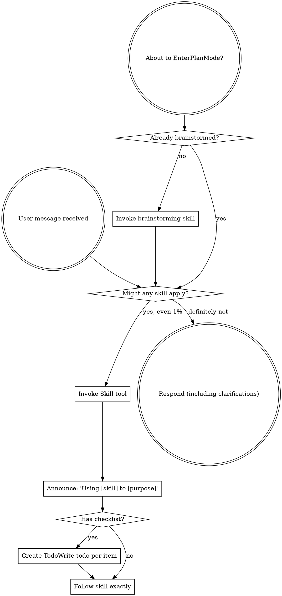
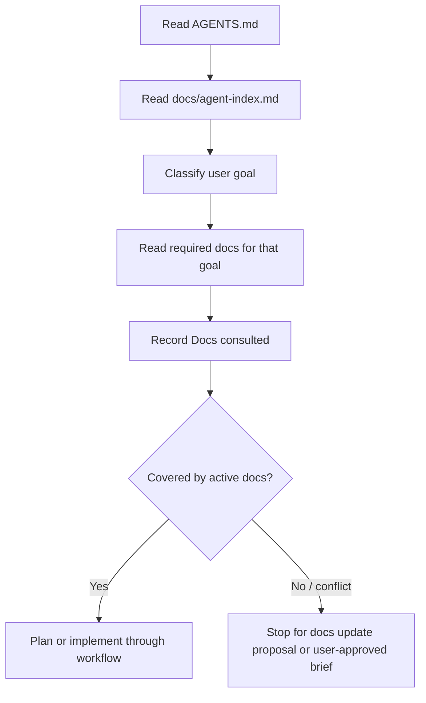
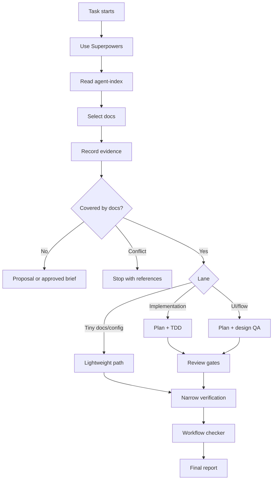
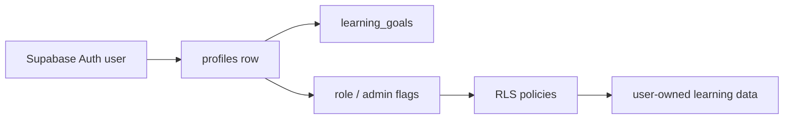

OpenAI Codex v0.128.0 (research preview)
--------
workdir: C:\Users\admin\Desktop\workspace\topik-project\v13
model: gpt-5.5
provider: openai
approval: never
sandbox: workspace-write [workdir, C:\Users\admin\.codex\memories]
reasoning effort: high
reasoning summaries: none
session id: 019e637c-a4a9-7963-be8b-4fd567dcd3a2
--------
user
# Cross-Model Review · Round 3
# Auth Error / Callback UX — Resolving Round 2 NEEDS REVISION items

Round 2 verdict: CONCERN. 4 NEEDS REVISION items + 2 NEW FINDINGS. All other findings ACCEPTED. Below are the final wording fixes.

## Round 2 NEEDS REVISION — author resolutions

### F2 (verifyOtp `type` values)

ACCEPTED. The callback Route Handler dispatches by Supabase-documented `type` values, not invented ones. Final mapping:

| Incoming URL params | Supabase call | Supabase docs `type` value |
| --- | --- | --- |
| `token_hash=...&type=signup` | `supabase.auth.verifyOtp({ type: 'signup', token_hash })` | `signup` |
| `token_hash=...&type=recovery` | `verifyOtp({ type: 'recovery', token_hash })` | `recovery` |
| `token_hash=...&type=email_change` | `verifyOtp({ type: 'email_change', token_hash })` | `email_change` |
| `token_hash=...&type=email` (PKCE magic link) | `verifyOtp({ type: 'email', token_hash })` | `email` |
| `code=...` (PKCE OAuth / SSR PKCE) | `exchangeCodeForSession(code)` | — |

The report's table will be updated with these exact `type` values. Source: https://supabase.com/docs/guides/auth/auth-email-passwordless and https://supabase.com/docs/guides/auth/server-side/advanced-guide

### C1 (`access_denied` source labeling)

ACCEPTED. `access_denied` is NOT in Supabase's published `error.code` list — it comes from:
- OAuth provider callback denial (e.g. Google "Cancel"), surfaced via URL fragment `#error=access_denied&error_code=access_denied`
- Currently out of phase (no OAuth wired up yet)

Final treatment in the reason table:
- `access_denied` row labeled **"(OAuth provider 거부 — 현 phase 외, OAuth �� 시 활성)"**.
- The current callback handler treats unknown `error_code` values as `reason=unknown`. `access_denied` becomes active only when OAuth providers are added later.

### C4 (Retry-After propagation)

ACCEPTED. Supabase's `Retry-After` header reaches `/auth/callback` Route Handler only; a redirect drops it. Resolution: Route Handler forwards the seconds value as a query param.

Contract:
```
on rate-limit error:
  retryAfter = response.headers.get('retry-after') ?? null
  redirect to /auth/error?reason=over_email_send_rate_limit&retry_after_seconds=<number-or-omitted>
```

`/auth/error` page reads `retry_after_seconds`:
- If present (1..86400): show countdown timer; disable CTA until expired.
- If absent: show fallback message "�시 후 다시 시�해주세요" with a generic 60s countdown (matching Supabase same-user OTP window).

### D2 (Supabase rate-limit full citation)

ACCEPTED. Report wording will cite the full Supabase rate-limit table, not only "30/hour":

> Supabase 기본 �� 한� (2026-05 기준, 출처: https://supabase.com/docs/guides/auth/rate-limits)
> - OTP / Magic link (`/auth/v1/otp`): 같� 사용��게 **60초 �내 �요청 불가**, 프로�트 전체 **시간당 30회**.
> - Email send (signup confirm / recover / email-change) 빌트� SMTP 사용 시: **시간당 2회**. 커스텀 SMTP 사용 시 � 높�.
> - �반 요청 endpoint: `over_request_rate_limit` 트리거 가능 (수치는 endpoint별 가변).

MVP 단계�서는 앱 레벨 추가 limiter 없� 위 한�� �존. 한계 �달 시 `/auth/error?reason=over_email_send_rate_limit` �는 `over_request_rate_limit`로 우아하게 안내.

## Round 2 NEW FINDINGS — author resolutions

### NEW-1 (`token_hash` type tightening)

ACCEPTED. Resolved by F2 above — the `type` mapping table now uses exact Supabase values, including `type=email` for PKCE magic link.

### NEW-2 (`access_denied` separate source)

ACCEPTED. Resolved by C1 above — `access_denied` is documented as OAuth-fragment-origin, not Supabase `error.code`.

## Final reason table (revised — same 11 reasons, just C1 + C4 wording tightened)

| `reason` | Source | Korean message (warm, plain) | Primary CTA | Notes |
| --- | --- | --- | --- | --- |
| `otp_expired` | Supabase `error.code` | "�� ��가 만료�어요. �메�� 다시 �력하면 새 메�� 보내드릴게요." | �메� �력 → �� 메� �전송 (60s cooldown) | |
| `flow_state_expired` | Supabase `error.code` | "�� 절차가 만료�어요. 처�부터 다시 시�해주세요." | 다시 시�하기 | |
| `flow_state_not_found` | Supabase `error.code` | "�� 요청� 찾� 수 없어요. 다른 기기/브�우저�서 시�한 ��� 수 �어요." | 다시 시�하기 | |
| `bad_code_verifier` | Supabase `error.code` | "보안 검�� 실패했어요. 같� 브�우저�서 �까지 진행해주세요." | 처�부터 다시 | |
| `user_not_found` | Supabase `error.code` | "� 계정� � �� 존�하지 않아요. 다시 가�하시면 �니다." | **다시 가�하기** | cleanup-deleted user 경로 |
| `over_email_send_rate_limit` | Supabase `error.code` | "메�� 너무 �� 보냈어요. �시 후 다시 시�해주세요." | (Retry-After countdown) | retry_after_seconds query 활용 |
| `over_request_rate_limit` | Supabase `error.code` | "요청� 너무 �아요. �시 기다려주세요." | (Retry-After countdown) | retry_after_seconds query 활용 |
| `email_not_confirmed` | Supabase `error.code` | "�메� ��� 아� 완료�지 않았어요. 받��지함� 확�해주세요." | �� 메� �전송 | |
| `signup_disabled` | Supabase `error.code` | "현� 신규 가�� �시 중단�어요." | 홈으로 | |
| `access_denied` | OAuth fragment (현 phase 외) | "��� 거부�어요." | 다시 시� | OAuth �� 시 활성 |
| `unknown` | catchall | "처리 중 문제가 �겼어요. �시 후 다시 시�해주세요." | 홈으로 | raw error_description� 서버 로그�만 |

## Your task (Round 3)

For each Round 2 NEEDS REVISION (F2 / C1 / C4 / D2) and NEW (NEW-1 / NEW-2), state ACCEPTED RESOLUTION / NEEDS FURTHER REVISION / REJECTED.

Then state whether the revised proposal is mergeable into the HTML report.

## Output format

```
VERDICT: PASS | CONCERN | FAIL

ROUND 2 NEEDS REVISION RESOLUTION:
| ID | Status | Note |
| F2 | ... |
| C1 | ... |
| C4 | ... |
| D2 | ... |
| NEW-1 | ... |
| NEW-2 | ... |

REVISED PROPOSAL ASSESSMENT:
- mergeable to HTML report: YES / NO
- blockers: ...

NEW FINDINGS (if any):
- ...

OVERALL:
- One paragraph.
```

2026-05-26T08:52:55.405803Z ERROR rmcp::transport::worker: worker quit with fatal: Transport channel closed, when AuthRequired(AuthRequiredError { www_authenticate_header: "Bearer resource_metadata=\"https://mcp.figma.com/.well-known/oauth-protected-resource\",scope=\"mcp:connect\",authorization_uri=\"https://api.figma.com/.well-known/oauth-authorization-server\"" })
2026-05-26T08:52:55.668820Z ERROR rmcp::transport::worker: worker quit with fatal: Transport channel closed, when Auth(TokenRefreshFailed("Server returned error response: invalid_grant: Invalid refresh token"))
hook: SessionStart
hook: SessionStart Completed
hook: UserPromptSubmit
hook: UserPromptSubmit Completed
codex
검토 요청으로 보고 진행합니다. 먼저 � 저�소� 필수 시� 절차대로 Superpowers와 문서 �우터를 확�한 뒤, 제안 문구 �체를 기준으로 �정하겠습니다.
hook: PreToolUse
hook: PreToolUse
hook: PreToolUse
hook: PreToolUse Completed
hook: PreToolUse Completed
hook: PreToolUse Completed
exec
"C:\\Windows\\System32\\WindowsPowerShell\\v1.0\\powershell.exe" -Command 'Get-Content -Path docs/agent-index.md -TotalCount 260' in C:\Users\admin\Desktop\workspace\topik-project\v13
exec
"C:\\Windows\\System32\\WindowsPowerShell\\v1.0\\powershell.exe" -Command 'Get-Content -Path .agents/superpowers/skills/using-superpowers/SKILL.md -TotalCount 220' in C:\Users\admin\Desktop\workspace\topik-project\v13
exec
"C:\\Windows\\System32\\WindowsPowerShell\\v1.0\\powershell.exe" -Command 'Get-Content -Path docs/ai-development-workflow.md -TotalCount 260' in C:\Users\admin\Desktop\workspace\topik-project\v13
 succeeded in 569ms:
---
name: using-superpowers
description: Use when starting any conversation - establishes how to find and use skills, requiring Skill tool invocation before ANY response including clarifying questions
---

<SUBAGENT-STOP>
If you were dispatched as a subagent to execute a specific task, skip this skill.
</SUBAGENT-STOP>

<EXTREMELY-IMPORTANT>
If you think there is even a 1% chance a skill might apply to what you are doing, you ABSOLUTELY MUST invoke the skill.

IF A SKILL APPLIES TO YOUR TASK, YOU DO NOT HAVE A CHOICE. YOU MUST USE IT.

This is not negotiable. This is not optional. You cannot rationalize your way out of this.
</EXTREMELY-IMPORTANT>

## Instruction Priority

Superpowers skills override default system prompt behavior, but **user instructions always take precedence**:

1. **User's explicit instructions** (CLAUDE.md, GEMINI.md, AGENTS.md, direct requests) ??highest priority
2. **Superpowers skills** ??override default system behavior where they conflict
3. **Default system prompt** ??lowest priority

If CLAUDE.md, GEMINI.md, or AGENTS.md says "don't use TDD" and a skill says "always use TDD," follow the user's instructions. The user is in control.

## How to Access Skills

**In Claude Code:** Use the `Skill` tool. When you invoke a skill, its content is loaded and presented to you?ë´£ollow it directly. Never use the Read tool on skill files.

**In Copilot CLI:** Use the `skill` tool. Skills are auto-discovered from installed plugins. The `skill` tool works the same as Claude Code's `Skill` tool.

**In Gemini CLI:** Skills activate via the `activate_skill` tool. Gemini loads skill metadata at session start and activates the full content on demand.

**In other environments:** Check your platform's documentation for how skills are loaded.

## Platform Adaptation

Skills use Claude Code tool names. Non-CC platforms: see `references/copilot-tools.md` (Copilot CLI), `references/codex-tools.md` (Codex) for tool equivalents. Gemini CLI users get the tool mapping loaded automatically via GEMINI.md.

# Using Skills

## The Rule

**Invoke relevant or requested skills BEFORE any response or action.** Even a 1% chance a skill might apply means that you should invoke the skill to check. If an invoked skill turns out to be wrong for the situation, you don't need to use it.



## Red Flags

These thoughts mean STOP?ë´¸ou're rationalizing:

| Thought | Reality |
|---------|---------|
| "This is just a simple question" | Questions are tasks. Check for skills. |
| "I need more context first" | Skill check comes BEFORE clarifying questions. |
| "Let me explore the codebase first" | Skills tell you HOW to explore. Check first. |
| "I can check git/files quickly" | Files lack conversation context. Check for skills. |
| "Let me gather information first" | Skills tell you HOW to gather information. |
| "This doesn't need a formal skill" | If a skill exists, use it. |
| "I remember this skill" | Skills evolve. Read current version. |
| "This doesn't count as a task" | Action = task. Check for skills. |
| "The skill is overkill" | Simple things become complex. Use it. |
| "I'll just do this one thing first" | Check BEFORE doing anything. |
| "This feels productive" | Undisciplined action wastes time. Skills prevent this. |
| "I know what that means" | Knowing the concept ??using the skill. Invoke it. |

## Skill Priority

When multiple skills could apply, use this order:

1. **Process skills first** (brainstorming, debugging) - these determine HOW to approach the task
2. **Implementation skills second** (frontend-design or other domain implementation skills) - these guide execution

"Let's build X" ??brainstorming first, then implementation skills.
"Fix this bug" ??debugging first, then domain-specific skills.

## Skill Types

**Rigid** (TDD, debugging): Follow exactly. Don't adapt away discipline.

**Flexible** (patterns): Adapt principles to context.

The skill itself tells you which.

## User Instructions

Instructions say WHAT, not HOW. "Add X" or "Fix Y" doesn't mean skip workflows.

hook: PostToolUse
 succeeded in 609ms:
# AI Agent Index

This is the mandatory routing index for AI agents. Read this file after `AGENTS.md` and before planning or editing.

Purpose: make document access predictable as the project grows. Do not read every document by default. Select the smallest required set by task goal, then record the exact files in `Docs consulted`.

## Startup Algorithm



## Index Groups

| Index | Group | Entry point | Use for |
| --- | --- | --- | --- |
| `ROOT-00` | Human project map | [../README.md](../README.md) | Human-friendly project overview |
| `DOCS-00` | Docs map | [README.md](README.md) | Human + AI navigation across `docs/` |
| `AGENT-00` | AI routing | [agent-index.md](agent-index.md) | Required AI document selection |
| `FLOW-00` | AI workflow entry | [ai-development-workflow.md](ai-development-workflow.md) | Entry point ??88-line index that links sub-docs |
| `WF-00` | Workflow sub-docs | [ai-workflow/planning-contracts.md](ai-workflow/planning-contracts.md), [ai-workflow/context-and-packets.md](ai-workflow/context-and-packets.md), [ai-workflow/review-gates.md](ai-workflow/review-gates.md), [ai-workflow/fallback-and-recovery.md](ai-workflow/fallback-and-recovery.md) | Planning 쨌 ledger/packets 쨌 review gates 쨌 fallback matrix |
| `WF-10` | Ledger/report templates | [ai-workflow/README.md](ai-workflow/README.md) | Ledgers, reports, packets, plans (folder map + templates) |
| `HARNESS-00` | Harness and skills | [ai-workflow/harness-and-skills.md](ai-workflow/harness-and-skills.md) | TALKPIK, practical skills, GStack, Superpowers, host-specific skill names |
| `PRODUCT-00` | Product requirements | [prd.md](prd.md) | Product scope, users, value, business rules |
| `SPEC-00` | Implementation spec | [spec.md](spec.md) | Development baseline, behavior, validation, framework, backend, auth, AI boundary, deployment |
| `DEV-10` | Development details | [development/README.md](development/README.md) | Detailed technical specs selected through `SPEC-00` |
| `UI-00` | Design system | [ant-design/README.md](ant-design/README.md) | UI implementation, tokens, components, motion |
| `IA-00` | Information architecture | [ia.md](ia.md), [sitemap.md](sitemap.md) | Page hierarchy, routes, navigation |
| `IA-10` | Screen specs | [IA/README.md](IA/README.md) | Specific page descriptions and wireframes |
| `JOURNEY-00` | User journey | [flow/user-flow.md](flow/user-flow.md) | Step order, transitions, entry/exit states |
| `LEGACY-00` | Legacy observations | [ia-pages/README.md](ia-pages/README.md), [user-flow.md](user-flow.md) | Historical context only |

## Goal-To-Doc Routing

| User goal | Required docs | Conditional docs | Notes |
| --- | --- | --- | --- |
| Product scope, user value, roles, business direction | `PRODUCT-00` | `SPEC-00`, `JOURNEY-00` | Do not invent new product direction. |
| Functional behavior, validation, data handling, acceptance criteria | `SPEC-00` | `PRODUCT-00`, `JOURNEY-00` | Use for implementation and tests. |
| Framework, package, dependency, backend, auth, deployment, env vars, deferred billing | `SPEC-00` | Matching `DEV-10` detail file | Start at `spec.md`; do not read all development details by default. |
| Navigation, routes, page hierarchy | `IA-00` | `JOURNEY-00`, `IA-10` | Use Target React Route Map, not legacy route notes. |
| User journey, screen order, transitions, entry/exit states | `JOURNEY-00` | `IA-10`, `SPEC-00` | `docs/user-flow.md` is legacy context only. |
| Visual UI, layout, components, tokens, motion | `UI-00` | `IA-10`, `JOURNEY-00` | Run design review before user-facing implementation. |
| Specific page or screen | `IA-10` matching page | `UI-00`, `JOURNEY-00`, `SPEC-00` | Read the matching `description.md` and inspect `wireframe.png`. |
| Admin ?붾㈃ / 沅뚰븳 / RBAC / audit log | `SPEC-00`, ?대떦 admin `IA-10`(`docs/IA/{21-H-01,30-X-08,32-X-10}-*`), `DEV-10`(backend-auth) | `JOURNEY-00`, `UI-00`, `docs/ai-workflow/light-specs/phase-6-admin-library-hardening.md` | Admin?€ ?쇰컲 ?ъ슜?먯? 沅뚰븳 �⑤뜽쨌UI �꾧린쨌QA ?쒕굹由ъ삤媛€ ?ㅻ쫫. Plan/Light Spec??`Audience: user/admin/both` �낆떆 ?꾩닔. `Architecture Pass`?먯꽌 audience 寃�� = 肄붾뱶 boundary ?쇱튂 寃€�? |
| AI workflow, context, reports, fallback, multi-agent work | `FLOW-00`, `WF-00` | `HARNESS-00` | Required for workflow or harness changes. |
| Historical page composition | `LEGACY-00` | Active docs above | Reference only. Active docs win. |

## Development Detail Routing

Use this table only after reading [spec.md](spec.md).

| Development goal | Read |
| --- | --- |
| Frontend framework, package choice, runtime, UI library, forms, validation, charts, tests | [development/stack.md](development/stack.md) |
| Supabase, Auth, Postgres, RLS, Storage, server-only keys | [development/backend-auth.md](development/backend-auth.md) |
| Vercel, environments, deployment gates, environment variables, rollback, CI, preview links | [development/deployment.md](development/deployment.md) |
| Billing, subscription, paywall, payment provider, deferred scope | [development/deferred-scope.md](development/deferred-scope.md) |

## Active Vs Legacy Rule

Active docs govern implementation, QA, and review:

- [prd.md](prd.md)
- [spec.md](spec.md)
- [ant-design/README.md](ant-design/README.md)
- [sitemap.md](sitemap.md) Target React Route Map
- [ia.md](ia.md)
- [IA/README.md](IA/README.md) and matching `docs/IA/<page>/description.md`
- [flow/user-flow.md](flow/user-flow.md)

Legacy docs are reference only:

- [user-flow.md](user-flow.md)
- [ia-pages/README.md](ia-pages/README.md)
- Legacy HTML Route Map sections inside [sitemap.md](sitemap.md)

If active and legacy docs conflict, active docs win. If active docs conflict with the user request, stop and report the conflict.

## Ledger Requirement Index

Create or update a run ledger under `docs/ai-workflow/runs/YYYY/MM/DD/` when any of these apply:

| Trigger | Required |
| --- | --- |
| Non-trivial work | Yes |
| Implementation work | Yes |
| UI, route, flow, or integration changes | Yes |
| Net-new scope or doc conflict | Yes |
| Multi-agent work | Yes |
| Work likely to resume later | Yes |
| Tiny docs/config-only edit with no behavior change, no conflict, no multi-agent work, no resume risk | May skip with reason |

Use [ai-workflow/context-ledger-template.md](ai-workflow/context-ledger-template.md).

For consistency, classify the work as non-trivial when it changes workflow-governing files, automation, scripts, CI, routes, UI, auth, database, API, dependencies, deployment behavior, test strategy, or AI-service boundaries. Multi-file changes are non-trivial by default unless they are purely mechanical docs/config updates and the final report states the lightweight exception.

When a ledger is required, update it before final verification and include it in the dirty scope, commit trailers, PR body, or final report as applicable.

## Output Requirement

Every plan, handoff, or final report must include:

- `Docs consulted`: exact files read.
- `Extracted requirements`: concrete requirements taken from those docs.
- `Doc conflicts`: `none` or exact conflict references.
- `Untouched relevant docs`: docs that seemed related but were not read, with reason.
- `Context ledger`: path or allowed lightweight exception.

hook: PostToolUse
 succeeded in 640ms:
# AI Development Workflow

Entry point for every AI agent working in this repository. **Read this file first, then follow the links to the sub-doc that governs your current task.** Detailed rules live in the four sub-docs listed at the bottom ??they are not duplicated here.

## Mandatory Startup

1. Invoke `using-superpowers` (Claude Code) or read its canonical SKILL file (other hosts). If host mirrors are stale, run `node scripts/sync-agent-skills.mjs` and retry.
2. Read [`docs/agent-index.md`](agent-index.md), classify your goal, and select the smallest matching docs.
3. Record `Docs consulted`, `Extracted requirements`, `Doc conflicts`, `Untouched relevant docs`, and `Context ledger` in your plan or ledger.
4. Run `node scripts/ai-workflow-check.mjs --repo .` before final reporting when Node is available. PRs run the same checker via `.github/workflows/ai-workflow-check.yml`.

## Workflow Diagram



## Lane Selection

| Work type | First action | Rules live in |
| --- | --- | --- |
| Tiny docs/config, no behavior change | Lightweight Path below | this file 짠Lightweight |
| Bug fix | `systematic-debugging` ??TDD | [`review-gates.md`](ai-workflow/review-gates.md) |
| Feature / behavior change | `writing-plans` ??TDD ??review gates | [`planning-contracts.md`](ai-workflow/planning-contracts.md), [`review-gates.md`](ai-workflow/review-gates.md) |
| UI / user flow | `writing-plans` + design review ??TDD ??UX/UI Consistency Pass ??audience蹂?QA | same as above + design review; Audience rules ?꾨옒 李몄“; [`review-gates.md#uxui-consistency-pass`](ai-workflow/review-gates.md#uxui-consistency-pass) |
| Net-new scope or doc pivot | `office-hours` + `brainstorming` ??docs update proposal OR approved brief | [`planning-contracts.md`](ai-workflow/planning-contracts.md) |
| Conflict with active docs | Stop. Report conflict with exact references. Do not implement. | this file 짠Mandatory Startup |
| Multi-agent / phase work | Plan + Light Spec + Ledger + cross-model review | [`planning-contracts.md`](ai-workflow/planning-contracts.md), [`context-and-packets.md`](ai-workflow/context-and-packets.md) |

### Audience rules (UI / user-flow 李⑥꽑 + �⑤뱺 phase ?묒뾽???곸슜)

UI 쨌 ?ъ슜???먮쫫 쨌 phase ?⑥� ?묒뾽?€ ?쒖옉 ?쒖�??audience瑜?�낆떆?�� ?쒕�. Audience �꾨쪟??UI/沅뚰븳 �꾧린 ?쒖젙 ??�꾨??뷀� ?쒖뒪???묒뾽(`cron`, `system`, `external partner` ???€ 蹂꾨룄 異뺤�濡?異뷀� ?꾩엯?쒕�.

- **`user`**: ?쇰컲 ?ъ슜???붾㈃. RLS??`auth.uid()` 湲곕컲 ?먭린 row ?쒖젙.
- **`admin`**: 愿€由ъ옄 ?붾㈃. `requirePlatformAdmin / requireContentAdmin / requireOrgAdmin` 媛숈? ?�씠�€ 媛€???�Т + �⑤뱺 沅뚰븳 蹂€寃?諛쒗뻾 ?좉??€ `admin_audit_logs` 湲곕줉 ?�Т.
- **`both`**: user/admin??媛숈? phase???ㅼ뼱媛? user/admin **task瑜?媛곴컖???��濡?�꾨�**??plan task table???곴퀬, 媛??�뿉 ?먯껜 audience �낆떆. Light Spec??user/admin �꾧린 ?대뜑 寃��(?? `src/app/admin/...` vs `src/app/library/...`)瑜???以꾩뵫 �낆떆.

audience �낆떆쨌寃€�?�€?? [`planning-contracts.md`](ai-workflow/planning-contracts.md) Light Spec Domain Boundary + task table audience ?? [`agent-packets.md`](ai-workflow/agent-packets.md) Task/Result Packet audience ?꾨뱶, [`review-gates.md#architecture-pass`](ai-workflow/review-gates.md#architecture-pass) audience 寃�� ??�, [`fallback-and-recovery.md`](ai-workflow/fallback-and-recovery.md) audience-mismatch fail-closed.

## Core Invariants

These are mandatory for any non-lightweight change. **The linked sub-doc is the authoritative source** ??this list exists so an agent reading only the entry file does not miss them.

- **TDD** (RED ??confirm fail ??GREEN ??confirm pass ??refactor while green). Allowed exceptions are docs-only, config-only, generated artifacts, or no runnable test surface. Full loop and exceptions: [`review-gates.md#tdd`](ai-workflow/review-gates.md).
- **Cross-model review is mandatory** for every code change and every non-trivial plan or doc change. When only one model is available, record `Cross-model review: degraded ??<reason>` in the ledger. [`review-gates.md#cross-model-review`](ai-workflow/review-gates.md#cross-model-review).
- **Plan-Review PASS Gate** ??if a pre-implementation review (`plan-eng-review`, `codex consult`, etc) returns FAIL, revise the plan AND re-run the same review until PASS or until each remaining concern is recorded as "accepted with reason" in the ledger. [`review-gates.md#plan-review-pass-gate`](ai-workflow/review-gates.md).
- **Architecture Pass** at phase completion: route handlers have no leaked business logic, folder/name boundaries match `docs/domain-glossary.md`, no single concept is implemented in two places. [`review-gates.md#architecture-pass`](ai-workflow/review-gates.md).
- **UX/UI Consistency Pass** when changed files match UI patterns (`src/app/**`, `src/components/**`, `src/features/**`, `src/lib/ui/**`, `src/styles/**`, `*.css`, `theme*`, etc.). 4-line evidence(Tokens 쨌 Components 쨌 A11y 쨌 Responsive) in ledger, machine-checked. Test-only changes auto-exempt. [`review-gates.md#uxui-consistency-pass`](ai-workflow/review-gates.md).
- **CSS Variable Scoping Gate** when changed files include `src/theme/**`, `src/styles/**`, `app/layout.tsx`, or any file containing `--app-*` declarations: verify the five constraints in [`docs/ant-design/06-ai-development-workflow.md#css-variable-scoping`](ant-design/06-ai-development-workflow.md) and run `scripts/ai-workflow-check.mjs`. The gate is machine-enforced for the following patterns: `--app-*: var(--ant-*)` chains, bare `@theme {` without `inline`, and `getAppTheme` at module scope. [`docs/ant-design/08-theme-architecture.md#css-variable-architecture-contract`](ant-design/08-theme-architecture.md).
- **Light Spec + Out of Scope + Smallest Buildable Unit + Subagent-eligible column** are mandatory plan/light-spec sections, machine-checked by `scripts/ai-workflow-check.mjs`. [`planning-contracts.md`](ai-workflow/planning-contracts.md).
- **Context ledger** is required for any non-trivial work (multi-file, implementation, UI/route/auth/database/API/dependency/test-strategy/AI-boundary change, multi-agent work, work likely to resume across sessions, **or any change to workflow-governing files ??`AGENTS.md`, `CLAUDE.md`, `docs/agent-index.md`, `docs/ai-development-workflow.md`, files under `docs/ai-workflow/`, `scripts/`, `.github/`**). [`context-and-packets.md`](ai-workflow/context-and-packets.md).
- **Fallback Protocol** ??fallback never weakens a quality gate. Classify failures (fail-closed, degraded-mode, recover, retry-once, reassign) and record evidence in the ledger. [`fallback-and-recovery.md`](ai-workflow/fallback-and-recovery.md).

## Required Evidence (Before Final Report)

- `Docs consulted` ??exact files read
- `Extracted requirements` ??concrete requirements pulled from those files
- `Doc conflicts` ??`none` or exact file references
- `Untouched relevant docs` ??and why they were not read
- `Context ledger` ??path or allowed lightweight exception
- Verification commands run and results
- Git publication decision per [`git-publication-decision.md`](ai-workflow/git-publication-decision.md)

Final response must follow [`report-template.md`](ai-workflow/report-template.md).

## Lightweight Path

For a tiny docs/config/non-behavioral change with no multi-agent work, no UI/flow change, no doc conflict, and no resume risk:

1. `using-superpowers`
2. Skill applicability check
3. Edit
4. Narrowest relevant verification (lint/typecheck/inspection)
5. Report checks and risks

A context ledger may be skipped only if every condition above is satisfied. State the exception in the final report. This path is **not allowed for production behavior changes**.

## Sub-docs (depth lives here)

- [`docs/ai-workflow/planning-contracts.md`](ai-workflow/planning-contracts.md) ??Light Spec, Out of Scope/Intentional Cuts, Smallest Buildable Unit, Subagent-eligible column, task-table contract
- [`docs/ai-workflow/context-and-packets.md`](ai-workflow/context-and-packets.md) ??Context ledger template, agent task/result packets, multi-agent integration, resume/compaction recovery
- [`docs/ai-workflow/review-gates.md`](ai-workflow/review-gates.md) ??TDD loop, Cross-model review, Plan-Review PASS Gate, Architecture Pass, QA gate, finish gate
- [`docs/ai-workflow/fallback-and-recovery.md`](ai-workflow/fallback-and-recovery.md) ??Failure classes, fallback matrix, degraded-mode reporting

hook: PostToolUse
hook: PostToolUse Completed
hook: PostToolUse Completed
hook: PostToolUse Completed
codex
`using-superpowers` 기준으로 관련 스킬� 확�했습니다. � �업� 코드 수정� 아니� 제안 검토�서, 저�소 문서�서는 AI 워�플로와 Supabase/Auth 관련 문서만 �게 확�하고 공� Supabase 문서로 사실관계를 대조하겠습니다.
hook: PreToolUse
hook: PreToolUse
hook: PreToolUse
hook: PreToolUse
hook: PreToolUse Completed
hook: PreToolUse Completed
exec
"C:\\Windows\\System32\\WindowsPowerShell\\v1.0\\powershell.exe" -Command 'Get-Content -Path docs/ai-workflow/review-gates.md -TotalCount 260' in C:\Users\admin\Desktop\workspace\topik-project\v13
exec
"C:\\Windows\\System32\\WindowsPowerShell\\v1.0\\powershell.exe" -Command "Get-Content -Path C:\\Users\\admin\\Desktop\\workspace\\topik-project\\v13\\.codex\\skills\\gstack-review\\SKILL.md -TotalCount 220" in C:\Users\admin\Desktop\workspace\topik-project\v13
hook: PreToolUse Completed
exec
"C:\\Windows\\System32\\WindowsPowerShell\\v1.0\\powershell.exe" -Command 'Get-Content -Path docs/spec.md -TotalCount 260' in C:\Users\admin\Desktop\workspace\topik-project\v13
hook: PreToolUse Completed
exec
"C:\\Windows\\System32\\WindowsPowerShell\\v1.0\\powershell.exe" -Command 'Get-Content -Path docs/development/backend-auth.md -TotalCount 260' in C:\Users\admin\Desktop\workspace\topik-project\v13
 succeeded in 684ms:
# Review Gates

All review and verification gates: TDD loop, cross-model review, plan-review PASS gate, code review, architecture pass, QA, and finish. **Entry point**: [`docs/ai-development-workflow.md`](../ai-development-workflow.md).

This sub-doc owns 짠2 (TDD), 짠3 (Codex+Claude Together), 짠3a (Plan-Review PASS Gate), 짠4 (Review Gate), 짠4b (Architecture Pass), 짠5 (QA Gate), and the review portion of 짠6 (Finish) of the legacy workflow.

## TDD

For code changes, `test-driven-development` is mandatory.

The required loop:

1. Write or update the smallest failing test
2. Run it and verify it fails for the expected reason
3. Write the minimal implementation
4. Run the focused test until it passes
5. Refactor only while tests stay green
6. Run broader verification

### Allowed TDD exceptions

- Documentation-only changes
- Configuration-only changes
- Generated artifacts
- No existing runnable test surface

When an exception applies, state it and use the nearest practical verification (lint, typecheck, build, static inspection, manual flow testing). The "no runnable test surface" exception is temporary ??once `package.json` or `src/` exists, behavior changes must not use this exception unless the relevant surface still has no executable test path.

## Cross-Model Review

**Cross-model review is mandatory** for every code change and every non-trivial plan or doc change. A different model than the implementer must read the diff and either record findings or sign off. The intent is to cover one model's blind spots with another model's reading.

Pairing:

- Codex implements ??Claude reviews (`requesting-code-review` or GStack `review`)
- Claude implements ??Codex reviews (`requesting-code-review` or GStack `gstack-review`)

When only one model is available, the implementer must record `Cross-model review: degraded ??<reason>` in the ledger's `## Verification State`. The checker (`scripts/ai-workflow-check.mjs`) treats `Cross-model review:` as required; missing/empty values block CI. Degraded completion is allowed only when the reason is recorded.

The implementer must not mark the task complete until reviewer findings are addressed or explicitly documented as rejected with a reason.

## Plan-Review PASS Gate

When a plan goes through pre-implementation review (`plan-eng-review`, `plan-ceo-review`, `plan-design-review`, or `codex consult` on the plan file) and the reviewer returns **FAIL**, the implementer must:

1. Revise the plan to address the findings
2. **Re-run the same review** against the revised plan
3. Only proceed to implementation after the re-review returns **PASS** (or **CONCERN** with each remaining concern explicitly documented in the ledger as "accepted with reason")

Going straight from "FAIL ??revise ??implement" without a re-review is a workflow violation: the implementer is signing off on their own revision and the originally-flagged risks have not been re-validated by an independent reader. This is true even when post-implementation cross-model review is planned ??that catches code-level issues, not plan-level ones.

Record the pre-implementation review chain in the ledger Decisions table with timestamps for the original review, the revision, and the re-review. If only one model is available for re-review, record `Re-review: degraded ??<reason>` and accept the residual risk explicitly.

Exemptions:

- **Lightweight path** changes skip plan review entirely; this gate does not apply
- **PASS verdict** on the first review needs no re-run
- **CONCERN verdict** on the first review needs the concerns documented and accepted, but no full re-review unless the implementer changes the plan in response

### Round-cap rule (lesson from cleanup PR)

- Base limit: 3 rounds
- Workflow-governing docs or first review FAIL: 4-5 rounds allowed
- Beyond 5 rounds: escalation to the user is mandatory (no infinite loops)
- When a round catches a different *layer* (scope summary ??task body ??prose ??verification) each pass, the implementer should fix every layer simultaneously rather than one at a time

### Disagreement resolution

When cross-review surfaces a commitment-level disagreement (not a simple finding):

1. Each side records its position + rationale + trade-off in the ledger (one paragraph)
2. Apply quantitative criteria first (line counts, checker PASS, token cost, explicit user rule)
3. If only qualitative trade-offs remain, each side does a "weakness acknowledgement" round
4. If unresolved, escalate to the user with options A/B + trade-offs + recommendation + risk
5. User's decision and rationale are recorded in the ledger

Downgrades from P1 to P2 (or P2 to accepted) require ledger evidence: originally flagged level, downgraded level, rationale, accepted trade-off, residual risk, owner decision. **PASS is forbidden while any downgraded P1/P2 lacks this record.**

## Code/Doc Review Gate

Every code change must pass review before completion:

- Superpowers review: `requesting-code-review`, then `receiving-code-review` when feedback exists
- GStack review: `review` (Claude) / `gstack-review` (Codex)

Review must check:

- Behavior matches the accepted plan
- Tests cover the changed behavior
- No unrelated refactors or broad rewrites
- Error states, empty states, edge cases handled
- User-facing text and UI remain coherent

When an independent reviewer or GStack review is unavailable, record degraded mode and run an explicit self-review checklist:

- Scope: changed files match accepted scope, no unrelated edits introduced
- Docs: implementation matches consulted active docs
- Tests: changed behavior covered, or TDD exception + substitute verification documented
- Failure paths: error states, empty states, fallback paths considered
- Evidence: verification commands run fresh, outputs read
- Ledger: current and lists remaining risks

## Architecture Pass

Every phase completion must pass an Architecture Pass before the next phase starts. This is a focused last-mile review that makes the domain visible in the code, not a generic refactor:

- Route/page handlers contain no business logic that should live in a service or domain module
- Folder names and module boundaries match `docs/domain-glossary.md` and the agreed phase scope
- A single concept is not implemented in two places. If duplication exists, the ledger records a deliberate reason or the duplication is removed
- File names, function names, and types use domain terms, not implementation terms
- **Audience 寃�� = 肄붾뱶 boundary ?쇱튂** ??Light Spec??`Audience: user/admin/both` �낆떆?€ ?ㅼ젣 肄붾뱶 ?대뜑(`src/app/admin/...`, `src/app/library/...`, `src/lib/admin/...`, `src/lib/auth/admin-guard.ts` ??媛€ ?쇱튂?쒕�. ?꾪뿕 ?⑦꽩 (?ㅼ젣 RLS ?고쉶 寃�줈): ??admin RPC 쨌 `SECURITY DEFINER` ?⑥닔 쨌 service role ?몄텧??user ?쇱슦?몄쓽 肄붾뱶 寃�줈?먯꽌 �곸젒 ?몄텧?? ??admin ?쇱슦?몄뿉??`requirePlatformAdmin / requireContentAdmin / requireOrgAdmin` ?�씠�€ 媛€?쒓? ?꾨씫?? ??content_admin ??platform_admin 沅뚰븳 ?곸듅 李⑤떒 ?뺤콉??RPC ?대????�쓬. ?대뜑 ?쇳빀 ?먯껜??臾댄�?????��??????寃�줈 以??�굹?쇰룄 ?���?RLS ?고쉶. `both`??phase??user?€ admin ?묒� ?대뜑 boundary 媛곴컖 寃€�?+ ?????⑦꽩 grep.

The ledger records the result:

```
- Architecture Pass: passed | failed | skipped ??<reason>
```

`scripts/ai-workflow-check.mjs` requires this field whenever the ledger's `Status:` is `complete` AND the ledger is a phase ledger. Phase plans (`*-development-phases-and-bootstrap.md`) must also list `Architecture Pass` in every row of the Phase Contract `Completion Gate` column.

## UX/UI Consistency Pass

UI 蹂€寃�씠 ?ы븿??�⑤뱺 ?묒뾽?먯꽌 ?듦낵?�� ?쒕�.

**寃뚯씠???꾩튂**: UI �ы� ?꾨즺 ?? ?ㅼ쓬 QA Gate(browser/visual ?ㅽ뻾 寃€�? **??*???ъ쟾 ?먭?.

**Architecture Pass?€??寃��**: Architecture Pass??肄붾뱶 boundary?€ audience(?꾧? ?곕굹)瑜?蹂몃�. UX/UI Consistency Pass??**visual/system consistency**(媛숈? ?⑦꽩?멸?, ?�겙 ?곕Ⅴ?? ?��???�굹, 諛�쓳??�ㅽ듃由?뒪 而ㅻ쾭?�굹)瑜?蹂몃�. ????phase ?꾨즺 ?쒖�???��?�?�?蹂대뒗 李⑥�???ㅻⅤ??

**QA Gate?€??寃��**: QA??濡쒖뺄 ?ㅽ뻾?쇰줈 **?ㅼ젣 ?숈옉** 寃€�? UX/UI Pass??**肄붾뱶/?붿옄??臾몄꽌 湲곕컲 ?ъ쟾 ?쇨???* ?먭? ???ㅽ뻾 ????

### 4媛?泥댄겕

媛?泥댄겕??`passed` 쨌 `failed` 쨌 `skipped ??<reason>` 以??�굹濡?ledger??湲곕줉. 媛?泥댄겕??PASS 湲곗??€ ��퀬 ?먯젙 媛€?ν븯寃?

- **Tokens PASS**: AntD ?�겙�??ъ슜. hardcoded color/radius/shadow/spacing ?�쓬. ?�쇅???ъ쑀 ?꾩닔.
  - ?뺣낯: [`docs/ant-design/02-global-styles.md`](../ant-design/02-global-styles.md), [`docs/ant-design/08-theme-architecture.md`](../ant-design/08-theme-architecture.md)
- **Components PASS**: 媛숈? ?⑦꽩?€ 媛숈? 而댄룷?뚰듃 ?ъ궗?? ??而댄룷?뚰듃 ?꾩엯 ??湲곗〈 ?⑦꽩怨?�꾧탳 + ?ъ쑀 湲곕줉.
  - ?뺣낯: [`docs/ant-design/03-patterns-and-components.md`](../ant-design/03-patterns-and-components.md), 李멸퀬 [`docs/ant-design/01-design-values.md`](../ant-design/01-design-values.md)
- **A11y PASS**: ?ㅻ낫???꾨떖 + focus visible + semantic label + ?�뒪???€�?4.5:1 ?�긽. 4媛€�€ �⑤몢 寃€?�옄媛€ ?뺤씤.
  - ?뺣낯: [`docs/ant-design/07-review-checklist.md`](../ant-design/07-review-checklist.md)
- **Responsive PASS**: 360px (mobile) / 768px (tablet) / 1280px (desktop) 3媛?breakpoint?먯꽌 �⑥쭚 ?�쓬.
  - ?뺣낯: [`docs/ant-design/02-global-styles.md`](../ant-design/02-global-styles.md) (breakpoint ?뺤쓽)

### ?�슜?�뒗 `skipped` ?ъ쑀

- `skipped ??types-only, no UI component prop/type contract change`: `*.d.ts` / `*.types.ts`�?蹂€寃? UI component prop/type 怨꾩빟 蹂€寃??�쓬 �낆떆.
- `skipped ??internal refactor, no visual change`: 而댄룷?뚰듃 ?대? ?뺣��? ?뚮뜑 寃곌낵 ?숈씪.
- `skipped ??dead code removal`: ?쇱슦???�씠�€?먯꽌 ?몄텧?�? ?딅뒗 而댄룷?뚰듃 ??젣.
- `skipped ??non-UI workflow change`: workflow 嫄곕쾭???ㅽ겕由�듃/CI 蹂€寃�쭔, UI ?곹뼢 ?�쓬.

?먮� ?먭??€ "?ъ쑀 �꾩뼱 ?�쓬 = FAIL"�?媛뺤젣. ?ъ쑀 ?�슜 ?먯껜??寃€�앺븯�€ ?딅뒗?? ?ъ쑀 ?뺤떇 ?⑥슜?€ 蹂꾨룄 �꾧린 媛먯궗(?�젙).

### ledger 湲곕줉 ?뺤떇

```
- UX/UI Consistency Pass: passed
  - Tokens: passed ??寃€??寃곌낵 ??以?+ ?뺣낯 臾몄꽌 寃�줈
  - Components: passed ??寃€??寃곌낵 ??以?  - A11y: passed ???ㅻ낫??focus/label/?€�?4媛€�€ �⑤몢 ?뺤씤
  - Responsive: passed ??360/768/1280 �⑤몢 �⑥쭚 ?�쓬
```

?먮뒗 ?꾩껜 skipped??寃�슦(?먮� ��젣??蹂꾨룄 ?꾨옒):

```
- UX/UI Consistency Pass: skipped ??internal refactor, no visual change
  - Tokens: skipped ??same reason
  - Components: skipped ??same reason
  - A11y: skipped ??same reason
  - Responsive: skipped ??same reason
```

�€�??꾨뱶?€ 4媛??�� ?꾨뱶 �⑤몢 議�옱 + 媛?�꾩뼱 ?�? ?딆쓣 寃? ?대뒓 ?�굹?쇰룄 ?꾨씫/怨듬갚?대㈃ `scripts/ai-workflow-check.mjs`媛€ FAIL.

### ?곸슜 ?€??PR 媛먯?

?ㅼ쓬 寃�줈 以??�굹 ?�긽??蹂€寃�릺�?UX/UI Consistency Pass ?꾩닔:
- `src/app/**`, `src/components/**`, `src/features/**`, `src/lib/ui/**`, `src/styles/**`
- `**/*.css`, `**/*.scss`, `**/globals.css`
- `**/theme*`, `tailwind.config.*`, `postcss.config.*`
- `public/icons/**`, `public/images/**`

**?먮� ��젣** (?щ엺 ledger 湲곕줉 ��슂): 蹂€寃??뚯씪??`**/*.test.*`, `**/*.spec.*`, `**/__tests__/**`濡쒕쭔 �ъ꽦?�㈃ 寃뚯씠???먮� skip. types-only(`*.d.ts`, `*.types.ts`)???먮� ��젣 ?꾨떂 ????`skipped ??types-only ...` ?ъ쑀 ?뺤떇?쇰줈 �낆떆 ?�Т.

## QA Gate

> **Past failure case** ??[`reports/phase-6-qa-gate-skipped-postmortem.html`](../../reports/phase-6-qa-gate-skipped-postmortem.html) (2026-05-22). 寃뚯씠?몃뒗 ?�뿀?쇰굹 ???곕Ⅸ 寃곌낵 dev ?쒕쾭媛€ HTTP 500???대ʼn ?ъ슜?먯뿉寃??몄텧?? 媛숈? ?⑦꽩 ?щ컻 諛⑹?瑜??꾪� 蹂?짠QA Gate??enforcement 猷곗씠 異붽???(?먮� 寃€?? `scripts/ai-workflow-check.mjs`).

Use QA for user-facing, browser, interaction, or integration work:

- Codex: `gstack-qa` or `gstack-qa-only`
- Claude Code: `qa` or `qa-only`

QA must include:

- **Starting the local app when applicable** ??UI 蹂€寃�씠 ?ы븿???묒뾽?€ dev ?쒕쾭 �€?낆쓣 �좊쑉由????녿�. vitest/typecheck/build ?듦낵??not sufficient.
- Exercising the changed user path
- Checking responsive layout when UI changed
- Capturing failures as reproducible notes
- Adding regression coverage when possible

### ledger 湲곕줉 ?뺤떇 (?�Т)

UI 蹂€寃?PR?먯꽌??蹂€寃�맂 ledger??`QA Gate:` ?꾨뱶媛€ 諛�뱶???�뼱???쒕�. ?먮� 寃€?ш? 媛뺤젣. ?뺤떇:

```
- QA Gate: passed | failed | degraded ??<blocker + alternative verification + residual risk> | skipped ??<reason>
```

媛?媛믪쓽 ?�?:
- **passed**: 濡쒖뺄 ??�€??+ 蹂€寃�맂 user path �곸젒 ?대┃ + 肄�넄 ?먮윭 罹≪쿂 �⑤몢 ?꾨즺.
- **failed**: ?ㅽ뻾 ?쒕룄?��???듦낵 �??? ��엺 ?먯씤 �낆떆.
- **degraded**: ?뺤긽 ?ㅽ뻾 ��?(?? 釉뚮씪?곗? ?먮�???�쓬, env dependency 寃곗넀, ?먭꺽 dependency ?ㅼ슫). `degraded` ?⑤룆?€ ����???**諛�뱶??(a) blocker (b) ?€泥?寃€�??�떒 (c) ?붿뿬 ?꾪뿕** ?뗭쓣 ??以꾩뿉 �낆떆. release/phase ?꾨즺??degraded�??먯튃?곸�濡?��옒(fail-closed). ?ъ슜??owner媛€ �낆떆 ?뱀씤??寃�슦?먮쭔 �꾪뻾 媛€??
- **skipped**: 蹂€寃�씠 UI瑜?嫄대뱶由ъ? ?딅뒗 寃�슦(non-UI workflow/?ㅽ겕由�듃/臾몄꽌). ?ъ쑀 ?�Т.

### ?먮� 寃€??(PR C ??Enforcement)

`scripts/ai-workflow-check.mjs`媛€ ?ㅼ쓬??媛뺤젣:

- 蹂€寃??뚯씪 以?UI ?⑦꽩(`src/app/**`, `src/components/**`, `src/features/**`, `src/lib/ui/**`, `src/styles/**`, `*.css`, `theme*` ?? 1媛??�긽 + test-only(`*.test.*`, `*.spec.*`, `__tests__/`)�뚯씠 ?꾨떂 ??蹂€寃�맂 ledger 以??곸뼱???�굹??`QA Gate:` ?꾨뱶 + �꾩뼱 ?�? ?딆? 媛??꾩닔.
- `degraded` ?⑤룆(?뚯씠??�꾨�??blocker/alternative/residual risk �낆떆 ?�쓬)?€ FAIL.
- `skipped`???ъ쑀 ?꾩닔.

### release/phase ?꾨즺 媛€??
phase ledger??`Status: complete` ?먮뒗 phase plan??final report ?쒖�??`QA Gate: degraded`媛€ ?���??먮� ?먭??€ PASS ??以? ?ъ슜??owner ?뱀씤 ??ledger??"QA Gate degraded accepted by <owner> ??<date>" ??以꾩쓣 蹂꾨룄濡?諛뺤븘???듦낵.

### degraded 泥�� ?뺤떊

`degraded`??**?듦낵沅뚯씠 ?꾨땲???꾪뿕 ?쇰꺼**?대�. "湲곕줉?�㈃ ?듦낵"媛€ ?꾨땲??"湲곕줉?�꽌 ?꾪뿕???④만 ???녾쾶 ?? ??蹂??ш퀬??�곸젒 �먰�.

## Finish (review portion)

Before saying done:

- Run `verification-before-completion`
- Run focused tests for changed behavior
- Run broader tests, lint, typecheck, or build when available
- Run `node scripts/ai-workflow-check.mjs --repo .` when Node is available, or document why the checker could not run
- Process the Git publication decision per [`git-publication-decision.md`](git-publication-decision.md): pick exactly `no-commit`, `local-commit`, `push-and-pr`, or `blocked` and record it in the final report and ledger
- For release-sized work, run `ship` (Claude) / `gstack-ship` (Codex)

Final response follows [`report-template.md`](report-template.md).

## Related

- Plan and Light Spec that this gate reviews ??[`planning-contracts.md`](planning-contracts.md)
- Ledger that records review evidence and degraded status ??[`context-and-packets.md`](context-and-packets.md)
- Fallback when a review gate is blocked ??[`fallback-and-recovery.md`](fallback-and-recovery.md)

hook: PostToolUse
 succeeded in 684ms:
# TALKPIK AI Implementation Spec

> Status: single required entry point for implementation decisions
>
> Last updated: 2026-05-19

This is the canonical implementation spec for TALKPIK AI. Read this file first
for any development, dependency, frontend, backend, auth, AI, deployment,
environment, route, or test task. Then read only the matching detailed documents
listed below.

This repository is currently pre-implementation. There is no stable `src/` or
`package.json` yet. Treat this document and the linked active docs as the target
implementation contract until production source exists. After production source
exists, reconcile accepted docs with current source before changing behavior.

## Fixed Baseline

| Area | Fixed decision |
| --- | --- |
| Application architecture | Frontend + serverless application |
| Application framework | `Next.js App Router` |
| UI runtime | `React` |
| Language | `TypeScript` |
| UI system | `Ant Design` with `ConfigProvider` and theme tokens |
| Styling utilities | `Tailwind CSS` as a constrained utility layer |
| Backend | `Supabase` as the serverless backend platform |
| Database | Supabase-hosted `Postgres` |
| Auth | `Supabase Auth` |
| Storage | `Supabase Storage` |
| Deployment | `Vercel` as the serverless deployment target |
| Package manager | `pnpm` |
| Billing | Deferred; not part of the current fixed stack |

## Required Reading Map

Read this file first, then select the smallest matching set.

| Work mentions | Also read |
| --- | --- |
| framework, package, dependency, library, UI stack, state, forms, validation, chart, test | `docs/development/stack.md` |
| Supabase, database, auth, login, RLS, storage, profile, admin role, server key | `docs/development/backend-auth.md` |
| table, column, schema, migration, DDL, RLS policy SQL, index | `docs/development/database-schema.md` |
| Vercel, deploy, deployment, preview, production, environment variable, rollback, CI | `docs/development/deployment.md` |
| billing, subscription, paywall, payment, Stripe, plan pricing | `docs/development/deferred-scope.md` |
| page, route, navigation, user flow | `docs/sitemap.md`, `docs/ia.md`, `docs/flow/user-flow.md`, and matching `docs/IA/<page>/description.md` when page-specific |
| visual UI, Ant Design component, theme, layout, motion | `docs/ant-design/README.md` and the matching Ant Design detail docs it routes to |

Do not read every detailed document by default. Use this map to keep the context
small and the implementation grounded.

## Source Structure

Use Next.js App Router conventions once source exists.

```text
src/
  app/
    layout.tsx
    page.tsx
    (workspace)/
    api/
  components/
    app/
    shared/
  lib/
    supabase/
    validation/
  stores/
  styles/
  theme/
  types/
```

Folder responsibilities:

- `src/app/`: route tree, layouts, route handlers, loading/error boundaries, and
  server actions where appropriate.
- `src/components/app/`: app shell pieces such as sidebar, header, and settings.
- `src/components/shared/`: reusable UI blocks shared by multiple pages.
- `src/lib/`: Supabase clients, validation schemas, and server-only utilities.
- `src/stores/`: focused Zustand stores for recoverable client interaction state.
- `src/styles/`: Tailwind entrypoint and minimal global CSS used only where
  layout glue is necessary.
- `src/theme/`: Ant Design theme setup, token composition, theme presets, and
  the Tailwind token bridge.
- `src/types/`: shared TypeScript types.

Do not use `src/App.tsx` as the route authority. The current route authority is
`docs/sitemap.md` until source exists; after implementation starts, the Next.js
`src/app/` route tree becomes the implementation reference.

## Frontend Implementation Rules

- Use Ant Design components before building custom UI.
- Use Ant Design theme tokens before hardcoded colors, shadows, radii, or spacing.
- Use Tailwind CSS for constrained utility styling, responsive layout glue, and
  small one-off adjustments when Ant Design components or tokens are not enough.
- Do not use Tailwind as the design system, component library, or source of
  brand tokens. Ant Design tokens remain the styling authority.
- Keep theme decisions centralized under `src/theme/`.
- Keep Tailwind and Ant Design visually synchronized through shared theme CSS
  variables generated from the active Ant Design theme. Do not copy separate
  Tailwind color, radius, shadow, font, or spacing values by hand.
- Use `ConfigProvider` at the app root.
- Use Ant Design `App` provider for message, notification, and modal context.
- Prefer Ant Design layout and feedback primitives such as `Layout`, `Row`,
  `Col`, `Flex`, `Space`, `Card`, `Form`, `Table`, `Tabs`, `Drawer`, `Modal`,
  `Descriptions`, `Statistic`, `Alert`, `Result`, and `Progress`.
- Do not introduce deprecated Ant Design components in new UI work.
- Include loading, empty, error, success, and disabled states.
- Verify desktop and mobile layout before calling UI work complete.
- Keep route-level pages thin; domain logic belongs in focused helpers, stores,
  server actions, route handlers, or API modules.
- Do not introduce shadcn/ui, Chakra, MUI, Redux, or MobX without a written
  stack-change decision and user approval or an updated spec.

Detailed UI policy lives in `docs/ant-design/`.

## State Management Model

Use the smallest state owner that fits the data lifecycle:

- Keep route and data fetching decisions in Next.js Server Components, route
  handlers, or server actions where practical.
- Use React local state for component-private UI state.
- Use URL search params for shareable filters, tabs, pagination, or route-level
  view state.
- Use React Hook Form for form-local state and validation flow.
- Use TanStack Query only for client-side server state that cannot stay purely
  server-rendered, including cache, mutation, retry, and invalidation state.
- Use Zustand only for client interaction state that benefits from local
  recovery, cross-component coordination, or temporary UI continuity.
- Do not duplicate server-derived data in Zustand unless the UI needs a
  temporary editable draft or optimistic interaction state.

Target stores:

- `useUserStore`: learner profile display state, plan, language, and goal basics.
- `useLearningStore`: dashboard learning metrics and current progress UI state.
- `usePracticeStore`: reading/listening practice solving state.
- `useWritingStore`: writing setup, draft, autosave, and submission flow.
- `useFeedbackStore`: writing feedback list/detail UI state.
- `useThemeStore`: light/dark theme preference.

Draft-like user input must be recoverable. Long-form writing surfaces need
autosave or clear draft-preservation cues.

## Backend And Auth Rules

- Use Supabase as the serverless backend platform.
- Use Supabase-hosted Postgres for relational data.
- Use Supabase Auth for authentication.
- Use Supabase Storage for user files or generated exports when storage is
  required.
- Enforce data access with RLS policies.
- Keep server-only keys on the server. Never expose Supabase `service_role` or
  other secrets in browser-visible variables.
- Use browser-visible Supabase variables only for publishable configuration.
- Read `docs/development/backend-auth.md` before implementing auth, RLS,
  storage, profile, or admin-role behavior.

## Serverless Architecture Rules

- Build the project as a frontend + serverless application.
- Treat Supabase and Vercel as the fixed serverless stack for backend capability,
  runtime boundaries, hosting, deployment, and environment management.
- Prefer managed Supabase capabilities and Vercel-supported Next.js serverless
  boundaries over self-managed backend servers.
- Do not introduce a separate long-running backend service without an approved
  architecture decision and updated spec.

## Deployment And Environment Rules

- Deploy on Vercel as the serverless deployment target.
- Use `pnpm` and commit `pnpm-lock.yaml` once packages exist.
- Configure Vercel project environments before sharing Preview links.
- Keep secrets out of committed files.
- Keep environment-variable names and visibility aligned with
  `docs/development/deployment.md`.
- Read `docs/development/deployment.md` before deployment, preview, production,
  rollback, CI, or environment-variable work.

## Testing And Quality

Once `package.json` exists, the implementation must provide scripts for:

- `dev`
- `build`
- `start`
- `lint`
- `typecheck`
- `test`
- `test:e2e`
- `format`

Follow the exact script expectations in `docs/development/stack.md` unless that
file is updated by an approved stack-change decision.

Before calling implementation work complete:

- run the relevant focused tests,
- run lint/typecheck/build when available and proportionate,
- check desktop and mobile layout for UI work,
- apply the Ant Design review checklist for UI work,
- run browser or visual QA for user-facing flows,
- and report what works, what does not work yet, and what risk remains.

## Non-Negotiable Rules

- Do not skip this file for implementation work.
- Do not add framework-level dependencies without a stack-change note and user
  approval or an updated spec.
- Do not add billing SDKs or payment flows unless billing scope is explicitly
  reopened.
- Do not expose secrets in browser-visible variables.
- Do not share Preview links until Vercel environment variables are configured.
- Do not treat legacy static `.html` route notes as current implementation
  targets.
- Do not silently invent product behavior. Use `docs/prd.md`, `docs/sitemap.md`,
  `docs/ia.md`, `docs/flow/user-flow.md`, and matching IA page docs for product,
  route, and flow requirements.

## Implementation Start Checklist

Before creating app code:

- Re-read this file.
- Read only the matching detailed files from the Required Reading Map.
- Re-read `docs/ai-development-workflow.md`.
- Re-read `docs/ant-design/README.md` for UI work.
- Use `docs/sitemap.md` as the route map until `src/app/` exists.
- Create `package.json` with `pnpm`.
- Pin versions through `pnpm-lock.yaml`.
- Configure Supabase env variables with publishable keys only in browser-visible
  variables.
- Configure Vercel project environments before sharing Preview links.
- Keep secrets out of committed files.
- Create initial tests before non-trivial implementation unless a documented TDD
  exception applies.

## Detailed Development Docs

- `docs/development/stack.md` - framework, packages, frontend stack, testing,
  and package snapshot.
- `docs/development/backend-auth.md` - Supabase, Auth, RLS, Storage, and Clerk
  decision.
- `docs/development/database-schema.md` - Tier 1 MVP table spec, RLS policy
  patterns, ER diagram, and migration index for `supabase/migrations/`.
- `docs/development/deployment.md` - Vercel environments, build settings,
  deployment gates, and rollback.
- `docs/development/deferred-scope.md` - billing and other deferred areas.

## Relationship To Other Active Docs

- `docs/prd.md` defines product scope and value.
- `docs/sitemap.md` defines the target route map.
- `docs/ia.md` and `docs/IA/` define information architecture and page-level
  screen requirements.
- `docs/flow/user-flow.md` defines user journey order and transitions.

hook: PostToolUse
 succeeded in 690ms:
---
name: review
description: |
  Pre-landing PR review. Analyzes diff against the base branch for SQL safety, LLM trust
  boundary violations, conditional side effects, and other structural issues. Use when
  asked to "review this PR", "code review", "pre-landing review", or "check my diff".
  Proactively suggest when the user is about to merge or land code changes. (gstack)
---
<!-- AUTO-GENERATED from SKILL.md.tmpl ??do not edit directly -->
<!-- Regenerate: bun run gen:skill-docs -->

## Preamble (run first)

```bash
_ROOT=$(git rev-parse --show-toplevel 2>/dev/null)
GSTACK_ROOT="$HOME/.codex/skills/gstack"
[ -n "$_ROOT" ] && [ -d "$_ROOT/.agents/skills/gstack" ] && GSTACK_ROOT="$_ROOT/.agents/skills/gstack"
GSTACK_BIN="$GSTACK_ROOT/bin"
GSTACK_BROWSE="$GSTACK_ROOT/browse/dist"
GSTACK_DESIGN="$GSTACK_ROOT/design/dist"
_UPD=$($GSTACK_BIN/gstack-update-check 2>/dev/null || .agents/skills/gstack/bin/gstack-update-check 2>/dev/null || true)
[ -n "$_UPD" ] && echo "$_UPD" || true
mkdir -p ~/.gstack/sessions
touch ~/.gstack/sessions/"$PPID"
_SESSIONS=$(find ~/.gstack/sessions -mmin -120 -type f 2>/dev/null | wc -l | tr -d ' ')
find ~/.gstack/sessions -mmin +120 -type f -exec rm {} + 2>/dev/null || true
_PROACTIVE=$($GSTACK_BIN/gstack-config get proactive 2>/dev/null || echo "true")
_PROACTIVE_PROMPTED=$([ -f ~/.gstack/.proactive-prompted ] && echo "yes" || echo "no")
_BRANCH=$(git branch --show-current 2>/dev/null || echo "unknown")
echo "BRANCH: $_BRANCH"
_SKILL_PREFIX=$($GSTACK_BIN/gstack-config get skill_prefix 2>/dev/null || echo "false")
echo "PROACTIVE: $_PROACTIVE"
echo "PROACTIVE_PROMPTED: $_PROACTIVE_PROMPTED"
echo "SKILL_PREFIX: $_SKILL_PREFIX"
source <($GSTACK_BIN/gstack-repo-mode 2>/dev/null) || true
REPO_MODE=${REPO_MODE:-unknown}
echo "REPO_MODE: $REPO_MODE"
_LAKE_SEEN=$([ -f ~/.gstack/.completeness-intro-seen ] && echo "yes" || echo "no")
echo "LAKE_INTRO: $_LAKE_SEEN"
_TEL=$($GSTACK_BIN/gstack-config get telemetry 2>/dev/null || true)
_TEL_PROMPTED=$([ -f ~/.gstack/.telemetry-prompted ] && echo "yes" || echo "no")
_TEL_START=$(date +%s)
_SESSION_ID="$$-$(date +%s)"
echo "TELEMETRY: ${_TEL:-off}"
echo "TEL_PROMPTED: $_TEL_PROMPTED"
_EXPLAIN_LEVEL=$($GSTACK_BIN/gstack-config get explain_level 2>/dev/null || echo "default")
if [ "$_EXPLAIN_LEVEL" != "default" ] && [ "$_EXPLAIN_LEVEL" != "terse" ]; then _EXPLAIN_LEVEL="default"; fi
echo "EXPLAIN_LEVEL: $_EXPLAIN_LEVEL"
_QUESTION_TUNING=$($GSTACK_BIN/gstack-config get question_tuning 2>/dev/null || echo "false")
echo "QUESTION_TUNING: $_QUESTION_TUNING"
mkdir -p ~/.gstack/analytics
if [ "$_TEL" != "off" ]; then
echo '{"skill":"review","ts":"'$(date -u +%Y-%m-%dT%H:%M:%SZ)'","repo":"'$(basename "$(git rev-parse --show-toplevel 2>/dev/null)" 2>/dev/null || echo "unknown")'"}'  >> ~/.gstack/analytics/skill-usage.jsonl 2>/dev/null || true
fi
for _PF in $(find ~/.gstack/analytics -maxdepth 1 -name '.pending-*' 2>/dev/null); do
  if [ -f "$_PF" ]; then
    if [ "$_TEL" != "off" ] && [ -x "$GSTACK_BIN/gstack-telemetry-log" ]; then
      $GSTACK_BIN/gstack-telemetry-log --event-type skill_run --skill _pending_finalize --outcome unknown --session-id "$_SESSION_ID" 2>/dev/null || true
    fi
    rm -f "$_PF" 2>/dev/null || true
  fi
  break
done
eval "$($GSTACK_BIN/gstack-slug 2>/dev/null)" 2>/dev/null || true
_LEARN_FILE="${GSTACK_HOME:-$HOME/.gstack}/projects/${SLUG:-unknown}/learnings.jsonl"
if [ -f "$_LEARN_FILE" ]; then
  _LEARN_COUNT=$(wc -l < "$_LEARN_FILE" 2>/dev/null | tr -d ' ')
  echo "LEARNINGS: $_LEARN_COUNT entries loaded"
  if [ "$_LEARN_COUNT" -gt 5 ] 2>/dev/null; then
    $GSTACK_BIN/gstack-learnings-search --limit 3 2>/dev/null || true
  fi
else
  echo "LEARNINGS: 0"
fi
$GSTACK_BIN/gstack-timeline-log '{"skill":"review","event":"started","branch":"'"$_BRANCH"'","session":"'"$_SESSION_ID"'"}' 2>/dev/null &
_HAS_ROUTING="no"
if [ -f CLAUDE.md ] && grep -q "## Skill routing" CLAUDE.md 2>/dev/null; then
  _HAS_ROUTING="yes"
fi
_ROUTING_DECLINED=$($GSTACK_BIN/gstack-config get routing_declined 2>/dev/null || echo "false")
echo "HAS_ROUTING: $_HAS_ROUTING"
echo "ROUTING_DECLINED: $_ROUTING_DECLINED"
_VENDORED="no"
if [ -d ".agents/skills/gstack" ] && [ ! -L ".agents/skills/gstack" ]; then
  if [ -f ".agents/skills/gstack/VERSION" ] || [ -d ".agents/skills/gstack/.git" ]; then
    _VENDORED="yes"
  fi
fi
echo "VENDORED_GSTACK: $_VENDORED"
echo "MODEL_OVERLAY: claude"
_CHECKPOINT_MODE=$($GSTACK_BIN/gstack-config get checkpoint_mode 2>/dev/null || echo "explicit")
_CHECKPOINT_PUSH=$($GSTACK_BIN/gstack-config get checkpoint_push 2>/dev/null || echo "false")
echo "CHECKPOINT_MODE: $_CHECKPOINT_MODE"
echo "CHECKPOINT_PUSH: $_CHECKPOINT_PUSH"
[ -n "$OPENCLAW_SESSION" ] && echo "SPAWNED_SESSION: true" || true
```

## Plan Mode Safe Operations

In plan mode, allowed because they inform the plan: `$B`, `$D`, `codex exec`/`codex review`, writes to `~/.gstack/`, writes to the plan file, and `open` for generated artifacts.

## Skill Invocation During Plan Mode

If the user invokes a skill in plan mode, the skill takes precedence over generic plan mode behavior. **Treat the skill file as executable instructions, not reference.** Follow it step by step starting from Step 0; the first AskUserQuestion is the workflow entering plan mode, not a violation of it. AskUserQuestion (any variant ??`mcp__*__AskUserQuestion` or native; see "AskUserQuestion Format ??Tool resolution") satisfies plan mode's end-of-turn requirement. If no variant is callable, the skill is BLOCKED ??stop and report `BLOCKED ??AskUserQuestion unavailable` per the AskUserQuestion Format rule. At a STOP point, stop immediately. Do not continue the workflow or call ExitPlanMode there. Commands marked "PLAN MODE EXCEPTION ??ALWAYS RUN" execute. Call ExitPlanMode only after the skill workflow completes, or if the user tells you to cancel the skill or leave plan mode.

If `PROACTIVE` is `"false"`, do not auto-invoke or proactively suggest skills. If a skill seems useful, ask: "I think /skillname might help here ??want me to run it?"

If `SKILL_PREFIX` is `"true"`, suggest/invoke `/gstack-*` names. Disk paths stay `$GSTACK_ROOT/[skill-name]/SKILL.md`.

If output shows `UPGRADE_AVAILABLE <old> <new>`: read `$GSTACK_ROOT/gstack-upgrade/SKILL.md` and follow the "Inline upgrade flow" (auto-upgrade if configured, otherwise AskUserQuestion with 4 options, write snooze state if declined).

If output shows `JUST_UPGRADED <from> <to>`: print "Running gstack v{to} (just updated!)". If `SPAWNED_SESSION` is true, skip feature discovery.

Feature discovery, max one prompt per session:
- Missing `$GSTACK_ROOT/.feature-prompted-continuous-checkpoint`: AskUserQuestion for Continuous checkpoint auto-commits. If accepted, run `$GSTACK_BIN/gstack-config set checkpoint_mode continuous`. Always touch marker.
- Missing `$GSTACK_ROOT/.feature-prompted-model-overlay`: inform "Model overlays are active. MODEL_OVERLAY shows the patch." Always touch marker.

After upgrade prompts, continue workflow.

If `WRITING_STYLE_PENDING` is `yes`: ask once about writing style:

> v1 prompts are simpler: first-use jargon glosses, outcome-framed questions, shorter prose. Keep default or restore terse?

Options:
- A) Keep the new default (recommended ??good writing helps everyone)
- B) Restore V0 prose ??set `explain_level: terse`

If A: leave `explain_level` unset (defaults to `default`).
If B: run `$GSTACK_BIN/gstack-config set explain_level terse`.

Always run (regardless of choice):
```bash
rm -f ~/.gstack/.writing-style-prompt-pending
touch ~/.gstack/.writing-style-prompted
```

Skip if `WRITING_STYLE_PENDING` is `no`.

If `LAKE_INTRO` is `no`: say "gstack follows the **Boil the Lake** principle ??do the complete thing when AI makes marginal cost near-zero. Read more: https://garryslist.org/posts/boil-the-ocean" Offer to open:

```bash
open https://garryslist.org/posts/boil-the-ocean
touch ~/.gstack/.completeness-intro-seen
```

Only run `open` if yes. Always run `touch`.

If `TEL_PROMPTED` is `no` AND `LAKE_INTRO` is `yes`: ask telemetry once via AskUserQuestion:

> Help gstack get better. Share usage data only: skill, duration, crashes, stable device ID. No code, file paths, or repo names.

Options:
- A) Help gstack get better! (recommended)
- B) No thanks

If A: run `$GSTACK_BIN/gstack-config set telemetry community`

If B: ask follow-up:

> Anonymous mode sends only aggregate usage, no unique ID.

Options:
- A) Sure, anonymous is fine
- B) No thanks, fully off

If B?묨: run `$GSTACK_BIN/gstack-config set telemetry anonymous`
If B?묪: run `$GSTACK_BIN/gstack-config set telemetry off`

Always run:
```bash
touch ~/.gstack/.telemetry-prompted
```

Skip if `TEL_PROMPTED` is `yes`.

If `PROACTIVE_PROMPTED` is `no` AND `TEL_PROMPTED` is `yes`: ask once:

> Let gstack proactively suggest skills, like /qa for "does this work?" or /investigate for bugs?

Options:
- A) Keep it on (recommended)
- B) Turn it off ??I'll type /commands myself

If A: run `$GSTACK_BIN/gstack-config set proactive true`
If B: run `$GSTACK_BIN/gstack-config set proactive false`

Always run:
```bash
touch ~/.gstack/.proactive-prompted
```

Skip if `PROACTIVE_PROMPTED` is `yes`.

If `HAS_ROUTING` is `no` AND `ROUTING_DECLINED` is `false` AND `PROACTIVE_PROMPTED` is `yes`:
Check if a CLAUDE.md file exists in the project root. If it does not exist, create it.

Use AskUserQuestion:

> gstack works best when your project's CLAUDE.md includes skill routing rules.

Options:
- A) Add routing rules to CLAUDE.md (recommended)
- B) No thanks, I'll invoke skills manually

If A: Append this section to the end of CLAUDE.md:

```markdown

## Skill routing

When the user's request matches an available skill, invoke it via the Skill tool. When in doubt, invoke the skill.

Key routing rules:
- Product ideas/brainstorming ??invoke /office-hours
- Strategy/scope ??invoke /plan-ceo-review
- Architecture ??invoke /plan-eng-review
- Design system/plan review ??invoke /design-consultation or /plan-design-review
- Full review pipeline ??invoke /autoplan
- Bugs/errors ??invoke /investigate
- QA/testing site behavior ??invoke /qa or /qa-only

hook: PostToolUse
 succeeded in 620ms:
# Backend And Authentication

> Last updated: 2026-05-19

This file fixes the backend, database, and authentication choices for TALKPIK AI.

## Backend Stack

| Area | Fixed Choice | Version Policy | Reason |
| --- | --- | --- | --- |
| Backend platform | `Supabase` | managed current stable | Auth, Postgres, RLS, Storage, generated APIs. |
| DB client | `@supabase/supabase-js` | `2.x` | Official client for browser/server Supabase access. |
| SSR auth helper | `@supabase/ssr` | latest stable `0.x` until 1.x exists | Cookie-based auth for Next.js server/client boundaries. |
| Database | Supabase Postgres | managed stable | Relational learning, attempts, feedback, profile, and admin data. |
| Authorization | Supabase RLS | mandatory | User-owned learning data must be protected at the database layer. |
| Storage | Supabase Storage | managed stable | Avatars, generated PDFs, exported feedback, and future media. |

## Backend Rules

- Default data access goes through Supabase and RLS.
- New tables in exposed schemas must enable RLS before user access.
- Do not use `service_role` keys in client code.
- Keep `service_role` usage server-only and narrowly scoped.
- Store authorization-critical role/plan data in trusted server/database fields, not user-editable metadata.
- Start without Prisma/Drizzle. Use SQL migrations and generated Supabase types first.
- Add an ORM only after there is a concrete problem SQL + Supabase types cannot solve.

## Authentication

Default provider: `Supabase Auth`.

Reason:

- The product is data-heavy and user-owned.
- Supabase Auth integrates directly with Supabase RLS.
- The app needs profile, goals, learning progress, writing drafts, feedback, and admin access.
- A single identity plane is simpler for MVP and safer for RLS.



## Clerk Decision

Clerk is not the default. Reconsider Clerk only if one of these becomes a
near-term requirement:

- enterprise SSO,
- organization/team membership as a core feature,
- hosted auth UI is more important than database-native authorization,
- B2B account administration becomes central to the product.

If Clerk is reconsidered, create a stack-change note before implementation.

hook: PostToolUse
hook: PostToolUse Completed
hook: PostToolUse Completed
hook: PostToolUse Completed
hook: PostToolUse Completed
web search: 
web search: site:supabase.com/docs/guides/auth/auth-email-passwordless verifyOtp token_hash type email signup recovery email_change Supabase ...
web search: 
web search: https://supabase.com/docs/guides/auth/auth-email-passwordless?language=python&queryGroups=language
web search: 
web search: Supabase JavaScript auth verifyOtp type email recovery invite email_change signup magiclink deprecated
web search: 
web search: https://supabase.com/docs/reference/javascript/auth-verifyotp
web search: 
web search: https://supabase.com/docs/reference/javascript/auth-verifyotp
web search: 
web search: github supabase supabase-js EmailOtpType type signup recovery email_change email
web search: 
web search: https://github.com/supabase/supabase/blob/master/apps/docs/content/guides/auth/passwords.mdx
web search: 
web search: site:github.com/supabase/auth-js EmailOtpType signup magiclink recovery invite email_change email
codex
공� 문서 대조�서 한 가지 중요한 �� 보�니다. Supabase� 최신 PKCE �메� 템플릿 예시는 회�가� 확�� `type=email`로 안내하지만, Auth 서버/API 문서 계열�는 `signup`, `recovery`, `email_change`� 여전� 검� 타�으로 남아 �습니다. � 차�를 문구� 어떻게 다루는지가 �정 ��트�니다.
web search: 
web search: "export type EmailOtpType" "signup" "email_change" "@supabase/auth-js"
web search: 
web search: "EmailOtpType" "email_change" "signup" "magiclink" "supabase-js"
web search: 
web search: Supabase Auth error codes access_denied error.code list
codex
문서와 공� 출처 확�� �났습니다. 코드 변경� 없어서 테스트 대신 정� 검토만 �용했고, 저�소 워�플로 체�� 가능한지 확�한 뒤 최종 �정� 내리겠습니다.
hook: PreToolUse
hook: PreToolUse
hook: PreToolUse Completed
hook: PreToolUse Completed
exec
"C:\\Windows\\System32\\WindowsPowerShell\\v1.0\\powershell.exe" -Command 'node --version' in C:\Users\admin\Desktop\workspace\topik-project\v13
exec
"C:\\Windows\\System32\\WindowsPowerShell\\v1.0\\powershell.exe" -Command 'Test-Path scripts/ai-workflow-check.mjs' in C:\Users\admin\Desktop\workspace\topik-project\v13
 succeeded in 485ms:
v24.15.0

hook: PostToolUse
 succeeded in 556ms:
True

hook: PostToolUse
hook: PostToolUse Completed
hook: PostToolUse Completed
hook: PreToolUse
hook: PreToolUse Completed
exec
"C:\\Windows\\System32\\WindowsPowerShell\\v1.0\\powershell.exe" -Command 'node scripts/ai-workflow-check.mjs --repo .' in C:\Users\admin\Desktop\workspace\topik-project\v13
 exited 1 in 448ms:
git status --porcelain failed

2026-05-26T08:56:07.059296Z ERROR codex_core::tools::router: error=Exit code: 1
Wall time: 0.4 seconds
Output:
git status --porcelain failed

hook: PreToolUse
hook: PreToolUse
hook: PreToolUse Completed
hook: PreToolUse Completed
exec
"C:\\Windows\\System32\\WindowsPowerShell\\v1.0\\powershell.exe" -Command 'git rev-parse --show-toplevel' in C:\Users\admin\Desktop\workspace\topik-project\v13
exec
"C:\\Windows\\System32\\WindowsPowerShell\\v1.0\\powershell.exe" -Command 'git status --porcelain' in C:\Users\admin\Desktop\workspace\topik-project\v13
 succeeded in 494ms:
 M .env.example
 M docs/ai-development-workflow.md
 M docs/ant-design/06-ai-development-workflow.md
 M docs/ant-design/07-review-checklist.md
 M docs/ant-design/08-theme-architecture.md
?? .context/
?? docs/ai-workflow/runs/2026/05/26/20260526-auth-error-callback-ux-review.md
?? reports/email-confirmation-policy-research-20260526.html
?? tasks/codex-output-auth-error-ux-round1-20260526.md
?? tasks/codex-output-auth-error-ux-round2-20260526.md
?? tasks/codex-output-auth-error-ux-round3-20260526.md
?? tasks/codex-output-email-confirmation-review-round1-20260526.md
?? tasks/codex-output-email-confirmation-review-round2-20260526.md
?? tasks/codex-output-email-confirmation-review-round3-20260526.md
?? tasks/codex-prompt-auth-error-ux-round1.md
?? tasks/codex-prompt-auth-error-ux-round2.md
?? tasks/codex-prompt-auth-error-ux-round3.md
?? tasks/codex-prompt-email-confirmation-review-round1.md
?? tasks/codex-prompt-email-confirmation-review-round2.md
?? tasks/codex-prompt-email-confirmation-review-round3.md

hook: PostToolUse
 succeeded in 515ms:
C:/Users/admin/Desktop/workspace/topik-project/v13

hook: PostToolUse
hook: PostToolUse Completed
hook: PostToolUse Completed
codex
VERDICT: PASS

ROUND 2 NEEDS REVISION RESOLUTION:
| ID | Status | Note |
| F2 | ACCEPTED RESOLUTION | `verifyOtp` 매핑� Supabase 문서화 타� 기준으로 정리�. `type=email` PKCE magic link �함� 핵심 수정. |
| C1 | ACCEPTED RESOLUTION | `access_denied`를 Supabase `error.code`가 아니� OAuth provider 거부로 분리한 처리 ��. 현 phase 외 표기� �절함. |
| C4 | ACCEPTED RESOLUTION | Redirect가 헤�를 �는 문제를 query param으로 넘기는 계약� 명확함. SDK가 헤�를 �접 안 줄 때는 absent fallback으로 처리하면 �. |
| D2 | ACCEPTED RESOLUTION | Supabase rate-limit 표를 � 넓게 �용하�� 수정�어 충분함. |
| NEW-1 | ACCEPTED RESOLUTION | F2 수정으로 같� 해결�. |
| NEW-2 | ACCEPTED RESOLUTION | C1 수정으로 같� 해결�. |

REVISED PROPOSAL ASSESSMENT:
- mergeable to HTML report: YES
- blockers: none

NEW FINDINGS (if any):
- none

OVERALL:
- 수정안� HTML 리�트� 병합 가능함. Supabase 공� 문서 기준으로 PKCE는 `exchangeCodeForSession(code)` �름� 쓰고, token hash �름� `verifyOtp({ token_hash, type })`를 쓰며, passwordless PKCE 예시는 `type=email`� 사용한다는 �� 반��다. Rate limit 문구� Supabase� 현� 표와 �는다: OTP `/auth/v1/otp`는 프로�트 전체 시간당 30회, 같� 사용� 60초 �요청 제한, built-in SMTP �메� 발송� 시간당 2회. 확�한 문서: `docs/agent-index.md`, `docs/ai-development-workflow.md`, `docs/spec.md`, `docs/development/backend-auth.md`, Supabase passwordless/PKCE/rate-limit/error-code docs. Workflow checker는 실행했지만 `git status --porcelain failed`로 종료�어 통과 �거는 없�.
hook: Stop
hook: Stop Completed
¼º°ø: PID 33296ÀÎ ÇÁ·Î¼¼½º(PID 35188ÀÎ ÀÚ½Ä ÇÁ·Î¼¼½º)°¡ Á¾·áµÇ¾ú½À´Ï´Ù.
¼º°ø: PID 4064ÀÎ ÇÁ·Î¼¼½º(PID 11848ÀÎ ÀÚ½Ä ÇÁ·Î¼¼½º)°¡ Á¾·áµÇ¾ú½À´Ï´Ù.
¼º°ø: PID 11848ÀÎ ÇÁ·Î¼¼½º(PID 35188ÀÎ ÀÚ½Ä ÇÁ·Î¼¼½º)°¡ Á¾·áµÇ¾ú½À´Ï´Ù.
¼º°ø: PID 40648ÀÎ ÇÁ·Î¼¼½º(PID 28404ÀÎ ÀÚ½Ä ÇÁ·Î¼¼½º)°¡ Á¾·áµÇ¾ú½À´Ï´Ù.
¼º°ø: PID 28404ÀÎ ÇÁ·Î¼¼½º(PID 34008ÀÎ ÀÚ½Ä ÇÁ·Î¼¼½º)°¡ Á¾·áµÇ¾ú½À´Ï´Ù.
¼º°ø: PID 34008ÀÎ ÇÁ·Î¼¼½º(PID 9760ÀÎ ÀÚ½Ä ÇÁ·Î¼¼½º)°¡ Á¾·áµÇ¾ú½À´Ï´Ù.
¼º°ø: PID 9760ÀÎ ÇÁ·Î¼¼½º(PID 27172ÀÎ ÀÚ½Ä ÇÁ·Î¼¼½º)°¡ Á¾·áµÇ¾ú½À´Ï´Ù.
¼º°ø: PID 27172ÀÎ ÇÁ·Î¼¼½º(PID 35188ÀÎ ÀÚ½Ä ÇÁ·Î¼¼½º)°¡ Á¾·áµÇ¾ú½À´Ï´Ù.
¼º°ø: PID 2300ÀÎ ÇÁ·Î¼¼½º(PID 40172ÀÎ ÀÚ½Ä ÇÁ·Î¼¼½º)°¡ Á¾·áµÇ¾ú½À´Ï´Ù.
¼º°ø: PID 40172ÀÎ ÇÁ·Î¼¼½º(PID 35188ÀÎ ÀÚ½Ä ÇÁ·Î¼¼½º)°¡ Á¾·áµÇ¾ú½À´Ï´Ù.
¼º°ø: PID 35092ÀÎ ÇÁ·Î¼¼½º(PID 35188ÀÎ ÀÚ½Ä ÇÁ·Î¼¼½º)°¡ Á¾·áµÇ¾ú½À´Ï´Ù.
¼º°ø: PID 37308ÀÎ ÇÁ·Î¼¼½º(PID 39944ÀÎ ÀÚ½Ä ÇÁ·Î¼¼½º)°¡ Á¾·áµÇ¾ú½À´Ï´Ù.
¼º°ø: PID 39944ÀÎ ÇÁ·Î¼¼½º(PID 29844ÀÎ ÀÚ½Ä ÇÁ·Î¼¼½º)°¡ Á¾·áµÇ¾ú½À´Ï´Ù.
¼º°ø: PID 29844ÀÎ ÇÁ·Î¼¼½º(PID 37904ÀÎ ÀÚ½Ä ÇÁ·Î¼¼½º)°¡ Á¾·áµÇ¾ú½À´Ï´Ù.
¼º°ø: PID 37904ÀÎ ÇÁ·Î¼¼½º(PID 35188ÀÎ ÀÚ½Ä ÇÁ·Î¼¼½º)°¡ Á¾·áµÇ¾ú½À´Ï´Ù.
¼º°ø: PID 3584ÀÎ ÇÁ·Î¼¼½º(PID 35188ÀÎ ÀÚ½Ä ÇÁ·Î¼¼½º)°¡ Á¾·áµÇ¾ú½À´Ï´Ù.
¼º°ø: PID 27348ÀÎ ÇÁ·Î¼¼½º(PID 35188ÀÎ ÀÚ½Ä ÇÁ·Î¼¼½º)°¡ Á¾·áµÇ¾ú½À´Ï´Ù.
¼º°ø: PID 31572ÀÎ ÇÁ·Î¼¼½º(PID 10976ÀÎ ÀÚ½Ä ÇÁ·Î¼¼½º)°¡ Á¾·áµÇ¾ú½À´Ï´Ù.
¼º°ø: PID 10976ÀÎ ÇÁ·Î¼¼½º(PID 34176ÀÎ ÀÚ½Ä ÇÁ·Î¼¼½º)°¡ Á¾·áµÇ¾ú½À´Ï´Ù.
¼º°ø: PID 34176ÀÎ ÇÁ·Î¼¼½º(PID 10600ÀÎ ÀÚ½Ä ÇÁ·Î¼¼½º)°¡ Á¾·áµÇ¾ú½À´Ï´Ù.
¼º°ø: PID 10600ÀÎ ÇÁ·Î¼¼½º(PID 35188ÀÎ ÀÚ½Ä ÇÁ·Î¼¼½º)°¡ Á¾·áµÇ¾ú½À´Ï´Ù.
¼º°ø: PID 9036ÀÎ ÇÁ·Î¼¼½º(PID 35188ÀÎ ÀÚ½Ä ÇÁ·Î¼¼½º)°¡ Á¾·áµÇ¾ú½À´Ï´Ù.
¼º°ø: PID 39512ÀÎ ÇÁ·Î¼¼½º(PID 35188ÀÎ ÀÚ½Ä ÇÁ·Î¼¼½º)°¡ Á¾·áµÇ¾ú½À´Ï´Ù.
¼º°ø: PID 39768ÀÎ ÇÁ·Î¼¼½º(PID 28688ÀÎ ÀÚ½Ä ÇÁ·Î¼¼½º)°¡ Á¾·áµÇ¾ú½À´Ï´Ù.
¼º°ø: PID 28688ÀÎ ÇÁ·Î¼¼½º(PID 40828ÀÎ ÀÚ½Ä ÇÁ·Î¼¼½º)°¡ Á¾·áµÇ¾ú½À´Ï´Ù.
¼º°ø: PID 40828ÀÎ ÇÁ·Î¼¼½º(PID 32788ÀÎ ÀÚ½Ä ÇÁ·Î¼¼½º)°¡ Á¾·áµÇ¾ú½À´Ï´Ù.
¼º°ø: PID 32788ÀÎ ÇÁ·Î¼¼½º(PID 35188ÀÎ ÀÚ½Ä ÇÁ·Î¼¼½º)°¡ Á¾·áµÇ¾ú½À´Ï´Ù.
¼º°ø: PID 33724ÀÎ ÇÁ·Î¼¼½º(PID 27956ÀÎ ÀÚ½Ä ÇÁ·Î¼¼½º)°¡ Á¾·áµÇ¾ú½À´Ï´Ù.
¼º°ø: PID 27956ÀÎ ÇÁ·Î¼¼½º(PID 9780ÀÎ ÀÚ½Ä ÇÁ·Î¼¼½º)°¡ Á¾·áµÇ¾ú½À´Ï´Ù.
¼º°ø: PID 9780ÀÎ ÇÁ·Î¼¼½º(PID 35664ÀÎ ÀÚ½Ä ÇÁ·Î¼¼½º)°¡ Á¾·áµÇ¾ú½À´Ï´Ù.
¼º°ø: PID 35664ÀÎ ÇÁ·Î¼¼½º(PID 26220ÀÎ ÀÚ½Ä ÇÁ·Î¼¼½º)°¡ Á¾·áµÇ¾ú½À´Ï´Ù.
¼º°ø: PID 26220ÀÎ ÇÁ·Î¼¼½º(PID 35188ÀÎ ÀÚ½Ä ÇÁ·Î¼¼½º)°¡ Á¾·áµÇ¾ú½À´Ï´Ù.
tokens used
188,630
VERDICT: PASS

ROUND 2 NEEDS REVISION RESOLUTION:
| ID | Status | Note |
| F2 | ACCEPTED RESOLUTION | `verifyOtp` 매핑� Supabase 문서화 타� 기준으로 정리�. `type=email` PKCE magic link �함� 핵심 수정. |
| C1 | ACCEPTED RESOLUTION | `access_denied`를 Supabase `error.code`가 아니� OAuth provider 거부로 분리한 처리 ��. 현 phase 외 표기� �절함. |
| C4 | ACCEPTED RESOLUTION | Redirect가 헤�를 �는 문제를 query param으로 넘기는 계약� 명확함. SDK가 헤�를 �접 안 줄 때는 absent fallback으로 처리하면 �. |
| D2 | ACCEPTED RESOLUTION | Supabase rate-limit 표를 � 넓게 �용하�� 수정�어 충분함. |
| NEW-1 | ACCEPTED RESOLUTION | F2 수정으로 같� 해결�. |
| NEW-2 | ACCEPTED RESOLUTION | C1 수정으로 같� 해결�. |

REVISED PROPOSAL ASSESSMENT:
- mergeable to HTML report: YES
- blockers: none

NEW FINDINGS (if any):
- none

OVERALL:
- 수정안� HTML 리�트� 병합 가능함. Supabase 공� 문서 기준으로 PKCE는 `exchangeCodeForSession(code)` �름� 쓰고, token hash �름� `verifyOtp({ token_hash, type })`를 쓰며, passwordless PKCE 예시는 `type=email`� 사용한다는 �� 반��다. Rate limit 문구� Supabase� 현� 표와 �는다: OTP `/auth/v1/otp`는 프로�트 전체 시간당 30회, 같� 사용� 60초 �요청 제한, built-in SMTP �메� 발송� 시간당 2회. 확�한 문서: `docs/agent-index.md`, `docs/ai-development-workflow.md`, `docs/spec.md`, `docs/development/backend-auth.md`, Supabase passwordless/PKCE/rate-limit/error-code docs. Workflow checker는 실행했지만 `git status --porcelain failed`로 종료�어 통과 �거는 없�.
