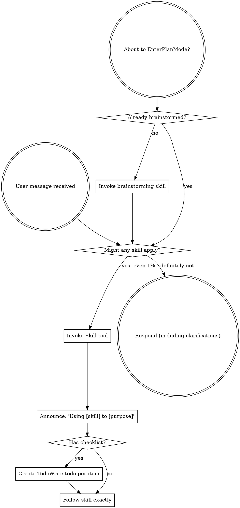
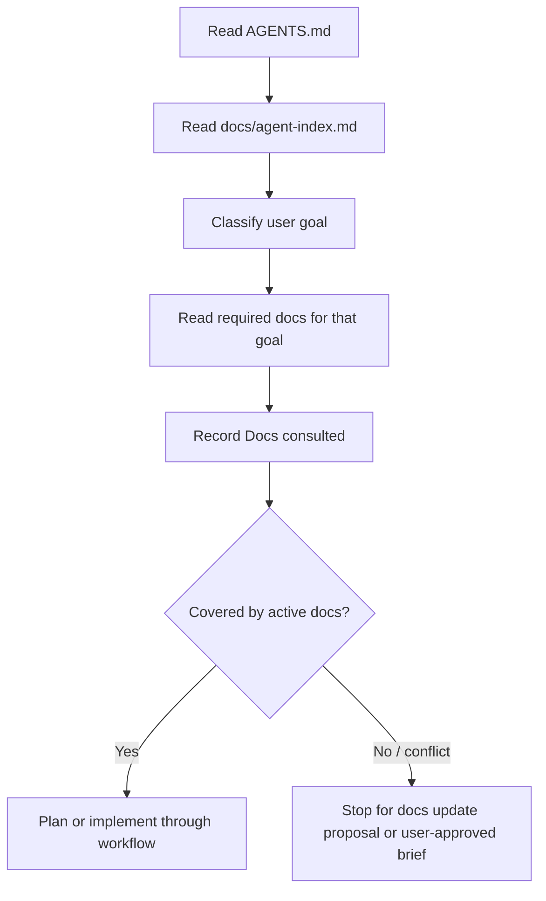
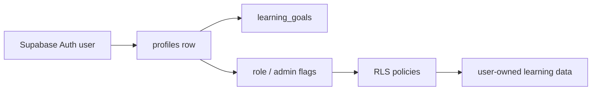
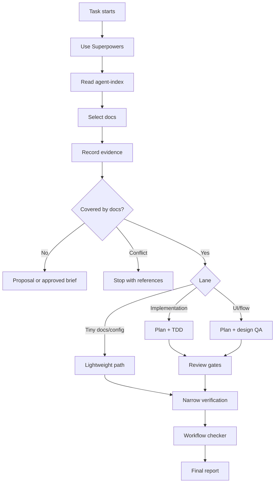

OpenAI Codex v0.128.0 (research preview)
--------
workdir: C:\Users\admin\Desktop\workspace\topik-project\v13
model: gpt-5.5
provider: openai
approval: never
sandbox: workspace-write [workdir, C:\Users\admin\.codex\memories]
reasoning effort: high
reasoning summaries: none
session id: 019e635d-ece7-7590-8ebf-7cf27ee7092a
--------
user
# Cross-Model Review · Round 2
# Email Confirmation Policy Report — Response to Round 1

You are continuing the cross-model review with Opus 4.7 (report author). Round 1 verdict was CONCERN.

## Author's response to Round 1 (read carefully)

Below is Opus 4.7's position on each Round 1 finding. Decide if you ACCEPT each resolution, PARTIALLY accept, or DISPUTE.

### Factual findings — author's position

- **F1 (Supabase 24h token = FAIL).** ACCEPTED. Report wording will change to: "Confirmation/OTP token default = 1 hour, configurable up to 24 hours maximum (`auth.email.otp_expiry`)." Source: Supabase docs CLI config + auth-email-passwordless.
- **F2 (#14994 still-true claim = CONCERN).** PARTIALLY ACCEPTED. Report will change "Still unfixed" → "Discussion #14994 remains open as of 2026-05; no public fix announcement located. Behavior should be re-tested before relying on this risk vector."
- **F3 (Auth0 5d = PASS).** No change.
- **F4 (Firebase phrasing = CONCERN).** ACCEPTED. Report will change "공식 권장: Admin SDK + 주기적 cleanup" → "Admin SDK는 정리에 필요한 primitives (list/metadata/delete) 제공. 정리 정책은 앱이 직접 정의."
- **F5 (OWASP 24h phrasing = CONCERN).** ACCEPTED. Report will drop the explicit "OWASP가 24h 권고" wording → "OWASP은 토큰을 단기·일회용으로 만료할 것을 권고 (구체 시간은 명시 X). 24h는 업계 통용치." Pre-account takeover risk class retained — OWASP documents account-takeover patterns.

### SQL findings — author's position (P0 verification result)

- **S6a (retention_days > 0 guard + make_interval).** ACCEPTED. Will use `make_interval(days => greatest(retention_days, 1))`.
- **S6b (SECURITY DEFINER privilege).** ACCEPTED. Will add explicit `revoke all ... from public, anon, authenticated` and grant only to `postgres` (which pg_cron uses by default in Supabase).
- **S7 (audit_logs P0).** **CONFIRMED by direct DB inspection.** Remote schema (verified just now):

  ```
  admin_audit_logs columns:
    id            uuid NOT NULL DEFAULT gen_random_uuid()
    admin_user_id uuid NOT NULL  (FK → public.profiles(id) ON DELETE RESTRICT)
    action        text NOT NULL
    target_table  text NOT NULL
    target_id     text NOT NULL
    diff          jsonb (nullable)
    payload       jsonb (nullable)
    created_at    timestamptz NOT NULL DEFAULT now()
  ```

  Report's SQL columns (`target_type`, `occurred_at`) are wrong; `admin_user_id = NULL` would violate NOT NULL + FK.

  **Author's proposed resolution: drop the `admin_audit_logs` insert entirely.** Rationale: `pg_cron` already records every run in `cron.job_run_details` with `start_time`, `end_time`, `status`, `return_message`. Adding a second audit row for system-initiated cleanup duplicates state and forces us to invent a synthetic actor or change schema. Operational visibility is preserved via `cron.job_run_details`. The function will instead `RAISE LOG` the deleted count, which Supabase ships to logs.

  Do you agree with dropping the audit insert, or do you require an alternative (system actor profile / schema change)?

- **S8a (pg_cron extension syntax).** ACCEPTED. Will use Supabase's documented pattern: enable via Dashboard, then `create extension if not exists pg_cron;` (no explicit schema clause).
- **S8b (UTC/KST wording).** ACCEPTED. Will write "04:00 UTC / 13:00 KST" explicitly.
- **S8c (post-resume verification).** ACCEPTED. Will add verification query: `select * from cron.job where jobname = 'cleanup-unconfirmed-users';` to post-deployment checklist.
- **S8d (idempotent scheduling).** ACCEPTED. Will use:

  ```sql
  select cron.unschedule('cleanup-unconfirmed-users') where exists
    (select 1 from cron.job where jobname = 'cleanup-unconfirmed-users');
  select cron.schedule('cleanup-unconfirmed-users', '0 4 * * *', $$ select public.cleanup_unconfirmed_users(30) $$);
  ```

- **S9 (FK CASCADE).** **CONFIRMED by direct DB inspection.** `profiles_id_fkey FOREIGN KEY (id) REFERENCES auth.users(id) ON DELETE CASCADE` already exists on remote. Report will reframe as **invariant**: "FK ON DELETE CASCADE is required and confirmed present in current schema (verified 2026-05-26)."

### Recommendation findings — author's position

- **R10 (30-day anchor).** ACCEPTED. Will reframe as "Product UX grace period choice, not industry default. Anchored to: (a) Supabase/Auth0 token windows are far shorter (1h-5d), (b) Learning app: a user who hasn't confirmed within a month is functionally lost."
- **R11 (31-day return UX).** ACCEPTED. Will add explicit subsection:
  - Old link → expired (24h ago)
  - Old account → deleted (cron ran)
  - `/sign-up` with same email → succeeds as fresh signup
  - Resend flow → unchanged (only relevant within retention window)
  - Admin visibility → daily Slack/log summary of deletion counts
- **R12 (missing controls).** ACCEPTED with one caveat. Will add to follow-up section:
  - Signup/resend rate limits (already partially handled by Supabase Auth defaults; explicit doc + monitoring)
  - Dry-run mode: `cleanup_unconfirmed_users(retention_days int, dry_run boolean default false)` — returns count without deleting
  - Per-run deletion cap (e.g., `limit 1000` clause) to prevent runaway in a bad scenario
  - Cron failure alerting via `cron.job_run_details` polling (separate ops doc)
  - Audit-log retention itself — separate concern, out of scope here
  - **Caveat**: "RLS hardening so profile existence never grants unconfirmed users access" — Author wants Codex's specific RLS attack scenario. Current RLS: profiles row visible only to its own `auth.uid()`. Author argues an unconfirmed user holding a valid JWT can already see/edit their own profile, which is intentional UX (let them complete profile before confirming). What specific access vector does Codex believe needs blocking?

## Updated SQL (combining all accepted findings)

```sql
-- supabase/migrations/2026XXXXxxxxxx_cleanup_unconfirmed_users.sql

create or replace function public.cleanup_unconfirmed_users(
  retention_days int default 30,
  dry_run boolean default false,
  max_batch int default 1000
)
returns int
language plpgsql security definer
set search_path = pg_catalog, public, auth
as $$
declare
  victim_ids uuid[];
  deleted_count int;
begin
  if retention_days < 1 then
    raise exception 'retention_days must be >= 1';
  end if;

  select array_agg(id) into victim_ids
  from (
    select id from auth.users
    where email_confirmed_at is null
      and created_at < now() - make_interval(days => retention_days)
      and is_sso_user = false
    order by created_at
    limit max_batch
  ) sub;

  deleted_count := coalesce(array_length(victim_ids, 1), 0);

  if dry_run then
    raise log 'cleanup_unconfirmed_users dry_run: would delete % users older than % days', deleted_count, retention_days;
    return deleted_count;
  end if;

  if deleted_count > 0 then
    delete from auth.users where id = any(victim_ids);
    -- public.profiles auto-removed via FK ON DELETE CASCADE (verified invariant)
    raise log 'cleanup_unconfirmed_users: deleted % users older than % days', deleted_count, retention_days;
  end if;

  return deleted_count;
end;
$$;

revoke all on function public.cleanup_unconfirmed_users(int, boolean, int) from public, anon, authenticated;
comment on function public.cleanup_unconfirmed_users(int, boolean, int) is
  'Delete unconfirmed users older than N days (default 30). SECURITY DEFINER. dry_run=true returns count without deleting. max_batch caps per-call deletes.';
```

Cron setup (separate migration block or dashboard):

```sql
create extension if not exists pg_cron;

select cron.unschedule('cleanup-unconfirmed-users')
where exists (select 1 from cron.job where jobname = 'cleanup-unconfirmed-users');

select cron.schedule(
  'cleanup-unconfirmed-users',
  '0 4 * * *',  -- 04:00 UTC / 13:00 KST
  $$ select public.cleanup_unconfirmed_users(30) $$
);
```

## Your task (Round 2)

For each numbered finding above, answer:
- ACCEPTED RESOLUTION / NEEDS REVISION / REJECTED
- One-line reason

Then state whether the new SQL is mergeable.

Open question for you to answer (from R12 caveat):
- What specific RLS attack vector should we block for unconfirmed users that the current "self-row only" policy does not already cover? Provide a concrete scenario or withdraw the finding.

## Output format

```
VERDICT: PASS | CONCERN | FAIL

ROUND 1 RESOLUTION:
| ID | Status | Note |
| F1 | ACCEPTED | ... |
...

NEW SQL ASSESSMENT:
- mergeable: YES / NO
- blockers (if NO): ...

R12 RLS QUESTION ANSWER:
- specific vector OR "withdrawn"

NEW FINDINGS (if any):
- ...

OVERALL:
- One paragraph: are we converging to consensus or do material disputes remain?
```

2026-05-26T08:19:22.316912Z ERROR rmcp::transport::worker: worker quit with fatal: Transport channel closed, when AuthRequired(AuthRequiredError { www_authenticate_header: "Bearer resource_metadata=\"https://mcp.figma.com/.well-known/oauth-protected-resource\",scope=\"mcp:connect\",authorization_uri=\"https://api.figma.com/.well-known/oauth-authorization-server\"" })
2026-05-26T08:19:22.506440Z ERROR rmcp::transport::worker: worker quit with fatal: Transport channel closed, when Auth(TokenRefreshFailed("Server returned error response: invalid_grant: Invalid refresh token"))
hook: SessionStart
hook: SessionStart Completed
hook: UserPromptSubmit
hook: UserPromptSubmit Completed
codex
작업 시작 전에 프로젝트 규칙대로 Superpowers와 문서 라우터를 먼저 확인하겠습니다. 이번 건은 코드 수정이 아니라 Round 2 검토라서, 필요한 문서만 작게 읽고 바로 판정으로 넘어가겠습니다.
hook: PreToolUse
hook: PreToolUse
hook: PreToolUse
hook: PreToolUse Completed
hook: PreToolUse Completed
hook: PreToolUse Completed
exec
"C:\\Windows\\System32\\WindowsPowerShell\\v1.0\\powershell.exe" -Command 'Get-Content -Path docs/agent-index.md -TotalCount 260' in C:\Users\admin\Desktop\workspace\topik-project\v13
exec
"C:\\Windows\\System32\\WindowsPowerShell\\v1.0\\powershell.exe" -Command 'Get-Content -Path .agents/superpowers/skills/using-superpowers/SKILL.md -TotalCount 220' in C:\Users\admin\Desktop\workspace\topik-project\v13
exec
"C:\\Windows\\System32\\WindowsPowerShell\\v1.0\\powershell.exe" -Command 'Get-Content -Path .codex/skills/gstack/benchmark-models/SKILL.md -TotalCount 220' in C:\Users\admin\Desktop\workspace\topik-project\v13
 succeeded in 541ms:
---
name: using-superpowers
description: Use when starting any conversation - establishes how to find and use skills, requiring Skill tool invocation before ANY response including clarifying questions
---

<SUBAGENT-STOP>
If you were dispatched as a subagent to execute a specific task, skip this skill.
</SUBAGENT-STOP>

<EXTREMELY-IMPORTANT>
If you think there is even a 1% chance a skill might apply to what you are doing, you ABSOLUTELY MUST invoke the skill.

IF A SKILL APPLIES TO YOUR TASK, YOU DO NOT HAVE A CHOICE. YOU MUST USE IT.

This is not negotiable. This is not optional. You cannot rationalize your way out of this.
</EXTREMELY-IMPORTANT>

## Instruction Priority

Superpowers skills override default system prompt behavior, but **user instructions always take precedence**:

1. **User's explicit instructions** (CLAUDE.md, GEMINI.md, AGENTS.md, direct requests) ??highest priority
2. **Superpowers skills** ??override default system behavior where they conflict
3. **Default system prompt** ??lowest priority

If CLAUDE.md, GEMINI.md, or AGENTS.md says "don't use TDD" and a skill says "always use TDD," follow the user's instructions. The user is in control.

## How to Access Skills

**In Claude Code:** Use the `Skill` tool. When you invoke a skill, its content is loaded and presented to you?봣ollow it directly. Never use the Read tool on skill files.

**In Copilot CLI:** Use the `skill` tool. Skills are auto-discovered from installed plugins. The `skill` tool works the same as Claude Code's `Skill` tool.

**In Gemini CLI:** Skills activate via the `activate_skill` tool. Gemini loads skill metadata at session start and activates the full content on demand.

**In other environments:** Check your platform's documentation for how skills are loaded.

## Platform Adaptation

Skills use Claude Code tool names. Non-CC platforms: see `references/copilot-tools.md` (Copilot CLI), `references/codex-tools.md` (Codex) for tool equivalents. Gemini CLI users get the tool mapping loaded automatically via GEMINI.md.

# Using Skills

## The Rule

**Invoke relevant or requested skills BEFORE any response or action.** Even a 1% chance a skill might apply means that you should invoke the skill to check. If an invoked skill turns out to be wrong for the situation, you don't need to use it.



## Red Flags

These thoughts mean STOP?봸ou're rationalizing:

| Thought | Reality |
|---------|---------|
| "This is just a simple question" | Questions are tasks. Check for skills. |
| "I need more context first" | Skill check comes BEFORE clarifying questions. |
| "Let me explore the codebase first" | Skills tell you HOW to explore. Check first. |
| "I can check git/files quickly" | Files lack conversation context. Check for skills. |
| "Let me gather information first" | Skills tell you HOW to gather information. |
| "This doesn't need a formal skill" | If a skill exists, use it. |
| "I remember this skill" | Skills evolve. Read current version. |
| "This doesn't count as a task" | Action = task. Check for skills. |
| "The skill is overkill" | Simple things become complex. Use it. |
| "I'll just do this one thing first" | Check BEFORE doing anything. |
| "This feels productive" | Undisciplined action wastes time. Skills prevent this. |
| "I know what that means" | Knowing the concept ??using the skill. Invoke it. |

## Skill Priority

When multiple skills could apply, use this order:

1. **Process skills first** (brainstorming, debugging) - these determine HOW to approach the task
2. **Implementation skills second** (frontend-design or other domain implementation skills) - these guide execution

"Let's build X" ??brainstorming first, then implementation skills.
"Fix this bug" ??debugging first, then domain-specific skills.

## Skill Types

**Rigid** (TDD, debugging): Follow exactly. Don't adapt away discipline.

**Flexible** (patterns): Adapt principles to context.

The skill itself tells you which.

## User Instructions

Instructions say WHAT, not HOW. "Add X" or "Fix Y" doesn't mean skip workflows.

hook: PostToolUse
 succeeded in 574ms:
# AI Agent Index

This is the mandatory routing index for AI agents. Read this file after `AGENTS.md` and before planning or editing.

Purpose: make document access predictable as the project grows. Do not read every document by default. Select the smallest required set by task goal, then record the exact files in `Docs consulted`.

## Startup Algorithm



## Index Groups

| Index | Group | Entry point | Use for |
| --- | --- | --- | --- |
| `ROOT-00` | Human project map | [../README.md](../README.md) | Human-friendly project overview |
| `DOCS-00` | Docs map | [README.md](README.md) | Human + AI navigation across `docs/` |
| `AGENT-00` | AI routing | [agent-index.md](agent-index.md) | Required AI document selection |
| `FLOW-00` | AI workflow entry | [ai-development-workflow.md](ai-development-workflow.md) | Entry point ??88-line index that links sub-docs |
| `WF-00` | Workflow sub-docs | [ai-workflow/planning-contracts.md](ai-workflow/planning-contracts.md), [ai-workflow/context-and-packets.md](ai-workflow/context-and-packets.md), [ai-workflow/review-gates.md](ai-workflow/review-gates.md), [ai-workflow/fallback-and-recovery.md](ai-workflow/fallback-and-recovery.md) | Planning 쨌 ledger/packets 쨌 review gates 쨌 fallback matrix |
| `WF-10` | Ledger/report templates | [ai-workflow/README.md](ai-workflow/README.md) | Ledgers, reports, packets, plans (folder map + templates) |
| `HARNESS-00` | Harness and skills | [ai-workflow/harness-and-skills.md](ai-workflow/harness-and-skills.md) | TALKPIK, practical skills, GStack, Superpowers, host-specific skill names |
| `PRODUCT-00` | Product requirements | [prd.md](prd.md) | Product scope, users, value, business rules |
| `SPEC-00` | Implementation spec | [spec.md](spec.md) | Development baseline, behavior, validation, framework, backend, auth, AI boundary, deployment |
| `DEV-10` | Development details | [development/README.md](development/README.md) | Detailed technical specs selected through `SPEC-00` |
| `UI-00` | Design system | [ant-design/README.md](ant-design/README.md) | UI implementation, tokens, components, motion |
| `IA-00` | Information architecture | [ia.md](ia.md), [sitemap.md](sitemap.md) | Page hierarchy, routes, navigation |
| `IA-10` | Screen specs | [IA/README.md](IA/README.md) | Specific page descriptions and wireframes |
| `JOURNEY-00` | User journey | [flow/user-flow.md](flow/user-flow.md) | Step order, transitions, entry/exit states |
| `LEGACY-00` | Legacy observations | [ia-pages/README.md](ia-pages/README.md), [user-flow.md](user-flow.md) | Historical context only |

## Goal-To-Doc Routing

| User goal | Required docs | Conditional docs | Notes |
| --- | --- | --- | --- |
| Product scope, user value, roles, business direction | `PRODUCT-00` | `SPEC-00`, `JOURNEY-00` | Do not invent new product direction. |
| Functional behavior, validation, data handling, acceptance criteria | `SPEC-00` | `PRODUCT-00`, `JOURNEY-00` | Use for implementation and tests. |
| Framework, package, dependency, backend, auth, deployment, env vars, deferred billing | `SPEC-00` | Matching `DEV-10` detail file | Start at `spec.md`; do not read all development details by default. |
| Navigation, routes, page hierarchy | `IA-00` | `JOURNEY-00`, `IA-10` | Use Target React Route Map, not legacy route notes. |
| User journey, screen order, transitions, entry/exit states | `JOURNEY-00` | `IA-10`, `SPEC-00` | `docs/user-flow.md` is legacy context only. |
| Visual UI, layout, components, tokens, motion | `UI-00` | `IA-10`, `JOURNEY-00` | Run design review before user-facing implementation. |
| Specific page or screen | `IA-10` matching page | `UI-00`, `JOURNEY-00`, `SPEC-00` | Read the matching `description.md` and inspect `wireframe.png`. |
| Admin ?붾㈃ / 沅뚰븳 / RBAC / audit log | `SPEC-00`, ?대떦 admin `IA-10`(`docs/IA/{21-H-01,30-X-08,32-X-10}-*`), `DEV-10`(backend-auth) | `JOURNEY-00`, `UI-00`, `docs/ai-workflow/light-specs/phase-6-admin-library-hardening.md` | Admin?€ ?쇰컲 ?ъ슜?먯? 沅뚰븳 紐⑤뜽쨌UI 遺꾧린쨌QA ?쒕굹由ъ삤媛€ ?ㅻ쫫. Plan/Light Spec??`Audience: user/admin/both` 紐낆떆 ?꾩닔. `Architecture Pass`?먯꽌 audience 寃쎄퀎 = 肄붾뱶 boundary ?쇱튂 寃€利? |
| AI workflow, context, reports, fallback, multi-agent work | `FLOW-00`, `WF-00` | `HARNESS-00` | Required for workflow or harness changes. |
| Historical page composition | `LEGACY-00` | Active docs above | Reference only. Active docs win. |

## Development Detail Routing

Use this table only after reading [spec.md](spec.md).

| Development goal | Read |
| --- | --- |
| Frontend framework, package choice, runtime, UI library, forms, validation, charts, tests | [development/stack.md](development/stack.md) |
| Supabase, Auth, Postgres, RLS, Storage, server-only keys | [development/backend-auth.md](development/backend-auth.md) |
| Vercel, environments, deployment gates, environment variables, rollback, CI, preview links | [development/deployment.md](development/deployment.md) |
| Billing, subscription, paywall, payment provider, deferred scope | [development/deferred-scope.md](development/deferred-scope.md) |

## Active Vs Legacy Rule

Active docs govern implementation, QA, and review:

- [prd.md](prd.md)
- [spec.md](spec.md)
- [ant-design/README.md](ant-design/README.md)
- [sitemap.md](sitemap.md) Target React Route Map
- [ia.md](ia.md)
- [IA/README.md](IA/README.md) and matching `docs/IA/<page>/description.md`
- [flow/user-flow.md](flow/user-flow.md)

Legacy docs are reference only:

- [user-flow.md](user-flow.md)
- [ia-pages/README.md](ia-pages/README.md)
- Legacy HTML Route Map sections inside [sitemap.md](sitemap.md)

If active and legacy docs conflict, active docs win. If active docs conflict with the user request, stop and report the conflict.

## Ledger Requirement Index

Create or update a run ledger under `docs/ai-workflow/runs/YYYY/MM/DD/` when any of these apply:

| Trigger | Required |
| --- | --- |
| Non-trivial work | Yes |
| Implementation work | Yes |
| UI, route, flow, or integration changes | Yes |
| Net-new scope or doc conflict | Yes |
| Multi-agent work | Yes |
| Work likely to resume later | Yes |
| Tiny docs/config-only edit with no behavior change, no conflict, no multi-agent work, no resume risk | May skip with reason |

Use [ai-workflow/context-ledger-template.md](ai-workflow/context-ledger-template.md).

For consistency, classify the work as non-trivial when it changes workflow-governing files, automation, scripts, CI, routes, UI, auth, database, API, dependencies, deployment behavior, test strategy, or AI-service boundaries. Multi-file changes are non-trivial by default unless they are purely mechanical docs/config updates and the final report states the lightweight exception.

When a ledger is required, update it before final verification and include it in the dirty scope, commit trailers, PR body, or final report as applicable.

## Output Requirement

Every plan, handoff, or final report must include:

- `Docs consulted`: exact files read.
- `Extracted requirements`: concrete requirements taken from those docs.
- `Doc conflicts`: `none` or exact conflict references.
- `Untouched relevant docs`: docs that seemed related but were not read, with reason.
- `Context ledger`: path or allowed lightweight exception.

hook: PostToolUse
 succeeded in 594ms:
---
name: benchmark-models
preamble-tier: 1
version: 1.0.0
description: |
  Cross-model benchmark for gstack skills. Runs the same prompt through Claude,
  GPT (via Codex CLI), and Gemini side-by-side ??compares latency, tokens, cost,
  and optionally quality via LLM judge. Answers "which model is actually best
  for this skill?" with data instead of vibes. Separate from /benchmark, which
  measures web page performance. Use when: "benchmark models", "compare models",
  "which model is best for X", "cross-model comparison", "model shootout". (gstack)
  Voice triggers (speech-to-text aliases): "compare models", "model shootout", "which model is best".
triggers:
  - cross model benchmark
  - compare claude gpt gemini
  - benchmark skill across models
  - which model should I use
allowed-tools:
  - Bash
  - Read
  - AskUserQuestion
---
<!-- AUTO-GENERATED from SKILL.md.tmpl ??do not edit directly -->
<!-- Regenerate: bun run gen:skill-docs -->

## Preamble (run first)

```bash
_UPD=$(~/.claude/skills/gstack/bin/gstack-update-check 2>/dev/null || .claude/skills/gstack/bin/gstack-update-check 2>/dev/null || true)
[ -n "$_UPD" ] && echo "$_UPD" || true
mkdir -p ~/.gstack/sessions
touch ~/.gstack/sessions/"$PPID"
_SESSIONS=$(find ~/.gstack/sessions -mmin -120 -type f 2>/dev/null | wc -l | tr -d ' ')
find ~/.gstack/sessions -mmin +120 -type f -exec rm {} + 2>/dev/null || true
_PROACTIVE=$(~/.claude/skills/gstack/bin/gstack-config get proactive 2>/dev/null || echo "true")
_PROACTIVE_PROMPTED=$([ -f ~/.gstack/.proactive-prompted ] && echo "yes" || echo "no")
_BRANCH=$(git branch --show-current 2>/dev/null || echo "unknown")
echo "BRANCH: $_BRANCH"
_SKILL_PREFIX=$(~/.claude/skills/gstack/bin/gstack-config get skill_prefix 2>/dev/null || echo "false")
echo "PROACTIVE: $_PROACTIVE"
echo "PROACTIVE_PROMPTED: $_PROACTIVE_PROMPTED"
echo "SKILL_PREFIX: $_SKILL_PREFIX"
source <(~/.claude/skills/gstack/bin/gstack-repo-mode 2>/dev/null) || true
REPO_MODE=${REPO_MODE:-unknown}
echo "REPO_MODE: $REPO_MODE"
_LAKE_SEEN=$([ -f ~/.gstack/.completeness-intro-seen ] && echo "yes" || echo "no")
echo "LAKE_INTRO: $_LAKE_SEEN"
_TEL=$(~/.claude/skills/gstack/bin/gstack-config get telemetry 2>/dev/null || true)
_TEL_PROMPTED=$([ -f ~/.gstack/.telemetry-prompted ] && echo "yes" || echo "no")
_TEL_START=$(date +%s)
_SESSION_ID="$$-$(date +%s)"
echo "TELEMETRY: ${_TEL:-off}"
echo "TEL_PROMPTED: $_TEL_PROMPTED"
_EXPLAIN_LEVEL=$(~/.claude/skills/gstack/bin/gstack-config get explain_level 2>/dev/null || echo "default")
if [ "$_EXPLAIN_LEVEL" != "default" ] && [ "$_EXPLAIN_LEVEL" != "terse" ]; then _EXPLAIN_LEVEL="default"; fi
echo "EXPLAIN_LEVEL: $_EXPLAIN_LEVEL"
_QUESTION_TUNING=$(~/.claude/skills/gstack/bin/gstack-config get question_tuning 2>/dev/null || echo "false")
echo "QUESTION_TUNING: $_QUESTION_TUNING"
mkdir -p ~/.gstack/analytics
if [ "$_TEL" != "off" ]; then
echo '{"skill":"benchmark-models","ts":"'$(date -u +%Y-%m-%dT%H:%M:%SZ)'","repo":"'$(basename "$(git rev-parse --show-toplevel 2>/dev/null)" 2>/dev/null || echo "unknown")'"}'  >> ~/.gstack/analytics/skill-usage.jsonl 2>/dev/null || true
fi
for _PF in $(find ~/.gstack/analytics -maxdepth 1 -name '.pending-*' 2>/dev/null); do
  if [ -f "$_PF" ]; then
    if [ "$_TEL" != "off" ] && [ -x "~/.claude/skills/gstack/bin/gstack-telemetry-log" ]; then
      ~/.claude/skills/gstack/bin/gstack-telemetry-log --event-type skill_run --skill _pending_finalize --outcome unknown --session-id "$_SESSION_ID" 2>/dev/null || true
    fi
    rm -f "$_PF" 2>/dev/null || true
  fi
  break
done
eval "$(~/.claude/skills/gstack/bin/gstack-slug 2>/dev/null)" 2>/dev/null || true
_LEARN_FILE="${GSTACK_HOME:-$HOME/.gstack}/projects/${SLUG:-unknown}/learnings.jsonl"
if [ -f "$_LEARN_FILE" ]; then
  _LEARN_COUNT=$(wc -l < "$_LEARN_FILE" 2>/dev/null | tr -d ' ')
  echo "LEARNINGS: $_LEARN_COUNT entries loaded"
  if [ "$_LEARN_COUNT" -gt 5 ] 2>/dev/null; then
    ~/.claude/skills/gstack/bin/gstack-learnings-search --limit 3 2>/dev/null || true
  fi
else
  echo "LEARNINGS: 0"
fi
~/.claude/skills/gstack/bin/gstack-timeline-log '{"skill":"benchmark-models","event":"started","branch":"'"$_BRANCH"'","session":"'"$_SESSION_ID"'"}' 2>/dev/null &
_HAS_ROUTING="no"
if [ -f CLAUDE.md ] && grep -q "## Skill routing" CLAUDE.md 2>/dev/null; then
  _HAS_ROUTING="yes"
fi
_ROUTING_DECLINED=$(~/.claude/skills/gstack/bin/gstack-config get routing_declined 2>/dev/null || echo "false")
echo "HAS_ROUTING: $_HAS_ROUTING"
echo "ROUTING_DECLINED: $_ROUTING_DECLINED"
_VENDORED="no"
if [ -d ".claude/skills/gstack" ] && [ ! -L ".claude/skills/gstack" ]; then
  if [ -f ".claude/skills/gstack/VERSION" ] || [ -d ".claude/skills/gstack/.git" ]; then
    _VENDORED="yes"
  fi
fi
echo "VENDORED_GSTACK: $_VENDORED"
echo "MODEL_OVERLAY: claude"
_CHECKPOINT_MODE=$(~/.claude/skills/gstack/bin/gstack-config get checkpoint_mode 2>/dev/null || echo "explicit")
_CHECKPOINT_PUSH=$(~/.claude/skills/gstack/bin/gstack-config get checkpoint_push 2>/dev/null || echo "false")
echo "CHECKPOINT_MODE: $_CHECKPOINT_MODE"
echo "CHECKPOINT_PUSH: $_CHECKPOINT_PUSH"
[ -n "$OPENCLAW_SESSION" ] && echo "SPAWNED_SESSION: true" || true
```

## Plan Mode Safe Operations

In plan mode, allowed because they inform the plan: `$B`, `$D`, `codex exec`/`codex review`, writes to `~/.gstack/`, writes to the plan file, and `open` for generated artifacts.

## Skill Invocation During Plan Mode

If the user invokes a skill in plan mode, the skill takes precedence over generic plan mode behavior. **Treat the skill file as executable instructions, not reference.** Follow it step by step starting from Step 0; the first AskUserQuestion is the workflow entering plan mode, not a violation of it. AskUserQuestion (any variant ??`mcp__*__AskUserQuestion` or native; see "AskUserQuestion Format ??Tool resolution") satisfies plan mode's end-of-turn requirement. If no variant is callable, the skill is BLOCKED ??stop and report `BLOCKED ??AskUserQuestion unavailable` per the AskUserQuestion Format rule. At a STOP point, stop immediately. Do not continue the workflow or call ExitPlanMode there. Commands marked "PLAN MODE EXCEPTION ??ALWAYS RUN" execute. Call ExitPlanMode only after the skill workflow completes, or if the user tells you to cancel the skill or leave plan mode.

If `PROACTIVE` is `"false"`, do not auto-invoke or proactively suggest skills. If a skill seems useful, ask: "I think /skillname might help here ??want me to run it?"

If `SKILL_PREFIX` is `"true"`, suggest/invoke `/gstack-*` names. Disk paths stay `~/.claude/skills/gstack/[skill-name]/SKILL.md`.

If output shows `UPGRADE_AVAILABLE <old> <new>`: read `~/.claude/skills/gstack/gstack-upgrade/SKILL.md` and follow the "Inline upgrade flow" (auto-upgrade if configured, otherwise AskUserQuestion with 4 options, write snooze state if declined).

If output shows `JUST_UPGRADED <from> <to>`: print "Running gstack v{to} (just updated!)". If `SPAWNED_SESSION` is true, skip feature discovery.

Feature discovery, max one prompt per session:
- Missing `~/.claude/skills/gstack/.feature-prompted-continuous-checkpoint`: AskUserQuestion for Continuous checkpoint auto-commits. If accepted, run `~/.claude/skills/gstack/bin/gstack-config set checkpoint_mode continuous`. Always touch marker.
- Missing `~/.claude/skills/gstack/.feature-prompted-model-overlay`: inform "Model overlays are active. MODEL_OVERLAY shows the patch." Always touch marker.

After upgrade prompts, continue workflow.

If `WRITING_STYLE_PENDING` is `yes`: ask once about writing style:

> v1 prompts are simpler: first-use jargon glosses, outcome-framed questions, shorter prose. Keep default or restore terse?

Options:
- A) Keep the new default (recommended ??good writing helps everyone)
- B) Restore V0 prose ??set `explain_level: terse`

If A: leave `explain_level` unset (defaults to `default`).
If B: run `~/.claude/skills/gstack/bin/gstack-config set explain_level terse`.

Always run (regardless of choice):
```bash
rm -f ~/.gstack/.writing-style-prompt-pending
touch ~/.gstack/.writing-style-prompted
```

Skip if `WRITING_STYLE_PENDING` is `no`.

If `LAKE_INTRO` is `no`: say "gstack follows the **Boil the Lake** principle ??do the complete thing when AI makes marginal cost near-zero. Read more: https://garryslist.org/posts/boil-the-ocean" Offer to open:

```bash
open https://garryslist.org/posts/boil-the-ocean
touch ~/.gstack/.completeness-intro-seen
```

Only run `open` if yes. Always run `touch`.

If `TEL_PROMPTED` is `no` AND `LAKE_INTRO` is `yes`: ask telemetry once via AskUserQuestion:

> Help gstack get better. Share usage data only: skill, duration, crashes, stable device ID. No code, file paths, or repo names.

Options:
- A) Help gstack get better! (recommended)
- B) No thanks

If A: run `~/.claude/skills/gstack/bin/gstack-config set telemetry community`

If B: ask follow-up:

> Anonymous mode sends only aggregate usage, no unique ID.

Options:
- A) Sure, anonymous is fine
- B) No thanks, fully off

If B?묨: run `~/.claude/skills/gstack/bin/gstack-config set telemetry anonymous`
If B?묪: run `~/.claude/skills/gstack/bin/gstack-config set telemetry off`

Always run:
```bash
touch ~/.gstack/.telemetry-prompted
```

Skip if `TEL_PROMPTED` is `yes`.

If `PROACTIVE_PROMPTED` is `no` AND `TEL_PROMPTED` is `yes`: ask once:

> Let gstack proactively suggest skills, like /qa for "does this work?" or /investigate for bugs?

Options:
- A) Keep it on (recommended)
- B) Turn it off ??I'll type /commands myself

If A: run `~/.claude/skills/gstack/bin/gstack-config set proactive true`
If B: run `~/.claude/skills/gstack/bin/gstack-config set proactive false`

Always run:
```bash
touch ~/.gstack/.proactive-prompted
```

Skip if `PROACTIVE_PROMPTED` is `yes`.

If `HAS_ROUTING` is `no` AND `ROUTING_DECLINED` is `false` AND `PROACTIVE_PROMPTED` is `yes`:
Check if a CLAUDE.md file exists in the project root. If it does not exist, create it.

Use AskUserQuestion:

> gstack works best when your project's CLAUDE.md includes skill routing rules.

Options:
- A) Add routing rules to CLAUDE.md (recommended)
- B) No thanks, I'll invoke skills manually

If A: Append this section to the end of CLAUDE.md:

```markdown

## Skill routing

When the user's request matches an available skill, invoke it via the Skill tool. When in doubt, invoke the skill.


hook: PostToolUse
hook: PostToolUse Completed
hook: PostToolUse Completed
hook: PostToolUse Completed
codex
검토 기준을 잡았습니다: 이 요청은 실제 파일 수정 없이 SQL/Auth 정책 판정입니다. 그래서 Supabase 관련 프로젝트 문서와 Supabase 스킬만 확인하고, 외부 최신성은 공식 문서 기준으로 짧게 교차확인하겠습니다.
hook: PreToolUse
hook: PreToolUse
hook: PreToolUse
hook: PreToolUse
hook: PreToolUse Completed
exec
"C:\\Windows\\System32\\WindowsPowerShell\\v1.0\\powershell.exe" -Command 'rg -n "Supabase|auth|email|confirm|confirmation|RLS|profile|profiles|audit|cron|unconfirmed|confirmed|admin_audit" docs/spec.md docs/development/backend-auth.md docs/ai-development-workflow.md' in C:\Users\admin\Desktop\workspace\topik-project\v13
hook: PreToolUse Completed
exec
"C:\\Windows\\System32\\WindowsPowerShell\\v1.0\\powershell.exe" -Command 'Get-Content -Path .codex/skills/supabase/SKILL.md -TotalCount 220' in C:\Users\admin\Desktop\workspace\topik-project\v13
hook: PreToolUse Completed
hook: PreToolUse Completed
exec
"C:\\Windows\\System32\\WindowsPowerShell\\v1.0\\powershell.exe" -Command 'Get-Content -Path .codex/skills/supabase-postgres-best-practices/SKILL.md -TotalCount 220' in C:\Users\admin\Desktop\workspace\topik-project\v13
exec
"C:\\Windows\\System32\\WindowsPowerShell\\v1.0\\powershell.exe" -Command 'Get-Content -Path .codex/skills/talkpik-supabase-boundary/SKILL.md -TotalCount 220' in C:\Users\admin\Desktop\workspace\topik-project\v13
 succeeded in 527ms:
docs/ai-development-workflow.md:49:UI · 사용자 흐름 · phase 단위 작업은 시작 시점에 audience를 명시해야 한다. Audience 분류는 UI/권한 분기 한정 — 비대화형 시스템 작업(`cron`, `system`, `external partner` 등)은 별도 축으로 추후 도입한다.
docs/ai-development-workflow.md:51:- **`user`**: 일반 사용자 화면. RLS는 `auth.uid()` 기반 자기 row 한정.
docs/ai-development-workflow.md:52:- **`admin`**: 관리자 화면. `requirePlatformAdmin / requireContentAdmin / requireOrgAdmin` 같은 페이지 가드 의무 + 모든 권한 변경/발행 토글은 `admin_audit_logs` 기록 의무.
docs/ai-development-workflow.md:59:These are mandatory for any non-lightweight change. **The linked sub-doc is the authoritative source** — this list exists so an agent reading only the entry file does not miss them.
docs/ai-development-workflow.md:61:- **TDD** (RED → confirm fail → GREEN → confirm pass → refactor while green). Allowed exceptions are docs-only, config-only, generated artifacts, or no runnable test surface. Full loop and exceptions: [`review-gates.md#tdd`](ai-workflow/review-gates.md).
docs/ai-development-workflow.md:67:- **Context ledger** is required for any non-trivial work (multi-file, implementation, UI/route/auth/database/API/dependency/test-strategy/AI-boundary change, multi-agent work, work likely to resume across sessions, **or any change to workflow-governing files — `AGENTS.md`, `CLAUDE.md`, `docs/agent-index.md`, `docs/ai-development-workflow.md`, files under `docs/ai-workflow/`, `scripts/`, `.github/`**). [`context-and-packets.md`](ai-workflow/context-and-packets.md).
docs/development/backend-auth.md:5:This file fixes the backend, database, and authentication choices for TALKPIK AI.
docs/development/backend-auth.md:11:| Backend platform | `Supabase` | managed current stable | Auth, Postgres, RLS, Storage, generated APIs. |
docs/development/backend-auth.md:12:| DB client | `@supabase/supabase-js` | `2.x` | Official client for browser/server Supabase access. |
docs/development/backend-auth.md:13:| SSR auth helper | `@supabase/ssr` | latest stable `0.x` until 1.x exists | Cookie-based auth for Next.js server/client boundaries. |
docs/development/backend-auth.md:14:| Database | Supabase Postgres | managed stable | Relational learning, attempts, feedback, profile, and admin data. |
docs/development/backend-auth.md:15:| Authorization | Supabase RLS | mandatory | User-owned learning data must be protected at the database layer. |
docs/development/backend-auth.md:16:| Storage | Supabase Storage | managed stable | Avatars, generated PDFs, exported feedback, and future media. |
docs/development/backend-auth.md:20:- Default data access goes through Supabase and RLS.
docs/development/backend-auth.md:21:- New tables in exposed schemas must enable RLS before user access.
docs/development/backend-auth.md:24:- Store authorization-critical role/plan data in trusted server/database fields, not user-editable metadata.
docs/development/backend-auth.md:25:- Start without Prisma/Drizzle. Use SQL migrations and generated Supabase types first.
docs/development/backend-auth.md:26:- Add an ORM only after there is a concrete problem SQL + Supabase types cannot solve.
docs/development/backend-auth.md:30:Default provider: `Supabase Auth`.
docs/development/backend-auth.md:35:- Supabase Auth integrates directly with Supabase RLS.
docs/development/backend-auth.md:36:- The app needs profile, goals, learning progress, writing drafts, feedback, and admin access.
docs/development/backend-auth.md:37:- A single identity plane is simpler for MVP and safer for RLS.
docs/development/backend-auth.md:41:    A["Supabase Auth user"] --> P["profiles row"]
docs/development/backend-auth.md:44:    R --> RLS["RLS policies"]
docs/development/backend-auth.md:45:    RLS --> DATA["user-owned learning data"]
docs/development/backend-auth.md:55:- hosted auth UI is more important than database-native authorization,
docs/spec.md:8:for any development, dependency, frontend, backend, auth, AI, deployment,
docs/spec.md:27:| Backend | `Supabase` as the serverless backend platform |
docs/spec.md:28:| Database | Supabase-hosted `Postgres` |
docs/spec.md:29:| Auth | `Supabase Auth` |
docs/spec.md:30:| Storage | `Supabase Storage` |
docs/spec.md:42:| Supabase, database, auth, login, RLS, storage, profile, admin role, server key | `docs/development/backend-auth.md` |
docs/spec.md:43:| table, column, schema, migration, DDL, RLS policy SQL, index | `docs/development/database-schema.md` |
docs/spec.md:81:- `src/lib/`: Supabase clients, validation schemas, and server-only utilities.
docs/spec.md:89:Do not use `src/App.tsx` as the route authority. The current route authority is
docs/spec.md:100:  brand tokens. Ant Design tokens remain the styling authority.
docs/spec.md:139:- `useUserStore`: learner profile display state, plan, language, and goal basics.
docs/spec.md:151:- Use Supabase as the serverless backend platform.
docs/spec.md:152:- Use Supabase-hosted Postgres for relational data.
docs/spec.md:153:- Use Supabase Auth for authentication.
docs/spec.md:154:- Use Supabase Storage for user files or generated exports when storage is
docs/spec.md:156:- Enforce data access with RLS policies.
docs/spec.md:157:- Keep server-only keys on the server. Never expose Supabase `service_role` or
docs/spec.md:159:- Use browser-visible Supabase variables only for publishable configuration.
docs/spec.md:160:- Read `docs/development/backend-auth.md` before implementing auth, RLS,
docs/spec.md:161:  storage, profile, or admin-role behavior.
docs/spec.md:166:- Treat Supabase and Vercel as the fixed serverless stack for backend capability,
docs/spec.md:168:- Prefer managed Supabase capabilities and Vercel-supported Next.js serverless
docs/spec.md:235:- Configure Supabase env variables with publishable keys only in browser-visible
docs/spec.md:246:- `docs/development/backend-auth.md` - Supabase, Auth, RLS, Storage, and Clerk
docs/spec.md:248:- `docs/development/database-schema.md` - Tier 1 MVP table spec, RLS policy

hook: PostToolUse
 succeeded in 583ms:
---
name: supabase
description: "Use when doing ANY task involving Supabase. Triggers: Supabase products (Database, Auth, Edge Functions, Realtime, Storage, Vectors, Cron, Queues); client libraries and SSR integrations (supabase-js, @supabase/ssr) in Next.js, React, SvelteKit, Astro, Remix; auth issues (login, logout, sessions, JWT, cookies, getSession, getUser, getClaims, RLS); Supabase CLI or MCP server; schema changes, migrations, security audits, Postgres extensions (pg_graphql, pg_cron, pg_vector)."
metadata:
  author: supabase
  version: "0.1.2"
---

# Supabase

## Core Principles

**1. Supabase changes frequently ??verify against changelog and current docs before implementing.**
Do not rely on training data for Supabase features. Function signatures, config.toml settings, and API conventions change between versions.

First, fetch `https://supabase.com/changelog.md` (a lightweight summary index ??not a heavy pull), scan for `breaking-change` tags relevant to your task, and follow the linked page for any that apply. Then look up the relevant topic using the documentation access methods below.

**2. Verify your work.**
After implementing any fix, run a test query to confirm the change works. A fix without verification is incomplete.

**3. Recover from errors, don't loop.**
If an approach fails after 2-3 attempts, stop and reconsider. Try a different method, check documentation, inspect the error more carefully, and review relevant logs when available. Supabase issues are not always solved by retrying the same command, and the answer is not always in the logs, but logs are often worth checking before proceeding.

**4. Exposing tables to the Data API:** Depending on the user's [Data API settings](https://supabase.com/dashboard/project/<ref>/integrations/data_api/settings), newly created tables may not be automatically exposed via the Data (REST) API. If this is the case, `anon` and `authenticated` roles will need to be explicitly granted access.

> Note that this is separate from RLS, which controls which _rows_ are visible once a table is accessible, not whether the table is accessible at all.

When a user reports a SQL-created table is unexpectedly inaccessible, check their Data API settings and whether the roles have been granted access via explicit `GRANT` SQL. When granting public (`anon`/`authenticated`) access, always enable RLS too. See [Exposing a Table to the Data API](https://supabase.com/docs/guides/api/securing-your-api.md) for the full setup workflow.

**5. RLS in exposed schemas.**
Enable RLS on every table in any exposed schema, which includes `public` by default. This is critical in Supabase because tables in exposed schemas can be reachable through the Data API when the `anon`/`authenticated` roles have access (see [Exposing a Table to the Data API](https://supabase.com/docs/guides/api/securing-your-api.md)). For private schemas, prefer RLS as defense in depth. After enabling RLS, create policies that match the actual access model rather than defaulting every table to the same `auth.uid()` pattern.

**6. Security checklist.**
When working on any Supabase task that touches auth, RLS, views, storage, or user data, run through this checklist. These are Supabase-specific security traps that silently create vulnerabilities:

- **Auth and session security**
  - **Never use `user_metadata` claims in JWT-based authorization decisions.** In Supabase, `raw_user_meta_data` is user-editable and can appear in `auth.jwt()`, so it is unsafe for RLS policies or any other authorization logic. Store authorization data in `raw_app_meta_data` / `app_metadata` instead.
  - **Deleting a user does not invalidate existing access tokens.** Sign out or revoke sessions first, keep JWT expiry short for sensitive apps, and for strict guarantees validate `session_id` against `auth.sessions` on sensitive operations.
  - **If you use `app_metadata` or `auth.jwt()` for authorization, remember JWT claims are not always fresh until the user's token is refreshed.**

- **API key and client exposure**
  - **Never expose the `service_role` or secret key in public clients.** Prefer publishable keys for frontend code. Legacy `anon` keys are only for compatibility. In Next.js, any `NEXT_PUBLIC_` env var is sent to the browser.

- **RLS, views, and privileged database code**
  - **Views bypass RLS by default.** In Postgres 15 and above, use `CREATE VIEW ... WITH (security_invoker = true)`. In older versions of Postgres, protect your views by revoking access from the `anon` and `authenticated` roles, or by putting them in an unexposed schema.
  - **UPDATE requires a SELECT policy.** In Postgres RLS, an UPDATE needs to first SELECT the row. Without a SELECT policy, updates silently return 0 rows ??no error, just no change.
  - **Do not put `security definer` functions in an exposed schema.** Keep them in a private or otherwise unexposed schema.

- **Storage access control**
  - **Storage upsert requires INSERT + SELECT + UPDATE.** Granting only INSERT allows new uploads but file replacement (upsert) silently fails. You need all three.

For any security concern not covered above, fetch the Supabase product security index: `https://supabase.com/docs/guides/security/product-security.md`

## Supabase CLI

Always discover commands via `--help` ??never guess. The CLI structure changes between versions.

```bash
supabase --help                    # All top-level commands
supabase <group> --help            # Subcommands (e.g., supabase db --help)
supabase <group> <command> --help  # Flags for a specific command
```

**Supabase CLI Known gotchas:**

- `supabase db query` requires **CLI v2.79.0+** ??use MCP `execute_sql` or `psql` as fallback
- `supabase db advisors` requires **CLI v2.81.3+** ??use MCP `get_advisors` as fallback
- When you need a new migration SQL file, **always** create it with `supabase migration new <name>` first. Never invent a migration filename or rely on memory for the expected format.

**Version check and upgrade:** Run `supabase --version` to check. For CLI changelogs and version-specific features, consult the [CLI documentation](https://supabase.com/docs/reference/cli/introduction) or [GitHub releases](https://github.com/supabase/cli/releases).

## Supabase MCP Server

For setup instructions, server URL, and configuration, see the [MCP setup guide](https://supabase.com/docs/guides/getting-started/mcp).

**Troubleshooting connection issues** ??follow these steps in order:

1. **Check if the server is reachable:**
   `curl -so /dev/null -w "%{http_code}" https://mcp.supabase.com/mcp`
   A `401` is expected (no token) and means the server is up. Timeout or "connection refused" means it may be down.

2. **Check `.mcp.json` configuration:**
   Verify the project root has a valid `.mcp.json` with the correct server URL. If missing, create one pointing to `https://mcp.supabase.com/mcp`.

3. **Authenticate the MCP server:**
   If the server is reachable and `.mcp.json` is correct but tools aren't visible, the user needs to authenticate. The Supabase MCP server uses OAuth 2.1 ??tell the user to trigger the auth flow in their agent, complete it in the browser, and reload the session.

## Supabase Documentation

Before implementing any Supabase feature, find the relevant documentation. Use these methods in priority order:

1. **MCP `search_docs` tool** (preferred ??returns relevant snippets directly)
2. **Fetch docs pages as markdown** ??any docs page can be fetched by appending `.md` to the URL path.
3. **Web search** for Supabase-specific topics when you don't know which page to look at.

## Making and Committing Schema Changes

**To make schema changes, use `execute_sql` (MCP) or `supabase db query` (CLI).** These run SQL directly on the database without creating migration history entries, so you can iterate freely and generate a clean migration when ready.

Do NOT use `apply_migration` to change a local database schema ??it writes a migration history entry on every call, which means you can't iterate, and `supabase db diff` / `supabase db pull` will produce empty or conflicting diffs. If you use it, you'll be stuck with whatever SQL you passed on the first try.

**When ready to commit** your changes to a migration file:

1. **Run advisors** ??`supabase db advisors` (CLI v2.81.3+) or MCP `get_advisors`. Fix any issues.
2. **Review the Security Checklist above** if your changes involve views, functions, triggers, or storage.
3. **Generate the migration** ??`supabase db pull <descriptive-name> --local --yes`
4. **Verify** ??`supabase migration list --local`

## Reference Guides

- **Skill Feedback** ??[references/skill-feedback.md](references/skill-feedback.md)
  **MUST read when** the user reports that this skill gave incorrect guidance or is missing information.

hook: PostToolUse
 succeeded in 603ms:
---
name: supabase-postgres-best-practices
description: Postgres performance optimization and best practices from Supabase. Use this skill when writing, reviewing, or optimizing Postgres queries, schema designs, or database configurations.
license: MIT
metadata:
  author: supabase
  version: "1.1.1"
  organization: Supabase
  date: January 2026
  abstract: Comprehensive Postgres performance optimization guide for developers using Supabase and Postgres. Contains performance rules across 8 categories, prioritized by impact from critical (query performance, connection management) to incremental (advanced features). Each rule includes detailed explanations, incorrect vs. correct SQL examples, query plan analysis, and specific performance metrics to guide automated optimization and code generation.
---

# Supabase Postgres Best Practices

Comprehensive performance optimization guide for Postgres, maintained by Supabase. Contains rules across 8 categories, prioritized by impact to guide automated query optimization and schema design.

## When to Apply

Reference these guidelines when:
- Writing SQL queries or designing schemas
- Implementing indexes or query optimization
- Reviewing database performance issues
- Configuring connection pooling or scaling
- Optimizing for Postgres-specific features
- Working with Row-Level Security (RLS)

## Rule Categories by Priority

| Priority | Category | Impact | Prefix |
|----------|----------|--------|--------|
| 1 | Query Performance | CRITICAL | `query-` |
| 2 | Connection Management | CRITICAL | `conn-` |
| 3 | Security & RLS | CRITICAL | `security-` |
| 4 | Schema Design | HIGH | `schema-` |
| 5 | Concurrency & Locking | MEDIUM-HIGH | `lock-` |
| 6 | Data Access Patterns | MEDIUM | `data-` |
| 7 | Monitoring & Diagnostics | LOW-MEDIUM | `monitor-` |
| 8 | Advanced Features | LOW | `advanced-` |

## How to Use

Read individual rule files for detailed explanations and SQL examples:

```
references/query-missing-indexes.md
references/query-partial-indexes.md
references/_sections.md
```

Each rule file contains:
- Brief explanation of why it matters
- Incorrect SQL example with explanation
- Correct SQL example with explanation
- Optional EXPLAIN output or metrics
- Additional context and references
- Supabase-specific notes (when applicable)

## References

- https://www.postgresql.org/docs/current/
- https://supabase.com/docs
- https://wiki.postgresql.org/wiki/Performance_Optimization
- https://supabase.com/docs/guides/database/overview
- https://supabase.com/docs/guides/auth/row-level-security

hook: PostToolUse
 succeeded in 626ms:
---
name: talkpik-supabase-boundary
description: Use when working on TALKPIK Supabase Auth, Postgres schema, RLS policies, Storage, server/client Supabase clients, profile data, admin roles, migrations, or database security.
---

# TALKPIK Supabase Boundary

Use this skill for any Supabase or database-affecting work.

## Required Docs

Read these before editing:

1. `docs/spec.md`
2. `docs/development/backend-auth.md`
3. Relevant product, page, or flow docs for the data being changed

## Security Rules

- Never expose `service_role` or other secret keys to browser-visible code.
- Browser-visible Supabase variables are publishable configuration only.
- Enable RLS on every table in exposed schemas.
- Write policies that match the actual access model; do not default every table to the same policy.
- Do not use user-editable metadata for authorization decisions.
- Keep privileged SQL functions out of exposed schemas.
- Treat admin-role behavior as security-sensitive and verify it explicitly.

## Client Boundary

- Keep browser clients, server clients, and admin/server-only clients separate.
- Initialize server-only clients lazily when runtime environment values are required.
- Do not import server-only helpers into client components.
- Keep auth/session reads aligned with Next.js server/client boundaries.

## Schema And Migration Rules

1. Draft schema changes from documented product behavior.
2. Include RLS and indexes with table changes.
3. Prefer explicit migrations once the design is settled.
4. Verify policy behavior with representative authenticated and unauthenticated cases.
5. Record any degraded verification path in the ledger and final report.

## Completion Evidence

Report changed tables, policies, storage buckets, auth assumptions, verification commands, and remaining security risk.

hook: PostToolUse
hook: PostToolUse Completed
hook: PostToolUse Completed
hook: PostToolUse Completed
hook: PostToolUse Completed
web search: 
web search: site:supabase.com/docs auth.email.otp_expiry Supabase confirmation token expiry ...
web search: 
web search: https://supabase.com/docs/guides/cli/config
web search: 
web search: 
web search: 
web search: supabase changelog.md
hook: PreToolUse
hook: PreToolUse
hook: PreToolUse
hook: PreToolUse Completed
exec
"C:\\Windows\\System32\\WindowsPowerShell\\v1.0\\powershell.exe" -Command 'Get-Content -Path docs/spec.md -TotalCount 190' in C:\Users\admin\Desktop\workspace\topik-project\v13
hook: PreToolUse Completed
exec
"C:\\Windows\\System32\\WindowsPowerShell\\v1.0\\powershell.exe" -Command 'Get-Content -Path docs/development/backend-auth.md -TotalCount 120' in C:\Users\admin\Desktop\workspace\topik-project\v13
hook: PreToolUse Completed
exec
"C:\\Windows\\System32\\WindowsPowerShell\\v1.0\\powershell.exe" -Command 'Get-Content -Path docs/ai-development-workflow.md -TotalCount 95' in C:\Users\admin\Desktop\workspace\topik-project\v13
 succeeded in 522ms:
# TALKPIK AI Implementation Spec

> Status: single required entry point for implementation decisions
>
> Last updated: 2026-05-19

This is the canonical implementation spec for TALKPIK AI. Read this file first
for any development, dependency, frontend, backend, auth, AI, deployment,
environment, route, or test task. Then read only the matching detailed documents
listed below.

This repository is currently pre-implementation. There is no stable `src/` or
`package.json` yet. Treat this document and the linked active docs as the target
implementation contract until production source exists. After production source
exists, reconcile accepted docs with current source before changing behavior.

## Fixed Baseline

| Area | Fixed decision |
| --- | --- |
| Application architecture | Frontend + serverless application |
| Application framework | `Next.js App Router` |
| UI runtime | `React` |
| Language | `TypeScript` |
| UI system | `Ant Design` with `ConfigProvider` and theme tokens |
| Styling utilities | `Tailwind CSS` as a constrained utility layer |
| Backend | `Supabase` as the serverless backend platform |
| Database | Supabase-hosted `Postgres` |
| Auth | `Supabase Auth` |
| Storage | `Supabase Storage` |
| Deployment | `Vercel` as the serverless deployment target |
| Package manager | `pnpm` |
| Billing | Deferred; not part of the current fixed stack |

## Required Reading Map

Read this file first, then select the smallest matching set.

| Work mentions | Also read |
| --- | --- |
| framework, package, dependency, library, UI stack, state, forms, validation, chart, test | `docs/development/stack.md` |
| Supabase, database, auth, login, RLS, storage, profile, admin role, server key | `docs/development/backend-auth.md` |
| table, column, schema, migration, DDL, RLS policy SQL, index | `docs/development/database-schema.md` |
| Vercel, deploy, deployment, preview, production, environment variable, rollback, CI | `docs/development/deployment.md` |
| billing, subscription, paywall, payment, Stripe, plan pricing | `docs/development/deferred-scope.md` |
| page, route, navigation, user flow | `docs/sitemap.md`, `docs/ia.md`, `docs/flow/user-flow.md`, and matching `docs/IA/<page>/description.md` when page-specific |
| visual UI, Ant Design component, theme, layout, motion | `docs/ant-design/README.md` and the matching Ant Design detail docs it routes to |

Do not read every detailed document by default. Use this map to keep the context
small and the implementation grounded.

## Source Structure

Use Next.js App Router conventions once source exists.

```text
src/
  app/
    layout.tsx
    page.tsx
    (workspace)/
    api/
  components/
    app/
    shared/
  lib/
    supabase/
    validation/
  stores/
  styles/
  theme/
  types/
```

Folder responsibilities:

- `src/app/`: route tree, layouts, route handlers, loading/error boundaries, and
  server actions where appropriate.
- `src/components/app/`: app shell pieces such as sidebar, header, and settings.
- `src/components/shared/`: reusable UI blocks shared by multiple pages.
- `src/lib/`: Supabase clients, validation schemas, and server-only utilities.
- `src/stores/`: focused Zustand stores for recoverable client interaction state.
- `src/styles/`: Tailwind entrypoint and minimal global CSS used only where
  layout glue is necessary.
- `src/theme/`: Ant Design theme setup, token composition, theme presets, and
  the Tailwind token bridge.
- `src/types/`: shared TypeScript types.

Do not use `src/App.tsx` as the route authority. The current route authority is
`docs/sitemap.md` until source exists; after implementation starts, the Next.js
`src/app/` route tree becomes the implementation reference.

## Frontend Implementation Rules

- Use Ant Design components before building custom UI.
- Use Ant Design theme tokens before hardcoded colors, shadows, radii, or spacing.
- Use Tailwind CSS for constrained utility styling, responsive layout glue, and
  small one-off adjustments when Ant Design components or tokens are not enough.
- Do not use Tailwind as the design system, component library, or source of
  brand tokens. Ant Design tokens remain the styling authority.
- Keep theme decisions centralized under `src/theme/`.
- Keep Tailwind and Ant Design visually synchronized through shared theme CSS
  variables generated from the active Ant Design theme. Do not copy separate
  Tailwind color, radius, shadow, font, or spacing values by hand.
- Use `ConfigProvider` at the app root.
- Use Ant Design `App` provider for message, notification, and modal context.
- Prefer Ant Design layout and feedback primitives such as `Layout`, `Row`,
  `Col`, `Flex`, `Space`, `Card`, `Form`, `Table`, `Tabs`, `Drawer`, `Modal`,
  `Descriptions`, `Statistic`, `Alert`, `Result`, and `Progress`.
- Do not introduce deprecated Ant Design components in new UI work.
- Include loading, empty, error, success, and disabled states.
- Verify desktop and mobile layout before calling UI work complete.
- Keep route-level pages thin; domain logic belongs in focused helpers, stores,
  server actions, route handlers, or API modules.
- Do not introduce shadcn/ui, Chakra, MUI, Redux, or MobX without a written
  stack-change decision and user approval or an updated spec.

Detailed UI policy lives in `docs/ant-design/`.

## State Management Model

Use the smallest state owner that fits the data lifecycle:

- Keep route and data fetching decisions in Next.js Server Components, route
  handlers, or server actions where practical.
- Use React local state for component-private UI state.
- Use URL search params for shareable filters, tabs, pagination, or route-level
  view state.
- Use React Hook Form for form-local state and validation flow.
- Use TanStack Query only for client-side server state that cannot stay purely
  server-rendered, including cache, mutation, retry, and invalidation state.
- Use Zustand only for client interaction state that benefits from local
  recovery, cross-component coordination, or temporary UI continuity.
- Do not duplicate server-derived data in Zustand unless the UI needs a
  temporary editable draft or optimistic interaction state.

Target stores:

- `useUserStore`: learner profile display state, plan, language, and goal basics.
- `useLearningStore`: dashboard learning metrics and current progress UI state.
- `usePracticeStore`: reading/listening practice solving state.
- `useWritingStore`: writing setup, draft, autosave, and submission flow.
- `useFeedbackStore`: writing feedback list/detail UI state.
- `useThemeStore`: light/dark theme preference.

Draft-like user input must be recoverable. Long-form writing surfaces need
autosave or clear draft-preservation cues.

## Backend And Auth Rules

- Use Supabase as the serverless backend platform.
- Use Supabase-hosted Postgres for relational data.
- Use Supabase Auth for authentication.
- Use Supabase Storage for user files or generated exports when storage is
  required.
- Enforce data access with RLS policies.
- Keep server-only keys on the server. Never expose Supabase `service_role` or
  other secrets in browser-visible variables.
- Use browser-visible Supabase variables only for publishable configuration.
- Read `docs/development/backend-auth.md` before implementing auth, RLS,
  storage, profile, or admin-role behavior.

## Serverless Architecture Rules

- Build the project as a frontend + serverless application.
- Treat Supabase and Vercel as the fixed serverless stack for backend capability,
  runtime boundaries, hosting, deployment, and environment management.
- Prefer managed Supabase capabilities and Vercel-supported Next.js serverless
  boundaries over self-managed backend servers.
- Do not introduce a separate long-running backend service without an approved
  architecture decision and updated spec.

## Deployment And Environment Rules

- Deploy on Vercel as the serverless deployment target.
- Use `pnpm` and commit `pnpm-lock.yaml` once packages exist.
- Configure Vercel project environments before sharing Preview links.
- Keep secrets out of committed files.
- Keep environment-variable names and visibility aligned with
  `docs/development/deployment.md`.
- Read `docs/development/deployment.md` before deployment, preview, production,
  rollback, CI, or environment-variable work.

## Testing And Quality

Once `package.json` exists, the implementation must provide scripts for:

- `dev`
- `build`
- `start`

hook: PostToolUse
 succeeded in 518ms:
# Backend And Authentication

> Last updated: 2026-05-19

This file fixes the backend, database, and authentication choices for TALKPIK AI.

## Backend Stack

| Area | Fixed Choice | Version Policy | Reason |
| --- | --- | --- | --- |
| Backend platform | `Supabase` | managed current stable | Auth, Postgres, RLS, Storage, generated APIs. |
| DB client | `@supabase/supabase-js` | `2.x` | Official client for browser/server Supabase access. |
| SSR auth helper | `@supabase/ssr` | latest stable `0.x` until 1.x exists | Cookie-based auth for Next.js server/client boundaries. |
| Database | Supabase Postgres | managed stable | Relational learning, attempts, feedback, profile, and admin data. |
| Authorization | Supabase RLS | mandatory | User-owned learning data must be protected at the database layer. |
| Storage | Supabase Storage | managed stable | Avatars, generated PDFs, exported feedback, and future media. |

## Backend Rules

- Default data access goes through Supabase and RLS.
- New tables in exposed schemas must enable RLS before user access.
- Do not use `service_role` keys in client code.
- Keep `service_role` usage server-only and narrowly scoped.
- Store authorization-critical role/plan data in trusted server/database fields, not user-editable metadata.
- Start without Prisma/Drizzle. Use SQL migrations and generated Supabase types first.
- Add an ORM only after there is a concrete problem SQL + Supabase types cannot solve.

## Authentication

Default provider: `Supabase Auth`.

Reason:

- The product is data-heavy and user-owned.
- Supabase Auth integrates directly with Supabase RLS.
- The app needs profile, goals, learning progress, writing drafts, feedback, and admin access.
- A single identity plane is simpler for MVP and safer for RLS.



## Clerk Decision

Clerk is not the default. Reconsider Clerk only if one of these becomes a
near-term requirement:

- enterprise SSO,
- organization/team membership as a core feature,
- hosted auth UI is more important than database-native authorization,
- B2B account administration becomes central to the product.

If Clerk is reconsidered, create a stack-change note before implementation.

hook: PostToolUse
 succeeded in 545ms:
# AI Development Workflow

Entry point for every AI agent working in this repository. **Read this file first, then follow the links to the sub-doc that governs your current task.** Detailed rules live in the four sub-docs listed at the bottom ??they are not duplicated here.

## Mandatory Startup

1. Invoke `using-superpowers` (Claude Code) or read its canonical SKILL file (other hosts). If host mirrors are stale, run `node scripts/sync-agent-skills.mjs` and retry.
2. Read [`docs/agent-index.md`](agent-index.md), classify your goal, and select the smallest matching docs.
3. Record `Docs consulted`, `Extracted requirements`, `Doc conflicts`, `Untouched relevant docs`, and `Context ledger` in your plan or ledger.
4. Run `node scripts/ai-workflow-check.mjs --repo .` before final reporting when Node is available. PRs run the same checker via `.github/workflows/ai-workflow-check.yml`.

## Workflow Diagram



## Lane Selection

| Work type | First action | Rules live in |
| --- | --- | --- |
| Tiny docs/config, no behavior change | Lightweight Path below | this file 짠Lightweight |
| Bug fix | `systematic-debugging` ??TDD | [`review-gates.md`](ai-workflow/review-gates.md) |
| Feature / behavior change | `writing-plans` ??TDD ??review gates | [`planning-contracts.md`](ai-workflow/planning-contracts.md), [`review-gates.md`](ai-workflow/review-gates.md) |
| UI / user flow | `writing-plans` + design review ??TDD ??UX/UI Consistency Pass ??audience蹂?QA | same as above + design review; Audience rules ?꾨옒 李몄“; [`review-gates.md#uxui-consistency-pass`](ai-workflow/review-gates.md#uxui-consistency-pass) |
| Net-new scope or doc pivot | `office-hours` + `brainstorming` ??docs update proposal OR approved brief | [`planning-contracts.md`](ai-workflow/planning-contracts.md) |
| Conflict with active docs | Stop. Report conflict with exact references. Do not implement. | this file 짠Mandatory Startup |
| Multi-agent / phase work | Plan + Light Spec + Ledger + cross-model review | [`planning-contracts.md`](ai-workflow/planning-contracts.md), [`context-and-packets.md`](ai-workflow/context-and-packets.md) |

### Audience rules (UI / user-flow 李⑥꽑 + 紐⑤뱺 phase ?묒뾽???곸슜)

UI 쨌 ?ъ슜???먮쫫 쨌 phase ?⑥쐞 ?묒뾽?€ ?쒖옉 ?쒖젏??audience瑜?紐낆떆?댁빞 ?쒕떎. Audience 遺꾨쪟??UI/沅뚰븳 遺꾧린 ?쒖젙 ??鍮꾨??뷀삎 ?쒖뒪???묒뾽(`cron`, `system`, `external partner` ???€ 蹂꾨룄 異뺤쑝濡?異뷀썑 ?꾩엯?쒕떎.

- **`user`**: ?쇰컲 ?ъ슜???붾㈃. RLS??`auth.uid()` 湲곕컲 ?먭린 row ?쒖젙.
- **`admin`**: 愿€由ъ옄 ?붾㈃. `requirePlatformAdmin / requireContentAdmin / requireOrgAdmin` 媛숈? ?섏씠吏€ 媛€???섎Т + 紐⑤뱺 沅뚰븳 蹂€寃?諛쒗뻾 ?좉??€ `admin_audit_logs` 湲곕줉 ?섎Т.
- **`both`**: user/admin??媛숈? phase???ㅼ뼱媛? user/admin **task瑜?媛곴컖???됱쑝濡?遺꾨━**??plan task table???곴퀬, 媛??됱뿉 ?먯껜 audience 紐낆떆. Light Spec??user/admin 遺꾧린 ?대뜑 寃쎄퀎(?? `src/app/admin/...` vs `src/app/library/...`)瑜???以꾩뵫 紐낆떆.

audience 紐낆떆쨌寃€利?吏€?? [`planning-contracts.md`](ai-workflow/planning-contracts.md) Light Spec Domain Boundary + task table audience ?? [`agent-packets.md`](ai-workflow/agent-packets.md) Task/Result Packet audience ?꾨뱶, [`review-gates.md#architecture-pass`](ai-workflow/review-gates.md#architecture-pass) audience 寃쎄퀎 ??ぉ, [`fallback-and-recovery.md`](ai-workflow/fallback-and-recovery.md) audience-mismatch fail-closed.

## Core Invariants

These are mandatory for any non-lightweight change. **The linked sub-doc is the authoritative source** ??this list exists so an agent reading only the entry file does not miss them.

- **TDD** (RED ??confirm fail ??GREEN ??confirm pass ??refactor while green). Allowed exceptions are docs-only, config-only, generated artifacts, or no runnable test surface. Full loop and exceptions: [`review-gates.md#tdd`](ai-workflow/review-gates.md).
- **Cross-model review is mandatory** for every code change and every non-trivial plan or doc change. When only one model is available, record `Cross-model review: degraded ??<reason>` in the ledger. [`review-gates.md#cross-model-review`](ai-workflow/review-gates.md#cross-model-review).
- **Plan-Review PASS Gate** ??if a pre-implementation review (`plan-eng-review`, `codex consult`, etc) returns FAIL, revise the plan AND re-run the same review until PASS or until each remaining concern is recorded as "accepted with reason" in the ledger. [`review-gates.md#plan-review-pass-gate`](ai-workflow/review-gates.md).
- **Architecture Pass** at phase completion: route handlers have no leaked business logic, folder/name boundaries match `docs/domain-glossary.md`, no single concept is implemented in two places. [`review-gates.md#architecture-pass`](ai-workflow/review-gates.md).
- **UX/UI Consistency Pass** when changed files match UI patterns (`src/app/**`, `src/components/**`, `src/features/**`, `src/lib/ui/**`, `src/styles/**`, `*.css`, `theme*`, etc.). 4-line evidence(Tokens 쨌 Components 쨌 A11y 쨌 Responsive) in ledger, machine-checked. Test-only changes auto-exempt. [`review-gates.md#uxui-consistency-pass`](ai-workflow/review-gates.md).
- **Light Spec + Out of Scope + Smallest Buildable Unit + Subagent-eligible column** are mandatory plan/light-spec sections, machine-checked by `scripts/ai-workflow-check.mjs`. [`planning-contracts.md`](ai-workflow/planning-contracts.md).
- **Context ledger** is required for any non-trivial work (multi-file, implementation, UI/route/auth/database/API/dependency/test-strategy/AI-boundary change, multi-agent work, work likely to resume across sessions, **or any change to workflow-governing files ??`AGENTS.md`, `CLAUDE.md`, `docs/agent-index.md`, `docs/ai-development-workflow.md`, files under `docs/ai-workflow/`, `scripts/`, `.github/`**). [`context-and-packets.md`](ai-workflow/context-and-packets.md).
- **Fallback Protocol** ??fallback never weakens a quality gate. Classify failures (fail-closed, degraded-mode, recover, retry-once, reassign) and record evidence in the ledger. [`fallback-and-recovery.md`](ai-workflow/fallback-and-recovery.md).

## Required Evidence (Before Final Report)

- `Docs consulted` ??exact files read
- `Extracted requirements` ??concrete requirements pulled from those files
- `Doc conflicts` ??`none` or exact file references
- `Untouched relevant docs` ??and why they were not read
- `Context ledger` ??path or allowed lightweight exception
- Verification commands run and results
- Git publication decision per [`git-publication-decision.md`](ai-workflow/git-publication-decision.md)

Final response must follow [`report-template.md`](ai-workflow/report-template.md).

## Lightweight Path

For a tiny docs/config/non-behavioral change with no multi-agent work, no UI/flow change, no doc conflict, and no resume risk:

1. `using-superpowers`
2. Skill applicability check
3. Edit
4. Narrowest relevant verification (lint/typecheck/inspection)
5. Report checks and risks

A context ledger may be skipped only if every condition above is satisfied. State the exception in the final report. This path is **not allowed for production behavior changes**.

## Sub-docs (depth lives here)


hook: PostToolUse
hook: PostToolUse Completed
hook: PostToolUse Completed
hook: PostToolUse Completed
codex
프로젝트 문서는 “Supabase + RLS 필수, 권한 핵심 값은 신뢰된 서버/DB 필드에 둔다”는 쪽입니다. 이제 SQL 자체를 기준으로 막히는 지점이 있는지 마지막으로 점검하겠습니다.
hook: PreToolUse
hook: PreToolUse
hook: PreToolUse Completed
exec
"C:\\Windows\\System32\\WindowsPowerShell\\v1.0\\powershell.exe" -Command 'node scripts/ai-workflow-check.mjs --repo .' in C:\Users\admin\Desktop\workspace\topik-project\v13
hook: PreToolUse Completed
exec
"C:\\Windows\\System32\\WindowsPowerShell\\v1.0\\powershell.exe" -Command 'rg -n "cleanup_unconfirmed|admin_audit_logs|email_confirmed|ON DELETE CASCADE|profiles" docs supabase .omx -g "*.md" -g "*.sql"' in C:\Users\admin\Desktop\workspace\topik-project\v13
 exited 1 in 451ms:
supabase\seed.sql:8:-- recommendation_runs/items, study_events, admin_audit_logs) is created by
supabase\README.md:23:예) `20260520120100_profiles_goals.sql` = "2026-05-20 12:01:00에 만든 profiles + learning_goals 마이그레이션".
supabase\README.md:31:1. **적용 순서 보장.** `profiles`가 먼저 만들어져야 `writing_submissions.user_id` FK가 가능. 파일명 정렬로 `120100_profiles_goals.sql` → `120400_writing.sql` → `121100_rls_policies.sql` 순으로 실행되도록 강제.
docs\sitemap.md:68:| **admin** (역할 분리된 관리자) | `/admin/problems` (H-01, content admin), `/admin/org` (X-08, org admin), `/admin/users` (X-10, platform admin) | `requireContentAdmin / requireOrgAdmin / requirePlatformAdmin` 페이지 가드 + `private.is_{content,org,platform}_admin(uid)` 기반 RLS + 모든 권한 변경/발행 토글은 `admin_audit_logs` 기록 |
supabase\migrations\20260520120400_writing.sql:12:  user_id          uuid not null references public.profiles(id) on delete cascade,
supabase\migrations\20260520120400_writing.sql:44:  user_id               uuid not null references public.profiles(id) on delete cascade,
supabase\migrations\20260520120300_attempts.sql:9:  user_id             uuid not null references public.profiles(id) on delete cascade,
supabase\migrations\20260520120100_profiles_goals.sql:3:-- 02/12 · profiles + learning_goals
supabase\migrations\20260520120100_profiles_goals.sql:8:-- profiles : auth.users 1:1 mirror with trusted role/plan/status
supabase\migrations\20260520120100_profiles_goals.sql:10:create table if not exists public.profiles (
supabase\migrations\20260520120100_profiles_goals.sql:26:create unique index if not exists profiles_nickname_lower_uniq
supabase\migrations\20260520120100_profiles_goals.sql:27:  on public.profiles ( (lower(nickname)) )
supabase\migrations\20260520120100_profiles_goals.sql:30:comment on table public.profiles is
supabase\migrations\20260520120100_profiles_goals.sql:32:comment on column public.profiles.app_role is
supabase\migrations\20260520120100_profiles_goals.sql:39:  user_id              uuid primary key references public.profiles(id) on delete cascade,
supabase\migrations\20260520120000_extensions_and_schemas.sql:10:-- profiles.nickname citext
supabase\migrations\INDEX.md:23:| 2 | `12:01:00` | [`20260520120100_profiles_goals.sql`](./20260520120100_profiles_goals.sql) | `profiles`, `learning_goals` |
supabase\migrations\INDEX.md:30:| 9 | `12:08:00` | [`20260520120800_audit.sql`](./20260520120800_audit.sql) | `admin_audit_logs` |
supabase\migrations\INDEX.md:43:| 15 | `12:14:00` | [`20260520121400_profiles_protected_columns.sql`](./20260520121400_profiles_protected_columns.sql) | `app_role`/`plan_label`/`status` 변경 차단 트리거 |
supabase\migrations\INDEX.md:52:| 17 | `12:00:00` | [`20260521120000_auth_user_profile_bootstrap.sql`](./20260521120000_auth_user_profile_bootstrap.sql) | `auth.users → public.profiles` INSERT 트리거 (`121100:46` 주석의 self-inconsistency 해소) |
supabase\migrations\INDEX.md:55:| 20 | `14:10:00` | [`20260521141000_phase_6_notification_prefs.sql`](./20260521141000_phase_6_notification_prefs.sql) | Phase 6: `profiles.notification_prefs jsonb not null default '{}' + object check` |
supabase\migrations\20260520120200_problems.sql:14:  author_id       uuid references public.profiles(id) on delete set null,
supabase\migrations\20260521120000_auth_user_profile_bootstrap.sql:2:-- TALKPIK AI · Phase 2 · 17/17 · auth.users -> profiles bootstrap trigger
supabase\migrations\20260521120000_auth_user_profile_bootstrap.sql:8:--     triggers but no `auth.users -> profiles` insert trigger.
supabase\migrations\20260521120000_auth_user_profile_bootstrap.sql:12:-- consistent. RLS on `profiles` still blocks anon/authenticated INSERT
supabase\migrations\20260521120000_auth_user_profile_bootstrap.sql:21:-- malicious public.* of the same name. public.profiles is fully qualified
supabase\migrations\20260521120000_auth_user_profile_bootstrap.sql:26:  insert into public.profiles (id)
supabase\migrations\20260521120000_auth_user_profile_bootstrap.sql:36:  'After insert on auth.users, create matching public.profiles row idempotently. SECURITY DEFINER with locked search_path.';
supabase\migrations\20260520120600_recommendations.sql:12:  user_id         uuid not null references public.profiles(id) on delete cascade,
supabase\migrations\20260520120600_recommendations.sql:33:  user_id             uuid not null references public.profiles(id) on delete cascade,
supabase\migrations\20260520121100_rls_policies.sql:11:--   - admin_audit_logs has no UPDATE/DELETE policies → append-only.
supabase\migrations\20260520121100_rls_policies.sql:15:-- profiles
supabase\migrations\20260520121100_rls_policies.sql:17:alter table public.profiles enable row level security;
supabase\migrations\20260520121100_rls_policies.sql:18:alter table public.profiles force  row level security;
supabase\migrations\20260520121100_rls_policies.sql:20:drop policy if exists profiles_self_select on public.profiles;
supabase\migrations\20260520121100_rls_policies.sql:21:create policy profiles_self_select
supabase\migrations\20260520121100_rls_policies.sql:22:  on public.profiles
supabase\migrations\20260520121100_rls_policies.sql:26:drop policy if exists profiles_self_update on public.profiles;
supabase\migrations\20260520121100_rls_policies.sql:27:create policy profiles_self_update
supabase\migrations\20260520121100_rls_policies.sql:28:  on public.profiles
supabase\migrations\20260520121100_rls_policies.sql:34:    and app_role = (select app_role from public.profiles where id = (select auth.uid()))
supabase\migrations\20260520121100_rls_policies.sql:35:    and plan_label = (select plan_label from public.profiles where id = (select auth.uid()))
supabase\migrations\20260520121100_rls_policies.sql:36:    and status = (select status from public.profiles where id = (select auth.uid()))
supabase\migrations\20260520121100_rls_policies.sql:39:drop policy if exists profiles_admin_all on public.profiles;
supabase\migrations\20260520121100_rls_policies.sql:40:create policy profiles_admin_all
supabase\migrations\20260520121100_rls_policies.sql:41:  on public.profiles
supabase\migrations\20260520121100_rls_policies.sql:46:-- note: INSERT into profiles is handled by an auth trigger (out of scope for this MVP migration).
supabase\migrations\20260520121100_rls_policies.sql:312:-- admin_audit_logs (append-only, admin select)
supabase\migrations\20260520121100_rls_policies.sql:314:alter table public.admin_audit_logs enable row level security;
supabase\migrations\20260520121100_rls_policies.sql:315:alter table public.admin_audit_logs force  row level security;
supabase\migrations\20260520121100_rls_policies.sql:317:drop policy if exists admin_audit_logs_admin_select on public.admin_audit_logs;
supabase\migrations\20260520121100_rls_policies.sql:318:create policy admin_audit_logs_admin_select
supabase\migrations\20260520121100_rls_policies.sql:319:  on public.admin_audit_logs
supabase\migrations\20260520121100_rls_policies.sql:323:drop policy if exists admin_audit_logs_admin_insert on public.admin_audit_logs;
supabase\migrations\20260520121100_rls_policies.sql:324:create policy admin_audit_logs_admin_insert
supabase\migrations\20260520121100_rls_policies.sql:325:  on public.admin_audit_logs
supabase\migrations\20260520120800_audit.sql:3:-- 09/12 · admin_audit_logs (X-10 admin action tracking)
supabase\migrations\20260520120800_audit.sql:7:create table if not exists public.admin_audit_logs (
supabase\migrations\20260520120800_audit.sql:9:  admin_user_id  uuid not null references public.profiles(id) on delete restrict,
supabase\migrations\20260520120800_audit.sql:18:create index if not exists admin_audit_logs_admin_created
supabase\migrations\20260520120800_audit.sql:19:  on public.admin_audit_logs (admin_user_id, created_at desc);
supabase\migrations\20260520120800_audit.sql:21:create index if not exists admin_audit_logs_target_created
supabase\migrations\20260520120800_audit.sql:22:  on public.admin_audit_logs (target_table, target_id, created_at desc);
supabase\migrations\20260520120800_audit.sql:24:comment on table public.admin_audit_logs is
supabase\migrations\20260520121400_profiles_protected_columns.sql:3:-- 15/16 · profiles protected columns (app_role / plan_label / status)
supabase\migrations\20260520121400_profiles_protected_columns.sql:12:-- 1. Simplify profiles_self_update — drop subquery-based protected-column check
supabase\migrations\20260520121400_profiles_protected_columns.sql:14:drop policy if exists profiles_self_update on public.profiles;
supabase\migrations\20260520121400_profiles_protected_columns.sql:15:create policy profiles_self_update
supabase\migrations\20260520121400_profiles_protected_columns.sql:16:  on public.profiles
supabase\migrations\20260520121400_profiles_protected_columns.sql:38:      'profiles.app_role can only be changed by admins'
supabase\migrations\20260520121400_profiles_protected_columns.sql:44:      'profiles.plan_label can only be changed by admins or billing service'
supabase\migrations\20260520121400_profiles_protected_columns.sql:50:      'profiles.status can only be changed by admins'
supabase\migrations\20260520121400_profiles_protected_columns.sql:62:  'BEFORE UPDATE on public.profiles. Blocks app_role/plan_label/status changes for non-admins.';
supabase\migrations\20260520121400_profiles_protected_columns.sql:67:drop trigger if exists trg_profiles_protect_columns on public.profiles;
supabase\migrations\20260520121400_profiles_protected_columns.sql:68:create trigger trg_profiles_protect_columns
supabase\migrations\20260520121400_profiles_protected_columns.sql:69:  before update on public.profiles
supabase\migrations\20260521140000_phase_6_rpc_and_admin.sql:10:--   1b. profiles policies narrowed to platform_admin
supabase\migrations\20260521140000_phase_6_rpc_and_admin.sql:38:    select 1 from public.profiles
supabase\migrations\20260521140000_phase_6_rpc_and_admin.sql:57:    select 1 from public.profiles
supabase\migrations\20260521140000_phase_6_rpc_and_admin.sql:76:    select 1 from public.profiles
supabase\migrations\20260521140000_phase_6_rpc_and_admin.sql:89:-- 1b. profiles policies — narrow admin branches to platform_admin only
supabase\migrations\20260521140000_phase_6_rpc_and_admin.sql:92:drop policy if exists profiles_admin_all on public.profiles;
supabase\migrations\20260521140000_phase_6_rpc_and_admin.sql:93:create policy profiles_platform_admin_all
supabase\migrations\20260521140000_phase_6_rpc_and_admin.sql:94:  on public.profiles
supabase\migrations\20260521140000_phase_6_rpc_and_admin.sql:99:drop policy if exists profiles_self_select on public.profiles;
supabase\migrations\20260521140000_phase_6_rpc_and_admin.sql:100:create policy profiles_self_select
supabase\migrations\20260521140000_phase_6_rpc_and_admin.sql:101:  on public.profiles
supabase\migrations\20260521140000_phase_6_rpc_and_admin.sql:522:  select app_role into old_role from public.profiles where id = target_id;
supabase\migrations\20260521140000_phase_6_rpc_and_admin.sql:526:  update public.profiles set app_role = new_role where id = target_id;
supabase\migrations\20260521140000_phase_6_rpc_and_admin.sql:528:  insert into public.admin_audit_logs (
supabase\migrations\20260521140000_phase_6_rpc_and_admin.sql:533:    'profiles',
supabase\migrations\20260521140000_phase_6_rpc_and_admin.sql:543:  'Platform-admin only. Updates profiles.app_role + writes admin_audit_logs row.';
supabase\migrations\20260521140000_phase_6_rpc_and_admin.sql:577:  insert into public.admin_audit_logs (
supabase\migrations\20260521140000_phase_6_rpc_and_admin.sql:592:  'Content/platform admin only. Toggles problems.publish_status + writes admin_audit_logs row.';
supabase\migrations\20260521140000_phase_6_rpc_and_admin.sql:741:    (select count(*)::int from public.profiles where app_role = 'learner') as learner_count,
supabase\migrations\20260520120700_library_events_exports.sql:12:  user_id       uuid not null references public.profiles(id) on delete cascade,
supabase\migrations\20260520120700_library_events_exports.sql:40:  user_id         uuid not null references public.profiles(id) on delete cascade,
supabase\migrations\20260520120700_library_events_exports.sql:97:  user_id        uuid not null references public.profiles(id) on delete cascade,
supabase\migrations\20260520120500_feedback.sql:13:  user_id             uuid not null references public.profiles(id) on delete cascade,
supabase\migrations\20260520120500_feedback.sql:37:  user_id         uuid not null references public.profiles(id) on delete cascade,
supabase\migrations\20260520120500_feedback.sql:61:  user_id         uuid not null references public.profiles(id) on delete cascade,
supabase\migrations\20260520120500_feedback.sql:79:  user_id                  uuid not null references public.profiles(id) on delete cascade,
supabase\migrations\20260521141000_phase_6_notification_prefs.sql:2:-- TALKPIK AI · Phase 6 · profiles.notification_prefs column
supabase\migrations\20260521141000_phase_6_notification_prefs.sql:12:alter table public.profiles
supabase\migrations\20260521141000_phase_6_notification_prefs.sql:17:alter table public.profiles
supabase\migrations\20260521141000_phase_6_notification_prefs.sql:18:  drop constraint if exists profiles_notification_prefs_is_object;
supabase\migrations\20260521141000_phase_6_notification_prefs.sql:19:alter table public.profiles
supabase\migrations\20260521141000_phase_6_notification_prefs.sql:20:  add constraint profiles_notification_prefs_is_object
supabase\migrations\20260521141000_phase_6_notification_prefs.sql:23:comment on column public.profiles.notification_prefs is
supabase\migrations\20260520121000_triggers.sql:12:drop trigger if exists trg_profiles_touch_updated_at on public.profiles;
supabase\migrations\20260520121000_triggers.sql:13:create trigger trg_profiles_touch_updated_at
supabase\migrations\20260520121000_triggers.sql:14:  before update on public.profiles
docs\ai-development-workflow.md:52:- **`admin`**: 관리자 화면. `requirePlatformAdmin / requireContentAdmin / requireOrgAdmin` 같은 페이지 가드 의무 + 모든 권한 변경/발행 토글은 `admin_audit_logs` 기록 의무.
supabase\migrations\20260520120900_functions.sql:7:-- They must be created AFTER profiles exists (02/12) and BEFORE policies.
supabase\migrations\20260520120900_functions.sql:22:    from public.profiles
docs\development\README.md:26:| [backend-auth.md](./backend-auth.md) | Supabase, Auth, RLS, Storage, and server-only key rules. | Implementing login, database access, storage, profiles, or admin roles. |
docs\development\database-schema.md:30:### 1.1 `profiles`
docs\development\database-schema.md:59:| `user_id` | `uuid` | no | — | PK, FK `profiles(id)` on delete cascade |
docs\development\database-schema.md:82:| `author_id` | `uuid` | yes | | FK `profiles(id)` on delete set null |
docs\development\database-schema.md:133:| `user_id` | `uuid` | no | | FK `profiles(id)` on delete cascade |
docs\development\database-schema.md:163:| `user_id` | `uuid` | no | | FK `profiles(id)` on delete cascade |
docs\development\database-schema.md:186:| `user_id` | `uuid` | no | | FK `profiles(id)` on delete cascade |
docs\development\database-schema.md:279:| `user_id` | `uuid` | no | | FK `profiles(id)` on delete cascade |
docs\development\database-schema.md:304:| `user_id` | `uuid` | no | | FK `profiles(id)` on delete cascade |
docs\development\database-schema.md:345:| `user_id` | `uuid` | no | | FK `profiles(id)` on delete cascade |
docs\development\database-schema.md:394:| `user_id` | `uuid` | no | | FK `profiles(id)` on delete cascade |
docs\development\database-schema.md:421:| `user_id` | `uuid` | no | | FK `profiles(id)` on delete cascade |
docs\development\database-schema.md:438:### 1.12 `admin_audit_logs`
docs\development\database-schema.md:445:| `admin_user_id` | `uuid` | no | | FK `profiles(id)` on delete restrict |
docs\development\database-schema.md:498:    select 1 from profiles
docs\development\database-schema.md:532:| `avatars` | public | `{user_id}/{file}` | 5MB | png/jpeg/webp | `profiles.avatar_path` |
docs\development\database-schema.md:594:| 2 | `20260520120100_profiles_goals.sql` | `profiles`, `learning_goals` |
docs\development\database-schema.md:601:| 9 | `20260520120800_audit.sql` | `admin_audit_logs` |
docs\development\database-schema.md:607:| 15 | `20260520121400_profiles_protected_columns.sql` | `profiles.app_role`/`plan_label`/`status` 변경 차단 트리거 (RLS 정책 단순화 + BEFORE UPDATE 트리거) |
docs\development\database-schema.md:652:- `auth.users.id = profiles.id` (1:1, cascade)
docs\development\database-schema.md:659:- `profiles.app_role` / `plan_label` / `status`는 BEFORE UPDATE 트리거 `private.protect_profile_columns()` 가 보호. 비-admin은 어떤 경로로도 변경 불가 (RLS + 트리거 이중).
docs\development\database-schema.md:665:- 2026-05-20 round-2: 마이그레이션 보강 (storage buckets/정책, profiles protected-column 트리거, feedback_status 전이 함수) 추가. 구현 ledger round-2 섹션 참고.
supabase\migrations\20260526170000_phase_7_profile_bio.sql:2:-- Phase 7-E · Task 10 (P1-6) · profiles.bio column
supabase\migrations\20260526170000_phase_7_profile_bio.sql:7:-- is nullable so existing profiles continue to work without migration data.
supabase\migrations\20260526170000_phase_7_profile_bio.sql:8:-- Self-update is permitted by the existing `profiles_self_update` policy
supabase\migrations\20260526170000_phase_7_profile_bio.sql:11:-- The protected-columns trigger (20260520121400_profiles_protected_columns)
supabase\migrations\20260526170000_phase_7_profile_bio.sql:15:alter table public.profiles
supabase\migrations\20260526170000_phase_7_profile_bio.sql:18:alter table public.profiles
supabase\migrations\20260526170000_phase_7_profile_bio.sql:19:  drop constraint if exists profiles_bio_max_length;
supabase\migrations\20260526170000_phase_7_profile_bio.sql:21:alter table public.profiles
supabase\migrations\20260526170000_phase_7_profile_bio.sql:22:  add constraint profiles_bio_max_length
supabase\migrations\20260526170000_phase_7_profile_bio.sql:25:comment on column public.profiles.bio is
supabase\migrations\20260526170000_phase_7_profile_bio.sql:26:  'Self-introduction up to 160 chars. Editable by owner (profiles_self_update). Phase 7 Task 10.';
docs\development\backend-auth.md:41:    A["Supabase Auth user"] --> P["profiles row"]
docs\ai-workflow\plans\20260524-phase-7-coverage-gap-fill.md:29:- `docs/development/database-schema.md` (profiles bio 추가 위치)
docs\ai-workflow\plans\20260524-phase-7-coverage-gap-fill.md:164:| R-6 | profiles.bio 마이그레이션이 기존 RLS 정책과 충돌 | bio는 self-update 가능 컬럼이라 별도 정책 변경 없음. 검증: migration 후 RLS smoke 테스트 |
docs\ai-workflow\plans\20260523-0100-implementation-coverage-audit.md:195:  - 반환된 user id로 `profiles.app_role` 업데이트 (admin trio는 RPC 또는 직접 UPDATE — 본 스크립트는 service role이라 가능)
docs\ai-workflow\plans\20260523-0100-implementation-coverage-audit.md:201:  - admin_audit_logs 1건 (X-08 분석용)
docs\ai-workflow\plans\20260521-residual-risks-cleanup.md:126:- [ ] Step 2: types.ts에 추가. profiles/learning_goals 그대로.
docs\ai-workflow\plans\20260521-residual-risks-cleanup.md:130:> Codex pre-review P1 #1: 원래 14 테이블 hand-align은 실수 위험 + Phase 5/6 영역. Phase 4가 직접 소비하는 5 테이블로 축소. 나머지 9(writing_drafts, writing_submissions, writing_feedback, feedback_dimension_scores, sentence_feedback, comparison_reports, library_items, study_events, export_files, admin_audit_logs)는 Phase 5/6 진입 또는 supabase CLI regen 시.
docs\ai-workflow\plans\20260521-phase-6-admin-library-hardening.md:10:> 변경 요약: (i) `profiles_admin_all` 정책을 `is_platform_admin`으로 좁힘 — content_admin의
docs\ai-workflow\plans\20260521-phase-6-admin-library-hardening.md:13:> 6종(`grammar/vocab/structure/content/expression/topic_fit`)으로 정정, (m) admin_audit_logs
docs\ai-workflow\plans\20260521-phase-6-admin-library-hardening.md:18:> 변경 요약: (o) `profiles_self_select` 정책의 admin OR branch도 `is_platform_admin`으로 좁힘 —
docs\ai-workflow\plans\20260521-phase-6-admin-library-hardening.md:30:Phase 6는 Tier 1 MVP의 마지막 phase로, 누적된 hardening follow-ups를 모두 정리하고 sitemap의 나머지 active routes(Admin × 3, Library + Export, Weakness, Next, Retry modal, Settings × 3, Profile)를 채운다. 신규 마이그레이션 두 개로 (a) Phase 5 RPC 본문 강화 + writing_submissions self-INSERT revoke + library/export/study_events 정책에 ownership 검증 + `get_dashboard_kpi`(인자 없음, KST 보존) + 권한 분리된 admin RPCs + 3개 권한 helper(`is_platform_admin`/`is_content_admin`/`is_org_admin`), (b) `profiles.notification_prefs` 컬럼(NOT NULL DEFAULT '{}'::jsonb + object check)을 추가한다. Admin 작업은 모두 SECURITY DEFINER RPC 경유로 `admin_audit_logs`에 자동 기록된다. PDF export는 Phase 6 한정으로 browser print-to-PDF에 `options.source='browser_print'` 마커로 구분(실 storage queue는 OOS-6). `study_events` 로깅은 마이그레이션이 frozen한 8종 카탈로그 그대로 client-side fire-and-forget으로 도입된다. Edge Function service-role 임퍼소네이션 경로는 OOS-12로 deferred(Phase 5 RPC service_role grant 철회).
docs\ai-workflow\plans\20260521-phase-6-admin-library-hardening.md:33:사용자가 `/library`에서 4 탭을 전환하며 저장된 submissions/reports/saved problems/exports를 본다. 각 항목 행 "PDF로 내보내기" → `window.print()` + `export_files` ledger row(options.source='browser_print') + study_event 기록. Admin은 `/admin/users`에서 user list → role change → admin_audit_logs 자동 기록(platform_admin only). `/practice/weakness`는 `feedback_dimension_scores` 5건 이상 dimension의 하위 2개 추천 카드, 데이터 부족 시 빈 상태 + CTA. `/settings/language`에서 `profiles.ui_locale` 변경 → 즉시 반영. 이 흐름 전체가 vitest mock + Architecture Pass + Plan-Review PASS Gate Round 2로 검증된다.
docs\ai-workflow\plans\20260521-phase-6-admin-library-hardening.md:86:  - `supabase/migrations/20260521141000_phase_6_notification_prefs.sql` — `profiles.notification_prefs` 컬럼
docs\ai-workflow\plans\20260521-phase-6-admin-library-hardening.md:144:- [ ] **Step 1b: profiles 정책 좁힘 — admin all + self_select 양쪽 (P1-2 잔여, rev3)**
docs\ai-workflow\plans\20260521-phase-6-admin-library-hardening.md:147:  drop policy if exists profiles_admin_all on public.profiles;
docs\ai-workflow\plans\20260521-phase-6-admin-library-hardening.md:148:  create policy profiles_platform_admin_all on public.profiles
docs\ai-workflow\plans\20260521-phase-6-admin-library-hardening.md:155:  -- 기존 profiles_self_select는 OR private.is_admin(...) 분기로 content/org admin이 모든
docs\ai-workflow\plans\20260521-phase-6-admin-library-hardening.md:157:  drop policy if exists profiles_self_select on public.profiles;
docs\ai-workflow\plans\20260521-phase-6-admin-library-hardening.md:158:  create policy profiles_self_select on public.profiles
docs\ai-workflow\plans\20260521-phase-6-admin-library-hardening.md:260:  - profiles.app_role 업데이트 + admin_audit_logs insert. **컬럼 정본**(audit.sql:7-16):
docs\ai-workflow\plans\20260521-phase-6-admin-library-hardening.md:262:    insert into public.admin_audit_logs (admin_user_id, action, target_table, target_id, diff, payload)
docs\ai-workflow\plans\20260521-phase-6-admin-library-hardening.md:266:      'profiles',
docs\ai-workflow\plans\20260521-phase-6-admin-library-hardening.md:275:  - problems.publish_status 업데이트 + admin_audit_logs insert:
docs\ai-workflow\plans\20260521-phase-6-admin-library-hardening.md:277:    insert into public.admin_audit_logs (admin_user_id, action, target_table, target_id, diff, payload)
docs\ai-workflow\plans\20260521-phase-6-admin-library-hardening.md:314:      (select count(*)::int from public.profiles where app_role = 'learner') as learner_count,
docs\ai-workflow\plans\20260521-phase-6-admin-library-hardening.md:343:- [ ] Step 1: `alter table public.profiles add column if not exists notification_prefs jsonb not null default '{}'::jsonb;`
docs\ai-workflow\plans\20260521-phase-6-admin-library-hardening.md:344:- [ ] Step 2: `alter table public.profiles add constraint profiles_notification_prefs_is_object check (jsonb_typeof(notification_prefs) = 'object');`
docs\ai-workflow\plans\20260521-phase-6-admin-library-hardening.md:372:- [ ] Step 1: `tests/lib/supabase/phase-6-types.test.ts` RED — `library_items`, `export_files`, `study_events`, `admin_audit_logs` 키 + `profiles.notification_prefs` 컬럼 검증.
docs\ai-workflow\plans\20260521-phase-6-admin-library-hardening.md:471:- **R-PROFILE-ADMIN-LEAK (해결됨, rev2)**: `profiles_admin_all` 정책을 `is_platform_admin`으로 좁혀 content_admin이 다른 user의 app_role을 직접 update할 수 없도록 차단. RPC 경유 강제.
docs\ai-workflow\plans\20260521-phase-6-admin-library-hardening.md:474:- **R-AUDIT-COLUMN-DRIFT (해결됨, rev2)**: admin_audit_logs 컬럼 정본 매핑(`diff`/`payload`/`target_table`/`target_id`) — `metadata` 라는 컬럼은 없음.
docs\ai-workflow\light-specs\phase-7-coverage-gap-fill.md:74:  - `supabase/migrations/` — profiles.bio 컬럼 추가 1 마이그레이션 (P1-6)
docs\ai-workflow\runs\2026\05\26\20260526-1700-phase-7-e-profile-and-golden-path.md:34:| 2026-05-26 17:00 KST | bio는 profiles에 별도 컬럼, exam info는 learning_goals 재사용 | Plan rev3 P1-6 합의 (Codex AGREE) |
docs\ai-workflow\plans\20260521-phase-4-learning-core.md:219:- learning_goals upsert에서 RLS가 정상 작동하는지 — `profiles_self_select` 그대로지만 `learning_goals` insert/update 정책 확인 필요. 단위 테스트로 검증 안 됨 → integration test에서 mock 또는 SUPABASE_LOCAL_STACK gated.
docs\ai-workflow\light-specs\phase-6-admin-library-hardening.md:5:> profiles_admin_all 좁힘 / export library_selection 분기 / next.config 순서 / dimension enum DB 정본 / audit_logs 컬럼 정정 / recommendation_items.status.
docs\ai-workflow\light-specs\phase-6-admin-library-hardening.md:56:   - `/admin/users` (platform admin): 사용자 리스트 + role/status 변경. admin_audit_logs에 모든 변경 기록. **content_admin이 platform_admin으로 권한 상승 불가**.
docs\ai-workflow\light-specs\phase-6-admin-library-hardening.md:68:   - `/settings/language`: `profiles.ui_locale` (ko/en/vi).
docs\ai-workflow\light-specs\phase-6-admin-library-hardening.md:69:   - `/settings/notifications`: form + `profiles.notification_prefs jsonb not null default '{}'::jsonb check (jsonb_typeof = 'object')`. 허용 키는 코드 레벨 fallback. Transport는 OOS-9.
docs\ai-workflow\light-specs\phase-6-admin-library-hardening.md:73:8. **admin_audit_logs 도입**: 모든 admin role change / publish toggle을 audit log에 기록 (admin_user_id=auth.uid()).
docs\ai-workflow\light-specs\phase-6-admin-library-hardening.md:74:9. **Types snapshot extension (P2-1)**: **4 신규 테이블** (`library_items`, `export_files`, `study_events`, `admin_audit_logs`) + **1 컬럼** (`profiles.notification_prefs`) hand-align.
docs\ai-workflow\light-specs\phase-6-admin-library-hardening.md:92:- **경계 강제**: admin 라우트 진입에는 `requirePlatformAdmin / requireContentAdmin / requireOrgAdmin` 페이지 가드 의무. content_admin → platform_admin 권한 상승 금지(role change RPC 내부에서 정책 강제). 모든 admin role change/publish toggle은 `admin_audit_logs`에 기록.
docs\ai-workflow\light-specs\phase-6-admin-library-hardening.md:103:- 신규 typed: library_items, export_files, study_events, admin_audit_logs, profiles.notification_prefs 컬럼
docs\ai-workflow\plans\20260521-phase-3-app-shell-and-ia-routes.md:45:types.ts regen(`profiles` + `learning_goals` 최소) + workspace shell layout + `/dashboard` placeholder(자체 onboarding gate 포함) — 로그인한 사용자가 `/dashboard`에 진입했을 때 sidebar + header + "Dashboard placeholder" 콘텐츠가 보이거나 학습 목표 없으면 `/onboarding/learning-goal`로 redirect되는 상태. 이게 가장 작은 ship-shaped 단위이고 나머지 26개 route는 이 패턴의 incremental 적용. `learning_goals`가 SBU에 포함되는 이유: Task 5/6의 onboarding gate가 query하므로 Task 1이 이 두 테이블의 타입을 먼저 박아야 함.
docs\ai-workflow\plans\20260521-phase-3-app-shell-and-ia-routes.md:60:| `src/lib/supabase/types.ts` (modify) | CLI 가능 시 17개 마이그레이션 전체 regen. CLI 부재 시 fallback은 **Phase 3가 직접 소비하는 `profiles` + `learning_goals`만** hand-align(전체 manual은 부담 + Phase 5/6에서 자연 확장). 우선순위: full CLI regen > Phase 3 minimum hand-align. |
docs\ai-workflow\plans\20260521-phase-3-app-shell-and-ia-routes.md:104:| 1 | types.ts regen (CLI 가능 시 17 마이그레이션 full regen, 부재 시 profiles+learning_goals minimum hand-align) | `src/lib/supabase/types.ts` | N — 후속 task가 새 타입에 의존하므로 main session이 직접 |
docs\ai-workflow\plans\20260521-phase-3-app-shell-and-ia-routes.md:137:  - `getCurrentProfile()`: auth user 있으면 profiles row 반환, 없으면 null
docs\ai-workflow\plans\20260520-phase-2-data-and-auth-foundation.md:34:| Schema 변경 (1개 예외) | 16개 마이그레이션은 정본. **예외: auth.users → profiles INSERT 트리거 마이그레이션 1개만 신규 추가** — Codex 사전 리뷰가 `20260520121100_rls_policies.sql:46` 주석("auth trigger out of scope") vs `20260520121000_triggers.sql`(트리거 실제 부재)의 self-inconsistency를 잡음. 이 결함은 Phase 2가 발견한 첫 PR이므로 같은 PR에서 해소. 그 외 schema 변경은 별도 PR. |
docs\ai-workflow\plans\20260520-phase-2-data-and-auth-foundation.md:55:| `supabase/migrations/20260521120000_auth_user_profile_bootstrap.sql` (new) | `auth.users` insert → `public.profiles` INSERT 트리거. `security definer` + 적절한 search_path. idempotent. |
docs\ai-workflow\plans\20260520-phase-2-data-and-auth-foundation.md:58:| `tests/integration/profile-trigger.test.ts` (new) | 마이그레이션 트리거가 실제로 작동하는지 Supabase local stack에서 확인. anon signup → profiles row 1개 자동 생성. |
docs\ai-workflow\plans\20260520-phase-2-data-and-auth-foundation.md:76:| 6a | auth.users → profiles 트리거 마이그레이션 + INDEX.md 갱신 | `supabase/migrations/20260521120000_auth_user_profile_bootstrap.sql`, `supabase/migrations/INDEX.md` | Y — 독립 SQL, 코드와 분리 |
docs\ai-workflow\plans\20260520-phase-2-data-and-auth-foundation.md:142:- [ ] Step 1: 마이그레이션 작성. `create function public.handle_new_user() returns trigger language plpgsql security definer set search_path = public as $$ begin insert into public.profiles (id, ...defaults) values (new.id, ...) on conflict (id) do nothing; return new; end $$;` 패턴. `create trigger on_auth_user_created after insert on auth.users for each row execute function public.handle_new_user();`
docs\ai-workflow\plans\20260520-phase-2-data-and-auth-foundation.md:162:- [ ] Step 2: signup 직후 `supabase.from('profiles').select().eq('id', user.id)` → 1행 확인 (트리거 작동 증명)
docs\ai-workflow\plans\20260520-phase-2-data-and-auth-foundation.md:236:- **트리거 마이그레이션 적용 시 기존 dev/prod 데이터** — 이미 사용자 row가 있는 환경에서 트리거 추가는 신규 가입에만 적용. 기존 사용자에게 profiles row가 누락된 경우 보강 SQL이 필요할 수 있음. 현재 환경은 pre-implementation이라 적용 가능, 향후 환경에선 backfill 검토.
docs\ai-workflow\light-specs\phase-2-data-and-auth-foundation.md:11:5. profile auto-bootstrap: 마이그레이션 1개(`auth.users` insert → `public.profiles` INSERT 트리거)를 신규 추가해 16개 마이그레이션의 self-inconsistency를 해소(`20260520121100_rls_policies.sql:46`의 "auth trigger out of scope" 주석에 대응하는 실제 트리거 부재 문제). 코드 측은 idempotent `bootstrapProfile()` helper만 — 트리거가 정상 작동하면 helper는 거의 no-op.
docs\ai-workflow\light-specs\phase-2-data-and-auth-foundation.md:23:| Schema 변경 (1개 예외) | 16개 마이그레이션은 정본. **예외: auth.users → profiles INSERT 트리거 마이그레이션 1개만 신규 추가** (Codex 사전 리뷰가 self-inconsistency 발견 — line 46 주석은 트리거 존재 가정, 실제는 부재). 그 외 schema 변경은 별도 PR. |
docs\ai-workflow\light-specs\phase-2-data-and-auth-foundation.md:36:- 신규 가입 시 `public.profiles` row가 자동 생성됨(트리거 또는 server bootstrap).
docs\ai-workflow\light-specs\phase-2-data-and-auth-foundation.md:45:신규 가입 → profiles row 자동 생성 → /onboarding/learning-goal (Phase 3에서 채움)
docs\ai-workflow\runs\2026\05\23\20260523-0500-sbu-bc-browser-and-report.md:78:- `scripts/audit-setup/seed-dev-users.mjs` 실행 → 4 dev users (Auth Admin API) + 9 도메인 batch (learning_goals, writing_drafts, writing_submissions, writing_feedback, feedback_dimension_scores ×6, recommendation_runs/items, library_items, study_events, admin_audit_logs)
docs\ai-workflow\runs\2026\05\23\20260523-0500-sbu-bc-browser-and-report.md:80:  - profiles.app_role 변경은 trg_profiles_protect_columns 트리거 회피 위해 `docker exec psql -- SET session_replication_role='replica'`로 처리
docs\ai-workflow\runs\2026\05\21\20260521-1800-phase-6-admin-library-hardening.md:64:| P1-2 잔여 | `profiles_admin_all` 정책이 여전히 `private.is_admin()` 사용 → content_admin이 RPC 우회로 다른 user의 app_role 직접 update 가능 | rls_policies.sql:39-44 |
docs\ai-workflow\runs\2026\05\21\20260521-1800-phase-6-admin-library-hardening.md:73:| P1-NEW-1 | `admin_change_user_role` audit insert에 `metadata` 컬럼 사용 — admin_audit_logs에는 `(action, target_table, target_id, diff, payload)` 컬럼만 있고 metadata 없음. RPC 실행 시 SQL error | audit.sql:7-16 |
docs\ai-workflow\runs\2026\05\21\20260521-1800-phase-6-admin-library-hardening.md:85:- `profiles_admin_all` → `profiles_platform_admin_all` (is_platform_admin)
docs\ai-workflow\runs\2026\05\21\20260521-1800-phase-6-admin-library-hardening.md:89:- admin_audit_logs insert 컬럼 정정 (`action/target_table/target_id/diff/payload`)
docs\ai-workflow\runs\2026\05\21\20260521-1800-phase-6-admin-library-hardening.md:103:| P1-R3-NEW | `profiles_self_select` 정책이 여전히 `is_admin()` 분기 — content/org admin이 모든 profile 행 select 가능 | rls_policies.sql:20-24 |
docs\ai-workflow\runs\2026\05\21\20260521-1800-phase-6-admin-library-hardening.md:112:- `profiles_self_select` 좁힘: admin OR 분기를 `is_platform_admin`으로 변경
docs\ai-workflow\runs\2026\05\21\20260521-1800-phase-6-admin-library-hardening.md:179:- SECURITY DEFINER가 좁힌 profiles_self_select bypass ✓
docs\ai-workflow\runs\2026\05\21\20260521-1800-phase-6-admin-library-hardening.md:214:  - 5 신규 typed tables (library_items, export_files, study_events, admin_audit_logs, profiles.notification_prefs 컬럼)
docs\ai-workflow\runs\2026\05\21\20260521-1800-phase-6-admin-library-hardening.md:217:  - admin_audit_logs 자동 기록 (모든 admin role/publish change)
docs\ai-workflow\runs\2026\05\21\20260521-1800-phase-6-admin-library-hardening.md:227:| 2026-05-21 18:00 | Notification은 form + profiles.notification_prefs 컬럼만 — transport OOS-9 | 인프라(SES/FCM 등) 미준비 | X-09 IA |
docs\ai-workflow\runs\2026\05\21\20260521-1500-phase-4-learning-core.md:37:  - `supabase/migrations/{20260520120100_profiles_goals,20260520120200_problems,20260520120300_attempts,20260520120600_recommendations,20260520121100_rls_policies}.sql`
docs\ai-workflow\runs\2026\05\21\20260521-1030-phase-3-app-shell-and-ia-routes.md:55:| 2026-05-21 11:00 | Task 1 fallback scope를 profiles + learning_goals minimum으로 축소(CLI 부재 시) | Codex P2: 17 마이그레이션 전체 hand-align은 부담 + Phase 5/6에서 자연 확장 | Codex Phase 3 plan 사전 리뷰 |
docs\ai-workflow\proposals\20260523-coverage-audit-fix-proposals.md:621:### Opus 선호 안: profiles 스키마 확장 + ProfileForm 재구성
docs\ai-workflow\proposals\20260523-coverage-audit-fix-proposals.md:625:  alter table public.profiles
docs\ai-workflow\runs\2026\05\20\20260520-1800-phase-2-data-and-auth-foundation.md:57:| 2026-05-21 10:10 | Phase 2 types snapshot은 profiles만 정확 작성 | YAGNI — Phase 2가 실제로 사용하는 테이블만. 나머지는 supabase CLI 도입 시 regen으로 한 번에 교체 | plan §Task 2 |
docs\ai-workflow\runs\2026\05\20\20260520-1800-phase-2-data-and-auth-foundation.md:74:  - `src/lib/supabase/types.ts` (Task 2, new) — Database type, profiles만 정확
docs\ai-workflow\runs\2026\05\20\20260520-1800-phase-2-data-and-auth-foundation.md:80:  - `supabase/migrations/20260521120000_auth_user_profile_bootstrap.sql` (Task 6a, new) — auth.users → profiles trigger. cross-model review 후 search_path = pg_catalog, public으로 강화 (P2 #1)
docs\ai-workflow\runs\2026\05\20\20260520-1530-schema-implementation.md:52:| 15:30 | `pgcrypto` + `citext` extension 활성화 | gen_random_uuid + profiles.nickname 위해 | DDL 요구 |
docs\ai-workflow\runs\2026\05\20\20260520-1530-schema-implementation.md:62:  - `supabase/migrations/20260520120100_profiles_goals.sql`
docs\ai-workflow\runs\2026\05\20\20260520-1530-schema-implementation.md:93:  - `profiles.id = auth.users.id` FK (cascade)
docs\ai-workflow\runs\2026\05\20\20260520-1530-schema-implementation.md:104:  - FK 의존 수동 검토: profiles → 모든 user_id, problems → assets/attempts/recommendations/library/events, writing_submissions → feedback/comparison/library/events. 순서 OK.
docs\ai-workflow\runs\2026\05\20\20260520-1530-schema-implementation.md:105:  - 함수 의존: `private.is_admin` (120900) → profiles (120100) 이전 정의. `supersede_active_draft` → writing_drafts (120400) 이전 정의. RLS 정책 (121100)은 함수 (120900) 이후 적용.
docs\ai-workflow\runs\2026\05\20\20260520-1530-schema-implementation.md:131:  - **`profiles_self_update` 정책의 protected-column 검사** (`app_role`/`plan_label`/`status` 변경 차단)는 PostgreSQL RLS의 `with check` 서브쿼리 평가 시점에 의존. 실제 적용 시 cross-user 시나리오 + 권한 상승 시도 테스트 필요. 차선책: BEFORE UPDATE 트리거로 `OLD.app_role IS DISTINCT FROM NEW.app_role then RAISE` 패턴 추가.
docs\ai-workflow\runs\2026\05\20\20260520-1530-schema-implementation.md:160:  - `profiles_self_update` 정책 단순화 + protected-column BEFORE UPDATE 트리거
docs\ai-workflow\runs\2026\05\20\20260520-1530-schema-implementation.md:173:| 16:30 | `profiles_self_update` 정책의 protected-column with check 제거 + BEFORE UPDATE 트리거로 이전 | RLS with check 서브쿼리 평가 시점 의존성 위험 제거. 트리거는 OLD/NEW 직접 비교라 명확. | Round-1 위험 노트 |
docs\ai-workflow\runs\2026\05\20\20260520-1530-schema-implementation.md:182:  - `supabase/migrations/20260520121400_profiles_protected_columns.sql`
docs\ai-workflow\runs\2026\05\19\20260519-0940-development-stack-freeze.md:45:  - Product requires learner accounts, profiles, goals, progress, problem solving, writing drafts, feedback, vocabulary, mock exams, notices, subscription/admin surfaces, and generated problem workflows.
rg: .omx\pydeps\bin: 액세스가 거부되었습니다. (os error 5)
rg: .omx\pydeps\certifi: 액세스가 거부되었습니다. (os error 5)
rg: .omx\pydeps\certifi-2026.4.22.dist-info: 액세스가 거부되었습니다. (os error 5)
rg: .omx\pydeps\charset_normalizer: 액세스가 거부되었습니다. (os error 5)
rg: .omx\pydeps\charset_normalizer-3.4.7.dist-info: 액세스가 거부되었습니다. (os error 5)
rg: .omx\pydeps\defusedxml: 액세스가 거부되었습니다. (os error 5)
rg: .omx\pydeps\defusedxml-0.7.1.dist-info: 액세스가 거부되었습니다. (os error 5)
rg: .omx\pydeps\idna: 액세스가 거부되었습니다. (os error 5)
rg: .omx\pydeps\idna-3.15.dist-info: 액세스가 거부되었습니다. (os error 5)
rg: .omx\pydeps\requests: 액세스가 거부되었습니다. (os error 5)
rg: .omx\pydeps\requests-2.34.2.dist-info: 액세스가 거부되었습니다. (os error 5)
rg: .omx\pydeps\urllib3: 액세스가 거부되었습니다. (os error 5)
rg: .omx\pydeps\urllib3-2.7.0.dist-info: 액세스가 거부되었습니다. (os error 5)
rg: .omx\pydeps\youtube_transcript_api: 액세스가 거부되었습니다. (os error 5)
rg: .omx\pydeps\youtube_transcript_api-1.2.4.dist-info: 액세스가 거부되었습니다. (os error 5)

2026-05-26T08:21:33.333368Z ERROR codex_core::tools::router: error=Exit code: 1
Wall time: 0.5 seconds
Total output lines: 248
Output:
supabase\seed.sql:8:-- recommendation_runs/items, study_events, admin_audit_logs) is created by
supabase\README.md:23:예) `20260520120100_profiles_goals.sql` = "2026-05-20 12:01:00에 만든 profiles + learning_goals 마이그레이션".
supabase\README.md:31:1. **적용 순서 보장.** `profiles`가 먼저 만들어져야 `writing_submissions.user_id` FK가 가능. 파일명 정렬로 `120100_profiles_goals.sql` → `120400_writing.sql` → `121100_rls_policies.sql` 순으로 실행되도록 강제.
docs\sitemap.md:68:| **admin** (역할 분리된 관리자) | `/admin/problems` (H-01, content admin), `/admin/org` (X-08, org admin), `/admin/users` (X-10, platform admin) | `requireContentAdmin / requireOrgAdmin / requirePlatformAdmin` 페이지 가드 + `private.is_{content,org,platform}_admin(uid)` 기반 RLS + 모든 권한 변경/발행 토글은 `admin_audit_logs` 기록 |
supabase\migrations\20260520120400_writing.sql:12:  user_id          uuid not null references public.profiles(id) on delete cascade,
supabase\migrations\20260520120400_writing.sql:44:  user_id               uuid not null references public.profiles(id) on delete cascade,
supabase\migrations\20260520120300_attempts.sql:9:  user_id             uuid not null references public.profiles(id) on delete cascade,
supabase\migrations\20260520120100_profiles_goals.sql:3:-- 02/12 · profiles + learning_goals
supabase\migrations\20260520120100_profiles_goals.sql:8:-- profiles : auth.users 1:1 mirror with trusted role/plan/status
supabase\migrations\20260520120100_profiles_goals.sql:10:create table if not exists public.profiles (
supabase\migrations\20260520120100_profiles_goals.sql:26:create unique index if not exists profiles_nickname_lower_uniq
supabase\migrations\20260520120100_profiles_goals.sql:27:  on public.profiles ( (lower(nickname)) )
supabase\migrations\20260520120100_profiles_goals.sql:30:comment on table public.profiles is
supabase\migrations\20260520120100_profiles_goals.sql:32:comment on column public.profiles.app_role is
supabase\migrations\20260520120100_profiles_goals.sql:39:  user_id              uuid primary key references public.profiles(id) on delete cascade,
supabase\migrations\20260520120000_extensions_and_schemas.sql:10:-- profiles.nickname citext
supabase\migrations\INDEX.md:23:| 2 | `12:01:00` | [`20260520120100_profiles_goals.sql`](./20260520120100_profiles_goals.sql) | `profiles`, `learning_goals` |
supabase\migrations\INDEX.md:30:| 9 | `12:08:00` | [`20260520120800_audit.sql`](./20260520120800_audit.sql) | `admin_audit_logs` |
supabase\migrations\INDEX.md:43:| 15 | `12:14:00` | [`20260520121400_profiles_protected_columns.sql`](./20260520121400_profiles_protected_columns.sql) | `app_role`/`plan_label`/`status` 변경 차단 트리거 |
supabase\migrations\INDEX.md:52:| 17 | `12:00:00` | [`20260521120000_auth_user_profile_bootstrap.sql`](./20260521120000_auth_user_profile_bootstrap.sql) | `auth.users → public.profiles` INSERT 트리거 (`121100:46` 주석의 self-inconsistency 해소) |
supabase\migrations\INDEX.md:55:| 20 | `14:10:00` | [`20260521141000_phase_6_notification_prefs.sql`](./20260521141000_phase_6_notification_prefs.sql) | Phase 6: `profiles.notification_prefs jsonb not null default '{}' + object check` |
supabase\migrations\20260520120200_problems.sql:14:  author_id       uuid references public.profiles(id) on delete set null,
supabase\migrations\20260521120000_auth_user_profile_bootstrap.sql:2:-- TALKPIK AI · Phase 2 · 17/17 · auth.users -> profiles bootstrap trigger
supabase\migrations\20260521120000_auth_user_profile_bootstrap.sql:8:--     triggers but no `auth.users -> profiles` insert trigger.
supabase\migrations\20260521120000_auth_user_profile_bootstrap.sql:12:-- consistent. RLS on `profiles` still blocks anon/authenticated INSERT
supabase\migrations\20260521120000_auth_user_profile_bootstrap.sql:21:-- malicious public.* of the same name. public.profiles is fully qualified
supabase\migrations\20260521120000_auth_user_profile_bootstrap.sql:26:  insert into public.profiles (id)
supabase\migrations\20260521120000_auth_user_profile_bootstrap.sql:36:  'After insert on auth.users, create matching public.profiles row idempotently. SECURITY DEFINER with locked search_path.';
supabase\migrations\20260520120600_recommendations.sql:12:  user_id         uuid not null references public.profiles(id) on delete cascade,
supabase\migrations\20260520120600_recommendations.sql:33:  user_id             uuid not null references public.profiles(id) on delete cascade,
supabase\migrations\20260520121100_rls_policies.sql:11:--   - admin_audit_logs has no UPDATE/DELETE policies → append-only.
supabase\migrations\20260520121100_rls_policies.sql:15:-- profiles
supabase\migrations\20260520121100_rls_policies.sql:17:alter table public.profiles enable row level security;
supabase\migrations\20260520121100_rls_policies.sql:18:alter table public.profiles force  row level security;
supabase\migrations\20260520121100_rls_policies.sql:20:drop policy if exists profiles_self_select on public.profiles;
supabase\migrations\20260520121100_rls_policies.sql:21:create policy profiles_self_select
supabase\migrations\20260520121100_rls_policies.sql:22:  on public.profiles
supabase\migrations\20260520121100_rls_policies.sql:26:drop policy if exists profiles_self_update on public.profiles;
supabase\migrations\20260520121100_rls_policies.sql:27:create policy profiles_self_update
supabase\migrations\20260520121100_rls_policies.sql:28:  on public.profiles
supabase\migrations\20260520121100_rls_policies.sql:34:    and app_role = (select app_role from public.profiles where id = (select auth.uid()))
supabase\migrations\20260520121100_rls_policies.sql:35:    and plan_label = (select plan_label from public.profiles where id = (select auth.uid()))
supabase\migrations\20260520121100_rls_policies.sql:36:    and status = (select status from public.profiles where id = (select auth.uid()))
supabase\migrations\20260520121100_rls_policies.sql:39:drop policy if exists profiles_admin_all on public.profiles;
supabase\migrations\20260520121100_rls_policies.sql:40:create policy profiles_admin_all
supabase\migrations\20260520121100_rls_policies.sql:41:  on public.profiles
supabase\migrations\20260520121100_rls_policies.sql:46:-- note: INSERT into profiles is handled by an auth trigger (out of scope for this MVP migration).
supabase\migrations\20260520121100_rls_policies.sql:312:-- admin_audit_logs (append-only, admin select)
supabase\migrations\20260520121100_rls_policies.sql:314:alter table public.admin_audit_logs enable row level security;
supabase\migrations\20260520121100_rls_policies.sql:315:alter table public.admin_audit_logs force  row level security;
supabase\migrations\20260520121100_rls_policies.sql:317:drop policy if exists admin_audit_logs_admin_select on public.admin_audit_logs;
supabase\migrations\20260520121100_rls_policies.sql:318:create policy admin_audit_logs_admin_select
supabase\migrations\20260520121100_rls_policies.sql:319:  on public.admin_audit_logs
supabase\migrations\20260520121100_rls_policies.sql:323:drop policy if exists admin_audit_logs_admin_insert on public.admin_audit_logs;
supabase\migrations\20260520121100_rls_policies.sql:324:create policy admin_audit_logs_admin_insert
supabase\migrations\20260520121100_rls_policies.sql:325:  on public.admin_audit_logs
supabase\migrations\20260520120800_audit.sql:3:-- 09/12 · admin_audit_logs (X-10 admin action tracking)
supabase\migrations\20260520120800_audit.sql:7:create table if not exists public.admin_audit_logs (
supabase\migrations\20260520120800_audit.sql:9:  admin_user_id  uuid not null references public.profiles(id) on delete restrict,
supabase\migrations\20260520120800_audit.sql:18:create index if not exists admin_audit_logs_admin_created
supabase\migrations\20260520120800_audit.sql:19:  on public.admin_audit_logs (admin_user_id, created_at desc);
supabase\migrations\20260520120800_audit.sql:21:create index if not exists admin_audit_logs_target_created
supabase\migrations\20260520120800_audit.sql:22:  on public.admin_audit_logs (target_table, target_id, created_at desc);
supabase\migrations\20260520120800_audit.sql:24:comment on table public.admin_audit_logs is
supabase\migrations\20260520121400_profiles_protected_columns.sql:3:-- 15/16 · profiles protected columns (app_role / plan_label / status)
supabase\migrations\20260520121400_profiles_protected_columns.sql:12:-- 1. Simplify profiles_self_update — drop subquery-based protected-column check
supabase\migrations\20260520121400_profiles_protected_columns.sql:14:drop policy if exists profiles_self_update on public.profiles;
supabase\migrations\20260520121400_profiles_protected_columns.sql:15:create policy profiles_self_update
supabase\migrations\20260520121400_profiles_protected_columns.sql:16:  on public.profiles
supabase\migrations\20260520121400_profiles_protected_columns.sql:38:      'profiles.app_role can only be changed by admins'
supabase\migrations\20260520121400_profiles_protected_columns.sql:44:      'profiles.plan_label can only be changed by admins or billing service'
supabase\migrations\20260520121400_profiles_protected_columns.sql:50:      'profiles.status can only be changed by admins'
supabase\migrations\20260520121400_profiles_protected_columns.sql:62:  'BEFORE UPDATE on public.profiles. Blocks app_role/plan_label/status changes for non-admins.';
supabase\migrations\20260520121400_profiles_protected_columns.sql:67:drop trigger if exists trg_profiles_protect_columns on public.profiles;
supabase\migrations\20260520121400_profiles_protected_columns.sql:68:create trigger trg_profiles_protect_columns
supabase\migrations\20260520121400_profiles_protected_columns.sql:69:  before update on public.profiles
supabase\migrations\20260521140000_phase_6_rpc_and_admin.sql:10:--   1b. profiles policies narrowed to platform_admin
supabase\migrations\20260521140000_phase_6_rpc_and_admin.sql:38:    select 1 from public.profiles
supabase\migrations\20260521140000_phase_6_rpc_and_admin.sql:57:    select 1 from public.profiles
supabase\migrations\20260521140000_phase_6_rpc_and_admin.sql:76:    select 1 from public.profiles
supabase\migrations\20260521140000_phase_6_rpc_and_admin.sql:89:-- 1b. profiles policies — narrow admin branches to platform_admin only
supabase\migrations\20260521140000_phase_6_rpc_and_admin.sql:92:drop policy if exists profiles_admin_all on public.profiles;
supabase\migrations\20260521140000_phase_6_rpc_and_admin.sql:93:create policy profiles_platform_admin_all
supabase\migrations\20260521140000_phase_6_rpc_and_admin.sql:94:  on public.profiles
supabase\migrations\20260521140000_phase_6_rpc_and_admin.sql:99:drop policy if exists profiles_self_select on public.profiles;
supabase\migrations\20260521140000_phase_6_rpc_and_admin.sql:100:create policy profiles_self_select
supabase\migrations\20260521140000_phase_6_rpc_and_admin.sql:101:  on public.profiles
supabase\migrations\20260521140000_phase_6_rpc_and_admin.sql:522:  select app_role into old_role from public.profiles where id = target_id;
supabase\migrations\20260521140000_phase_6_rpc_and_admin.sql:526:  update public.profiles set app_role = new_role where id = target_id;
supabase\migrations\20260521140000_phase_6_rpc_and_admin.sql:528:  insert into public.admin_audit_logs (
supabase\migrations\20260521140000_phase_6_rpc_and_admin.sql:533:    'profiles',
supabase\migrations\20260521140000_phase_6_rpc_and_admin.sql:543:  'Platform-admin only. Updates profiles.app_role + writes admin_audit_logs row.';
supabase\migrations\20260521140000_phase_6_rpc_and_admin.sql:577:  insert into public.admin_audit_logs (
supabase\migrations\20260521140000_phase_6_rpc_and_admin.sql:592:  'Content/platform admin only. Toggles problems.publish_status + writes admin_audit_logs row.';
supabase\migrations\20260521140000_phase_6_rpc_and_admin.sql:741:    (select count(*)::int from public.profiles where app_role = 'learner') as learner_count,
supabase\migrations\20260520120700_library_events_exports.sql:12:  user_id       uuid not null references public.profiles(id) on delete cascade,
supabase\migrations\20260520120700_library_events_exports.sql:40:  user_id         uuid not null references public.profiles(id) on delete cascade,
supabase\migrations\20260520120700_library_events_exports.sql:97:  user_id        uuid not null references public.profiles(id) on delete cascade,
supabase\migrations\20260520120500_feedback.sql:13:  user_id             uuid not null references public.profiles(id) on delete cascade,
supabase\migrations\20260520120500_feedback.sql:37:  user_id         uuid not null references public.profiles(id) on delete cascade,
supabase\migrations\20260520120500_feedback.sql:61:  user_id         uuid not null references public.profiles(id) on delete cascade,
supabase\migrations\20260520120500_feedback.sql:79:  user_id                  uuid not null references public.profiles(id) on delete cascade,
supabase\migrations\20260521141000_phase_6_notification_prefs.sql:2:-- TALKPIK AI · Phase 6 · profiles.notification_prefs column
supabase\migrations\20260521141000_phase_6_notification_prefs.sql:12:alter table public.profiles
supabase\migrations\20260521141000_phase_6_notification_prefs.sql:17:alter table public.profiles
supabase\migrations\20260521141000_phase_6_notification_prefs.sql:18:  drop constraint if exists profiles_notification_prefs_is_object;
supabase\migrations\20260521141000_phase_6_notification_prefs.sql:19:alter table public.profiles
supabase\migrations\20260521141000_phase_6_notification_prefs.sql:20:  add constraint profiles_notification_prefs_is_object
supabase\migrations\20260521141000_phase_6_notification_prefs.sql:23:comment on column public.profiles.notification_prefs is
supabase\migrations\20260520121000_triggers.sql:12:drop trigger if exists trg_profiles_touch_updated_at on public.profiles;
supabase\migrations\20260520121000_triggers.sql:13:create trigger trg_profiles_touch_updated_at
supabase\migrations\20260520121000_triggers.sql:14:  before update on public.profiles
docs\ai-development-workflow.md:52:- **`admin`**: 관리자 화면. `requirePlatformAdmin / requireContentAdmin / requireOrgAdmin` 같은 페이지 가드 의무 + 모든 권한 변경/발행 토글은 `admin_audit_logs` 기록 의무.
supabase\migrations\20260520120900_functions.sql:7:-- They must be created AFTER profiles exists (02/12) and BEFORE policies.
supabase\migrations\20260520120900_functions.sql:22:    from public.profiles
docs\development\README.md:26:| [backend-auth.md](./backend-auth.md) | Supabase, Auth, RLS, Storage, and server-only key rules. | Implementing login, database access, storage, profiles, or admin roles. |
docs\development\database-schema.md:30:### 1.1 `profiles`
docs\development\database-schema.md:59:| `user_id` | `uuid` | no | — | PK, FK `profiles(id)` on delete cascade |
docs\development\database-schema.md:82:| `author_id` | `uuid` | yes | | FK `profiles(id)` on delete set null |
docs\development\database-schema.md:133:| `user_id` | `uuid` | no | | FK `profiles(id)` on delete cascade |
docs\development\database-schema.md:163:| `user_id` | `uuid` | no | | FK `profiles(id)` on delete cascade |
docs\development\database-schema.md:186:| `user_id` | `uuid` | no | | FK `profiles(id)` on delete cascade |
docs\development\database-schema.md:279:| `user_id` | `uuid` | no | | FK `profiles(id)` on delete cascade |
docs\development\database-schema.md:304:| `user_id` | `uuid` | no | | FK `profiles(id)` on delete cascade |
docs\development\database-schema.md:345:| `user_id` | `uuid` | no | | FK `profiles(id)` on delete cascade |
docs\development\database-schema.md:394:| `user_id` | `uuid` | no | | FK `profiles(id)` on delete cascade |
docs\development\database-schema.md:421:| `user_id` | `uuid` | no | | FK `profiles(id)` on delete cascade |
docs\development\database-schema.md:438:### 1.12 `admin_audit_logs`
docs\development\database-schema.md:445:| `admin_user_id` | `uuid` | no | | FK `profiles(id)` on delete restrict |
docs\development\database-schema.md:498:    select 1 from profiles
docs\development\database-schema.md:532:| `avatars` | public | `{user_id}/{file}` | 5MB | png/jpeg/webp | `profiles.avatar_path` |
docs\development\database-schema.md:594:| 2 | `20260520120100_profiles_goals.sql` | `profiles`, `learning_goals` |
docs\development\database-schema.md:601:| 9 | `20260520120800_audit.sql` | `admin_audit_logs` |
docs\development\database-schema.md:607:| 15 | `20260520121400_profiles_protected_columns.sql` | `profiles.app_role`/`plan_label`/`status` 변경 차단 트리거 (RLS 정책 단순화 + BEFORE UPDATE 트리거) |
docs\development\database-schema.md:652:- `auth.users.id = profiles.id` (1:1, cascade)
docs\development\database-schema.md:659:- `profiles.app_role` / `plan_label` / `status`는 BEFORE UPDATE 트리거 `private.protect_profile_columns()` 가 보호. 비-admin은 어떤 경로로도 변경 불가 (RLS + 트리거 이중).
docs\development\database-schema.md:665:- 2026-05-20 round-2: 마이그레이션 보강 (storage buckets/정책, profiles protected-column 트리거, feedback_status 전이 함수) 추가. 구현 ledger round-2 섹션 참고.
supabase\migrations\20260526170000_phase_7_profile_bio.sql:2:-- Phase 7-E · Task 10 (P1-6) · profiles.bio column
supabase\migrations\20260526170000_phase_7_profile_bio.sql:7:-- is nullable so existing profiles continue to work without migration data.
supabase\migrations\20260526170000_phase_7_profile_bio.sql:8:-- Self-update is permitted by the existing `profiles_self_update` policy
supabase\migrations\20260526170000_phase_7_profile_bio.sql:11:-- The protected-columns trigger (20260520121400_profiles_protected_columns)
supabase\migrations\20260526170000_phase_7_profile_bio.sql:15:alter table public.profiles
supabase\migrations\20260526170000_phase_7_profile_bio.sql:18:alter table public.profiles
supabase\migrations\20260526170000_phase_7_profile_bio.sql:19:  drop constraint if exists profiles_bio_max_length;
supabase\migrations\20260526170000_phase_7_profile_bio.sql:21:alter table public.profiles
supabase\migrations\20260526170000_phase_7_profile_bio.sql:22:  add constraint profiles_bio_max_length
supabase\migrations\20260526170000_phase_7_profile_bio.sql:25:comment on column public.profiles.bio is
supabase\migrations\20260526170000_phase_7_profile_bio.sql:26:  'Self-introduction up to 160 chars. Editable by owner (profiles_self_update). Phase 7 Task 10.';
docs\development\backend-auth.md:41:    A["Supabase Auth user"] --> P["profiles row"]
docs\ai-workflow\plans\20260524-phase-7-coverage-gap-fill.md:29:- `docs/development/database-schema.md` (profiles bio 추가 위치)
docs\ai-workflow\plans\20260524-phase-7-coverage-gap-fill.md:164:| R-6 | profiles.bio 마이그레이션이 기존 RLS 정책과 충돌 | bio는 self-update 가능 컬럼이라 별도 정책 변경 없음. 검증: migration 후 RLS smoke 테스트 |
docs\ai-workflow\plans\20260523-0100-implementation-coverage-audit.md:195:  - 반환된 user id로 `profiles.app_role` 업데이트 (admin trio는 RPC 또는 직접 UPDATE — 본 스크립트는 service role이라 가능)
docs\ai-workflow\plans\20260523-0100-implementation-coverage-audit.md:201:  - admin_audit_logs 1건 (X-08 분석용)
docs\ai-workflow\plans\20260521-residual-risks-cleanup.md:126:- [ ] Step 2: types.ts에 추가. profiles/learning_goals 그대로.
docs\ai-workflow\plans\20260521-residual-risks-cleanup.md:130:> Codex pre-review P1 #1: 원래 14 테이블 hand-align은 실수 위험 + Phase 5/6 영역. Phase 4가 직접 소비하는 5 테이블로 축소. 나머지 9(writing_drafts, writing_submissions, writing_feedback, feedback_dimension_scores, sentence_feedback, comparison_reports, library_items, study_events, export_files, admin_audit_logs)는 Phase 5/6 진입 또는 supabase CLI regen 시.
docs\ai-workflow\plans\20260521-phase-6-admin-library-hardening.md:10:> 변경 요약: (…316 tokens truncated…port는 Phase 6 한정으로 browser print-to-PDF에 `options.source='browser_print'` 마커로 구분(실 storage queue는 OOS-6). `study_events` 로깅은 마이그레이션이 frozen한 8종 카탈로그 그대로 client-side fire-and-forget으로 도입된다. Edge Function service-role 임퍼소네이션 경로는 OOS-12로 deferred(Phase 5 RPC service_role grant 철회).
docs\ai-workflow\plans\20260521-phase-6-admin-library-hardening.md:33:사용자가 `/library`에서 4 탭을 전환하며 저장된 submissions/reports/saved problems/exports를 본다. 각 항목 행 "PDF로 내보내기" → `window.print()` + `export_files` ledger row(options.source='browser_print') + study_event 기록. Admin은 `/admin/users`에서 user list → role change → admin_audit_logs 자동 기록(platform_admin only). `/practice/weakness`는 `feedback_dimension_scores` 5건 이상 dimension의 하위 2개 추천 카드, 데이터 부족 시 빈 상태 + CTA. `/settings/language`에서 `profiles.ui_locale` 변경 → 즉시 반영. 이 흐름 전체가 vitest mock + Architecture Pass + Plan-Review PASS Gate Round 2로 검증된다.
docs\ai-workflow\plans\20260521-phase-6-admin-library-hardening.md:86:  - `supabase/migrations/20260521141000_phase_6_notification_prefs.sql` — `profiles.notification_prefs` 컬럼
docs\ai-workflow\plans\20260521-phase-6-admin-library-hardening.md:144:- [ ] **Step 1b: profiles 정책 좁힘 — admin all + self_select 양쪽 (P1-2 잔여, rev3)**
docs\ai-workflow\plans\20260521-phase-6-admin-library-hardening.md:147:  drop policy if exists profiles_admin_all on public.profiles;
docs\ai-workflow\plans\20260521-phase-6-admin-library-hardening.md:148:  create policy profiles_platform_admin_all on public.profiles
docs\ai-workflow\plans\20260521-phase-6-admin-library-hardening.md:155:  -- 기존 profiles_self_select는 OR private.is_admin(...) 분기로 content/org admin이 모든
docs\ai-workflow\plans\20260521-phase-6-admin-library-hardening.md:157:  drop policy if exists profiles_self_select on public.profiles;
docs\ai-workflow\plans\20260521-phase-6-admin-library-hardening.md:158:  create policy profiles_self_select on public.profiles
docs\ai-workflow\plans\20260521-phase-6-admin-library-hardening.md:260:  - profiles.app_role 업데이트 + admin_audit_logs insert. **컬럼 정본**(audit.sql:7-16):
docs\ai-workflow\plans\20260521-phase-6-admin-library-hardening.md:262:    insert into public.admin_audit_logs (admin_user_id, action, target_table, target_id, diff, payload)
docs\ai-workflow\plans\20260521-phase-6-admin-library-hardening.md:266:      'profiles',
docs\ai-workflow\plans\20260521-phase-6-admin-library-hardening.md:275:  - problems.publish_status 업데이트 + admin_audit_logs insert:
docs\ai-workflow\plans\20260521-phase-6-admin-library-hardening.md:277:    insert into public.admin_audit_logs (admin_user_id, action, target_table, target_id, diff, payload)
docs\ai-workflow\plans\20260521-phase-6-admin-library-hardening.md:314:      (select count(*)::int from public.profiles where app_role = 'learner') as learner_count,
docs\ai-workflow\plans\20260521-phase-6-admin-library-hardening.md:343:- [ ] Step 1: `alter table public.profiles add column if not exists notification_prefs jsonb not null default '{}'::jsonb;`
docs\ai-workflow\plans\20260521-phase-6-admin-library-hardening.md:344:- [ ] Step 2: `alter table public.profiles add constraint profiles_notification_prefs_is_object check (jsonb_typeof(notification_prefs) = 'object');`
docs\ai-workflow\plans\20260521-phase-6-admin-library-hardening.md:372:- [ ] Step 1: `tests/lib/supabase/phase-6-types.test.ts` RED — `library_items`, `export_files`, `study_events`, `admin_audit_logs` 키 + `profiles.notification_prefs` 컬럼 검증.
docs\ai-workflow\plans\20260521-phase-6-admin-library-hardening.md:471:- **R-PROFILE-ADMIN-LEAK (해결됨, rev2)**: `profiles_admin_all` 정책을 `is_platform_admin`으로 좁혀 content_admin이 다른 user의 app_role을 직접 update할 수 없도록 차단. RPC 경유 강제.
docs\ai-workflow\plans\20260521-phase-6-admin-library-hardening.md:474:- **R-AUDIT-COLUMN-DRIFT (해결됨, rev2)**: admin_audit_logs 컬럼 정본 매핑(`diff`/`payload`/`target_table`/`target_id`) — `metadata` 라는 컬럼은 없음.
docs\ai-workflow\light-specs\phase-7-coverage-gap-fill.md:74:  - `supabase/migrations/` — profiles.bio 컬럼 추가 1 마이그레이션 (P1-6)
docs\ai-workflow\runs\2026\05\26\20260526-1700-phase-7-e-profile-and-golden-path.md:34:| 2026-05-26 17:00 KST | bio는 profiles에 별도 컬럼, exam info는 learning_goals 재사용 | Plan rev3 P1-6 합의 (Codex AGREE) |
docs\ai-workflow\plans\20260521-phase-4-learning-core.md:219:- learning_goals upsert에서 RLS가 정상 작동하는지 — `profiles_self_select` 그대로지만 `learning_goals` insert/update 정책 확인 필요. 단위 테스트로 검증 안 됨 → integration test에서 mock 또는 SUPABASE_LOCAL_STACK gated.
docs\ai-workflow\light-specs\phase-6-admin-library-hardening.md:5:> profiles_admin_all 좁힘 / export library_selection 분기 / next.config 순서 / dimension enum DB 정본 / audit_logs 컬럼 정정 / recommendation_items.status.
docs\ai-workflow\light-specs\phase-6-admin-library-hardening.md:56:   - `/admin/users` (platform admin): 사용자 리스트 + role/status 변경. admin_audit_logs에 모든 변경 기록. **content_admin이 platform_admin으로 권한 상승 불가**.
docs\ai-workflow\light-specs\phase-6-admin-library-hardening.md:68:   - `/settings/language`: `profiles.ui_locale` (ko/en/vi).
docs\ai-workflow\light-specs\phase-6-admin-library-hardening.md:69:   - `/settings/notifications`: form + `profiles.notification_prefs jsonb not null default '{}'::jsonb check (jsonb_typeof = 'object')`. 허용 키는 코드 레벨 fallback. Transport는 OOS-9.
docs\ai-workflow\light-specs\phase-6-admin-library-hardening.md:73:8. **admin_audit_logs 도입**: 모든 admin role change / publish toggle을 audit log에 기록 (admin_user_id=auth.uid()).
docs\ai-workflow\light-specs\phase-6-admin-library-hardening.md:74:9. **Types snapshot extension (P2-1)**: **4 신규 테이블** (`library_items`, `export_files`, `study_events`, `admin_audit_logs`) + **1 컬럼** (`profiles.notification_prefs`) hand-align.
docs\ai-workflow\light-specs\phase-6-admin-library-hardening.md:92:- **경계 강제**: admin 라우트 진입에는 `requirePlatformAdmin / requireContentAdmin / requireOrgAdmin` 페이지 가드 의무. content_admin → platform_admin 권한 상승 금지(role change RPC 내부에서 정책 강제). 모든 admin role change/publish toggle은 `admin_audit_logs`에 기록.
docs\ai-workflow\light-specs\phase-6-admin-library-hardening.md:103:- 신규 typed: library_items, export_files, study_events, admin_audit_logs, profiles.notification_prefs 컬럼
docs\ai-workflow\plans\20260521-phase-3-app-shell-and-ia-routes.md:45:types.ts regen(`profiles` + `learning_goals` 최소) + workspace shell layout + `/dashboard` placeholder(자체 onboarding gate 포함) — 로그인한 사용자가 `/dashboard`에 진입했을 때 sidebar + header + "Dashboard placeholder" 콘텐츠가 보이거나 학습 목표 없으면 `/onboarding/learning-goal`로 redirect되는 상태. 이게 가장 작은 ship-shaped 단위이고 나머지 26개 route는 이 패턴의 incremental 적용. `learning_goals`가 SBU에 포함되는 이유: Task 5/6의 onboarding gate가 query하므로 Task 1이 이 두 테이블의 타입을 먼저 박아야 함.
docs\ai-workflow\plans\20260521-phase-3-app-shell-and-ia-routes.md:60:| `src/lib/supabase/types.ts` (modify) | CLI 가능 시 17개 마이그레이션 전체 regen. CLI 부재 시 fallback은 **Phase 3가 직접 소비하는 `profiles` + `learning_goals`만** hand-align(전체 manual은 부담 + Phase 5/6에서 자연 확장). 우선순위: full CLI regen > Phase 3 minimum hand-align. |
docs\ai-workflow\plans\20260521-phase-3-app-shell-and-ia-routes.md:104:| 1 | types.ts regen (CLI 가능 시 17 마이그레이션 full regen, 부재 시 profiles+learning_goals minimum hand-align) | `src/lib/supabase/types.ts` | N — 후속 task가 새 타입에 의존하므로 main session이 직접 |
docs\ai-workflow\plans\20260521-phase-3-app-shell-and-ia-routes.md:137:  - `getCurrentProfile()`: auth user 있으면 profiles row 반환, 없으면 null
docs\ai-workflow\plans\20260520-phase-2-data-and-auth-foundation.md:34:| Schema 변경 (1개 예외) | 16개 마이그레이션은 정본. **예외: auth.users → profiles INSERT 트리거 마이그레이션 1개만 신규 추가** — Codex 사전 리뷰가 `20260520121100_rls_policies.sql:46` 주석("auth trigger out of scope") vs `20260520121000_triggers.sql`(트리거 실제 부재)의 self-inconsistency를 잡음. 이 결함은 Phase 2가 발견한 첫 PR이므로 같은 PR에서 해소. 그 외 schema 변경은 별도 PR. |
docs\ai-workflow\plans\20260520-phase-2-data-and-auth-foundation.md:55:| `supabase/migrations/20260521120000_auth_user_profile_bootstrap.sql` (new) | `auth.users` insert → `public.profiles` INSERT 트리거. `security definer` + 적절한 search_path. idempotent. |
docs\ai-workflow\plans\20260520-phase-2-data-and-auth-foundation.md:58:| `tests/integration/profile-trigger.test.ts` (new) | 마이그레이션 트리거가 실제로 작동하는지 Supabase local stack에서 확인. anon signup → profiles row 1개 자동 생성. |
docs\ai-workflow\plans\20260520-phase-2-data-and-auth-foundation.md:76:| 6a | auth.users → profiles 트리거 마이그레이션 + INDEX.md 갱신 | `supabase/migrations/20260521120000_auth_user_profile_bootstrap.sql`, `supabase/migrations/INDEX.md` | Y — 독립 SQL, 코드와 분리 |
docs\ai-workflow\plans\20260520-phase-2-data-and-auth-foundation.md:142:- [ ] Step 1: 마이그레이션 작성. `create function public.handle_new_user() returns trigger language plpgsql security definer set search_path = public as $$ begin insert into public.profiles (id, ...defaults) values (new.id, ...) on conflict (id) do nothing; return new; end $$;` 패턴. `create trigger on_auth_user_created after insert on auth.users for each row execute function public.handle_new_user();`
docs\ai-workflow\plans\20260520-phase-2-data-and-auth-foundation.md:162:- [ ] Step 2: signup 직후 `supabase.from('profiles').select().eq('id', user.id)` → 1행 확인 (트리거 작동 증명)
docs\ai-workflow\plans\20260520-phase-2-data-and-auth-foundation.md:236:- **트리거 마이그레이션 적용 시 기존 dev/prod 데이터** — 이미 사용자 row가 있는 환경에서 트리거 추가는 신규 가입에만 적용. 기존 사용자에게 profiles row가 누락된 경우 보강 SQL이 필요할 수 있음. 현재 환경은 pre-implementation이라 적용 가능, 향후 환경에선 backfill 검토.
docs\ai-workflow\light-specs\phase-2-data-and-auth-foundation.md:11:5. profile auto-bootstrap: 마이그레이션 1개(`auth.users` insert → `public.profiles` INSERT 트리거)를 신규 추가해 16개 마이그레이션의 self-inconsistency를 해소(`20260520121100_rls_policies.sql:46`의 "auth trigger out of scope" 주석에 대응하는 실제 트리거 부재 문제). 코드 측은 idempotent `bootstrapProfile()` helper만 — 트리거가 정상 작동하면 helper는 거의 no-op.
docs\ai-workflow\light-specs\phase-2-data-and-auth-foundation.md:23:| Schema 변경 (1개 예외) | 16개 마이그레이션은 정본. **예외: auth.users → profiles INSERT 트리거 마이그레이션 1개만 신규 추가** (Codex 사전 리뷰가 self-inconsistency 발견 — line 46 주석은 트리거 존재 가정, 실제는 부재). 그 외 schema 변경은 별도 PR. |
docs\ai-workflow\light-specs\phase-2-data-and-auth-foundation.md:36:- 신규 가입 시 `public.profiles` row가 자동 생성됨(트리거 또는 server bootstrap).
docs\ai-workflow\light-specs\phase-2-data-and-auth-foundation.md:45:신규 가입 → profiles row 자동 생성 → /onboarding/learning-goal (Phase 3에서 채움)
docs\ai-workflow\runs\2026\05\23\20260523-0500-sbu-bc-browser-and-report.md:78:- `scripts/audit-setup/seed-dev-users.mjs` 실행 → 4 dev users (Auth Admin API) + 9 도메인 batch (learning_goals, writing_drafts, writing_submissions, writing_feedback, feedback_dimension_scores ×6, recommendation_runs/items, library_items, study_events, admin_audit_logs)
docs\ai-workflow\runs\2026\05\23\20260523-0500-sbu-bc-browser-and-report.md:80:  - profiles.app_role 변경은 trg_profiles_protect_columns 트리거 회피 위해 `docker exec psql -- SET session_replication_role='replica'`로 처리
docs\ai-workflow\runs\2026\05\21\20260521-1800-phase-6-admin-library-hardening.md:64:| P1-2 잔여 | `profiles_admin_all` 정책이 여전히 `private.is_admin()` 사용 → content_admin이 RPC 우회로 다른 user의 app_role 직접 update 가능 | rls_policies.sql:39-44 |
docs\ai-workflow\runs\2026\05\21\20260521-1800-phase-6-admin-library-hardening.md:73:| P1-NEW-1 | `admin_change_user_role` audit insert에 `metadata` 컬럼 사용 — admin_audit_logs에는 `(action, target_table, target_id, diff, payload)` 컬럼만 있고 metadata 없음. RPC 실행 시 SQL error | audit.sql:7-16 |
docs\ai-workflow\runs\2026\05\21\20260521-1800-phase-6-admin-library-hardening.md:85:- `profiles_admin_all` → `profiles_platform_admin_all` (is_platform_admin)
docs\ai-workflow\runs\2026\05\21\20260521-1800-phase-6-admin-library-hardening.md:89:- admin_audit_logs insert 컬럼 정정 (`action/target_table/target_id/diff/payload`)
docs\ai-workflow\runs\2026\05\21\20260521-1800-phase-6-admin-library-hardening.md:103:| P1-R3-NEW | `profiles_self_select` 정책이 여전히 `is_admin()` 분기 — content/org admin이 모든 profile 행 select 가능 | rls_policies.sql:20-24 |
docs\ai-workflow\runs\2026\05\21\20260521-1800-phase-6-admin-library-hardening.md:112:- `profiles_self_select` 좁힘: admin OR 분기를 `is_platform_admin`으로 변경
docs\ai-workflow\runs\2026\05\21\20260521-1800-phase-6-admin-library-hardening.md:179:- SECURITY DEFINER가 좁힌 profiles_self_select bypass ✓
docs\ai-workflow\runs\2026\05\21\20260521-1800-phase-6-admin-library-hardening.md:214:  - 5 신규 typed tables (library_items, export_files, study_events, admin_audit_logs, profiles.notification_prefs 컬럼)
docs\ai-workflow\runs\2026\05\21\20260521-1800-phase-6-admin-library-hardening.md:217:  - admin_audit_logs 자동 기록 (모든 admin role/publish change)
docs\ai-workflow\runs\2026\05\21\20260521-1800-phase-6-admin-library-hardening.md:227:| 2026-05-21 18:00 | Notification은 form + profiles.notification_prefs 컬럼만 — transport OOS-9 | 인프라(SES/FCM 등) 미준비 | X-09 IA |
docs\ai-workflow\runs\2026\05\21\20260521-1500-phase-4-learning-core.md:37:  - `supabase/migrations/{20260520120100_profiles_goals,20260520120200_problems,20260520120300_attempts,20260520120600_recommendations,20260520121100_rls_policies}.sql`
docs\ai-workflow\runs\2026\05\21\20260521-1030-phase-3-app-shell-and-ia-routes.md:55:| 2026-05-21 11:00 | Task 1 fallback scope를 profiles + learning_goals minimum으로 축소(CLI 부재 시) | Codex P2: 17 마이그레이션 전체 hand-align은 부담 + Phase 5/6에서 자연 확장 | Codex Phase 3 plan 사전 리뷰 |
docs\ai-workflow\proposals\20260523-coverage-audit-fix-proposals.md:621:### Opus 선호 안: profiles 스키마 확장 + ProfileForm 재구성
docs\ai-workflow\proposals\20260523-coverage-audit-fix-proposals.md:625:  alter table public.profiles
docs\ai-workflow\runs\2026\05\20\20260520-1800-phase-2-data-and-auth-foundation.md:57:| 2026-05-21 10:10 | Phase 2 types snapshot은 profiles만 정확 작성 | YAGNI — Phase 2가 실제로 사용하는 테이블만. 나머지는 supabase CLI 도입 시 regen으로 한 번에 교체 | plan §Task 2 |
docs\ai-workflow\runs\2026\05\20\20260520-1800-phase-2-data-and-auth-foundation.md:74:  - `src/lib/supabase/types.ts` (Task 2, new) — Database type, profiles만 정확
docs\ai-workflow\runs\2026\05\20\20260520-1800-phase-2-data-and-auth-foundation.md:80:  - `supabase/migrations/20260521120000_auth_user_profile_bootstrap.sql` (Task 6a, new) — auth.users → profiles trigger. cross-model review 후 search_path = pg_catalog, public으로 강화 (P2 #1)
docs\ai-workflow\runs\2026\05\20\20260520-1530-schema-implementation.md:52:| 15:30 | `pgcrypto` + `citext` extension 활성화 | gen_random_uuid + profiles.nickname 위해 | DDL 요구 |
docs\ai-workflow\runs\2026\05\20\20260520-1530-schema-implementation.md:62:  - `supabase/migrations/20260520120100_profiles_goals.sql`
docs\ai-workflow\runs\2026\05\20\20260520-1530-schema-implementation.md:93:  - `profiles.id = auth.users.id` FK (cascade)
docs\ai-workflow\runs\2026\05\20\20260520-1530-schema-implementation.md:104:  - FK 의존 수동 검토: profiles → 모든 user_id, problems → assets/attempts/recommendations/library/events, writing_submissions → feedback/comparison/library/events. 순서 OK.
docs\ai-workflow\runs\2026\05\20\20260520-1530-schema-implementation.md:105:  - 함수 의존: `private.is_admin` (120900) → profiles (120100) 이전 정의. `supersede_active_draft` → writing_drafts (120400) 이전 정의. RLS 정책 (121100)은 함수 (120900) 이후 적용.
docs\ai-workflow\runs\2026\05\20\20260520-1530-schema-implementation.md:131:  - **`profiles_self_update` 정책의 protected-column 검사** (`app_role`/`plan_label`/`status` 변경 차단)는 PostgreSQL RLS의 `with check` 서브쿼리 평가 시점에 의존. 실제 적용 시 cross-user 시나리오 + 권한 상승 시도 테스트 필요. 차선책: BEFORE UPDATE 트리거로 `OLD.app_role IS DISTINCT FROM NEW.app_role then RAISE` 패턴 추가.
docs\ai-workflow\runs\2026\05\20\20260520-1530-schema-implementation.md:160:  - `profiles_self_update` 정책 단순화 + protected-column BEFORE UPDATE 트리거
docs\ai-workflow\runs\2026\05\20\20260520-1530-schema-implementation.md:173:| 16:30 | `profiles_self_update` 정책의 protected-column with check 제거 + BEFORE UPDATE 트리거로 이전 | RLS with check 서브쿼리 평가 시점 의존성 위험 제거. 트리거는 OLD/NEW 직접 비교라 명확. | Round-1 위험 노트 |
docs\ai-workflow\runs\2026\05\20\20260520-1530-schema-implementation.md:182:  - `supabase/migrations/20260520121400_profiles_protected_columns.sql`
docs\ai-workflow\runs\2026\05\19\20260519-0940-development-stack-freeze.md:45:  - Product requires learner accounts, profiles, goals, progress, problem solving, writing drafts, feedback, vocabulary, mock exams, notices, subscription/admin surfaces, and generated problem workflows.
rg: .omx\pydeps\bin: 액세스가 거부되었습니다. (os error 5)
rg: .omx\pydeps\certifi: 액세스가 거부되었습니다. (os error 5)
rg: .omx\pydeps\certifi-2026.4.22.dist-info: 액세스가 거부되었습니다. (os error 5)
rg: .omx\pydeps\charset_normalizer: 액세스가 거부되었습니다. (os error 5)
rg: .omx\pydeps\charset_normalizer-3.4.7.dist-info: 액세스가 거부되었습니다. (os error 5)
rg: .omx\pydeps\defusedxml: 액세스가 거부되었습니다. (os error 5)
rg: .omx\pydeps\defusedxml-0.7.1.dist-info: 액세스가 거부되었습니다. (os error 5)
rg: .omx\pydeps\idna: 액세스가 거부되었습니다. (os error 5)
rg: .omx\pydeps\idna-3.15.dist-info: 액세스가 거부되었습니다. (os error 5)
rg: .omx\pydeps\requests: 액세스가 거부되었습니다. (os error 5)
rg: .omx\pydeps\requests-2.34.2.dist-info: 액세스가 거부되었습니다. (os error 5)
rg: .omx\pydeps\urllib3: 액세스가 거부되었습니다. (os error 5)
rg: .omx\pydeps\urllib3-2.7.0.dist-info: 액세스가 거부되었습니다. (os error 5)
rg: .omx\pydeps\youtube_transcript_api: 액세스가 거부되었습니다. (os error 5)
rg: .omx\pydeps\youtube_transcript_api-1.2.4.dist-info: 액세스가 거부되었습니다. (os error 5)

 exited 1 in 511ms:
git status --porcelain failed

2026-05-26T08:21:33.391352Z ERROR codex_core::tools::router: error=Exit code: 1
Wall time: 0.5 seconds
Output:
git status --porcelain failed

codex
로컬 마이그레이션도 보니, 작성자 설명보다 더 구체적인 근거가 있습니다. `profiles`는 이미 `auth.users`와 cascade 연결이고, 보호 컬럼 트리거도 있어 R12는 원래 표현 그대로 유지하기 어렵습니다.
hook: PreToolUse
hook: PreToolUse
hook: PreToolUse
hook: PreToolUse
hook: PreToolUse
hook: PreToolUse Completed
exec
"C:\\Windows\\System32\\WindowsPowerShell\\v1.0\\powershell.exe" -Command 'Get-Content -Path supabase/migrations/20260520120100_profiles_goals.sql -TotalCount 90' in C:\Users\admin\Desktop\workspace\topik-project\v13
hook: PreToolUse Completed
exec
"C:\\Windows\\System32\\WindowsPowerShell\\v1.0\\powershell.exe" -Command 'Get-Content -Path supabase/migrations/20260520121100_rls_policies.sql -TotalCount 60' in C:\Users\admin\Desktop\workspace\topik-project\v13
hook: PreToolUse Completed
exec
"C:\\Windows\\System32\\WindowsPowerShell\\v1.0\\powershell.exe" -Command 'Get-Content -Path supabase/migrations/20260520121400_profiles_protected_columns.sql -TotalCount 90' in C:\Users\admin\Desktop\workspace\topik-project\v13
hook: PreToolUse Completed
exec
"C:\\Windows\\System32\\WindowsPowerShell\\v1.0\\powershell.exe" -Command 'Get-Content -Path supabase/migrations/20260520120800_audit.sql -TotalCount 60' in C:\Users\admin\Desktop\workspace\topik-project\v13
hook: PreToolUse Completed
exec
"C:\\Windows\\System32\\WindowsPowerShell\\v1.0\\powershell.exe" -Command 'Get-Content -Path supabase/migrations/20260521140000_phase_6_rpc_and_admin.sql -TotalCount 130' in C:\Users\admin\Desktop\workspace\topik-project\v13
 succeeded in 599ms:
-- =====================================================================
-- TALKPIK AI 쨌 Tier 1 MVP
-- 02/12 쨌 profiles + learning_goals
-- Spec: docs/development/database-schema.md 짠1.1, 짠1.2
-- =====================================================================

-- ---------------------------------------------------------------------
-- profiles : auth.users 1:1 mirror with trusted role/plan/status
-- ---------------------------------------------------------------------
create table if not exists public.profiles (
  id            uuid primary key references auth.users(id) on delete cascade,
  display_name  text,
  nickname      citext,
  avatar_path   text,
  ui_locale     text not null default 'ko'
                check (ui_locale in ('ko','en','vi')),
  app_role      text not null default 'learner'
                check (app_role in ('learner','content_admin','org_admin','platform_admin')),
  plan_label    text not null default 'free',
  status        text not null default 'active'
                check (status in ('active','blocked','deleted')),
  created_at    timestamptz not null default now(),
  updated_at    timestamptz not null default now()
);

create unique index if not exists profiles_nickname_lower_uniq
  on public.profiles ( (lower(nickname)) )
  where nickname is not null;

comment on table public.profiles is
  'Per-user trusted attributes (role, plan, status). 1:1 mirror of auth.users.';
comment on column public.profiles.app_role is
  'Authorization role. Never source from JWT/user metadata.';

-- ---------------------------------------------------------------------
-- learning_goals : A-03 single active learning goal per user
-- ---------------------------------------------------------------------
create table if not exists public.learning_goals (
  user_id              uuid primary key references public.profiles(id) on delete cascade,
  topik_level          text not null check (topik_level in ('TOPIK_I','TOPIK_II')),
  target_grade         smallint not null check (target_grade between 1 and 6),
  exam_date            date,
  weekly_goal_minutes  int,
  weak_areas           text[] not null default '{}',
  is_active            boolean not null default true,
  updated_at           timestamptz not null default now()
);

create index if not exists learning_goals_weak_areas_gin
  on public.learning_goals using gin (weak_areas);

comment on table public.learning_goals is
  'Per-user active TOPIK learning goal. One row per user.';

hook: PostToolUse
 succeeded in 618ms:
-- =====================================================================
-- TALKPIK AI 쨌 Tier 1 MVP
-- 12/12 쨌 RLS enable + force + policies
-- Spec: docs/development/database-schema.md 짠2
--
-- Conventions:
--   - All user-owned tables: enable + force RLS (owners can't bypass).
--   - All policies wrap auth.uid() with (select ...) for InitPlan optimization.
--   - Admin bypass goes through private.is_admin(...) (defined in 10/12).
--   - writing_submissions has no UPDATE/DELETE policies ??immutable.
--   - admin_audit_logs has no UPDATE/DELETE policies ??append-only.
-- =====================================================================

-- =====================================================================
-- profiles
-- =====================================================================
alter table public.profiles enable row level security;
alter table public.profiles force  row level security;

drop policy if exists profiles_self_select on public.profiles;
create policy profiles_self_select
  on public.profiles
  for select to authenticated
  using ( id = (select auth.uid()) or private.is_admin((select auth.uid())) );

drop policy if exists profiles_self_update on public.profiles;
create policy profiles_self_update
  on public.profiles
  for update to authenticated
  using ( id = (select auth.uid()) )
  with check (
    id = (select auth.uid())
    -- prevent users from elevating their own role/plan/status
    and app_role = (select app_role from public.profiles where id = (select auth.uid()))
    and plan_label = (select plan_label from public.profiles where id = (select auth.uid()))
    and status = (select status from public.profiles where id = (select auth.uid()))
  );

drop policy if exists profiles_admin_all on public.profiles;
create policy profiles_admin_all
  on public.profiles
  for all to authenticated
  using ( private.is_admin((select auth.uid())) )
  with check ( private.is_admin((select auth.uid())) );

-- note: INSERT into profiles is handled by an auth trigger (out of scope for this MVP migration).

-- =====================================================================
-- learning_goals
-- =====================================================================
alter table public.learning_goals enable row level security;
alter table public.learning_goals force  row level security;

drop policy if exists learning_goals_owner_all on public.learning_goals;
create policy learning_goals_owner_all
  on public.learning_goals
  for all to authenticated
  using ( user_id = (select auth.uid()) )
  with check ( user_id = (select auth.uid()) );


hook: PostToolUse
 succeeded in 632ms:
-- =====================================================================
-- TALKPIK AI 쨌 Tier 1 MVP 쨌 hardening round-2
-- 15/16 쨌 profiles protected columns (app_role / plan_label / status)
-- Spec: docs/development/database-schema.md 짠7
--
-- Replaces the with-check subquery pattern from 12/16 with a BEFORE UPDATE
-- trigger that compares OLD vs NEW directly ??clearer semantics and
-- testable. Admin bypasses via private.is_admin().
-- =====================================================================

-- ---------------------------------------------------------------------
-- 1. Simplify profiles_self_update ??drop subquery-based protected-column check
-- ---------------------------------------------------------------------
drop policy if exists profiles_self_update on public.profiles;
create policy profiles_self_update
  on public.profiles
  for update to authenticated
  using ( id = (select auth.uid()) )
  with check ( id = (select auth.uid()) );

-- ---------------------------------------------------------------------
-- 2. BEFORE UPDATE trigger function ??enforces protected-column rule
-- ---------------------------------------------------------------------
create or replace function private.protect_profile_columns()
returns trigger
language plpgsql
security definer
set search_path = public, pg_catalog
as $$
begin
  -- Admins (content_admin / platform_admin) bypass entirely.
  if private.is_admin((select auth.uid())) then
    return new;
  end if;

  if new.app_role is distinct from old.app_role then
    raise exception
      'profiles.app_role can only be changed by admins'
      using errcode = '42501';
  end if;

  if new.plan_label is distinct from old.plan_label then
    raise exception
      'profiles.plan_label can only be changed by admins or billing service'
      using errcode = '42501';
  end if;

  if new.status is distinct from old.status then
    raise exception
      'profiles.status can only be changed by admins'
      using errcode = '42501';
  end if;

  return new;
end;
$$;

revoke all on function private.protect_profile_columns() from public;
-- trigger runs as SECURITY DEFINER owner; no explicit grant needed.

comment on function private.protect_profile_columns() is
  'BEFORE UPDATE on public.profiles. Blocks app_role/plan_label/status changes for non-admins.';

-- ---------------------------------------------------------------------
-- 3. Attach trigger
-- ---------------------------------------------------------------------
drop trigger if exists trg_profiles_protect_columns on public.profiles;
create trigger trg_profiles_protect_columns
  before update on public.profiles
  for each row execute function private.protect_profile_columns();

hook: PostToolUse
 succeeded in 685ms:
-- =====================================================================
-- TALKPIK AI 쨌 Tier 1 MVP
-- 09/12 쨌 admin_audit_logs (X-10 admin action tracking)
-- Spec: docs/development/database-schema.md 짠1.12
-- =====================================================================

create table if not exists public.admin_audit_logs (
  id             uuid primary key default gen_random_uuid(),
  admin_user_id  uuid not null references public.profiles(id) on delete restrict,
  action         text not null,
  target_table   text not null,
  target_id      text not null,
  diff           jsonb,
  payload        jsonb,
  created_at     timestamptz not null default now()
);

create index if not exists admin_audit_logs_admin_created
  on public.admin_audit_logs (admin_user_id, created_at desc);

create index if not exists admin_audit_logs_target_created
  on public.admin_audit_logs (target_table, target_id, created_at desc);

comment on table public.admin_audit_logs is
  'Append-only audit log for admin actions. select restricted to admins via RLS.';

hook: PostToolUse
 succeeded in 717ms:
-- =====================================================================
-- TALKPIK AI 쨌 Phase 6 쨌 RPC + admin + RLS hardening
--
-- Codex pre-impl review: 5 rounds, PASS at rev4 (2026-05-22).
-- Ledger: docs/ai-workflow/runs/2026/05/21/20260521-1800-phase-6-admin-library-hardening.md
-- Plan:   docs/ai-workflow/plans/20260521-phase-6-admin-library-hardening.md (rev4)
--
-- Sections:
--   1.  Admin role helpers (is_platform/content/org_admin)
--   1b. profiles policies narrowed to platform_admin
--   2.  writing_submissions self-INSERT removal + explicit deny
--   3.  private.assert_submission_payload validator
--   4.  library_items / export_files / study_events ownership-strict policies
--   5.  get_dashboard_kpi() ??no args, KST day boundary
--   6.  admin_change_user_role ??platform_admin only
--   7.  admin_toggle_problem_publish ??content_admin
--   8.  Phase 5 RPC body upgrade (validator + dead invalidate friendly)
--   8b. get_admin_org_dashboard ??org_admin SECURITY DEFINER aggregate
--
-- Trust model: SECURITY DEFINER functions run as their definer (postgres,
-- BYPASSRLS). FORCE RLS on user tables still applies to direct client
-- access; the definer bypass keeps RPC paths working.
-- =====================================================================


-- =====================================================================
-- 1. Admin role helpers (private schema, SECURITY DEFINER, STABLE)
-- =====================================================================

create or replace function private.is_platform_admin(uid uuid)
returns boolean
language sql
security definer
set search_path = public, pg_catalog
stable
as $$
  select exists (
    select 1 from public.profiles
    where id = uid
      and app_role = 'platform_admin'
      and status = 'active'
  );
$$;
revoke all on function private.is_platform_admin(uuid) from public;
grant execute on function private.is_platform_admin(uuid) to authenticated;
comment on function private.is_platform_admin(uuid) is
  'True only for platform_admin. Used to gate user role changes + profile admin read/write.';

create or replace function private.is_content_admin(uid uuid)
returns boolean
language sql
security definer
set search_path = public, pg_catalog
stable
as $$
  select exists (
    select 1 from public.profiles
    where id = uid
      and app_role in ('content_admin','platform_admin')
      and status = 'active'
  );
$$;
revoke all on function private.is_content_admin(uuid) from public;
grant execute on function private.is_content_admin(uuid) to authenticated;
comment on function private.is_content_admin(uuid) is
  'True for content_admin or platform_admin. Used to gate problem publish toggle.';

create or replace function private.is_org_admin(uid uuid)
returns boolean
language sql
security definer
set search_path = public, pg_catalog
stable
as $$
  select exists (
    select 1 from public.profiles
    where id = uid
      and app_role in ('org_admin','platform_admin')
      and status = 'active'
  );
$$;
revoke all on function private.is_org_admin(uuid) from public;
grant execute on function private.is_org_admin(uuid) to authenticated;
comment on function private.is_org_admin(uuid) is
  'True for org_admin or platform_admin. Used by get_admin_org_dashboard RPC.';


-- =====================================================================
-- 1b. profiles policies ??narrow admin branches to platform_admin only
-- =====================================================================

drop policy if exists profiles_admin_all on public.profiles;
create policy profiles_platform_admin_all
  on public.profiles
  for all to authenticated
  using ( private.is_platform_admin((select auth.uid())) )
  with check ( private.is_platform_admin((select auth.uid())) );

drop policy if exists profiles_self_select on public.profiles;
create policy profiles_self_select
  on public.profiles
  for select to authenticated
  using (
    id = (select auth.uid())
    or private.is_platform_admin((select auth.uid()))
  );


-- =====================================================================
-- 2. writing_submissions ??remove client-side INSERT path entirely
--    RPC submit_writing_with_feedback (SECURITY DEFINER) is the sole writer.
-- =====================================================================

drop policy if exists writing_submissions_owner_insert on public.writing_submissions;
create policy writing_submissions_no_direct_insert
  on public.writing_submissions
  for insert to authenticated
  with check (false);
comment on policy writing_submissions_no_direct_insert on public.writing_submissions is
  'Explicit deny. All inserts must go through submit_writing_with_feedback RPC.';


-- =====================================================================
-- 3. private.assert_submission_payload ??strict validator
--    DB-source-of-truth enums: feedback.sql:39 (dimension) + feedback.sql:43
--    (weakness_level 1-5) + writing.sql:47 (question_no in 51..54).
-- =====================================================================

create or replace function private.assert_submission_payload(
  submission jsonb,

hook: PostToolUse
hook: PostToolUse Completed
hook: PostToolUse Completed
hook: PostToolUse Completed
hook: PostToolUse Completed
hook: PostToolUse Completed
web search: 
web search: site:supabase.com/docs delete user does not invalidate JWT Supabase auth sessions ...
web search: 
web search: site:supabase.com/docs/guides/database/extensions/pg_cron cron.schedule unschedule job_run_details Supabase
web search: 
web search: Supabase Discussion 14994 email confirmation token open
web search: 
web search: https://supabase.com/docs/guides/auth/managing-user-data
web search: 
web search: https://github.com/orgs/supabase/discussions/14994
codex
VERDICT: CONCERN

ROUND 1 RESOLUTION:
| ID | Status | Note |
| --- | --- | --- |
| F1 | ACCEPTED RESOLUTION | Supabase OTP default is 1h; revised wording fixes the 24h overstatement. |
| F2 | ACCEPTED RESOLUTION | Cautious wording is right; #14994 still shows as unanswered/open enough to require re-test. |
| F3 | ACCEPTED RESOLUTION | No Round 2 issue with Auth0 5d claim. |
| F4 | ACCEPTED RESOLUTION | Firebase wording now separates SDK primitives from app-defined cleanup policy. |
| F5 | ACCEPTED RESOLUTION | OWASP no longer misquoted as a 24h source. |
| S6a | ACCEPTED RESOLUTION | `retention_days >= 1` plus `make_interval` is safe. |
| S6b | ACCEPTED RESOLUTION | Revoking `public/anon/authenticated` is correct; see new SQL blocker about schema location. |
| S7 | ACCEPTED RESOLUTION | Dropping `admin_audit_logs` insert is correct for system cron cleanup; `cron.job_run_details` + `RAISE LOG` is enough. |
| S8a | ACCEPTED RESOLUTION | Supabase Cron/pg_cron pattern is now aligned. |
| S8b | ACCEPTED RESOLUTION | Explicit `04:00 UTC / 13:00 KST` removes ambiguity. |
| S8c | ACCEPTED RESOLUTION | Post-deploy `cron.job` verification is the right checklist item. |
| S8d | ACCEPTED RESOLUTION | Unschedule-then-schedule is idempotent enough. |
| S9 | ACCEPTED RESOLUTION | Reframing FK cascade as a confirmed invariant is correct. |
| R10 | ACCEPTED RESOLUTION | 30 days is now framed as product grace period, not industry default. |
| R11 | ACCEPTED RESOLUTION | The 31-day return UX is now explicit. |
| R12 | ACCEPTED RESOLUTION | Added controls are good; RLS sub-finding is withdrawn below. |

NEW SQL ASSESSMENT:
- mergeable: NO
- blockers (if NO):
  - Move `cleanup_unconfirmed_users` out of `public`. It is a `SECURITY DEFINER` function that deletes `auth.users`; it should live in a non-exposed schema such as `private` or `maintenance`, then cron should call that fully qualified function.
  - Add `max_batch >= 1` validation. A negative manual call should fail with the function’s own clear error, not a raw `LIMIT` error.
  - Conditional but important: if unconfirmed users can upload Storage objects before confirmation, deleting from `auth.users` can fail because Supabase documents that Auth users owning Storage objects cannot be deleted. Either block pre-confirm Storage ownership or delete/reassign those objects first.

R12 RLS QUESTION ANSWER:
- withdrawn
- The current “self-row only” `profiles` policy does not create a concrete cross-user vector by itself. Local schema also protects `app_role`, `plan_label`, and `status` with trusted DB fields/triggers. Replace the finding with this invariant: future RLS/helpers must not treat mere `profiles` existence or user-editable profile fields as entitlement for paid/admin/sensitive access.

NEW FINDINGS (if any):
- NF1: `SECURITY DEFINER` cleanup function is in exposed `public` schema; move it private.
- NF2: `max_batch` lacks an explicit positive guard.
- NF3: Storage ownership can block Auth user deletion if unconfirmed users can upload files.

OVERALL:
- Consensus is close. The report wording fixes are acceptable, and the audit-log dispute is resolved in Opus’s favor. Material dispute remains only on SQL mergeability: the function shape is good, but the privilege boundary needs tightening before merge. Sources checked: Supabase OTP config, Cron/job logs, API security, user deletion/JWT behavior, and GitHub #14994. Workflow note: local `node scripts/ai-workflow-check.mjs --repo .` could not complete because `git status --porcelain` failed; no files were changed.
hook: Stop
hook: Stop Completed
����: PID 8916�� ���μ���(PID 24628�� �ڽ� ���μ���)�� ����Ǿ����ϴ�.
����: PID 39140�� ���μ���(PID 24628�� �ڽ� ���μ���)�� ����Ǿ����ϴ�.
����: PID 21464�� ���μ���(PID 24628�� �ڽ� ���μ���)�� ����Ǿ����ϴ�.
����: PID 39516�� ���μ���(PID 39716�� �ڽ� ���μ���)�� ����Ǿ����ϴ�.
����: PID 39716�� ���μ���(PID 28612�� �ڽ� ���μ���)�� ����Ǿ����ϴ�.
����: PID 28612�� ���μ���(PID 31504�� �ڽ� ���μ���)�� ����Ǿ����ϴ�.
����: PID 31504�� ���μ���(PID 24628�� �ڽ� ���μ���)�� ����Ǿ����ϴ�.
����: PID 39052�� ���μ���(PID 24612�� �ڽ� ���μ���)�� ����Ǿ����ϴ�.
����: PID 24612�� ���μ���(PID 1068�� �ڽ� ���μ���)�� ����Ǿ����ϴ�.
����: PID 1068�� ���μ���(PID 32084�� �ڽ� ���μ���)�� ����Ǿ����ϴ�.
����: PID 32084�� ���μ���(PID 24628�� �ڽ� ���μ���)�� ����Ǿ����ϴ�.
����: PID 39788�� ���μ���(PID 28192�� �ڽ� ���μ���)�� ����Ǿ����ϴ�.
����: PID 28192�� ���μ���(PID 3188�� �ڽ� ���μ���)�� ����Ǿ����ϴ�.
����: PID 3188�� ���μ���(PID 39616�� �ڽ� ���μ���)�� ����Ǿ����ϴ�.
����: PID 39616�� ���μ���(PID 39360�� �ڽ� ���μ���)�� ����Ǿ����ϴ�.
����: PID 39360�� ���μ���(PID 24628�� �ڽ� ���μ���)�� ����Ǿ����ϴ�.
����: PID 19532�� ���μ���(PID 25700�� �ڽ� ���μ���)�� ����Ǿ����ϴ�.
����: PID 25700�� ���μ���(PID 24628�� �ڽ� ���μ���)�� ����Ǿ����ϴ�.
����: PID 38008�� ���μ���(PID 24628�� �ڽ� ���μ���)�� ����Ǿ����ϴ�.
����: PID 28764�� ���μ���(PID 24628�� �ڽ� ���μ���)�� ����Ǿ����ϴ�.
����: PID 30920�� ���μ���(PID 24628�� �ڽ� ���μ���)�� ����Ǿ����ϴ�.
����: PID 30112�� ���μ���(PID 16548�� �ڽ� ���μ���)�� ����Ǿ����ϴ�.
����: PID 16548�� ���μ���(PID 37836�� �ڽ� ���μ���)�� ����Ǿ����ϴ�.
����: PID 37836�� ���μ���(PID 29576�� �ڽ� ���μ���)�� ����Ǿ����ϴ�.
����: PID 29576�� ���μ���(PID 9520�� �ڽ� ���μ���)�� ����Ǿ����ϴ�.
����: PID 9520�� ���μ���(PID 24628�� �ڽ� ���μ���)�� ����Ǿ����ϴ�.
����: PID 39128�� ���μ���(PID 35828�� �ڽ� ���μ���)�� ����Ǿ����ϴ�.
����: PID 35828�� ���μ���(PID 13912�� �ڽ� ���μ���)�� ����Ǿ����ϴ�.
����: PID 13912�� ���μ���(PID 39060�� �ڽ� ���μ���)�� ����Ǿ����ϴ�.
����: PID 39060�� ���μ���(PID 24628�� �ڽ� ���μ���)�� ����Ǿ����ϴ�.
����: PID 39152�� ���μ���(PID 32244�� �ڽ� ���μ���)�� ����Ǿ����ϴ�.
����: PID 32244�� ���μ���(PID 24628�� �ڽ� ���μ���)�� ����Ǿ����ϴ�.
tokens used
128,240
VERDICT: CONCERN

ROUND 1 RESOLUTION:
| ID | Status | Note |
| --- | --- | --- |
| F1 | ACCEPTED RESOLUTION | Supabase OTP default is 1h; revised wording fixes the 24h overstatement. |
| F2 | ACCEPTED RESOLUTION | Cautious wording is right; #14994 still shows as unanswered/open enough to require re-test. |
| F3 | ACCEPTED RESOLUTION | No Round 2 issue with Auth0 5d claim. |
| F4 | ACCEPTED RESOLUTION | Firebase wording now separates SDK primitives from app-defined cleanup policy. |
| F5 | ACCEPTED RESOLUTION | OWASP no longer misquoted as a 24h source. |
| S6a | ACCEPTED RESOLUTION | `retention_days >= 1` plus `make_interval` is safe. |
| S6b | ACCEPTED RESOLUTION | Revoking `public/anon/authenticated` is correct; see new SQL blocker about schema location. |
| S7 | ACCEPTED RESOLUTION | Dropping `admin_audit_logs` insert is correct for system cron cleanup; `cron.job_run_details` + `RAISE LOG` is enough. |
| S8a | ACCEPTED RESOLUTION | Supabase Cron/pg_cron pattern is now aligned. |
| S8b | ACCEPTED RESOLUTION | Explicit `04:00 UTC / 13:00 KST` removes ambiguity. |
| S8c | ACCEPTED RESOLUTION | Post-deploy `cron.job` verification is the right checklist item. |
| S8d | ACCEPTED RESOLUTION | Unschedule-then-schedule is idempotent enough. |
| S9 | ACCEPTED RESOLUTION | Reframing FK cascade as a confirmed invariant is correct. |
| R10 | ACCEPTED RESOLUTION | 30 days is now framed as product grace period, not industry default. |
| R11 | ACCEPTED RESOLUTION | The 31-day return UX is now explicit. |
| R12 | ACCEPTED RESOLUTION | Added controls are good; RLS sub-finding is withdrawn below. |

NEW SQL ASSESSMENT:
- mergeable: NO
- blockers (if NO):
  - Move `cleanup_unconfirmed_users` out of `public`. It is a `SECURITY DEFINER` function that deletes `auth.users`; it should live in a non-exposed schema such as `private` or `maintenance`, then cron should call that fully qualified function.
  - Add `max_batch >= 1` validation. A negative manual call should fail with the function’s own clear error, not a raw `LIMIT` error.
  - Conditional but important: if unconfirmed users can upload Storage objects before confirmation, deleting from `auth.users` can fail because Supabase documents that Auth users owning Storage objects cannot be deleted. Either block pre-confirm Storage ownership or delete/reassign those objects first.

R12 RLS QUESTION ANSWER:
- withdrawn
- The current “self-row only” `profiles` policy does not create a concrete cross-user vector by itself. Local schema also protects `app_role`, `plan_label`, and `status` with trusted DB fields/triggers. Replace the finding with this invariant: future RLS/helpers must not treat mere `profiles` existence or user-editable profile fields as entitlement for paid/admin/sensitive access.

NEW FINDINGS (if any):
- NF1: `SECURITY DEFINER` cleanup function is in exposed `public` schema; move it private.
- NF2: `max_batch` lacks an explicit positive guard.
- NF3: Storage ownership can block Auth user deletion if unconfirmed users can upload files.

OVERALL:
- Consensus is close. The report wording fixes are acceptable, and the audit-log dispute is resolved in Opus’s favor. Material dispute remains only on SQL mergeability: the function shape is good, but the privilege boundary needs tightening before merge. Sources checked: Supabase OTP config, Cron/job logs, API security, user deletion/JWT behavior, and GitHub #14994. Workflow note: local `node scripts/ai-workflow-check.mjs --repo .` could not complete because `git status --porcelain` failed; no files were changed.
