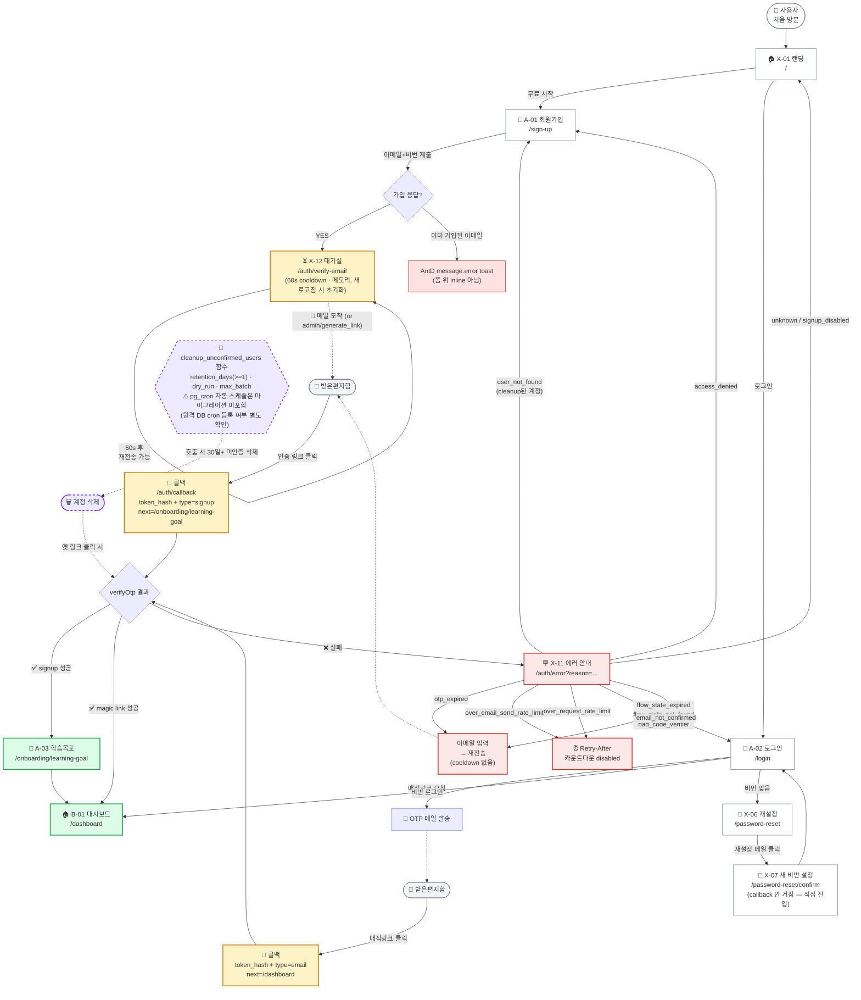

# Phase 8 — 인증 흐름 다이어그램 정정안 초안

Codex Agent 1 검수 결과를 반영한 새 Mermaid 다이어그램.

## 정정 항목

1. **CB_RESULT 성공 도착지 분기** — 단일 `/onboarding/learning-goal` 아님:
   - signup callback: `next=/onboarding/learning-goal` → `/onboarding/learning-goal`
   - magic link (LoginForm): `next=/dashboard` → `/dashboard`
   - 기본 fallback: `sanitizeNext` fallback = `/dashboard`
2. **RESET 흐름 분리** — `/auth/callback?type=recovery` 안 거침. `PasswordResetRequestForm`은 `/password-reset/confirm`으로 직접.
3. **SIGNUP_INLINE 라벨 변경** — "폼 내 inline 에러" 거짓. 실제는 AntD `message.error` toast.
4. **ERR reason 분기 보강** — 실제 11개 reason 중 다이어그램에서 누락된 분기 추가:
   - `over_request_rate_limit`
   - `email_not_confirmed`
   - `access_denied`
   - `flow_state_expired` / `flow_state_not_found` 개별 표기
5. **CLEANUP 표기** — pg_cron 매일 04:00 UTC 자동 실행 주장은 마이그레이션에 없음. "수동 호출 함수, 원격 DB cron 등록 미확인"으로 정정.
6. **otp_expired RESEND_FLOW 60초 cooldown 라벨 삭제** — 코드에 cooldown 없음 (`hasCountdown: false`).
7. **VerifyEmailCard cooldown 표기** — 새로고침 시 초기화되는 client-state 기반. "메모리상 60s" 등 명시.

## 새 Mermaid 다이어그램

## 핵심 차이점 비교

| 항목 | 이전 다이어그램 | 정정안 |
|---|---|---|
| 성공 도착지 | 단일 `/onboarding/learning-goal` | signup → onboarding, magic link → dashboard |
| 비번 재설정 | RESET → CB3 → CB_RESULT | RESET → /password-reset/confirm (직접) |
| 가입 실패 | "폼 내 inline 에러" | AntD `message.error` toast |
| reason 분기 | 5종 (otp_expired, user_not_found, rate_limit, flow_state_*, unknown/signup_disabled) | 8종 추가: over_request_rate_limit, email_not_confirmed, access_denied 분리 |
| RESEND_FLOW | "60s cooldown" 표기 | "cooldown 없음" 표기 |
| VERIFY 대기실 | "60초 cooldown" | "60s · 메모리, 새로고침 시 초기화" |
| CLEANUP | "매일 새벽 4시 UTC pg_cron" | "함수만 존재, cron 등록 미확인" |
